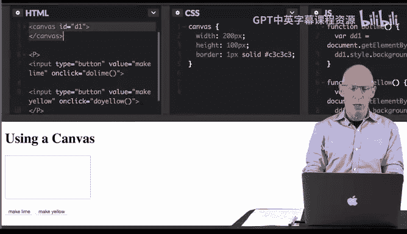
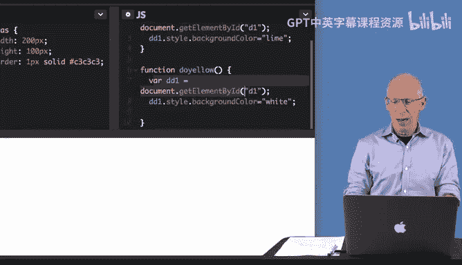
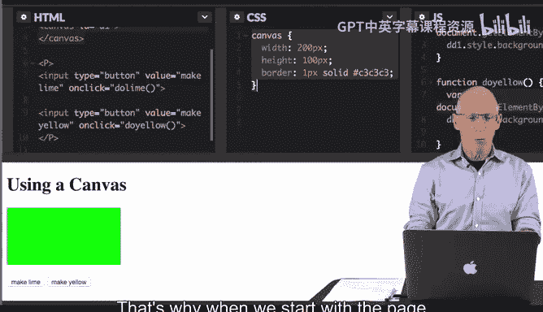
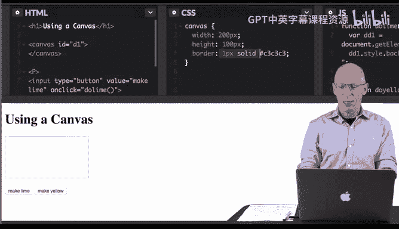
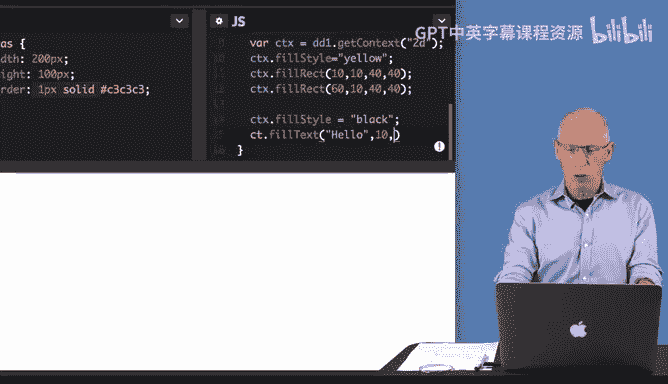
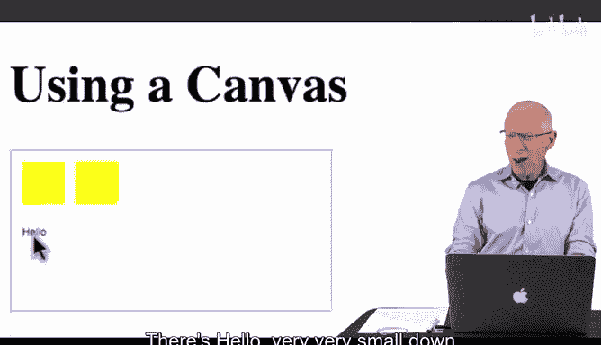
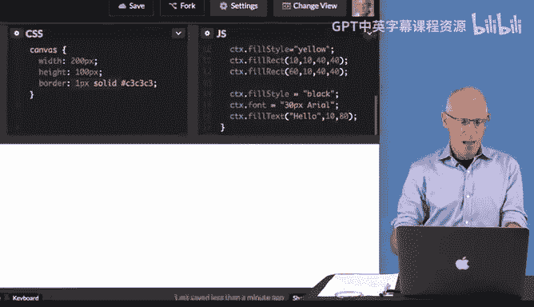

# Java编程和软件工程基础：P32：使用HTML5画布 🎨


在本节课中，我们将学习如何使用HTML5的`<canvas>`元素来创建图形，并编写JavaScript代码与之交互，从而替代之前使用的`<div>`元素。我们将创建一个包含按钮的简单网页，点击按钮可以改变画布背景色、绘制图形以及添加文字。

---

## 画布与Div元素的区别

上一节我们介绍了使用`<div>`元素来动态改变网页背景色。本节中我们来看看`<canvas>`元素。

`<canvas>`是一个HTML元素，用于通过JavaScript绘制图形。它与`<div>`的功能不同。`<div>`主要用于布局和样式化内容区块，而`<canvas>`则是一个图形容器，允许你绘制路径、形状、文本和图像。

在之前的例子中，我们通过`document.getElementById`获取`<div>`元素并改变其背景色。使用`<canvas>`时，虽然改变背景色的原理类似，但绘制文本和图形则需要使用特定的方法。

---

## 画布的基本用法

`<canvas>`元素专门用于绘制图形，通常与JavaScript结合使用。你可以将其视为一个图形容器，需要通过脚本来填充内容。



以下是使用`<canvas>`时常用的几种方法：
*   **绘制路径和形状**：例如线条、矩形、圆形。
*   **添加文本**：在画布上绘制文字。
*   **操作图像**：在画布上绘制或处理图像。

我们将创建一个简单的交互式页面，其中包含两个按钮，分别用于将画布背景变为酸橙色（lime）以及在画布上绘制黄色矩形和黑色文字。

---





## 编程实例：创建交互式画布

让我们通过CodePen平台，结合HTML、CSS和JavaScript来创建一个使用`<canvas>`的交互式网页。



### HTML结构

首先，我们定义画布和两个按钮。

```html
<canvas id="d1"></canvas>
<button onclick="doLime()">Make Lime</button>
<button onclick="doYellow()">Make Yellow</button>
```
*   画布的`id`为`"d1"`。
*   每个按钮都通过`onclick`属性调用对应的JavaScript函数。

### CSS样式

接着，我们为画布添加一些基本样式，定义其尺寸和边框。

```css
#d1 {
    width: 200px;
    height: 100px;
    border: 1px solid black;
}
```

### JavaScript交互逻辑

现在，我们编写JavaScript代码来实现交互功能。

**1. 改变背景色 (`doLime` 函数)**

这个函数与操作`<div>`时类似，直接改变画布元素的背景色。

```javascript
function doLime() {
    var d1 = document.getElementById("d1");
    d1.style.backgroundColor = "lime";
}
```

**2. 绘制图形和文字 (`doYellow` 函数)**

这是使用`<canvas>`的核心部分。要在画布上绘图，我们需要先获取其**绘图上下文（context）**。

```javascript
function doYellow() {
    var d1 = document.getElementById("d1");
    // 首先，将画布背景设为白色，为绘制黄色矩形做准备
    d1.style.backgroundColor = "white";

    // 关键步骤：获取2D绘图上下文
    var ctx = d1.getContext("2d");

    // 设置填充颜色为黄色
    ctx.fillStyle = "yellow";

    // 绘制第一个黄色矩形
    // 参数：起始点X坐标, 起始点Y坐标, 矩形宽度, 矩形高度
    ctx.fillRect(10, 10, 40, 40);

    // 绘制第二个黄色矩形
    ctx.fillRect(60, 10, 40, 40);

    // 设置填充颜色为黑色，用于绘制文字
    ctx.fillStyle = "black";
    // 设置字体样式
    ctx.font = "30px Arial";
    // 绘制文字
    // 参数：要绘制的文本, 文本起始点X坐标, 文本起始点Y坐标
    ctx.fillText("Hello", 10, 80);
}
```



**代码解析：**
*   `getContext("2d")`：获取画布的2D渲染上下文，这是所有绘图操作的基础。
*   `fillStyle`：设置或返回用于填充绘画的颜色、渐变或模式。
*   `fillRect(x, y, width, height)`：绘制一个填充的矩形。坐标`(0, 0)`位于画布的左上角。
*   `font`：设置或返回文本内容的当前字体属性。
*   `fillText(text, x, y)`：在画布上绘制填充的文本。



---



## 总结

本节课中我们一起学习了HTML5 `<canvas>`元素的基本用法。我们了解到：
*   `**<canvas>**` 是一个用于绘制图形的HTML元素。
*   与`<div>`不同，在`<canvas>`上绘制图形和文字需要使用JavaScript通过其**绘图上下文（Context）** 来实现。
*   核心步骤包括：获取上下文 (`getContext("2d")`)、设置样式 (`fillStyle`, `font`)，然后调用绘图方法 (`fillRect`, `fillText`)。
*   通过一个简单的例子，我们实现了改变画布背景色、绘制矩形和添加文字的功能。

你可以利用提供的资源进一步探索`<canvas>`的更多图形功能，享受编码的乐趣。