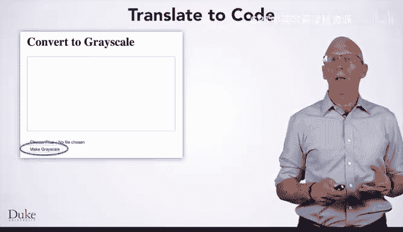

# Java编程和软件工程基础：P35：图像转灰度教程 🖼️➡️⚫⚪


## 概述
在本节课中，我们将学习如何通过编程方式将彩色图像转换为灰度图像。我们将运用之前模块中修改图像像素的概念，并将其应用于一个交互式网页。课程将涵盖从算法设计到代码实现的完整过程，并引入**全局变量**这一新概念。

---

## 从修改像素到创建交互式网页
上一节我们介绍了通过修改图像像素来创建条纹和绿幕合成图像。本节中，我们来看看如何运用相同的像素修改概念，来创建使用简单图像库的交互式网页。

我们将以实现一个常见的图像滤镜——灰度转换为例。

## 创建灰度图像：算法设计
编写程序的前四个步骤是设计算法。我们知道，一个颜色要成为灰色调，其红、绿、蓝（RGB）值必须相等。我们希望灰度图像能保留原始图像的亮度变化，而不仅仅是黑白两色。

实现方法之一是计算RGB值的平均值，并将新的RGB值都设置为这个平均值。

以下是实现灰度转换的步骤：
1.  从目标图像开始。
2.  对于图像中的每个像素：
    *   获取其R、G、B值。
    *   计算这些值的平均值。
    *   将像素的R、G、B值都设置为这个平均值。
3.  显示最终图像。

## 手动演算示例
在将算法转化为代码前，我们先通过手动计算来理解这个过程。

*   **绿色像素**：RGB值为 (0, 255, 0)。
    *   平均值 = (0 + 255 + 0) / 3 = 85。
    *   新的灰度像素RGB值为 (85, 85, 85)。
*   **洋红色像素**：RGB值为 (255, 0, 255)。
    *   平均值 = (255 + 0 + 255) / 3 = 170。
    *   新的灰度像素RGB值为 (170, 170, 170)。

你可以尝试手动计算栗色、天蓝色和橙色的灰度值进行更多练习。

## 将算法转化为代码
现在，我们已经完成了手动演算和步骤归纳。接下来，我们看看如何在网页的JavaScript函数中实现这个算法。

我们将在一个已有图片上传功能的网页基础上，添加一个“转为灰度”按钮。该按钮的`onclick`事件处理器将调用名为`makeGray`的JavaScript函数。



以下是`makeGray`函数的JavaScript源代码，我们将逐行分析其如何将图像转换为灰度：

```javascript
function makeGray() {
    // 步骤2：遍历图像中的所有像素
    for (var pixel of image.values()) {
        // 获取RGB值并计算平均值
        var avg = (pixel.getRed() + pixel.getGreen() + pixel.getBlue()) / 3;
        // 将RGB值设置为平均值
        pixel.setRed(avg);
        pixel.setGreen(avg);
        pixel.setBlue(avg);
    }
    // 步骤3：在画布上显示灰度图像
    var canvas = document.getElementById("can");
    image.drawTo(canvas);
}
```

代码解释：
*   `for (var pixel of image.values())`: 这行代码循环遍历图像`image`中的每一个像素。
*   `pixel.getRed()`, `getGreen()`, `getBlue()`: 这些方法获取当前像素的红、绿、蓝分量值。
*   `avg`: 计算三个颜色分量的平均值。
*   `pixel.setRed(avg)`, 等: 将当前像素的红、绿、蓝分量都设置为计算出的平均值`avg`。
*   `document.getElementById("can")`: 获取HTML页面中ID为“can”的`<canvas>`画布元素。
*   `image.drawTo(canvas)`: 将处理后的`image`绘制到指定的画布上，从而在网页中显示。

## 引入全局变量
上面的代码存在一个问题：`makeGray`函数中的变量`image`是从哪里来的？它需要在`upload`函数（处理文件上传的函数）中被初始化，但又要在`makeGray`中被访问。

这就需要使用**全局变量**。全局变量定义在所有函数之外，因此可以被所有函数访问。

**定义全局变量**：
```javascript
var image; // 在所有函数之外定义
```

**在函数中使用全局变量**：
```javascript
function upload() {
    // 注意：这里没有使用‘var‘关键字，因此是对全局变量‘image‘赋值
    image = new SimpleImage(fileInput);
    // ... 其他上传逻辑
}

function makeGray() {
    // 现在可以直接使用全局变量‘image‘
    for (var pixel of image.values()) {
        // ... 灰度处理逻辑
    }
}
```

**关键点**：
*   在`upload`函数中为`image`赋值时，**不能**使用`var`关键字（如`var image = ...`），否则会在`upload`函数内部创建一个新的局部变量，而不是修改全局变量。
*   在`makeGray`函数中访问`image`时，直接使用即可。
*   应谨慎使用全局变量，过度依赖会使代码难以理解和维护。

## 扩展：保留原始图像
有时我们可能希望在不改变原始图像的情况下显示灰度版本。这可以通过创建新的图像对象并存储在另一个全局变量中来实现。

例如：
```javascript
var originalImage;
var grayImage;

function upload() {
    originalImage = new SimpleImage(fileInput);
    // 显示原始图像
}

function makeGray() {
    // 基于原始图像创建新图像进行处理
    grayImage = new SimpleImage(originalImage);
    for (var pixel of grayImage.values()) {
        var avg = (pixel.getRed() + pixel.getGreen() + pixel.getBlue()) / 3;
        pixel.setRed(avg);
        pixel.setGreen(avg);
        pixel.setBlue(avg);
    }
    // 显示灰度图像
}
```

## 总结
本节课中我们一起学习了如何通过编程将彩色图像转换为灰度图像。我们回顾了修改像素的核心概念，设计了灰度转换算法，并手动进行了演算。接着，我们将其转化为JavaScript代码，在交互式网页中实现了一个“转为灰度”按钮的功能。在此过程中，我们引入了**全局变量**这一重要概念，它允许在不同的函数间共享数据（如图像对象）。最后，我们还探讨了如何通过创建图像副本来保留原始图像。记住要谨慎使用全局变量，并享受编码的乐趣！