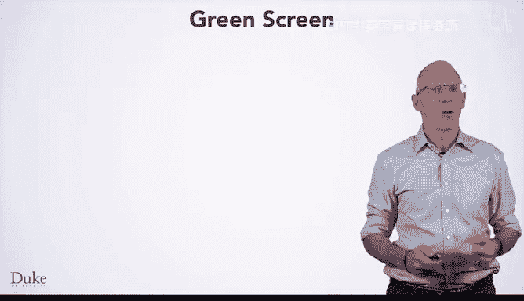
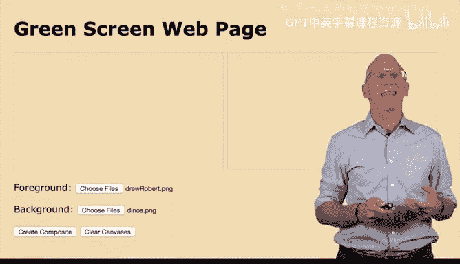
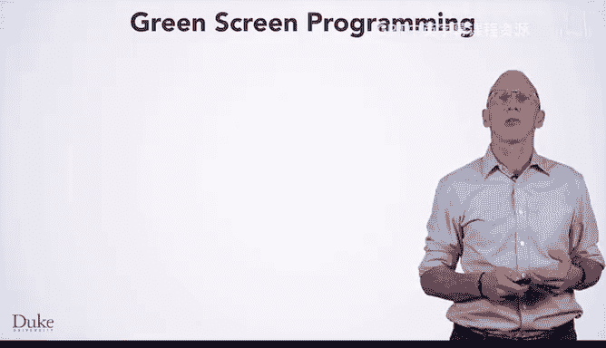
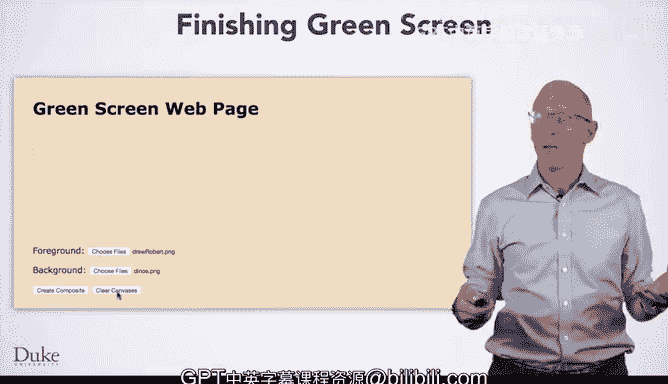

# 036：迁移至CodePen


## 概述



在本节课中，我们将学习如何将您在Duke Learn to Program环境中开发的绿幕代码，迁移到一个交互式网页中。我们将使用HTML、CSS和JavaScript来创建一个允许用户上传图片、应用绿幕效果并查看合成结果的网页应用。

---

## 网页组件分析

上一节我们介绍了课程目标，本节中我们来看看构成这个交互式网页的各个组件。

首先，我们分析HTML元素，然后将它们与JavaScript代码连接起来。

页面上有两个标准的Canvas元素。每个Canvas都带有CSS定义的边框。一个Canvas用于显示前景图像，另一个用于显示背景图像。

您还会看到四个输入元素。其中两个是用于上传图片的文件输入框，另外两个是按钮，用于改变Canvas中的显示内容。文件输入框在网页上标明了用途：“上传前景图像”和“上传背景图像”。两个按钮分别用于“创建绿幕合成图”和“清空画布”。

---

## HTML文件输入元素

让我们具体查看HTML文件中的元素定义。



以下是两个文件输入框的HTML代码，一个用于上传前景图像，另一个用于背景图像。

```html
<input type="file" id="fgFile" onchange="loadForegroundImage()">
<input type="file" id="bgFile" onchange="loadBackgroundImage()">
```

我们创建文件输入框，允许用户上传并显示图像文件。前景和背景的文件输入按钮都有唯一的ID（`fgFile` 和 `bgFile`），这便于在与之交互的JavaScript代码中识别它们。

我们使用 `onchange` 事件处理器来调用相应的JavaScript函数。这里，我们调用 `loadForegroundImage()` 和 `loadBackgroundImage()`。

---

## JavaScript：加载并显示图像

现在，让我们看看用户上传图像时被调用的JavaScript代码。上传和显示图像使用了我们之前学过的概念。

以下是加载前景图像的JavaScript函数：

```javascript
var fgImage = null; // 全局变量

function loadForegroundImage() {
    var imgFile = document.getElementById("fgFile");
    fgImage = new SimpleImage(imgFile);
    var canvas = document.getElementById("fgCanvas");
    fgImage.drawTo(canvas);
}
```

背景图像的加载函数与此非常相似。我们使用全局变量（如 `fgImage`）来引用每个图像。将全局变量初始化为 `null` 是一个好习惯，这允许我们在用户点击“创建合成图”按钮时判断图像是否已加载。

`null` 是JavaScript（及其他语言）中用于表示“空”或“无”的特殊值。

请注意，访问 `fgImage` 的代码没有使用 `var` 关键字，因为 `fgImage` 是全局变量。该变量被赋予一个从文件输入元素创建的新SimpleImage对象。

我们还使用了许多局部变量，例如 `var imgFile`，它引用了前景图像的文件输入HTML元素。在多个函数中需要访问的值，应设为全局变量；否则，应尽量使用局部变量，以避免在项目变量增多时失去跟踪。

---

## JavaScript：创建绿幕合成图

接下来，我们看看创建绿幕合成图的步骤。这需要用到您在Duke Learn to Program环境中学到的一些图像处理基本思想，我们已将其适配用于网页。

在用户上传图像并点击“创建合成图”按钮之前，我们需要检查用户是否已上传了两张图像。

我们通过检查全局变量 `fgImage` 是否已准备就绪来实现这一点。如果 `fgImage` 为 `null`（其初始化值），则用户尚未点击上传前景图像的按钮。此外，即使用户已上传，大图像也需要时间创建，`image.complete` 属性允许我们判断图像是否已完全加载。

```javascript
function createComposite() {
    // 检查前景图像
    if (fgImage == null || !fgImage.complete()) {
        alert("前景图像未就绪。");
        return;
    }
    // 检查背景图像（类似代码）
    // ... 创建合成图的代码 ...
}
```

如果图像未就绪（无论是 `null` 还是未完成加载），我们需要通过弹出警告框来告知用户，代码将无法工作。我们在创建绿幕合成图之前，同时检查前景和背景图像。

---

## 合成图核心算法

让我们更仔细地查看创建合成图的核心代码。

以下是适配自Duke Learn to Program环境的JavaScript代码，用于创建绿幕合成图：

```javascript
function createComposite() {
    // ... 之前的检查代码 ...

    // 第一步：创建一个与前景图尺寸相同的新图像
    var output = new SimpleImage(fgImage.getWidth(), fgImage.getHeight());

    // 循环遍历前景图的每个像素
    for (var pixel of fgImage.values()) {
        var x = pixel.getX();
        var y = pixel.getY();
        // 如果当前像素的绿色值大于阈值，则使用背景图的对应像素
        if (pixel.getGreen() > greenThreshold) {
            var bgPixel = bgImage.getPixel(x, y);
            output.setPixel(x, y, bgPixel);
        } else {
            // 否则，使用前景图的像素
            output.setPixel(x, y, pixel);
        }
    }

    // 将新合成的图像绘制到Canvas上
    var canvas = document.getElementById("outputCanvas");
    output.drawTo(canvas);
}
```



第一步是创建一个具有适当宽度和高度的新图像对象，它将是前景和背景图像的合成。新图像初始为全黑。

我们需要通过循环遍历前景图像的所有像素来设置新图像的每个像素。根据当前循环像素的绿色程度，决定是复制前景像素还是背景像素。

如果像素的绿色值大于某个阈值（`greenThreshold`），我们就在创建的新图像中使用背景像素；否则，就使用前景像素。

请注意，阈值变量 `greenThreshold` 必须是全局变量，因为它在此函数内没有用 `var` 关键字定义。

---

## 最终步骤：显示与交互

最后，我们需要显示或绘制新的合成图像。我们将使用 `.drawTo()` 方法将其绘制到Canvas元素中。

在确保图像显示之前，我们知道它会被加载，因为我们已经检查过。我们还会在绘制前清空Canvas元素，以确保只显示一张图像，即绿幕合成图。

一个正常工作的绿幕页面允许用户通过上传图像进行交互：一张作为前景，一张作为背景。我们必须等待这些图像加载并显示。然后点击“创建合成图”按钮，观察绿幕效果的生成。合成过程可能需要一些时间。完成后，我们就能看到有趣的合成结果，例如人物与恐龙同框。我们也可以使用“清空”按钮清除画布。

---

## 总结

本节课中，我们一起学习了如何将Duke Learn to Program环境中的绿幕代码迁移到一个交互式网页。我们涵盖了以下关键步骤：
1.  使用HTML输入元素（文件上传和按钮）构建用户界面。
2.  编写JavaScript函数来加载图像并使用全局变量进行管理。
3.  实现核心的绿幕合成算法，通过循环像素并比较绿色通道值与阈值来组合图像。
4.  添加必要的检查（如检查图像是否加载完成）以确保代码健壮性。
5.  使用Canvas的 `.drawTo()` 方法在网页上显示最终结果。



通过结合编程与网页技术，您将能够使用这个绿幕程序创建属于自己的有趣合成图像。祝您编程愉快！