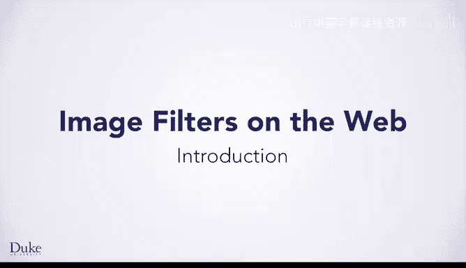
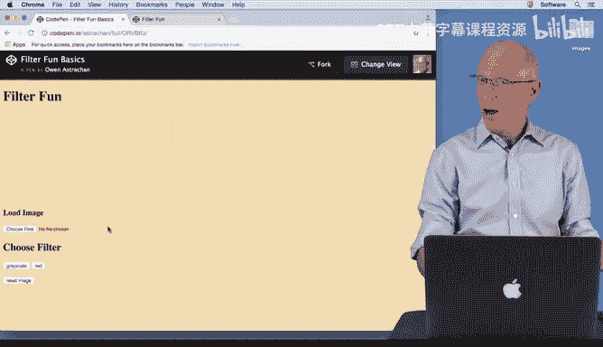
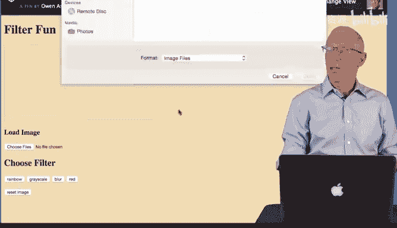
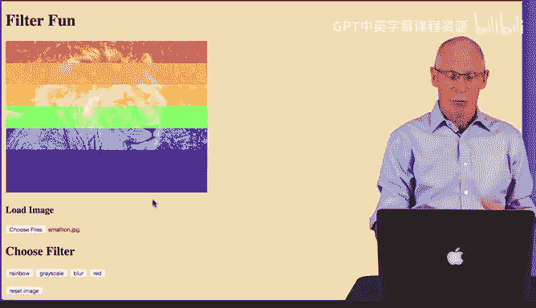

# Java编程和软件工程基础：P37：引言：图像滤镜网站项目介绍 🎨

在本节课中，我们将要学习如何结合HTML、CSS以及Duke编程环境中学到的技能，创建一个交互式网页。这个网页将允许用户上传图片并应用不同的滤镜效果。

## 项目概述

我们将制作一个简单的网站，其核心功能是让用户上传一张图片，然后通过点击不同的按钮来改变这张图片的视觉效果。这类似于Snapchat或Instagram等应用中的滤镜功能。我们将使用CodePen平台从头开始构建这个网站。

## 基础项目功能演示

以下是基础版本网站的功能流程：

首先，用户点击“选择文件”按钮上传一张图片。例如，上传一张棕色的马匹图片。

上传后，图片会显示在网页上。接着，用户可以点击不同的滤镜按钮来改变图片。

*   点击“红色”滤镜按钮，图片会整体变为红色调。
*   点击“重置”按钮，图片会恢复到上传时的原始状态。
*   点击“灰度”滤镜按钮，图片会变成黑白效果。

基础项目的目标，就是创建一个具备上述功能的网站：允许用户选择文件、上传图片，并实现红色滤镜、灰度滤镜以及重置功能。当然，你可以使用CSS自由地设计网页样式。

## 挑战项目功能扩展

上一节我们介绍了基础功能，本节中我们来看看如何为项目增加挑战性的功能。

作为挑战，我们鼓励你考虑添加更多滤镜和功能。让我展示一个功能更丰富的最终网页示例。

这个页面看起来相似，但提供了不同的滤镜选项：

1.  **彩虹滤镜**：此滤镜不会直接改变图片颜色，而是为图片添加一个彩虹色的条纹背景。你需要研究红、橙、黄、绿、蓝、靛、紫这些颜色的RGB值来实现它。
2.  **模糊滤镜**：此滤镜会使用我们在Duke编程环境中学到的一些技术，将图片变得模糊。
3.  **图片尺寸显示**：你可能会注意到，当我点击这些滤镜时，网页上会显示我上传图片的尺寸（例如 250 x 188）。如果上传一张新图片（比如更大的棕色马图片），这里的尺寸信息也会随之更新。

实现图片尺寸显示并将其添加到网页中，是另一个挑战活动。这些图像处理功能会非常有趣，你不必局限于这四种，完全可以创造更多滤镜。

## 总结

本节课中我们一起学习了如何规划一个图像滤镜网站项目。我们从基础功能入手，了解了如何实现图片上传、红色与灰度滤镜以及重置功能。随后，我们探讨了扩展挑战，包括添加彩虹背景、模糊滤镜以及动态显示图片尺寸。这个迷你项目将充分融合你已掌握的HTML、CSS和JavaScript知识，期待看到大家创造出精彩的作品。