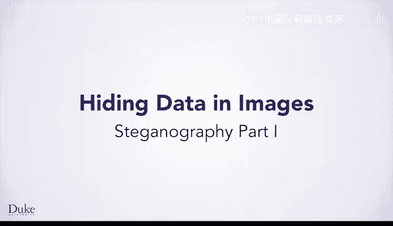

# 杜克大学《Java编程和软件工程基础-1》：P38：隐写术第一部分

在本节课中，你将学习如何使用函数来实现一种称为“隐写术”的技术。隐写术是指将数据隐藏在一张图片或其他数字载体（如音频文件、软件程序或任何由0和1组成的文件）中的方法。由于隐写术的任务规模比之前解决的问题稍大，将代码分解为函数是一个很好的思路。随着课程的推进，你将看到一些例子，其中部分代码被抽象成独立的函数，以简化整体解决方案并避免代码重复。

## 概述：什么是隐写术？🔍

上一节我们介绍了课程目标，本节中我们来看看隐写术的核心概念。

隐写术背后的想法是，拿一张图片（例如这张短跑运动员尤塞恩·博尔特的图片），并将其他数据（如另一张图片）隐藏在其中。具体做法是改变尤塞恩·博尔特图片像素的数值，以编码隐藏的图像。隐写术的关键在于，要以一种不易被人察觉的方式隐藏数据，使他人难以发现原始图片已被修改。

右边这张图片是在第一张图片中隐藏了一条秘密信息的结果。你能看出它被修改过吗？如果仔细观察，可以看到背景阴影的一些细微差别。然而，如果单独看这第二张图片，并没有什么可疑之处，它看起来就是一张尤塞恩·博尔特的照片。这个想法由来已久，早于计算机出现。在历史上，发送不被察觉的信息一直很重要。一个重要的现代用途是规避压迫性政府实施的审查。

你可以将任何数字信息隐藏在图片中。例如，你可以将文本或HTML文件隐藏在图片中，但这需要更多的数学知识和更深入的理解“万物皆数”的原理。为了入门简单，你首先将学习如何将一张图片隐藏到另一张尺寸相同的图片中。

完成本节课后，你将能够“在宇宙中发现隐藏的意义”。也就是说，我们不仅会引导你理解概念，还会讲解实现隐写术隐藏的代码。然后，你将编写代码从图片中提取隐藏的信息。例如，你可以从这张星系图片中提取我们隐藏在内的信息。

## 隐写术的原理：利用像素的微小差异 🎨

那么，具体如何实现呢？你已经知道像素有红、绿、蓝三个分量，它们用数值代表颜色。一个红色分量的值是240还是255，有很大区别吗？它们在数值上是不同的，但如果你观察它们，两者看起来非常相似。

正是这种轻微改变数值后不易察觉的特性，成为了在图片中隐藏数据的关键。你可以将隐藏数据存储在颜色值的**最低有效位**中，而不会导致最终颜色发生明显变化。最低有效位就像三位数中的个位和十位。因此，你可以通过将240改为255，在240中隐藏一个15。

为了实现这一点，你需要一些数学运算。别担心，只是乘法、除法和加法，你只需要以正确的方式组合它们。

## 从十进制（Base 10）理解概念 🔢

为了理解如何进行这些数学运算，我们将从你每天使用的十进制（以10为基数）数字系统开始。我们将在十进制中解释概念，然后学习二进制（以2为基数），这是计算机用来存储数字的系统。所有原理在二进制中和在十进制中是一样的，你只需要使用2的幂次方，而不是10的幂次方。

为了在熟悉的十进制中理解这个想法，假设红、绿、蓝分量的值范围是0到9999，而不是0到255。这样，颜色的每个分量就有四位十进制数字。

现在假设你想将下面这个红色像素（RGB值为：红=8274，绿=0，蓝=1098）隐藏到这个蓝色像素（RGB值为：红=3568，绿=5686，蓝=7450）中。我们将把结果放在右边。

对于红色分量，你想取用于隐藏数据的像素（即蓝色像素）的**最高两位有效数字**，并将它们用作结果像素的最高两位有效数字。然后，你想取要被隐藏的像素（即红色像素）的**最高两位有效数字**，并将它们用作结果像素的最低两位有效数字。

请注意，3582与3568非常相似，看起来几乎一样，但你已轻微改变了它，从而将秘密信息存储在了它的最低有效位中。

现在你对绿色分量做同样的事情，从这个蓝色像素中取最高两位有效数字，并与这个红色像素的最高两位有效数字组合。同样，5600与5686非常相似。

现在你对蓝色分量做同样的事情，组合两个像素蓝色分量的最高有效数字。得到的数字7410同样与原始的7450非常相似。

如果你观察这个结果像素的颜色，很难看出它与原始蓝色像素的区别，但正如你将看到的，我们已经将一个红色像素隐藏在其中了。

## 如何提取隐藏的信息？🔓

现在信息已经隐藏，你如何提取秘密呢？你知道，你想要这个像素红色分量的最低两位有效数字，成为隐藏的（即将被提取的）像素红色分量的最高两位有效数字。所以我们希望82成为R（红色）值的最高有效数字。但最低有效数字应该是什么呢？这其实不太重要，所以我们直接选择0。然后你对绿色和蓝色分量做同样的事情。

如果你观察得到的颜色，它是这种红色调。这种红色调与我们想要隐藏的原始颜色非常接近。即使你没有得到完全相同的颜色，提取出的图像看起来也会非常相似。

## 核心概念总结与过渡到二进制 💡

至此，你了解了隐写术的核心思想：将数据隐藏在其他数据中。具体来说，你将学习如何将一张图片隐藏在另一张图片中。现在你理解了其中涉及的基本数学原理：从每个数字中取出指定位数并进行组合。

然而，为了在代码中实现这一点，你需要学习一点关于**二进制**（以2为基数的数字系统）的知识。计算机使用二进制，这就是为什么颜色值的范围是0到255，而不是我们刚才使用的0到9999。

在下一部分，我们将深入探讨二进制表示，并学习如何用代码实现这些操作。