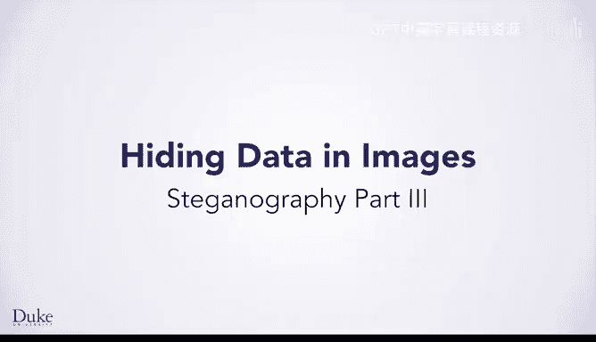

# 杜克大学《Java编程和软件工程基础-1》：P40：隐写术第三部分 🔍



在本节课中，我们将学习如何将隐写术的理论与二进制数学知识结合起来，通过编写具体的函数，实现将一幅图像隐藏到另一幅图像中的完整过程。

上一节我们介绍了隐写术的基本概念和二进制数学基础，本节中我们来看看如何将这些知识整合成可执行的代码。

## 核心算法概述

假设你想将一幅包含秘密信息的图像（顶部图像）隐藏到一幅银河系图片（底部图像）中。你已经知道如何获取代表颜色分量（红、绿或蓝）的8位数字，并将一幅图像的最高有效位隐藏到另一幅图像中。具体做法是：提取最终要显示的图像的最高有效位，并将其与要隐藏的图像的最高有效位组合。你已了解实现此功能的数学计算，但这不仅仅是处理一对数字的运算。

你需要对图像中的每个像素执行此运算。遍历图像中的每个像素现在应该很熟悉了，并且你需要对红、绿、蓝三个颜色分量分别进行此运算。由于需要对三个分量做相同的事情，你可能会考虑将计算提取到一个函数中，以便调用函数而不是重复编写代码。

## 分解任务：三个核心函数

鉴于这个任务较为复杂，将其分解为几个函数会很有帮助。我们将引导你了解我们在实现隐藏功能时分解出的几个函数。

### 1. 函数 `clearLow`：处理载体图像

我们创建的第一个函数叫做 `clearLow`。它的作用是处理最终要显示的图像，生成一幅看起来非常相似的新图像。该函数会对每个像素的每个颜色分量执行数学运算，保留最高有效位，并将最低有效位清零。

以下是该函数的算法描述：
1.  遍历图像中的每个像素。
2.  对红、绿、蓝分量执行以下运算：
    *   将原始值除以16。
    *   取该结果的 `Math.floor`（向下取整）。
    *   将结果乘以16。

你可能会想将这个重复的数学运算提取到它自己单独的函数中，然后在每个需要的地方调用它。生成的图像应该与原始图像看起来几乎相同，如下图所示。


如果你在实现、测试和调试这段代码，像这样将其分解成小块会很有帮助。你可以在继续下一步之前，检查这一部分的结果并确保其正常工作。

### 2. 函数 `shift`：处理秘密图像

你可能要编写的第二个函数将作用于你想要隐藏的图像。我们称之为 `shift`，因为它会将最高有效位移到最低有效位的位置。也就是说，你需要将一个颜色值（如 `10110010`）转换为 `00001011`。这里的 `1011` 已经从最高有效位移到了最低有效位。

以下是该函数的算法描述：
1.  遍历图像中的每个像素。
2.  将红、绿、蓝分量设置为原始值除以16后的 `Math.floor` 结果。

如果你查看这里的结果图像，它会看起来是全黑的。这实际上是一件好事，因为所有信息都在最低有效位中，而最高有效位应该全是零。同样，在继续之前，你可以单独测试这个函数。

### 3. 函数 `combine`：合并图像

最后一个函数叫做 `combine`。它接收两幅图像，并将红对红、绿对绿、蓝对蓝相加，以生成结果图像的颜色值。它看起来应该基本上与原始载体图像相同。

## 高层算法与代码实现

一旦你有了这三个函数的思路，隐藏一幅图像到另一幅图像的高层算法如下所示：

```pseudocode
载体图像_处理后 = clearLow(载体图像)
秘密图像_处理后 = shift(秘密图像)
最终图像 = combine(载体图像_处理后, 秘密图像_处理后)
```

你只需调用我们讨论过的这些函数，它们就会完成所有工作。

了解了每个函数的算法后，你可以将它们转化为代码。例如，这是 `clearLow` 函数的代码示例。你可以看到，我们决定将实际的数学运算提取到它自己的辅助函数中，并为红、绿、蓝每个分量调用它。

```java
// 示例辅助函数
public static int clearLowBits(int colorValue) {
    return (colorValue / 16) * 16; // 等价于 Math.floor(colorValue / 16) * 16
}

// 在 clearLow 函数中调用
for (Pixel p : image) {
    p.setRed(clearLowBits(p.getRed()));
    p.setGreen(clearLowBits(p.getGreen()));
    p.setBlue(clearLowBits(p.getBlue()));
}
```

隐藏功能的其他函数（`shift` 和 `combine`）也类似。正如我们讨论的，你遍历图像的像素，并执行我们之前描述的数学运算。

## 如何提取隐藏图像？

那么，如何将隐藏的图像取出来呢？我们将把这个问题留给你。你已经看到了所需的数学运算。现在，你可以使用“七步法”来开发算法并将其转化为代码。

以下是提取隐藏图像的步骤建议：
1.  **从第一步开始**：使用一个只有两个像素的图像进行工作。
2.  **写下数值**：为这两个像素的红、绿、蓝写下具体的数值。
3.  **手动提取**：尝试提取出隐藏的两个像素图像。
4.  **开发算法**：完成手动提取后，继续第2、3、4步，开发出你的通用算法。
5.  **转化为代码**：将算法翻译成代码。
6.  **测试与调试**：测试你的代码并进行调试。

祝你编码愉快！

## 总结

本节课中我们一起学习了隐写术的完整实现流程。我们首先将复杂的隐藏任务分解为三个核心函数：`clearLow`（清理载体图像的低位）、`shift`（移位秘密图像）和 `combine`（合并图像）。每个函数都有明确的算法和代码实现思路。最后，我们探讨了提取隐藏图像的方法，并鼓励你运用“七步法”来自行完成提取算法的设计与实现。通过这个过程，你将更深入地理解位运算在图像处理中的应用。