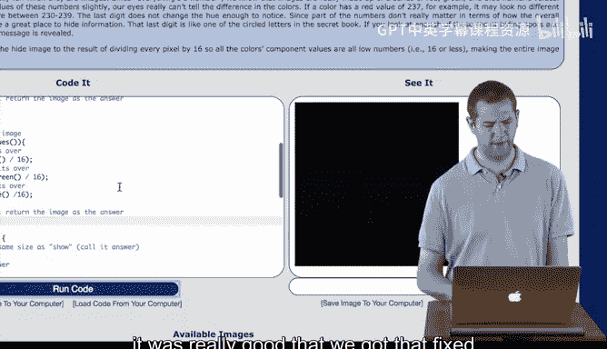
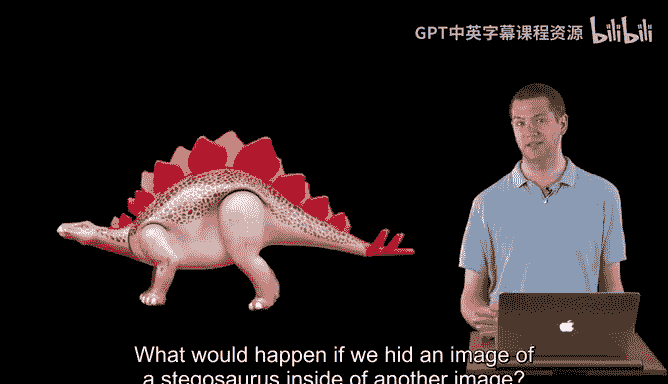

# 041：隐写术编码示例 🖼️➡️🔒

在本节课中，我们将学习如何通过代码实现一个简单的图像隐写术，即把一张图片隐藏到另一张图片中。我们将分步讲解三个核心函数：`clearBits`、`shift` 和 `combine`，并最终将它们组合起来完成隐藏过程。

---

## 概述

我们将编写代码，将一张“隐藏”图片嵌入到一张“展示”图片中。其核心原理是：修改“展示”图片每个像素颜色值的**最低有效位**，并用“隐藏”图片颜色值的**最高有效位**来填充。这样，人眼几乎察觉不到变化，但数据已被嵌入。

---

## 第一步：清除低位比特 🧹

上一节我们介绍了隐写术的基本概念，本节中我们来看看如何实现第一步：清除“展示”图片像素的低位比特。

我们首先实现 `clearBits` 函数。这个函数的作用是将一个颜色值（如红色、绿色或蓝色通道的值）的最低4位清零，只保留高4位。其数学公式如下：

`新颜色值 = Math.floor(原颜色值 / 16) * 16`

以下是该函数的代码实现：

```java
function clearBits(colorValue) {
    return Math.floor(colorValue / 16) * 16;
}
```

在 `chompToHide` 函数中，我们需要遍历“展示”图片的每一个像素，并对其红、绿、蓝通道分别应用 `clearBits` 函数。

以下是 `chompToHide` 函数的实现步骤：

1.  遍历图片中的每一个像素。
2.  获取当前像素的红色值，使用 `clearBits` 函数清零其低4位，然后设置回去。
3.  对绿色和蓝色通道重复步骤2。
4.  返回修改后的图片。

运行此部分代码后，“展示”图片（例如博尔特的照片）看起来会与之前非常相似，但背景色可能会有细微变化，因为颜色值已被修改。

---

## 第二步：移位操作 ⬅️

在清除了“展示”图片的低位后，我们需要处理“隐藏”图片。这一步的目标是将“隐藏”图片每个像素颜色值的最高4位移到最低4位的位置。

我们将在 `shift` 函数中完成这个操作。其原理是通过除以16（即2的4次方）来实现右移4个二进制位。

以下是 `shift` 函数的实现步骤：

1.  遍历“隐藏”图片的每一个像素。
2.  将当前像素的红色值设置为 `原红色值 / 16`。
3.  对绿色和蓝色通道重复步骤2。
4.  **重要**：确保函数返回修改后的图片对象。



运行 `shift` 函数后，“隐藏”图片会变得几乎全黑，因为其有效颜色信息现在都存储在最低的4个比特位中，人眼难以分辨。

**注意**：在编码时，一个常见的错误是忘记 `return` 语句，这会导致“undefined”错误。务必在函数末尾返回结果图像。

---

## 第三步：合并图像 🔗

现在，我们有了处理好的“展示”图片（低位已清零）和“隐藏”图片（高位已移位）。最后一步是将它们合并起来。

我们将在 `combine` 函数中完成合并。其核心操作是将两个图片对应像素的颜色值相加。因为一个图片的颜色信息在高4位，另一个在低4位，相加后就能得到一个完整的8位颜色值。

以下是 `combine` 函数的实现步骤：

1.  创建一个新的空白图片，尺寸与输入图片相同（代码中假设两张图片尺寸一致，实际应用中需要处理尺寸不同的情况）。
2.  遍历新图片的每一个像素。
3.  获取该像素在“展示”图片和“隐藏”图片中对应位置的颜色值。
4.  将两个图片对应通道（红、绿、蓝）的颜色值相加，并设置为新图片当前像素的颜色值。
    *   `新红色值 = 展示图片红色值 + 隐藏图片红色值`
5.  对绿色和蓝色通道重复步骤4。
6.  返回合并后的新图片。

当我们将所有函数组合起来并运行最终代码时，就能得到一张看起来是博尔特，但内部隐藏了另一张图片的新图像。

---

## 总结

本节课中我们一起学习了隐写术编码的完整流程：

1.  **清除低位** (`clearBits` 和 `chompToHide`)：为隐藏数据准备空间。
2.  **移位操作** (`shift`)：将待隐藏图片的数据移动到低位。
3.  **合并图像** (`combine`)：将处理后的两张图片相加，合成最终图像。



通过这三个步骤，我们成功地将一张图片的信息嵌入到了另一张图片之中。虽然本示例没有进行严格的测试，但它清晰地展示了基于最低有效位（LSB）的图像隐写术基本原理和实现方法。你可以尝试用不同的图片进行实验，例如将一张暴龙图片隐藏到风景图中。