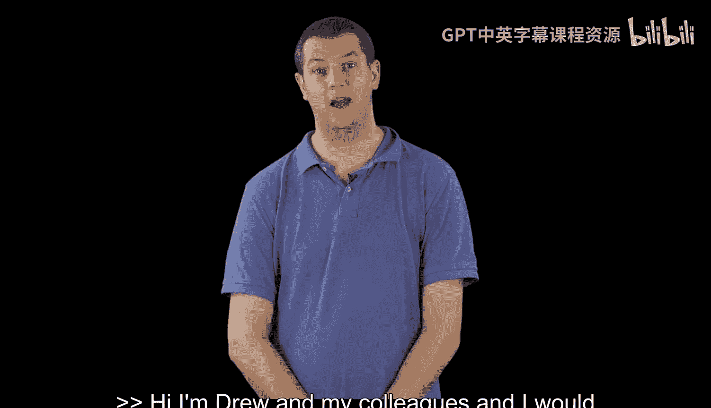
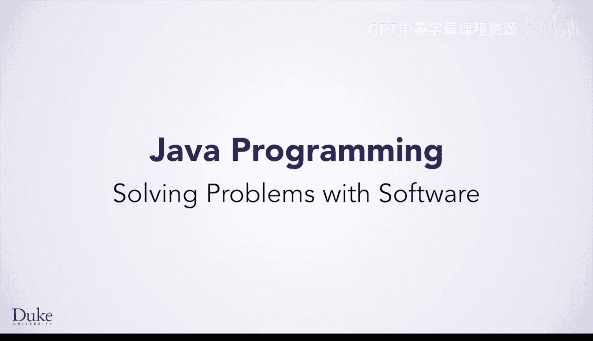
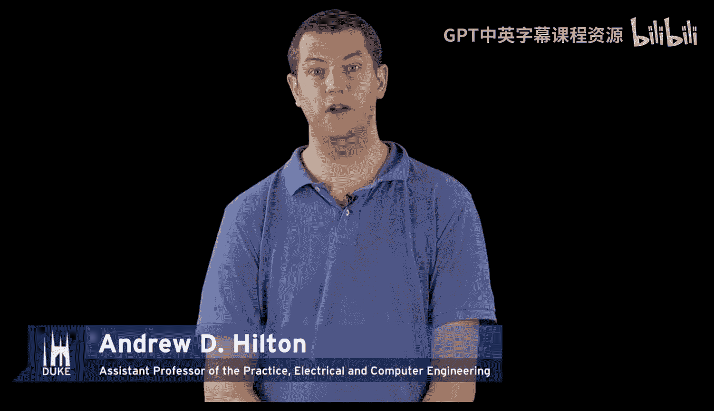
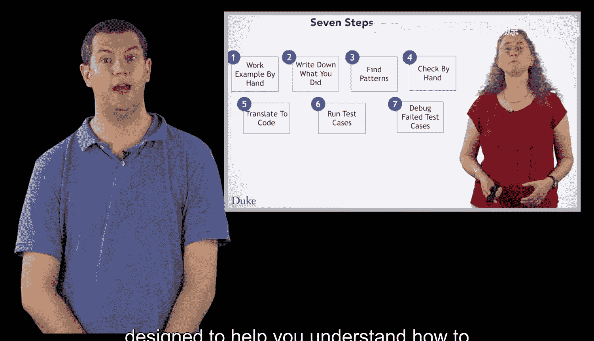
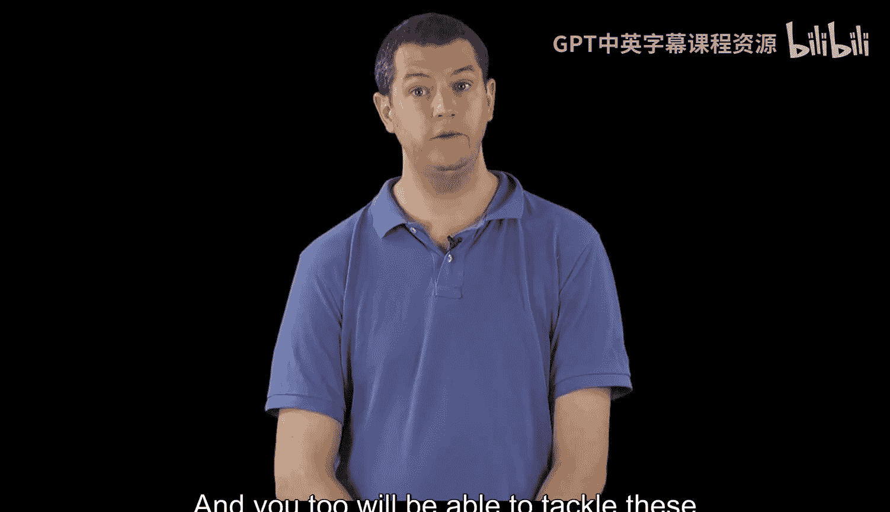
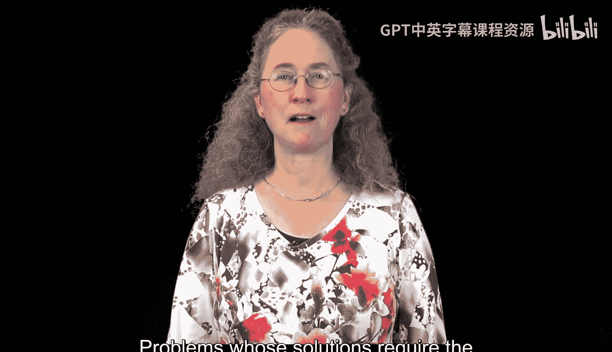
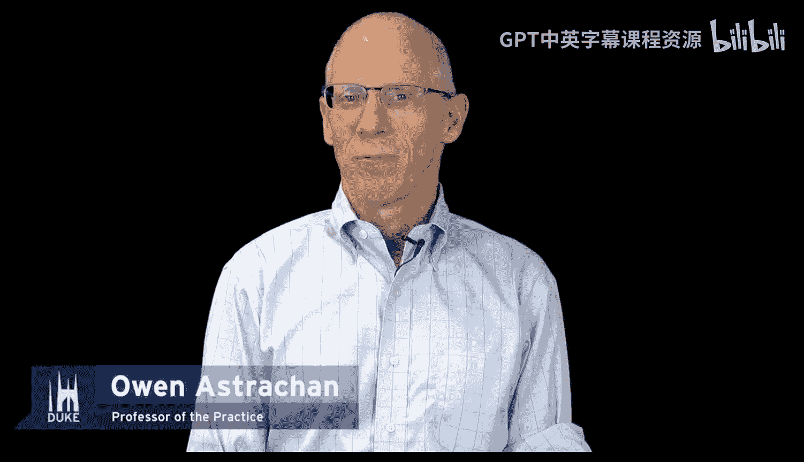
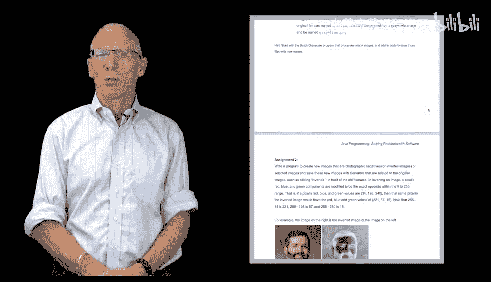
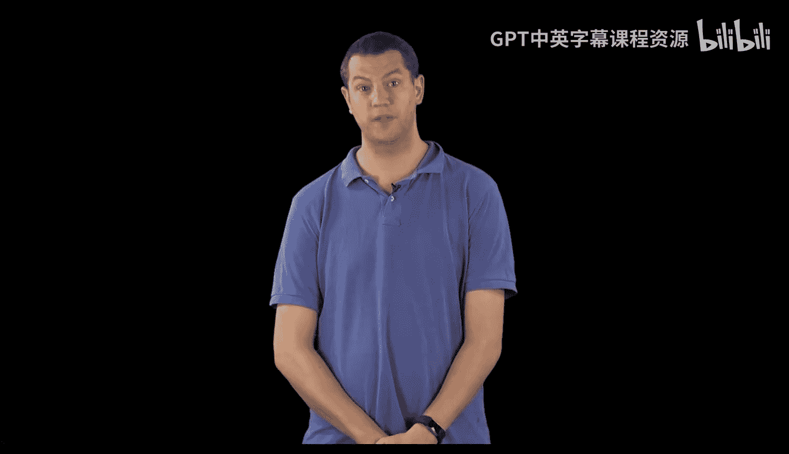
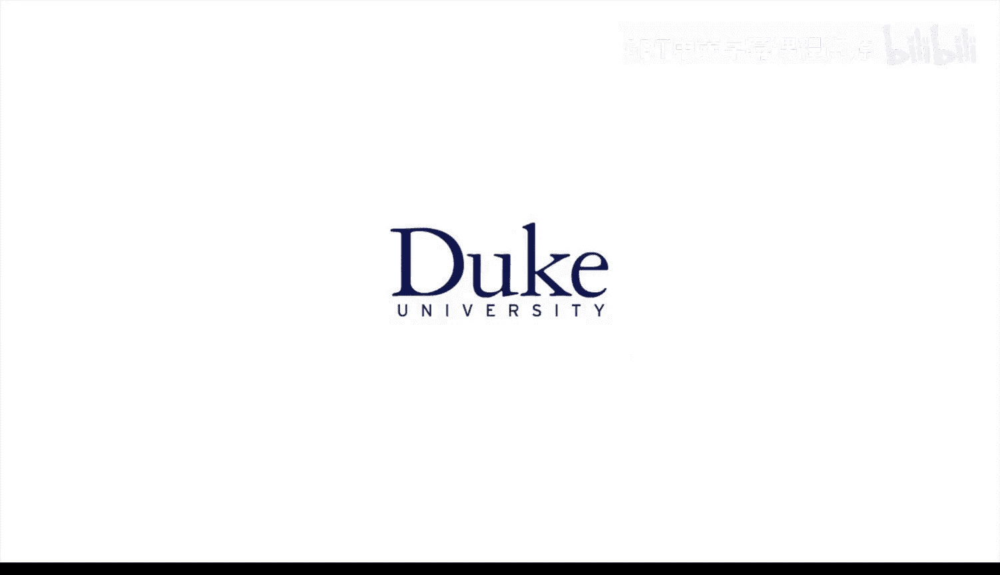

# Java编程和软件工程基础：1.1：课程介绍 🎯

在本节课中，我们将要学习杜克大学《Java编程和软件工程基础》课程的总体介绍。课程团队将向您介绍课程的核心目标、您将学习的内容以及课程的设计理念。

我是Drew，我和我的同事们欢迎您学习“使用软件解决Java编程问题”这门课程。

杜克大学的我们非常高兴您能迈出这第一步，学习使用Java解决实际问题。在本课程中，您将学习一个七步法，旨在帮助您理解如何应对任何编程问题。您将使用这个方法来解决实际问题，并且您将了解到，计算机科学远不止像Java这样的编程语言的语法。

您将有机会处理诸如分析DNA、操作CSV文件和处理图像等问题。这些都是工程师、科学家、程序员等人在现实生活中需要解决的真实问题。随着您开始学习Java，您也将能够应对这些问题。

我是Susan。在本课程中，您将学习使用Java编程，这些技术既可用于简单程序，也能扩展到更大的程序和更复杂的问题。我们介绍的库和API使处理多种格式的数据变得容易。您将能够使用这些相同的技术、工具和库来解决我们为您设计的问题。这些问题的解决方案需要您在此学习的编程知识。

我是Robert。当您学习Java程序的语法和语义时，您将在一个专门设计并已被证明能有效帮助像您这样的编程初学者的编程环境中进行练习。这个编程环境将让您使用软件工程师、科学家和程序员在设计和创建程序、使用Java及其他语言解决问题时所应用的技术，来设计、测试、运行和调试您的程序。这个编程环境可以扩展到大型问题，是您学习掌握日益复杂概念的一个绝佳起点。

我是Owen，我对我们为本课程创建的问题感到非常兴奋。我们运用了多年的集体经验来简化问题，并为您提供机会，在您处理真实问题时展示您对Java编程的掌握。这些问题仅从那些在日常工作中使用计算和编程方法的许多领域所面临的问题中做了轻微简化。

我们以类似的方式设计了我们的Java库，使用了标准的Java惯用法。如果您继续学习编程，您将会看到这些惯用法，但对于Java初学者来说，它们更容易使用。

再次欢迎您学习“使用软件解决Java编程问题”这门课程。期待在课程中与您相见。

---

本节课中我们一起学习了本课程的总体介绍。我们了解到，本课程旨在通过一个七步法教授Java编程，以解决实际问题，如分析DNA和处理图像。课程将使用专门设计的编程环境和库，帮助初学者掌握可扩展的编程技术，为处理更复杂的问题打下基础。