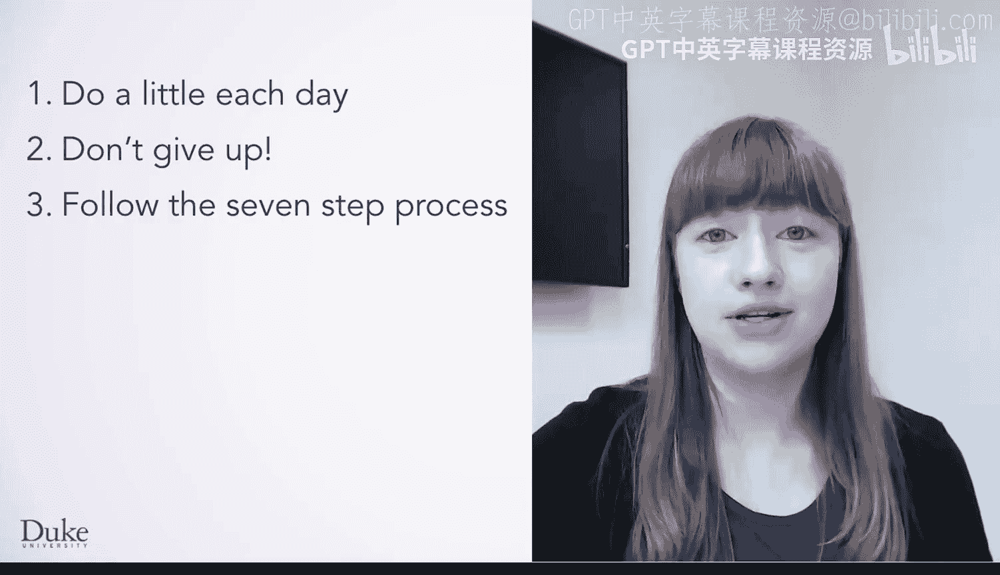
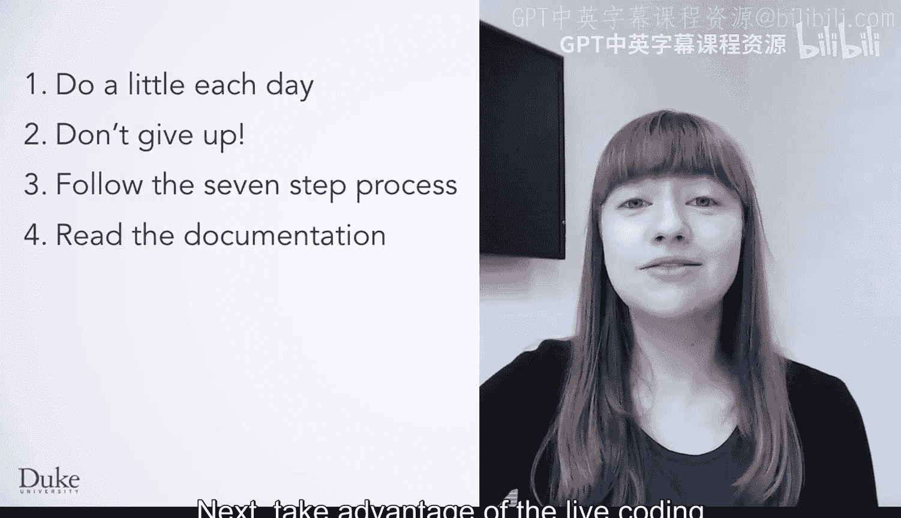

# Java编程和软件工程基础：2-5：编程学习技巧 🧠

在本节课中，我们将学习一些高效学习编程的技巧。这些建议旨在帮助你更好地掌握课程内容，克服编程中遇到的挑战，并最终成为一名更出色的程序员。

---

为了帮助你取得最佳学习效果，我们提供一些关于如何学习本课程的建议。

首先，**每天学习一点**。试图一次性学完所有编程知识非常困难。如果你每天完成几项课程内容，而不是试图在一两天内完成所有任务，你将能更好地记住知识，保持更高的学习动力，并有更多时间来解决代码中的问题。

---

上一节我们提到了代码中的问题，也就是所谓的“Bug”。

在编程时犯错是正常的，因此我们的下一个建议是：**不要放弃**。每个人的程序中都会出现Bug。编程的一部分就是找出问题所在并修复它。

---

在编程时，我们强烈建议遵循**七步流程法**。这意味着在开始编写任何代码之前，你应该先规划如何解决问题。如果你没有学习我们的第一门课程，不用担心，稍后会有机会回顾七步流程法。七步流程法很重要，因为它为你提供了一种解决问题的方法。当你构思出解决方案后，就可以开始编写代码了。

---

一旦你准备好开始编写程序，请确保**阅读了相关文档**。这样你就能了解存在哪些其他方法以及如何使用它们。根据需要，随时查阅文档。

---

接下来，**充分利用实时编码视频和随堂练习**。对于实时编码视频，这是一个与讲师一起编程的绝佳机会。你也可以从视频中下载代码并自己运行。尝试做一些小的改动，以确保你真正理解程序的每个部分是如何工作的。

---

最后，对于**随堂练习**，即使它们不计入最终成绩，它们仍然是测试你代码的好机会。在进入计分测验之前，利用随堂练习来发现和修复问题。

---

最后，如果你在编程中仍然遇到困难，**请在课程讨论区向讲师团队和同学寻求帮助**。成为一名优秀程序员的一部分，就是知道如何有效地寻求帮助。我们将在下一个视频中更详细地讨论这一点。

---

本节课中，我们一起学习了高效学习编程的几个关键技巧：坚持每日学习、不畏惧错误和Bug、遵循七步流程法、善用文档、利用视频和练习进行实践，以及在需要时积极寻求帮助。掌握这些技巧将帮助你更顺利地进行编程学习。