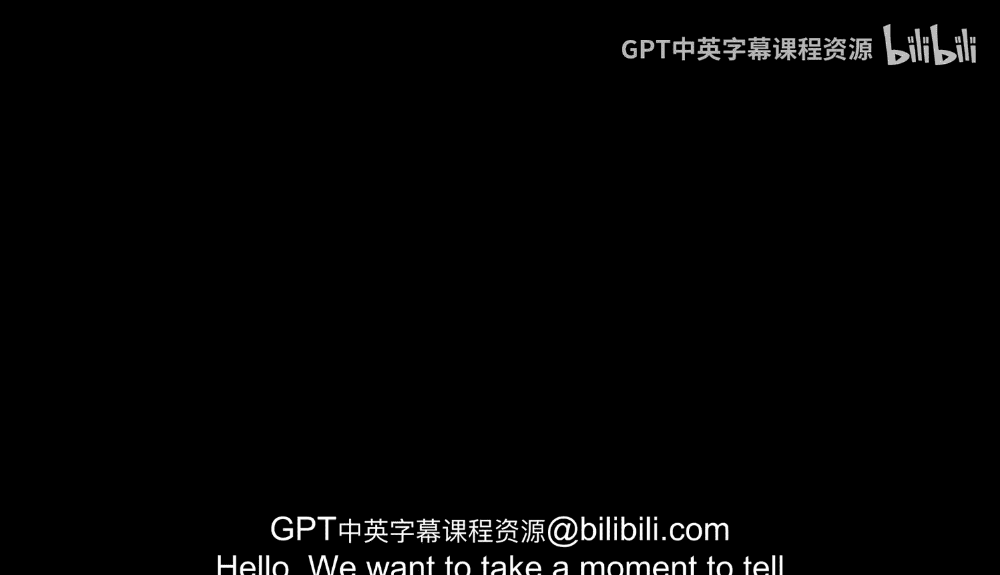
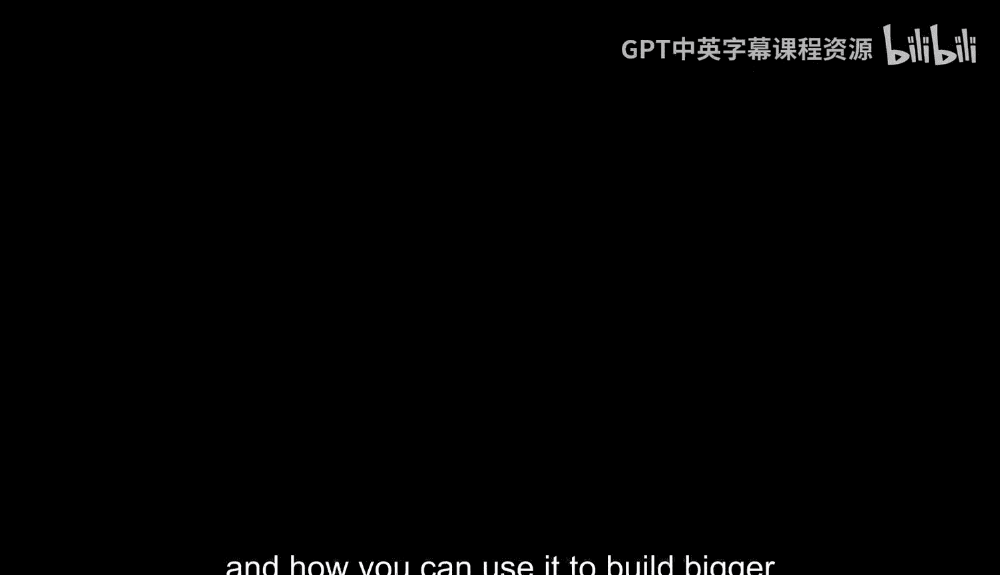

# Java编程和软件工程基础：专项课程介绍：面向对象编程与Java专项课程

在本节中，我们将向您介绍一门由杜克大学和加州大学圣地亚哥分校的讲师共同创建的专项课程。这门课程名为“面向对象编程与Java”。

我是杜克大学的讲师之一，欧文·阿斯特拉坎。我将帮助您学习这门专项课程。

我们将从Java的基础开始，学习如何使用它编写程序来解决各种各样的问题。

我是苏珊·罗杰，也是您来自杜克大学的另一位讲师。我们将从Java的基础知识开始。虽然我们希望您已经有一些编程经验，但我们会假设您对Java一无所知，并且渴望学习。

这门专项课程的下一门课程是“Java编程：数组列表与结构化数据”。我是罗伯特·杜瓦尔，很高兴能教您关于Java的知识。

在我们的下一门课程中，您将更深入地学习Java，并学习以更复杂的方式存储数据，从而解决更有趣、更激动人心的问题。我想我们的示例中甚至有一只恐龙。

我是德鲁·希尔顿，是您来自杜克大学的第四位讲师。在您与我们学习了这些Java基础知识之后，我们在加州大学圣地亚哥分校的朋友们将接手，教您更多关于Java和面向对象编程的精彩内容。

现在，我们将让他们向您做自我介绍，几个月后您将再次见到他们。

大家好，我是米娅·明尼斯。我将是您加州大学圣地亚哥分校的讲师之一。您将在第三门课程“面向对象编程”中见到我们。在这门课程中，我们将建立在您从杜克大学的朋友那里学到的编程概念之上，然后我们还将更多地讨论Java的面向对象特性，以及如何利用它来构建更大的程序以解决更复杂的问题。

大家好，我是莉亚·波特，是加州大学圣地亚哥分校的讲师。您将在专项课程的第三门课程中学到的另一个主题是图形用户界面和事件处理。掌握了这些技能，您将能够构建易于使用且直观的交互式应用程序。

我是克里斯汀·阿尔瓦拉多，是这门专项课程加州大学圣地亚哥分校团队的最后一位讲师。我想向您简要介绍一下专项课程的第四门课程。在那门课程中，您将学习如何更高效地存储数据，以便您的程序能够快速地对大型数据集执行操作。当您完成那门课程时，您将成为一名相当出色的Java程序员。

那么，让我们开始吧。😊