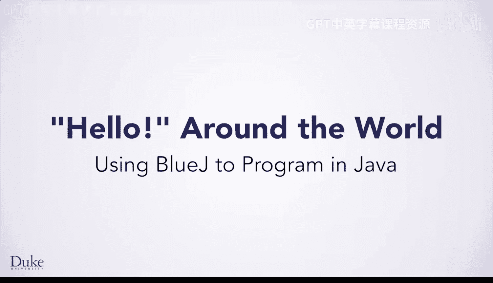
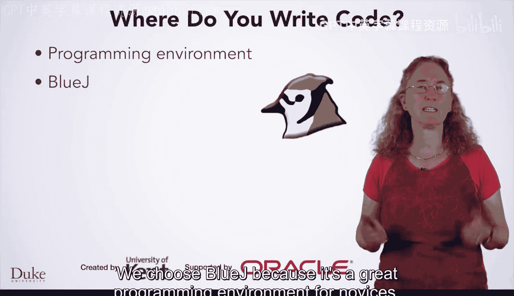
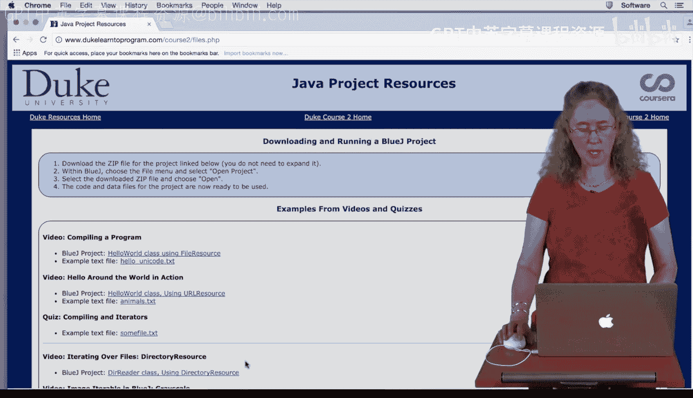
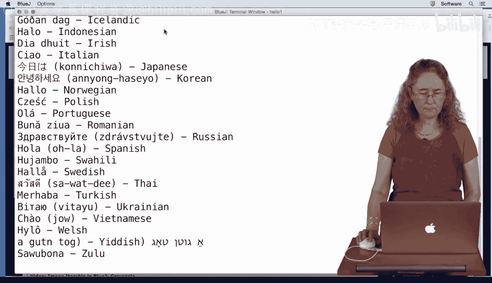
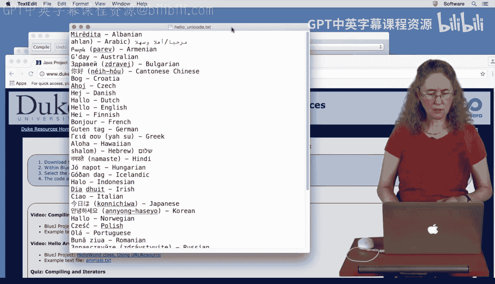

# 007：使用BlueJ进行Java编程



在本节课中，我们将学习Java代码的组织方式、计算机如何执行程序，并演示如何在BlueJ环境中运行你的第一个Java程序。

## 概述：Java代码的组织与执行

上一节我们介绍了编程的基本概念，本节中我们来看看Java语言的具体特点。Java是一种面向对象的语言。这意味着你将在编写代码时使用**类**和**对象**。

**类**是组织程序的一种方式，而**对象**是在程序运行时使用类创建的。我们将在后续课程中深入学习对象和面向对象编程。

类文件具有 `.java` 扩展名。在一个Java类中，你将编写一个或多个Java**方法**。这些方法是当你运行程序时，计算机要执行的指令。

你编写的代码被称为**源代码**。源代码是高级代码，人类可读，但机器不可读。因此，当我打开这个Java类时，我可以阅读我的同事讲师在其中编写的Java程序。

为了让计算机运行我的程序，我的源代码必须被翻译成低级的**字节码**，这是机器可读的。字节码文件具有 `.class` 扩展名。



将类中的源代码翻译成字节码的过程称为**编译**。当你编写Java程序时，在运行程序之前，你需要先编译它。

那么，你最终由计算机运行的代码写在哪里呢？程序员在**编程环境**中编写代码。在这些课程中，我们将使用一个名为BlueJ的特定环境。

我们选择BlueJ，因为它是一个非常适合初学者的编程环境。它允许你开始编程，而无需担心编辑器的复杂性，并且我们添加了一些特殊功能，供你在为本课程开发Java程序时使用。

## 下载并运行第一个Java程序



接下来，你将运行你的第一个Java程序。我们将向你展示如何从Duke Learner Program网站下载它，然后打开BlueJ并运行该程序。

以下是具体步骤：

1.  **访问课程网站**：打开Duke Learn to Program网站，进入Course2页面。
2.  **获取项目资源**：点击“Project Resources”。你可以看到我们的第一个程序，名为“Hello World BlueJ Project”。
3.  **下载项目**：点击该项目链接。你将获得一个包含Java程序和数据文件的ZIP压缩包。下载后，解压该文件即可。
4.  **启动BlueJ**：启动你已经安装好的BlueJ环境。
5.  **打开项目**：在BlueJ中，点击菜单栏的“Project” -> “Open Project...”，然后导航到你解压项目文件的文件夹，选择并打开“Hello World”项目。

打开项目后，你将看到名为“HelloWorld”的Java文件。点击它即可查看其中的代码。

让我们简要分析一下这段代码：
```java
// 这是一个名为HelloWorld的类
public class HelloWorld {
    // 类中包含一个名为runHello的方法
    public void runHello() {
        // 创建一个文件资源，关联到名为"hello_unicode.txt"的文件
        FileResource res = new FileResource("hello_unicode.txt");
        // 使用for循环遍历文件的每一行
        for (String line : res.lines()) {
            // 打印每一行内容
            System.out.println(line);
        }
    }
}
```
这是一个非常简单的程序。它的作用是：打开一个文件，并打印文件中的每一行。文件中的每一行是来自某个国家的问候语。

## 编译与运行程序

在运行程序之前，你需要先编译它。

在BlueJ的主窗口中，右键单击“HelloWorld”类图标。你会看到图标上有许多斜线，这表示程序尚未编译。你需要编译程序，以便计算机能够理解它。

右键单击后，选择“Compile”。如果一切顺利，你会看到除了右上角的两条线外，其他斜线都消失了。这意味着它已编译成功，并创建了计算机可以理解的机器可读的 `.class` 文件。

现在，我们可以创建该类的实例（即对象）。再次右键单击“HelloWorld”类图标，选择“new HelloWorld()”。你可以为对象指定任意名称，这里我们使用默认名称。

对象创建后，我们就可以运行它了。右键单击新创建的对象（下方带有红色长方形的图标），你会看到 `runHello()` 方法。点击它来运行。

运行后，程序将打印出文件中的所有行。你可以看到各种美妙的问候语，例如：Hallo, hello, Bonjour, Guten tag, Aloha 等。



这些问候语来自你下载项目时附带的数据文件 `hello_unicode.txt`。你可以用文本编辑器打开这个文件，会发现其中包含的内容与程序打印出的内容完全一致。

让我们回顾一下程序的工作流程：
1.  打开文件 `hello_unicode.txt`。
2.  使用 `for` 循环逐行遍历该文件。
3.  在循环中，获取每一行并将其打印出来。



## 总结

本节课中我们一起学习了Java代码的基本组织单元——类和方法，了解了源代码需要编译成字节码才能被计算机执行。我们重点实践了如何在BlueJ编程环境中下载、打开、编译并运行一个简单的Java程序。这个程序通过读取文件并打印其内容，向你展示了程序的基本输入输出操作。希望你已经成功运行了你的第一个Java程序，并感受到了编程的乐趣。