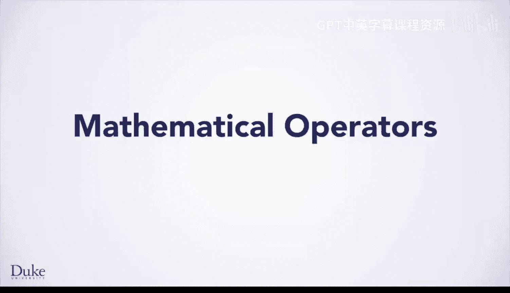
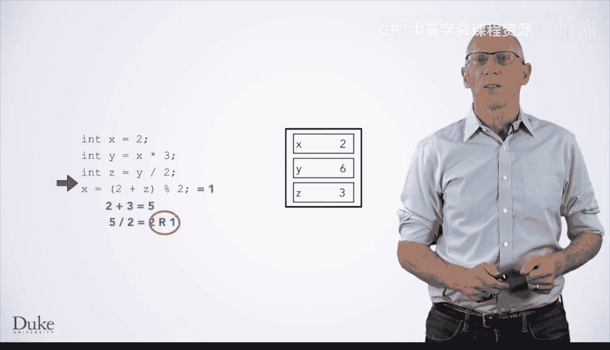
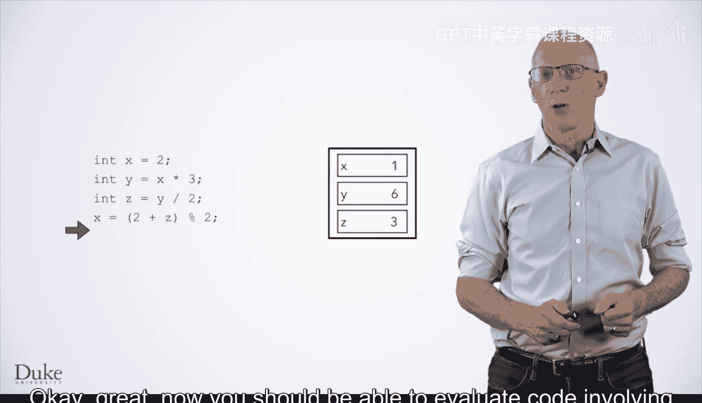

# 011：数学运算符

在本节课中，我们将要学习Java中数学运算符的使用，包括如何计算表达式、理解运算符优先级以及变量赋值的过程。



## 表达式实践

上一节我们介绍了表达式的基本概念，本节中我们来看看它们在实际代码中如何运作。

以下代码示例首先声明了一个名为`X`的整数类型变量。

```java
int x;
```

接下来，我们将`x`初始化为`4 + 3 * 2`。

根据数学规则，乘法比加法拥有更高的优先级，因此这个表达式先计算`3 * 2`得到`6`，再计算`4 + 6`，最终结果为`10`。

```java
x = 4 + 3 * 2; // x 的值为 10
```

所以，我们将数值`10`放入变量`x`的“盒子”中。

## 变量赋值与计算

然后，我们声明另一个`int`类型的变量`Y`，并将其初始化为`x - 6`。由于`x`的值是`10`，所以`10 - 6`的结果是`4`。

```java
int y = x - 6; // y 的值为 4
```

我们为`Y`创建一个“盒子”，并将`4`放入其中。

最后一条语句是`x = x * y`。有时新手程序员会误以为这类语句像代数方程一样，可以通过等号求解`x`。然而，实际情况并非如此。我们需要遵循已学习的规则：先计算等号右边的表达式。

右边表达式`x * y`计算为`10 * 4`，结果是`40`。然后，我们将`40`放入`x`的盒子中，覆盖之前的值。

```java
x = x * y; // x 的新值为 40
```

## 综合练习

现在，让我们看另一个例子。在逐步分析之前，请暂停视频，尝试自己推断这段代码片段执行后`X`、`Y`和`Z`的值。

```java
int x = 2;
int y = x * 3;
int z = y / 2;
x = 2 + z % 2;
```

好的，让我们逐步分析。

首先，我们声明并初始化`x`为`2`。

接着，我们计算`x * 3`，即`2 * 3`，得到`6`，并用这个值初始化`y`。

然后，我们计算`y / 2`，即`6 / 2`，得到`3`，并用这个值初始化`z`。

最后一条语句是`x = 2 + z % 2`。由于`(2 + z)`被括号括起，我们首先计算这部分，得到`5`。

接下来，我们计算`5 % 2`。根据阅读材料，`5 % 2`表示将`5`除以`2`，然后取余数而非商数，因此这个表达式的结果是`1`。

所以，我们将`x`盒子中的值更新为`1`。

```java
// 最终结果：
// x = 1
// y = 6
// z = 3
```

## 核心概念总结



以下是本课涉及的几个核心运算规则：

*   **运算符优先级**：乘法和除法在加法和减法之前计算。
*   **取模运算符**：`a % b` 返回 `a` 除以 `b` 后的余数。
*   **赋值操作**：`=` 是赋值操作符，先计算右边的表达式，然后将结果存入左边的变量。

## 课程总结



本节课中我们一起学习了Java数学运算符的实际应用。我们通过代码示例，练习了如何根据运算符优先级和括号来逐步计算表达式，并理解了变量赋值是如何更新存储值的。现在，你应该能够评估涉及各种数学表达式的代码了。