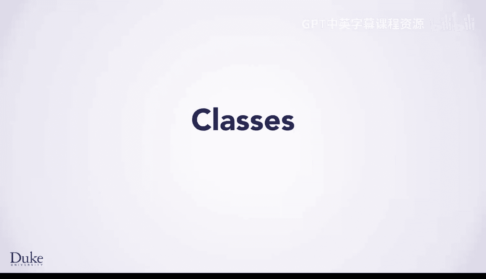
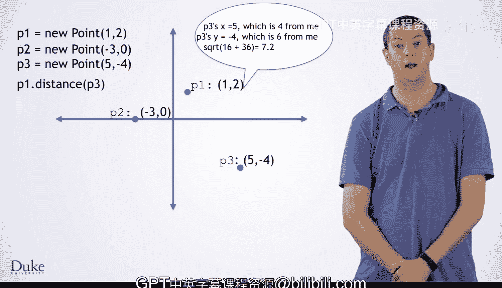

Java编程与软件工程基础：2-5：类与对象入门

在本节课中，我们将要学习Java编程中两个核心概念：**类**与**对象**。它们是面向对象编程的基石，能帮助我们将数据和操作数据的代码组织成逻辑单元，从而更清晰地构建程序。

---

随着你继续学习Java的工作原理，有必要花些时间讨论一下对象和类。

在深入具体的语义之前，我们先来谈谈高层次的概念。

当你编写程序时，通常会以变量的形式存储数据，这些变量保存着你正在计算的值，同时还有代码。

这些代码根据你设计的算法来操作这些数据。面向对象编程是一种编程语言的范式，它将数据和操作数据的代码组合在一起，形成称为对象的逻辑单元。

这种语言设计旨在通过将代码和数据组合成一个逻辑单元，来帮助程序员思考他们的程序。

当你编写越来越大的程序时，这个原则会变得越来越有帮助。

随着你的进步和对Java的深入了解，你将学习到许多与这些思想相关的重要原则。

然而，现在，我们只是从基础开始。

你可以看到一个类声明的例子。**类**是一个模板，它规定了如何创建对象。

让我们看看这个声明的每一部分。第一行告诉Java我们正在声明一个名为 `Point` 的类。

与变量类似，我们在命名自己创建的类时有很大的自由度，但我们应该用描述性的方式命名它们。

这里，我们正在创建一个表示二维点的类。所以 `Point` 是一个好名字。

接下来，我们声明两个字段：`int x` 和 `int y`。**字段**是对象内部变量的名称。

它们也被称为**实例变量**，因为它们是每个由该类创建的对象实例中的变量。

这些看起来像变量声明，只是前面有 `private` 关键字。

`private` 意味着只有这个类内部的代码才能直接操作这些字段。

随着你Java技能的提升，你会了解更多为什么这很重要。但现在，我们只需将所有字段设为 `private`。

接下来是类构造函数的声明。

**构造函数**规定了如何创建该类的对象。

它是在创建对象时运行的代码，用于初始化该对象。

请注意，构造函数看起来像一个函数，但没有返回类型，并且名称与类相同。

这些是构造函数声明的标志。

在构造函数前面，我们有 `public` 这个词，这意味着任何代码都可以使用这个构造函数来创建一个 `Point` 对象。

在构造函数之后，我们定义了三个方法：`getX`、`getY` 和 `distance`。**方法**是类内部的函数。在Java中，所有东西都在一个类内部。因此，从技术上讲，Java中的所有函数都是方法。

这些方法在特定对象上被**调用**，并隐式地作用于该对象。

你可以在这里看到一个方法调用，代码是 `otherPoint.getX()`。

这会在 `otherPoint` 对象上调用 `getX` 方法。

它将获取那个特定 `Point` 对象的 `x` 值。

最后，我们有一个静态方法的声明。

它们的行为与常规方法略有不同。

它们不作用于类的任何特定实例。它们通常只属于类本身。

这个概念有点棘手，我们稍后会详细解释。

这个方法叫做 `main`，它是一个特殊的方法。如果你在BlueJ之外运行你的程序，`main` 是起点。在任何对象被创建之前，执行就从 `main` 开始。

---

上一节我们介绍了类和对象的基本构成，本节中我们来看看如何实际使用它们。

对象的概念旨在帮助程序员从逻辑上有意义的角度，以对象的形式思考他们的数据。

例如，如果我们创建一个新的 `Point`，我们就是在创建一个对象，它代表我们可以具体思考的东西。

在这个例子中，就是平面上的一个点。

然后我们可以创建另一个点，它有自己的 `x` 和 `y`，代表同一类型事物的不同实例。

即平面上的另一个点。当然，你可以根据算法的需要创建任意数量的对象。

一旦你拥有了一些对象，你就可以在它们身上调用方法，例如 `p1.distance(p3)`。

你可以将其理解为要求 `p1` 计算到 `p3` 的距离。

也就是说，你可以把这行代码理解为：`p1`，去计算你离 `p3` 有多远。

你可以认为，为这个被调用的方法执行的代码，在逻辑上属于 `p1` 对象。

---

本节课中我们一起学习了Java中类和对象的基础知识。我们了解到，**类**是创建对象的蓝图，它封装了数据（字段）和行为（方法）。**对象**是类的实例，代表程序中的具体实体。通过将相关的数据和操作捆绑在一起，面向对象编程帮助我们构建更清晰、更模块化的代码结构，这对于开发大型复杂程序至关重要。