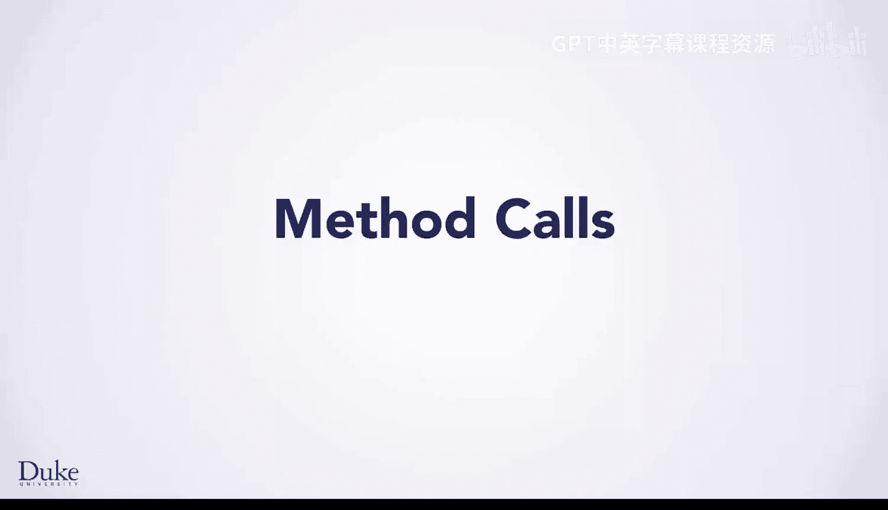
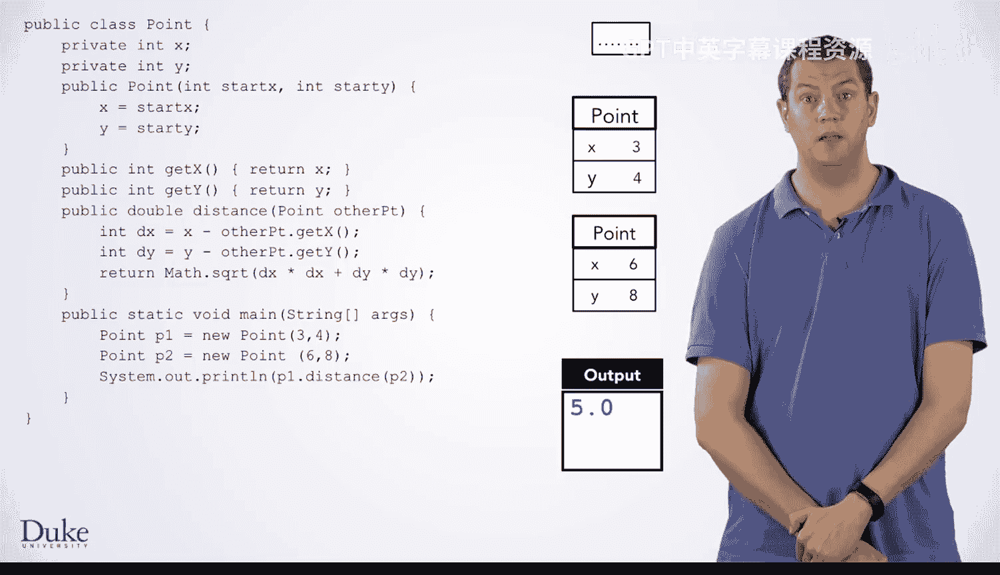
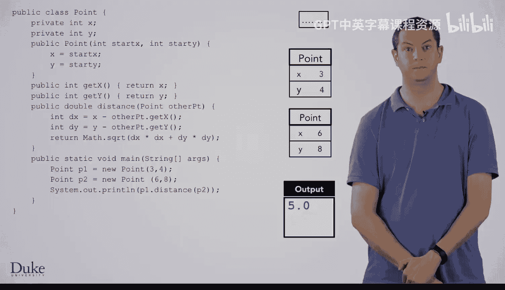

# 016：方法调用详解 🧠

在本节课中，我们将学习Java中方法调用的执行过程。我们将通过一个具体的例子，详细拆解从方法调用到返回的每一步，理解`this`参数、参数传递以及静态方法调用的概念。

---

在上一节中，我们执行了`Point`对象`P1`和`P2`的声明与初始化，并学习了`new`关键字和构造函数。本节中，我们来看看方法调用的具体执行机制。

方法调用与函数调用非常相似，但有一个关键区别：我们必须传递一个隐式的`this`参数，以告知方法它正在操作哪个对象。

让我们从上次中断的地方继续。代码`P1.distance(P2)`将调用`P1`的`distance`方法，并打印其返回值。

我们需要为`distance`方法设置一个栈帧，它将接收两个参数：
*   隐式的`this`参数，用于指明方法作用于哪个对象。
*   显式传递的`otherPoint`参数。

`this`参数的值与点号（`.`）前的变量值相同。在本例中，是`P1.distance`，因此`this`的值与`P1`相同，是一个指向同一个`Point`对象的引用箭头。图中我们为这个箭头使用了不同颜色，这只是为了帮助你在图表中区分不同的箭头，并无特殊含义。

对于`otherPoint`参数，我们直接复制传入的值，即`P2`。因此，`otherPoint`的值是一个指向与`P2`相同的`Point`对象的引用箭头。

现在，我们进入`distance`方法内部并开始执行其中的代码。

执行第一行代码时，我们声明变量`dx`并将其初始化为`x - otherPoint.getX()`。为了计算这个表达式，我们需要调用`otherPoint.getX()`。因此，我们需要为这个方法调用设置一个新的栈帧。

同样，这个方法接收一个隐式的`this`参数，以告知它对哪个对象执行`getX`操作。那么，`this`应该指向哪个对象呢？我们调用的是`otherPoint.getX()`，因此我们复制`otherPoint`的值，即指向那个`Point`对象的引用箭头。

现在我们进入`getX`方法内部并开始执行代码。这里我们遇到`return x;`，因此需要计算表达式`x`的值并返回。

如何获取`x`的值？我们跟随`this`指针找到正在操作的对象，然后在该对象内部查找`x`字段。该字段的值是`6`，这就是此处表达式`x`的值，它将被返回到调用点2。

返回到调用点2后，我们需要计算`x - 6`。这里的`x`如何计算？我们再次查看`this`指针，它指向当前的`Point`对象。我们获取该`Point`对象内部的`x`字段，其值为`3`。因此，我们将计算`3 - 6`，并将`dx`初始化为`-3`。

接下来，我们将通过一个非常相似的过程来声明和初始化`dy`。首先，为`dy`创建一个存储框。

然后，我们在`otherPoint`上调用`getY`。请注意，这里的`this`是`otherPoint`值的一个副本，即指向第二个`Point`对象的引用箭头。我们从该对象中获取`y`字段的值，即`8`，并将其返回到调用点2，执行箭头也返回到此处。

我们通过查看当前对象（由`this`指向）并找到其`y`字段来计算`y`的值，该值为`4`。现在，我们可以完成`dy`的初始化，计算`4 - 8`，得到`-4`。

下一行代码包含一些数学运算。让我们详细看一下。

我们调用`Math.sqrt(dx * dx + dy * dy)`。首先，我们可以计算参数的值：`(-3)^2 + (-4)^2 = 9 + 16 = 25`。因此，我们需要计算`Math.sqrt(25)`。

这看起来像一个方法调用，但`Math`对象从何而来？实际上，`Math`是一个类，而不是一个对象，它是Java库的一部分。这是一个**静态方法调用**。该方法是在类本身上调用的，而不是在任何特定的对象上。`Math`类只是一个方便存放一系列数学函数的地方。

由于我们没有`Math.sqrt`的源代码，我们必须知道它的作用。如果我们不知道，可以查阅Java文档。不过，你可能已经猜到，这个方法就是计算其参数的平方根。因此，`Math.sqrt(25)`将返回`5.0`。

我们的`distance`函数将这个值返回给它的调用者。因此，在`main`方法中调用`distance`的返回值将是`5.0`。

然后，我们返回到执行域，准备完成`print`语句，它将打印出`5.0`。现在，`main`方法执行完毕，我们将从中返回，销毁其栈帧并退出程序。

---

本节课中，我们一起学习了Java方法调用的完整执行流程。我们详细探讨了：
*   方法调用时隐式`this`参数的传递和作用。
*   参数值的复制与传递过程。
*   如何通过`this`指针在对象内部访问字段。
*   静态方法（如`Math.sqrt`）的调用方式及其与实例方法调用的区别。

通过逐步跟踪代码执行，我们清晰地看到了从方法调用、参数计算、内部执行到最终返回的每一个步骤，这对于理解面向对象编程中方法的运作原理至关重要。