# 017：数据类型详解 🧱

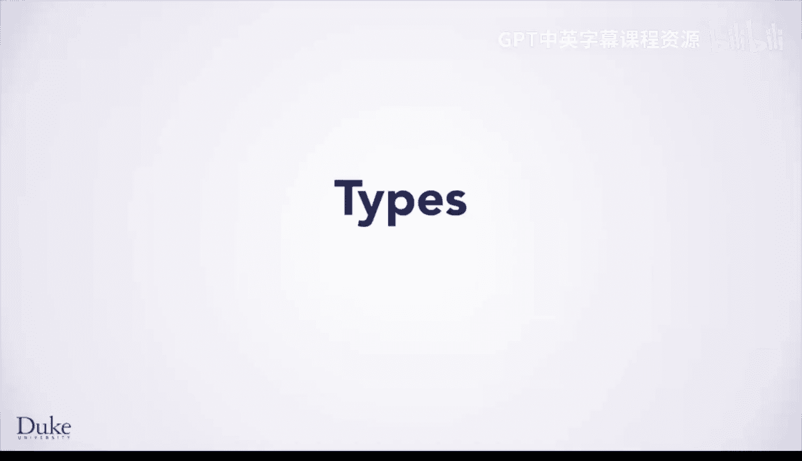

在本节课中，我们将要学习Java中一个核心概念：数据类型。我们将探讨类型的定义、作用、不同类型之间的转换，以及Java中两种主要的类型分类。

## 什么是数据类型？

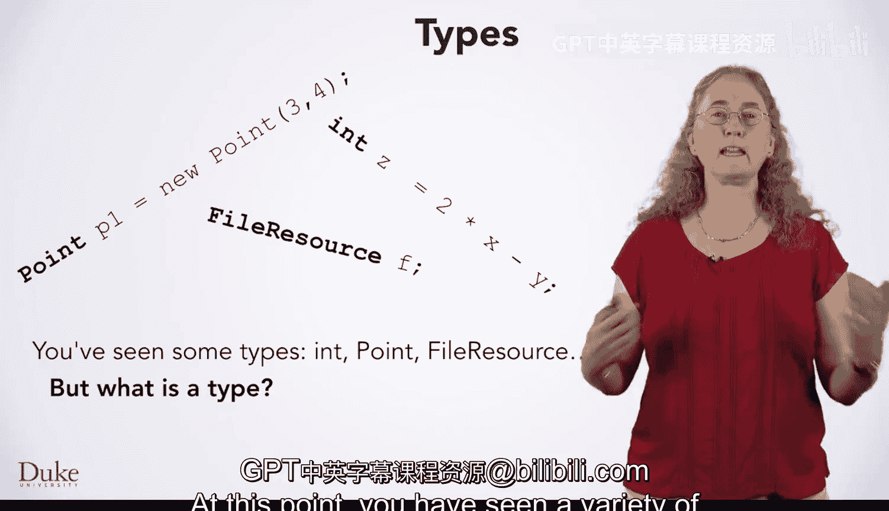

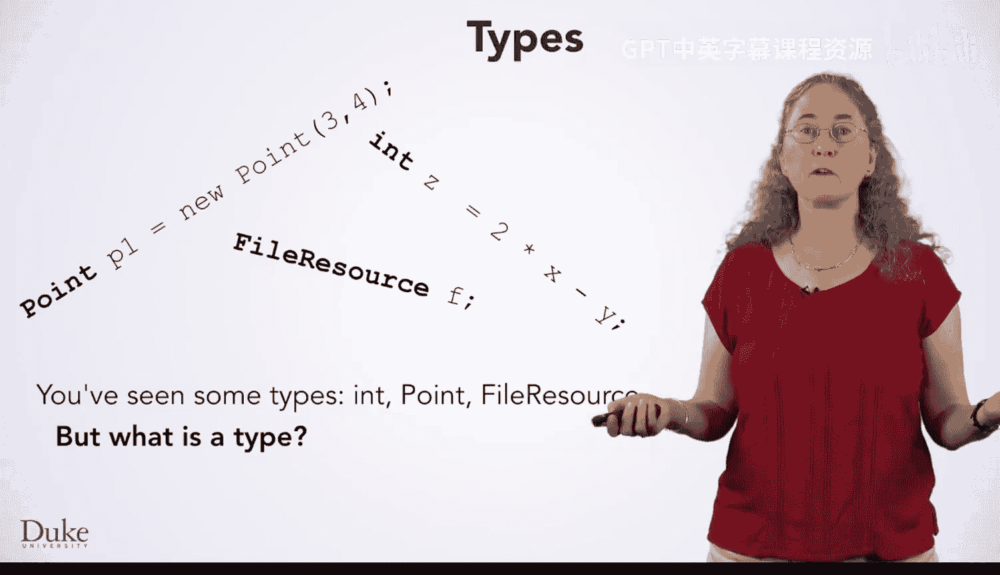

到目前为止，你已经见过多种类型，例如 `int`、`Point` 和 `FileResource`。

但类型究竟是什么？**类型规定了数据应如何被表示、解释和操作，以及你可以用它执行哪些操作。**

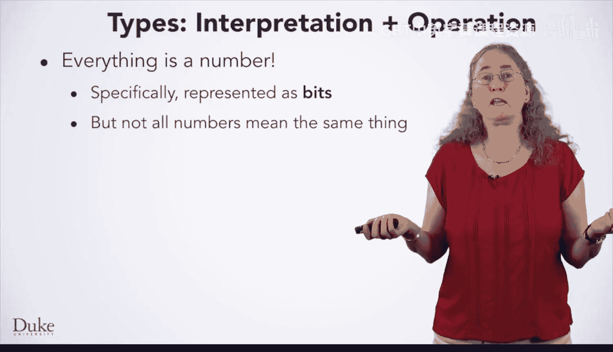

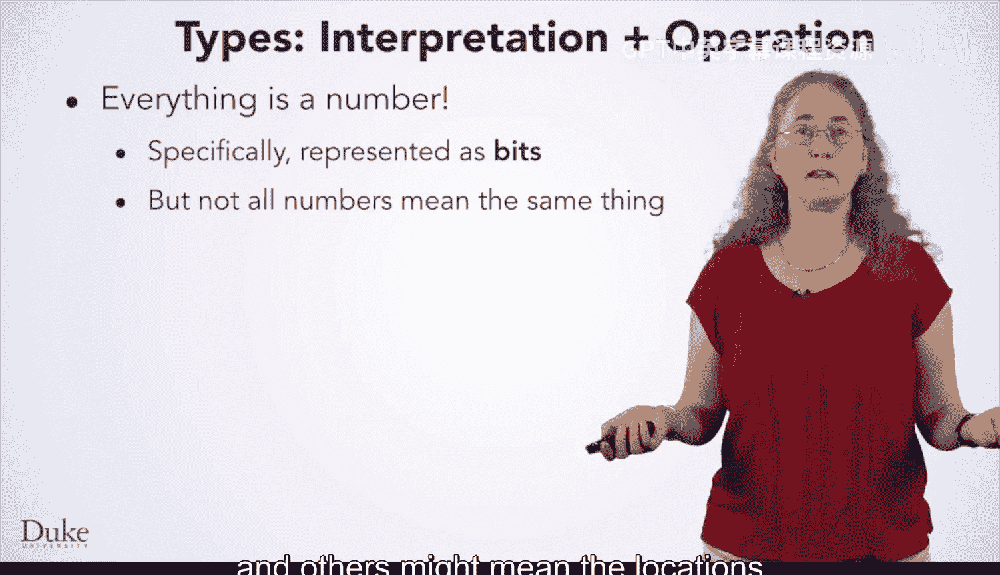

计算领域的一个重要规则是：**一切皆是数字**。如果你在之前的入门课程中没有了解过“一切皆是数字”原则，我们会在后续提供相关视频链接。

具体来说，这意味着计算机内存中的所有内容都以比特（bits），即1和0的形式存储。

但并非所有数字都代表相同含义。有些数字可能代表普通数值，有些可能代表字母，还有些可能代表数据在计算机内存中的位置。

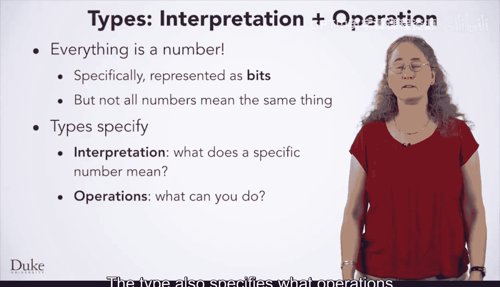

## 类型如何解释数据？

因此，**值的类型规定了如何解释这些数字**。它告诉Java如何为存储在内存中的1和0赋予意义。

类型还规定了你可以对数据执行哪些操作。类型不仅告诉Java你能做什么，还告诉它应该如何做。

让我们更详细地讨论这两点。

我们刚刚提到，类型告诉Java如何解释内存中的1和0。让我们进一步探讨。在左侧，是我们一直使用的程序状态的概念性表示。

有一个名为 `x` 的变量框。在右侧，是计算机内存中的一串比特。蓝色的比特对应变量 `x`。

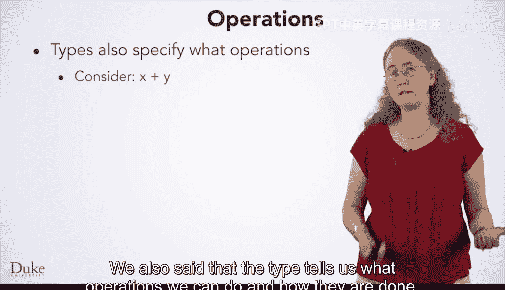

但它们对于 `x` 的值意味着什么？如果 `x` 是 `int` 类型，那么这些比特意味着它的值是 `1234567890`。我们在此不深入探讨如何得出这个结论的细节，对于Java编程初学者也无需了解。但如果你学习计算机组成原理课程，你会学到更多关于数据表示的知识。

我们想强调的是，如果 `x` 是其他类型，比如 `float`，那么相同的比特将具有不同的含义。这些相同的1和0将代表 `1228890.25`。

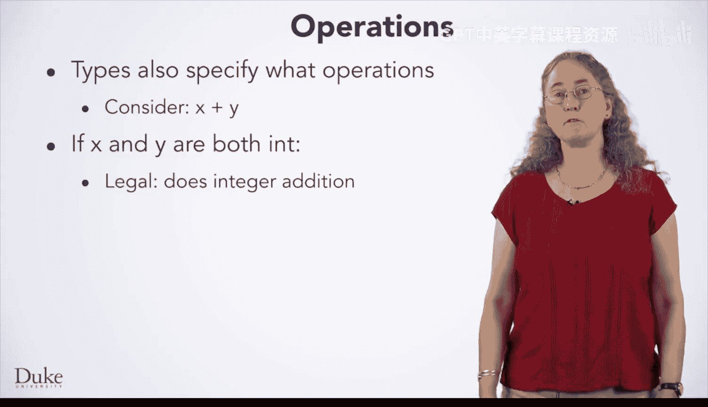

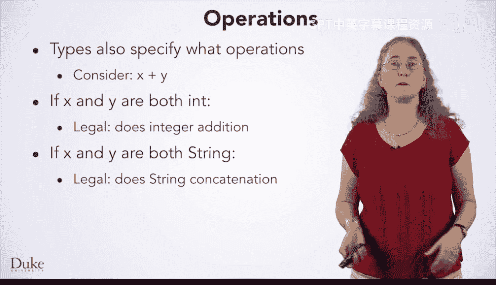

如果 `x` 是 `String` 类型，那么这些比特将是实际字符串对象在计算机内存中的位置，该对象包含一系列字符。这些字符本身也以比特形式存储，由于它们的类型是 `char`，所以会被解释为字母。

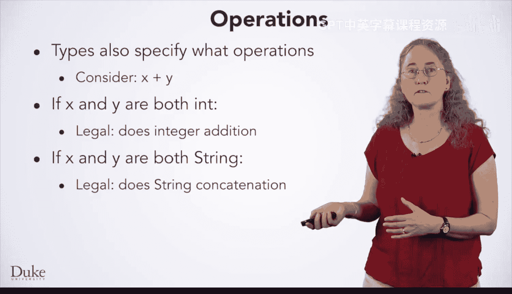

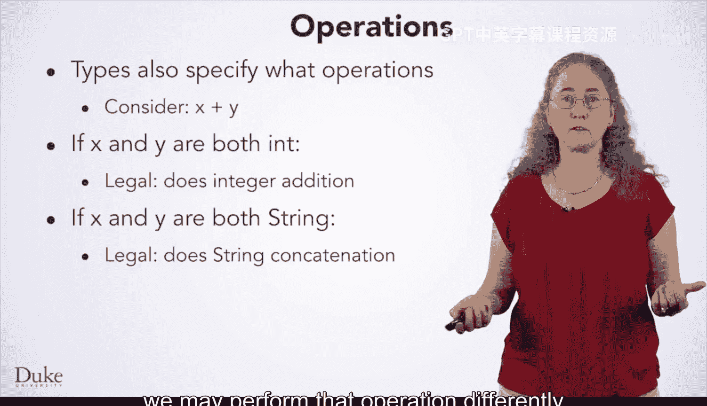

## 类型如何规定操作？

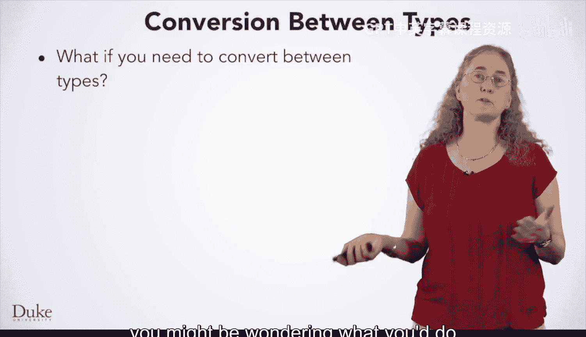

我们还提到，类型告诉我们能做什么操作以及如何执行。考虑这段简单的代码：`x + y`。它合法吗？如果合法，它执行什么操作？要回答这个问题，你需要知道 `x` 和 `y` 的类型。

以下是不同情况：
*   如果 `x` 和 `y` 都是 `int` 类型，那么这段代码合法并执行**整数算术加法**。
*   如果 `x` 和 `y` 都是 `String` 类型，那么这段代码也合法，但执行的是**字符串连接**。它会生成一个新字符串，内容是 `x` 的字母紧接 `y` 的字母。
*   请注意，即使 `+` 操作对两种不同类型都合法，我们对一种类型执行该操作的方式可能与另一种类型不同。
*   如果 `x` 和 `y` 都是 `Point` 类型，那么这段代码**不合法**。

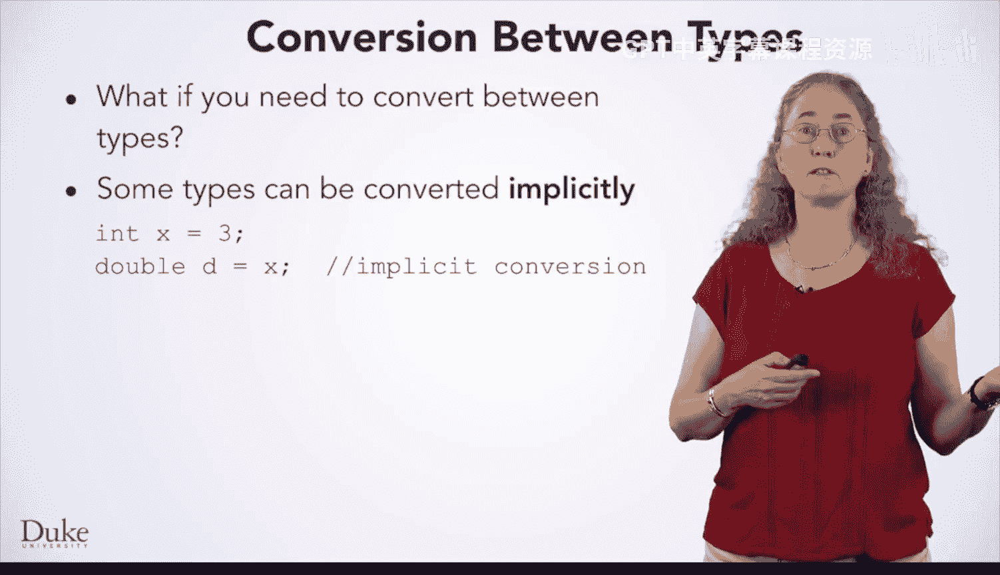

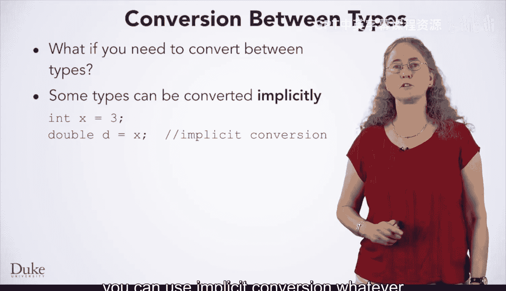

在讨论类型时，你可能想知道如何在类型之间进行转换。答案是：**视情况而定**。

## 类型转换

以下是三种主要的类型转换方式：

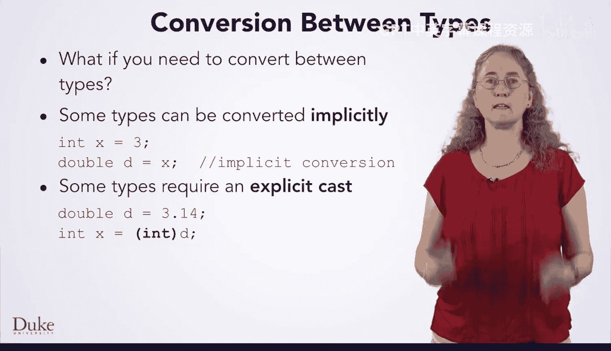

**1. 隐式转换**
对于某些类型转换，它们可以隐式发生。如果你有一个 `int` 类型的值，需要将其转换为双精度浮点数 `double`，编译器会自动为你插入转换，无需额外声明。

**规则是：只要编译器认为转换是安全的，就可以使用隐式转换。** 例如，这里我们将整数 `3` 转换为浮点数 `3.0`，这没有问题。请注意，编译器在决定隐式转换是否可行时，只考虑类型，而不考虑具体的值。

**2. 显式转换（强制类型转换）**
对于某些类型转换，你可以进行显式转换。这意味着你告诉编译器，即使你正在做的事情可能有风险，但你确定要这样做。例如，这里我们将 `double` 类型的 `3.14` 转换为 `int` 类型，这将丢弃小数部分，得到 `x = 3`。编译器需要确认我们确实想这样做，因此我们通过书写 `(int)` 来进行显式转换。

**3. 调用方法转换**
其他转换需要调用方法来计算出转换后的值。例如，如果我们有字符串 `"3"` 并想将其转换为整数，我们不能直接强制转换，因为这种转换实际上有些复杂。相反，我们必须调用像 `Integer.parseInt()` 这样的方法来执行转换。

## Java中的类型分类

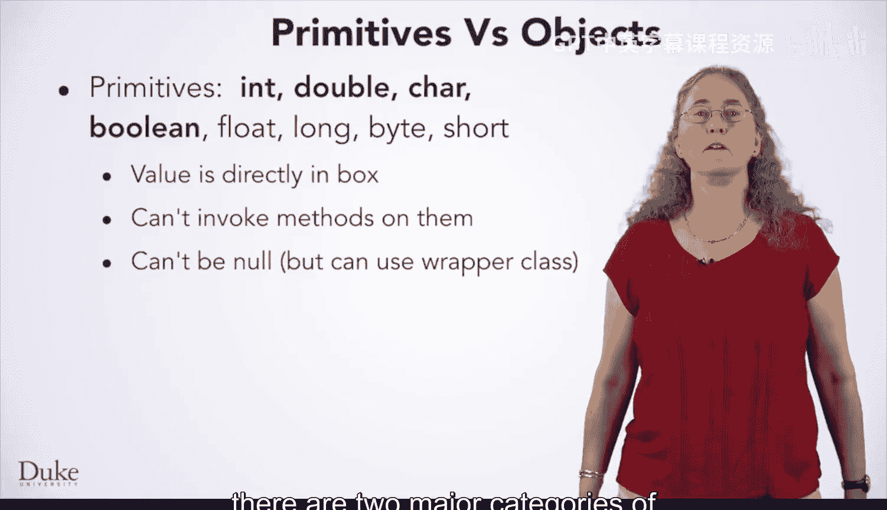

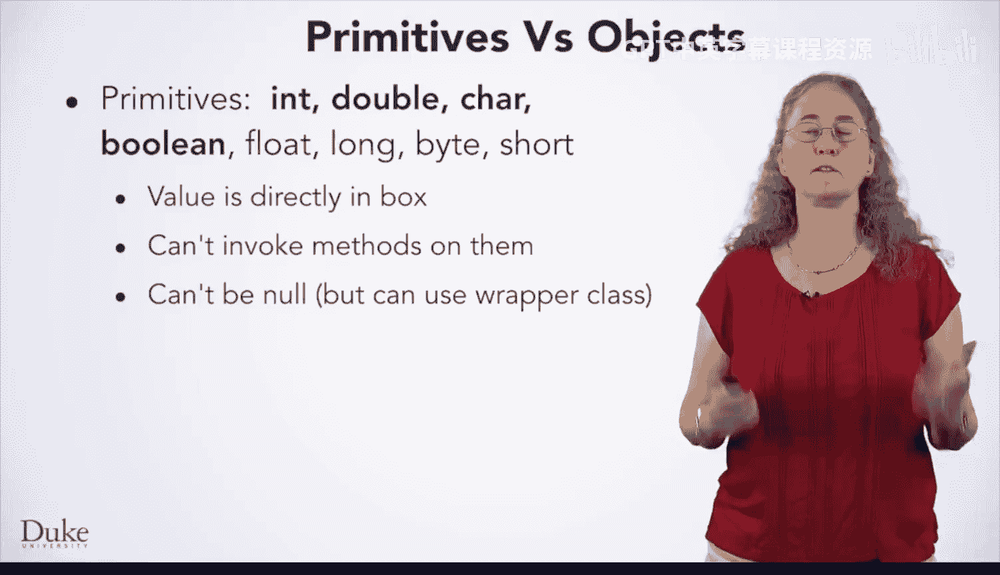

关于类型，我们要提到的最后一点是：**Java中的类型主要分为两大类：基本类型和对象类型。**

**基本类型**
Java有八种基本类型：`int`、`double`、`char`、`boolean`、`long`、`float`、`byte`、`short`。我们主要使用前四种。基本类型的变量直接在它们的“盒子”中保存值。基本类型没有方法，因此你不能在基本类型上使用 `.method()` 调用，并且它们不能为 `null`。不过，每种基本类型都有一个对应的包装类，它为你提供了一个可以容纳该基本类型的对象。

**对象类型**
其他所有类型都是对象类型。有些是Java内置的，如 `String`；有些是你可能使用的库的一部分，如 `Point` 或 `FileResource`；还有一些是你自己创建的类。每当你创建一个类，你创建的类就是一种新的类型。与基本类型不同，对象类型变量的值是一个指向对象的**箭头**。这个箭头称为**引用**。你可以使用 `.methodName()` 在对象上调用方法，并且引用可以为 `null`，意味着它不指向任何对象。如果你在两个对象上使用 `==`，你是在检查这两个箭头是否指向完全相同的对象。

## 总结

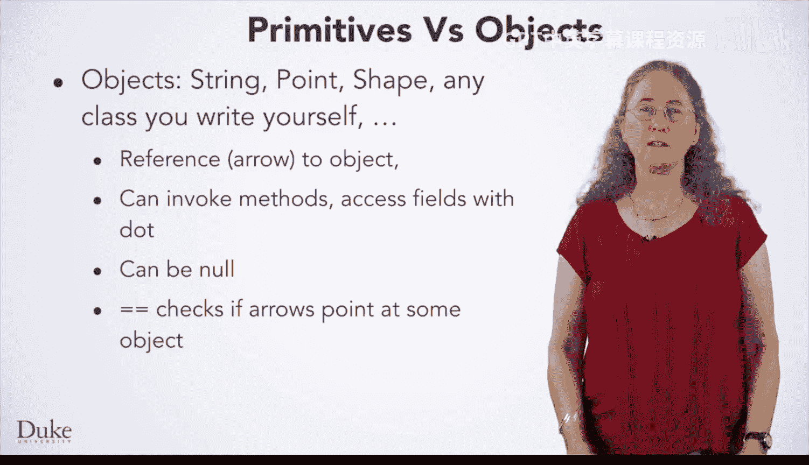

本节课中，我们一起学习了Java数据类型的基础知识。我们了解到类型定义了数据的解释和操作方式，探讨了隐式转换、显式转换和方法调用转换三种类型转换机制，并区分了基本类型和对象类型这两大类别。虽然这些概念一开始可能很多，但随着你进行更多的Java实践，你会更好地掌握这些思想。