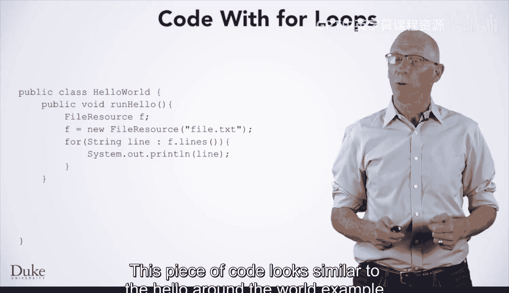
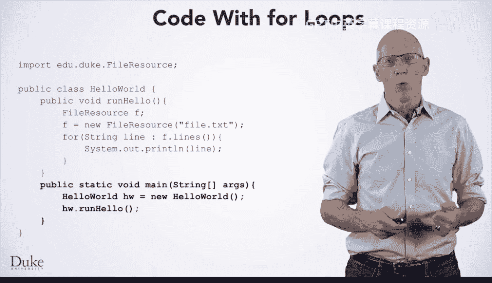
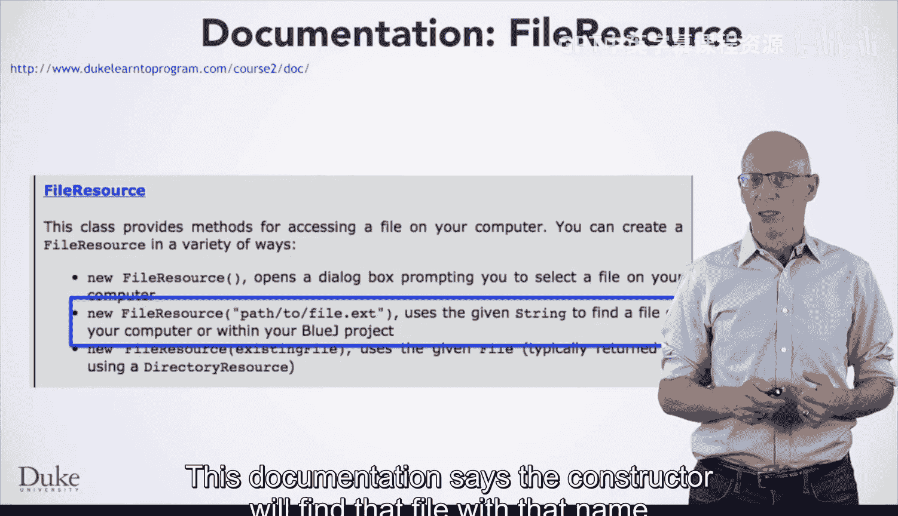
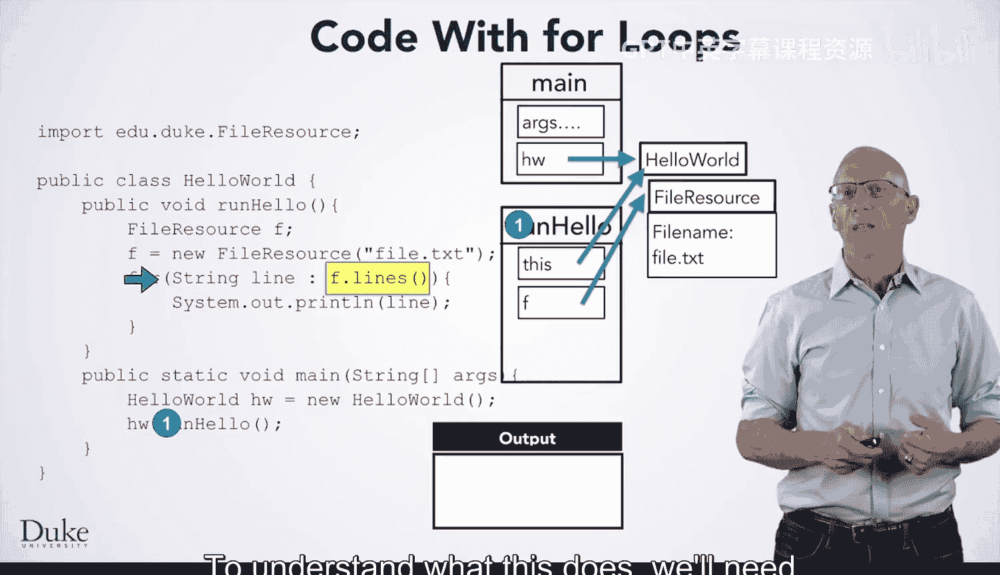
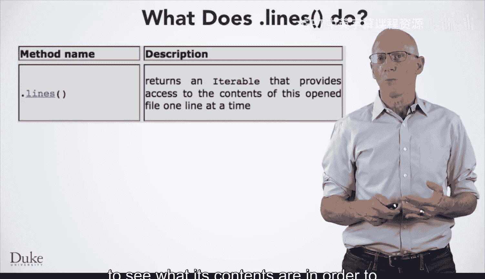
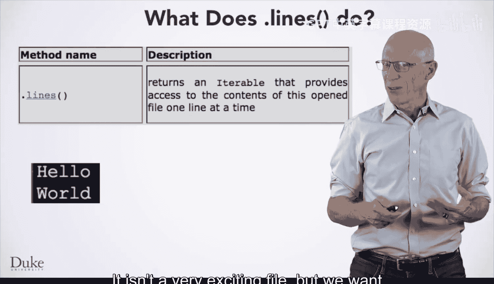
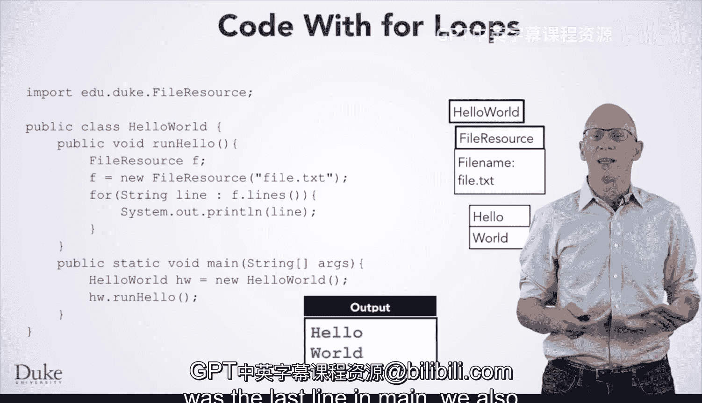

# Java编程和软件工程基础：2-5：for-each循环 🚀


在本节课中，我们将学习for-each循环的工作原理。这是一种用于遍历序列（如文件中的行）的便捷循环结构。我们将通过一个具体的代码示例，逐步解析其执行过程，并理解相关的核心概念，如对象创建、方法调用和抽象原则。

---

## 概述

我们将分析一段使用for-each循环读取文件并打印其内容的Java代码。此过程涉及创建对象、调用方法以及理解迭代器（Iterable）的概念。我们将手动模拟代码执行，以清晰地展示每一步发生了什么。



---



## 代码结构与初始设置

上一节我们介绍了循环的基本概念，本节中我们来看看for-each循环的具体应用。首先，我们需要在代码顶部添加一个import语句，以告知Java`FileResource`类的位置。

```java
import edu.duke.FileResource;
```

`FileResource`类位于我们提供的`edu.duke`包中。在学习更高级的Java技术之前，这个类库可以帮助我们操作数据和文件。

要运行此代码，可以创建一个`HelloWorld`对象并调用其`runHello`方法。或者，也可以添加一个`main`方法，以便在BlueJ或其他环境中直接运行。

```java
public class HelloWorld {
    public void runHello() {
        // ... 后续代码将放在这里
    }
    
    public static void main(String[] args) {
        HelloWorld hw = new HelloWorld();
        hw.runHello();
    }
}
```

---

## 逐步执行代码

现在，让我们开始手动执行代码。我们从`main`方法开始。

### 第一步：创建对象

`main`方法中的第一行声明并初始化了一个`HelloWorld`对象。

```java
HelloWorld hw = new HelloWorld();
```




由于`HelloWorld`类没有显式定义构造函数，Java会提供一个默认的无参数构造函数。因此，这行代码会创建一个`HelloWorld`对象。该对象没有字段，因此不包含任何可见的状态信息。

### 第二步：调用`runHello`方法

接下来，我们调用`hw.runHello()`方法。在`runHello`方法内部，首先声明了一个`FileResource`类型的变量`fr`。

```java
FileResource fr = new FileResource("file.txt");
```

这行代码引发了两个问题：
1.  `FileResource`对象内部是什么样子的？
2.  它的构造函数做了什么？

对于第一个问题，我们无需确切知道其内部细节。我们只需要知道它能做什么。这体现了**抽象**这一重要的编程原则。

对于第二个问题，我们需要查阅`FileResource`类的文档。文档显示，传入文件名字符串的构造函数会在计算机上查找该文件。

因此，执行这行代码后，变量`fr`将引用一个知道如何操作`file.txt`文件的`FileResource`对象。

---

## 理解for-each循环



下一行代码是一个for-each循环。



```java
for (String line : fr.lines()) {
    System.out.println(line);
}
```

以下是该循环的组成部分：
*   `String line`：声明一个`String`类型的循环变量`line`。
*   `:`：for-each循环的语法，常读作“in”。
*   `fr.lines()`：这是一个表达式，其计算结果是一个**可迭代对象**。可迭代对象能提供一个值的序列。



为了理解`fr.lines()`的作用，我们再次查阅文档。文档指出，`fr.lines()`返回一个可迭代对象，其值按顺序对应文件中的每一行。

假设我们的`file.txt`文件包含两行内容：
```
Hello
World
```
那么，`fr.lines()`将生成一个包含字符串`"Hello"`和`"World"`的序列。

---

## 模拟循环执行过程

现在，我们来模拟for-each循环的执行。

1.  **第一次迭代**：循环变量`line`被设置为序列中的第一个值，即`"Hello"`。然后进入循环体，执行`System.out.println(line)`，打印出`"Hello"`。执行到循环体末尾后，流程返回到循环开始处。
2.  **第二次迭代**：`line`被更新为序列中的下一个值，即`"World"`。再次进入循环体，打印出`"World"`。执行再次到达循环体末尾。
3.  **循环结束**：当流程再次返回到循环开始处，试图为`line`获取下一个值时，发现序列中已没有更多元素。此时，循环终止。程序跳出循环，继续执行后面的代码。同时，循环变量`line`因其作用域结束而被销毁。

循环结束后，`runHello`方法执行完毕并返回。由于这是在`main`方法中的最后一步，程序也随之结束。

---

## 总结

本节课中我们一起学习了for-each循环。我们通过一个读取文件的例子，详细分析了其语法`for (Type var : iterable)`和执行流程。关键点包括：
*   for-each循环用于便捷地遍历可迭代对象中的每个元素。
*   **抽象**原则允许我们使用对象的功能而无需了解其内部实现细节。
*   循环变量在每次迭代中自动更新，并在循环结束后离开其作用域。



掌握for-each循环将极大地简化遍历数组或集合等数据结构的代码编写。