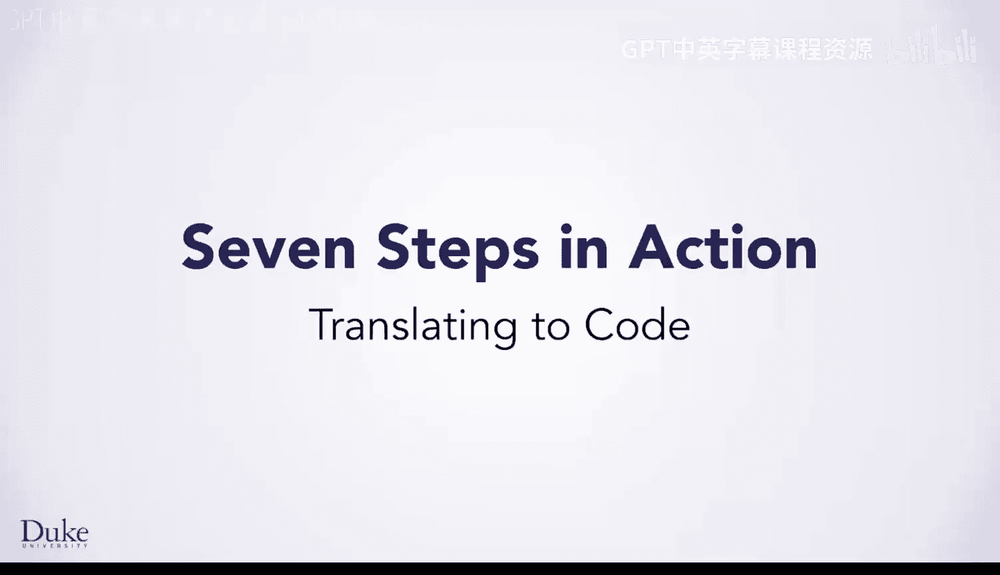
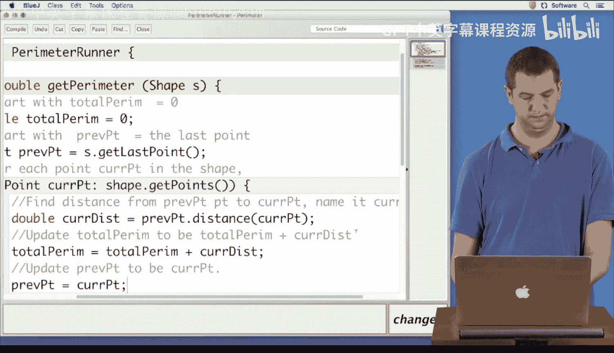
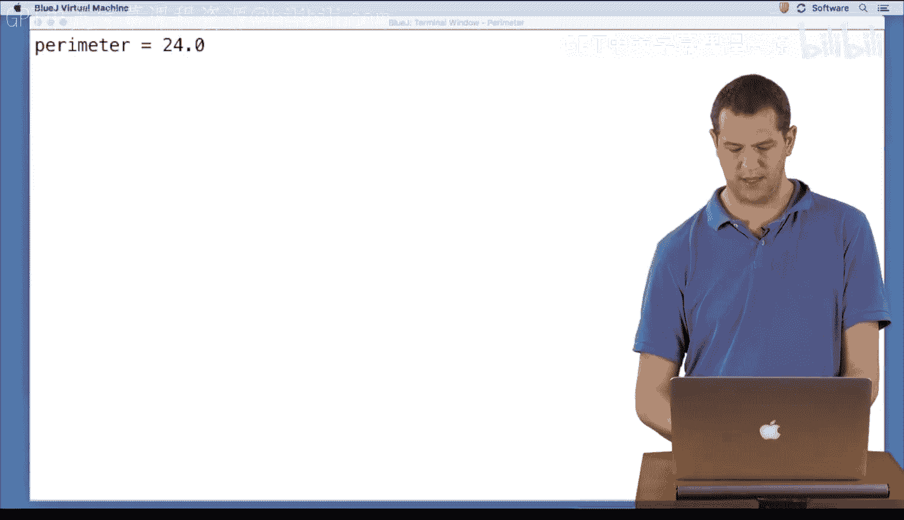
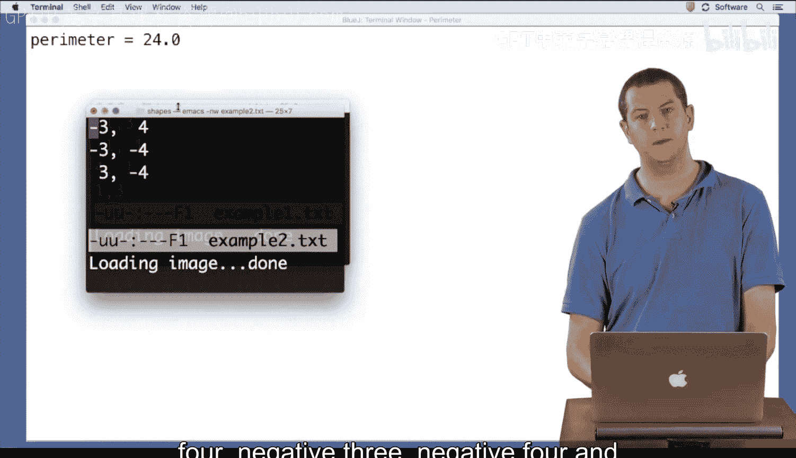

# 022：代码翻译 📝➡️💻



在本节课中，我们将学习如何将一个已设计好的算法，逐步翻译成可运行的Java代码。我们将使用一个计算图形周长的具体例子，演示从算法描述到代码实现的完整过程。

---

## 算法回顾与代码框架

上一节我们介绍了计算图形周长的算法。现在，我们来看看如何在一个名为 `PerimeterRunner` 的Java类中实现它。

这个类包含一个 `getPerimeter` 方法，它接收一个 `Shape` 对象并返回一个 `double` 类型的周长值。类中还有其他代码，例如一个 `main` 方法用于测试。

我们将把算法作为注释写在代码中，然后逐句将其翻译为Java语句。

---

## 逐步翻译算法

以下是算法翻译的具体步骤，我们将为每一步编写对应的Java代码。

**第一步：初始化总周长变量**
算法描述是“从总周长等于0开始”。这表示我们需要一个变量，并将其初始化为0。
*   我们将其命名为 `totalPerim`。
*   考虑到计算可能涉及小数，我们选择 `double` 类型而非 `int`。
*   对应的代码是：`double totalPerim = 0;`

**第二步：初始化“前一个点”变量**
算法描述是“设前一个点等于最后一个点”。这意味着我们需要另一个变量来追踪上一个点。
*   我们将其命名为 `prevPoint`。
*   它的类型是 `Point`。
*   通过查阅 `Shape` 类的文档，我们知道可以使用 `getLastPoint()` 方法来获取最后一个点。
*   对应的代码是：`Point prevPoint = shape.getLastPoint();`

**第三步：遍历图形中的所有点**
算法描述是“对于形状中的每个点（当前点）”。这提示我们使用一个 for-each 循环来遍历所有点。
*   循环将遍历 `shape.getPoints()` 返回的所有点。
*   我们将循环体用花括号 `{}` 括起来。
*   对应的代码结构是：
    ```java
    for (Point currPoint : shape.getPoints()) {
        // 循环体内的步骤将放在这里
    }
    ```

**第四步：计算当前距离**
在循环体内，算法描述是“计算从前一个点到当前点的距离，并将其命名为当前距离”。
*   任何需要命名的量都需要一个变量。
*   我们将其命名为 `currDist`。
*   通过查阅 `Point` 类的文档，我们知道可以使用 `distance()` 方法来计算两点间的距离。
*   对应的代码是：`double currDist = prevPoint.distance(currPoint);`

**第五步：更新总周长**
算法描述是“更新总周长为总周长加上当前距离”。
*   这是一个累加操作。
*   对应的代码是：`totalPerim = totalPerim + currDist;`

**第六步：更新“前一个点”**
算法描述是“更新前一个点为当前点”。
*   为下一次循环迭代做准备。
*   对应的代码是：`prevPoint = currPoint;`



**第七步：返回结果**
算法描述是“总周长就是我的答案”。当我们得到最终答案时，需要将其返回给调用者。
*   使用 `return` 语句。
*   对应的代码是：`return totalPerim;`

---

## 编译与测试

完成代码编写后，我们点击编译。编译器可能会提示找不到符号 `shape`，这是因为方法参数名是 `sh`，我们需要将代码中的 `shape` 统一改为 `sh`。修正后，代码编译成功，没有语法错误。

接下来进行测试。我们运行 `main` 方法，程序会要求指定一个包含图形点坐标的输入文件。

*   首先使用 `example1.txt` 文件，其坐标点与我们设计算法时使用的例子一致。程序计算出周长为 **16**，这与我们手动计算的结果相符。
*   为了进一步验证，我们使用另一个测试文件。程序计算出周长为 **24**，经手动验算，这也是正确的结果。

通过多个测试用例得到预期结果，我们越来越有信心确认刚刚编写的代码是正确的。

---



## 总结



本节课中，我们一起学习了将算法翻译成Java代码的完整流程。我们通过一个计算周长的实例，演示了如何：
1.  根据算法步骤声明和初始化变量。
2.  使用 for-each 循环结构进行遍历。
3.  调用对象的方法（如 `getLastPoint()`, `distance()`）来完成计算。
4.  通过编译和多个测试用例来验证代码的正确性。

这个过程的核心是**逐步对应**：将算法中的每一个自然语言步骤，严谨地转化为具有相同语义的Java代码。