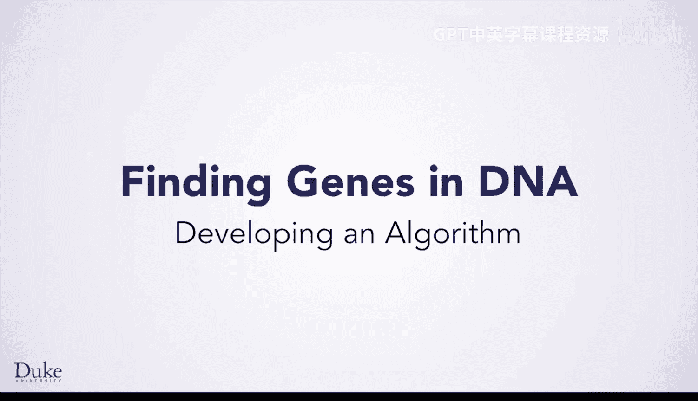
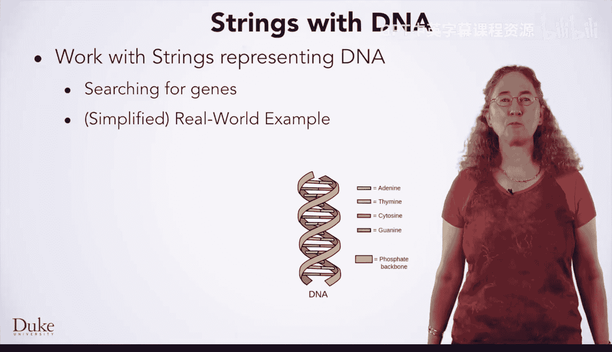
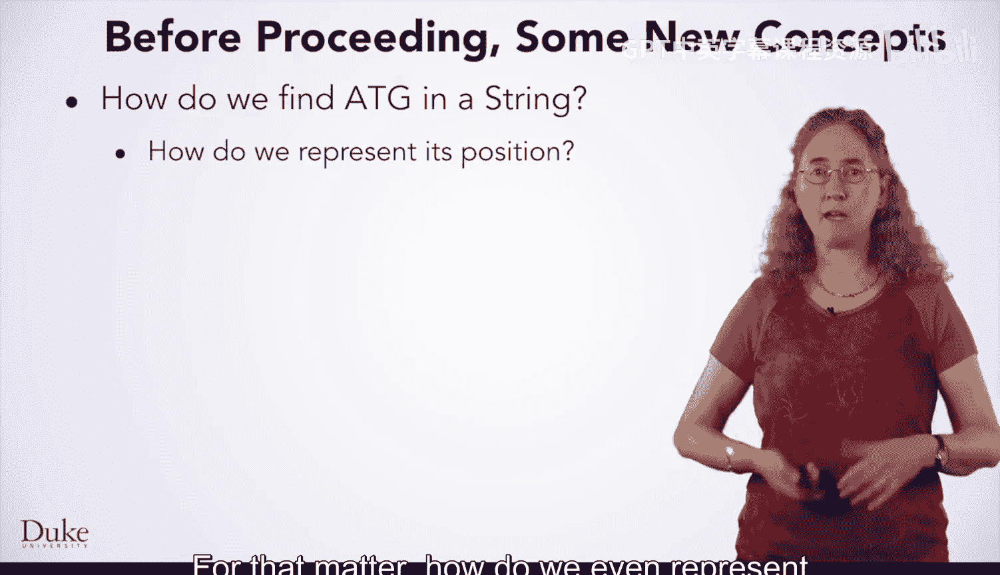
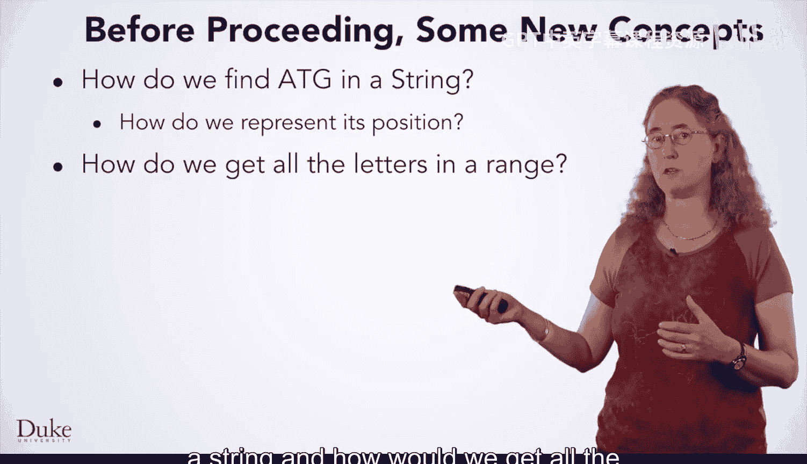
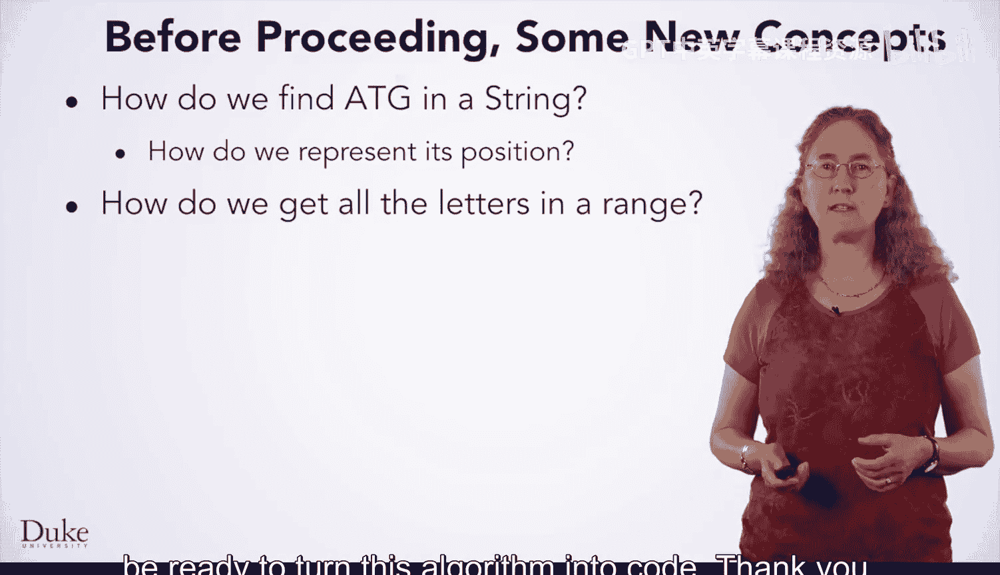

# 025：算法开发

在本节课中，我们将学习如何开发算法，特别是处理代表DNA的字符串，并从中搜索基因。这是一个绝佳的学习案例，因为即使我们从高度简化的版本开始，它也是一个具有实际应用价值的重要问题。

当然，您将学到的关于处理字符串和一般编程的知识，其价值将远超这个特定问题领域。无论您想解决何种问题，字符串都可能以某种形式出现，例如HTML、电子邮件或任何其他以字符串表示的文本。

在解决这些问题的过程中，您还将学习其他重要课程，例如如何在Java中进行数学运算。数学在编程中无处不在，因为一切最终都是数字。最重要的是，您将通过“七步法”获得更多开发和实现算法的实践。

在深入探讨DNA相关问题之前，我们需要先了解一些领域知识，即与处理DNA相关的一些术语和概念。

## DNA基础知识

以下是一个可以代表某段DNA的字符串：
`ATGGATTTACTATGACTAGCATGACATAA`
您会看到它由四个字母组成：A、T、C和G。

每个字母代表一个**核苷酸**，它们是DNA的基本构建单元。
三个核苷酸在一起组成一个**密码子**，每个密码子描述一种氨基酸。
这里显示的**ATG**密码子很特殊，因为它指示基因的开始，因此被称为**起始密码子**。
**TAA**密码子也很特殊，因为它指示基因的结束，所以被称为**终止密码子**。还有其他几种终止密码子，但目前我们只考虑TAA。
包含在这两个密码子之间（包括它们自身）的所有内容构成一个**基因**。

## 第一个问题：在DNA字符串中寻找基因

您要解决的第一个问题是在代表DNA的字符串中找到一个基因。
也就是说，您需要编写一个程序，接收像上面这样的字符串，并给出位于起始密码子ATG和终止密码子TAA之间（包括它们）的所有文本。

您将从这个问题的一个高度简化版本开始。
只需找到这些字母以及它们之间的所有文本。
您暂时无需担心真实的基因长度必须是3的倍数（因为它们由密码子组成），也无需担心存在其他终止密码子或其他一些复杂性。
随着您掌握更多字符串和算法概念，您将为程序添加功能，使其每一步都更接近现实。

## 算法开发实践

与往常一样，您要做的第一件事是自己动手解决一个具体问题实例。

让我们以这个DNA序列为例，找到其中的第一个基因。
`ATGGATTTACTATGACTAGCATGACATAA`

1.  找到起始密码子。找到了，就在这里（第一个ATG）。
2.  从它之后开始寻找终止密码子TAA，我们在这里找到了它（最后的TAA）。
3.  这意味着我们要提取代表该区域核苷酸的所有文本作为答案，即我们找到的基因。

现在我们已经完成了一个示例，应该把我们刚才所做的步骤写下来。

以下是我们在具体实例中采取的步骤：
1.  我找到了第一个出现的ATG。
2.  然后我开始在ATG之后寻找TAA。
3.  最后，我将它们之间（包括它们自身）的所有字母作为我的答案：ATG、GAT、TTA、CTA、TGA、CTA、GCA、TGA、CATAA。

## 将具体步骤泛化为通用算法

既然我们已经写下了针对那个具体问题的做法，现在需要将其泛化。

*   为什么我们寻找ATG？我们总是要寻找它，因为那是起始密码子。
*   在ATG之后寻找TAA呢？我们也总是要这样做，因为那是终止密码子。
*   提取它们之间（包括它们自身）的所有字母？我们同样总是要这样做。

这里唯一不具普遍性的，是我们写下的具体答案字符串，它更像是一个给自己的描述性笔记，而非算法本身。

现在，我们有了一个通用算法，我们希望将其转化为代码。
但在那之前，我们需要先学习一些新的Java概念。

## 转化为代码前需要掌握的概念

为了将算法转化为代码，我们需要知道：

1.  如何在一个字符串中找到ATG？
2.  我们如何表示或谈论字符串中某个内容的位置？
3.  我们如何获取字符串中特定范围内的所有字母？

您将在接下来的课程中学习这些概念，然后就可以准备将这个算法转化为代码了。

## 总结

本节课中，我们一起学习了算法开发的过程。我们从理解DNA相关的基本术语（如核苷酸、密码子、起始密码子和终止密码子）开始，定义了一个具体问题：在DNA字符串中寻找基因。接着，我们通过一个具体实例手动解决了问题，并将步骤记录下来。最后，我们将这些具体步骤抽象、泛化，形成了一个通用的算法框架。虽然我们尚未编写代码，但已经明确了实现算法所需掌握的关键Java字符串操作概念，为下一阶段的学习做好了准备。