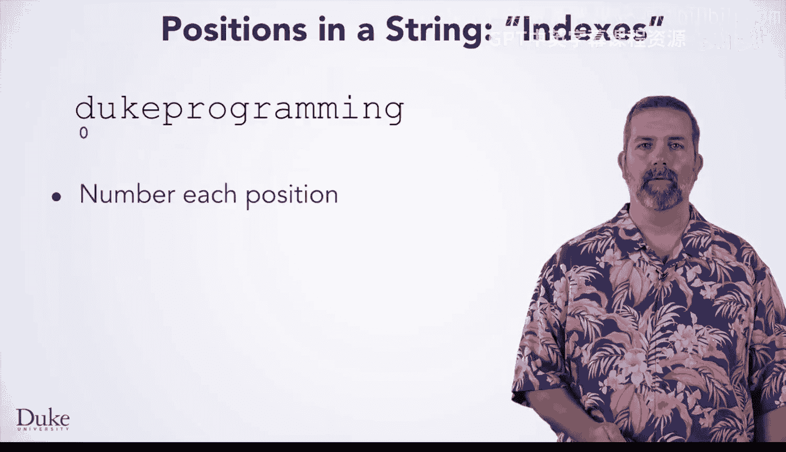
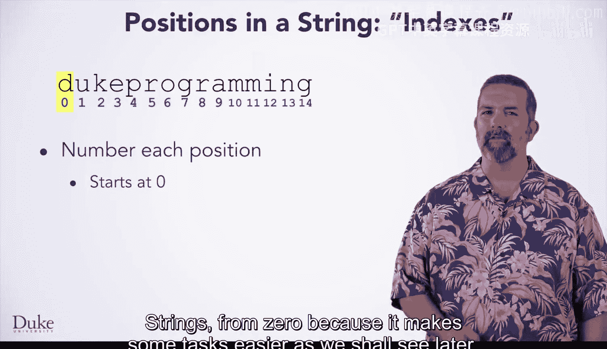
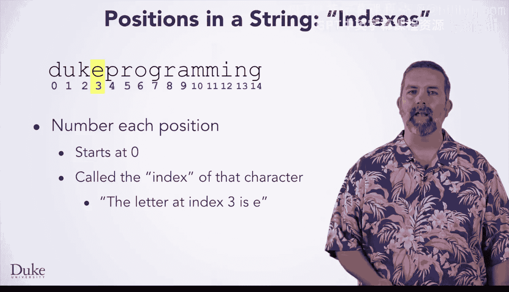
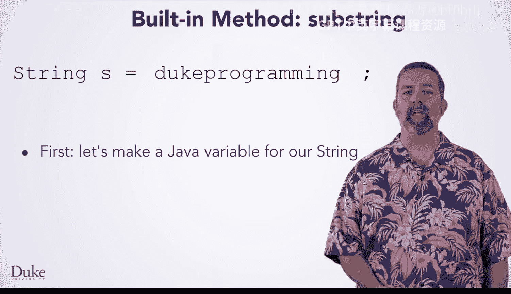
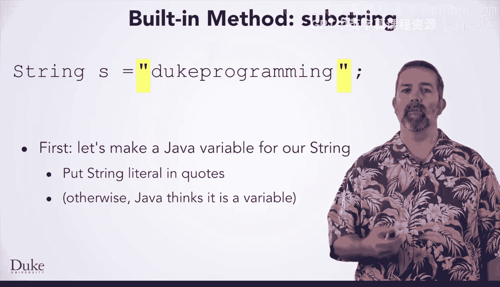
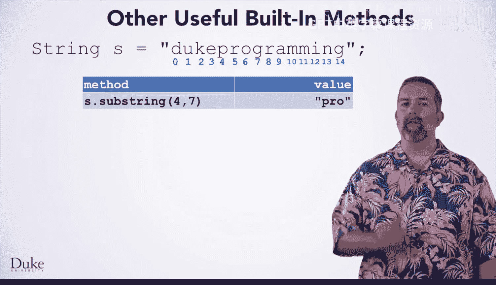
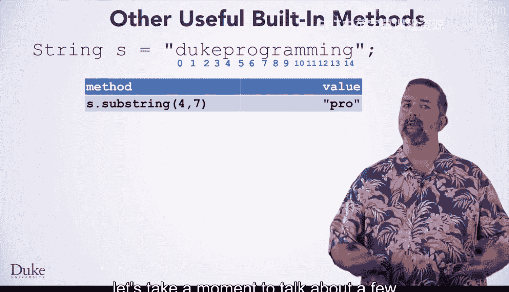
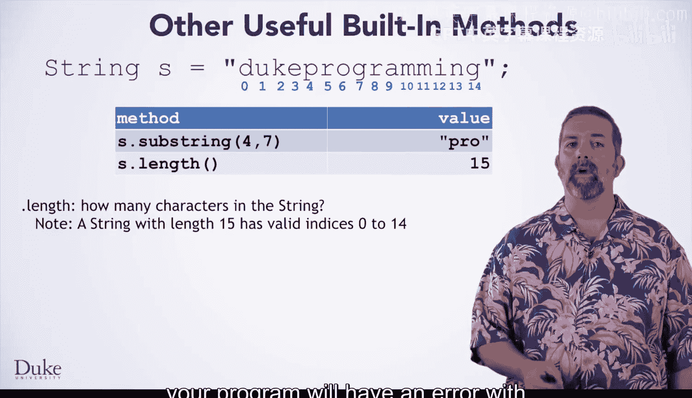
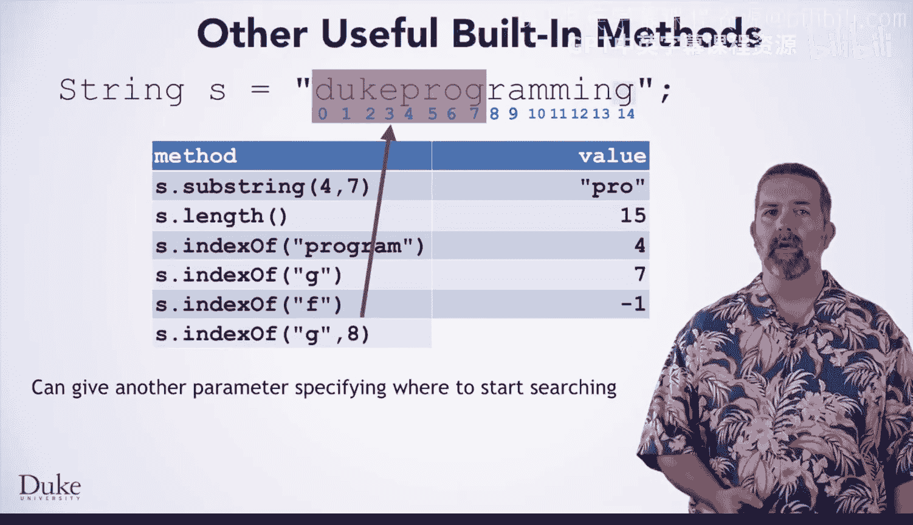
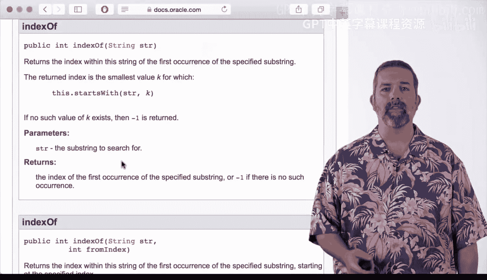

# Java编程和软件工程基础：2-5：字符串中的位置 🔍


在本节课中，我们将学习如何在字符串中表示位置，以及如何使用Java内置的字符串方法来获取特定范围内的字符。这些知识对于后续实现基因查找程序至关重要。




## 字符串位置的表示

上一节我们介绍了基因查找程序的背景，本节中我们来看看如何表示字符串中的位置。



为了回答这个问题，我们回到一个反复出现的核心概念：**一切皆数字**。也就是说，我们将为字符串中的每个位置分配一个数字索引。



请注意，这些数字从第一个位置的0开始，而不是1。这看起来可能有点奇怪，因为我们通常从1开始计数。然而，许多编程语言（包括Java）从0开始对字符串等序列进行编号，因为这样可以使某些任务更容易，我们将在后面看到这一点。

这些描述字符串中位置的数字被称为**索引**。例如，如果我们想谈论字符串中的字母E，我们可以说“索引3处的字母是E”。


## 获取特定范围内的字符


我们已经回答了第一个问题，即可以用数字表示位置。现在，是时候回答第二个问题：如何获取特定范围内的所有字符？

我们可以更精确地说，如何获取两个特定索引之间的字符。

一种选择是自己编写算法来完成这个任务。然而，你也可以使用字符串类的一个内置方法。



每当有内置方法可以完成特定任务时，最好使用它而不是自己编写。这不仅节省了你的工作，而且内置方法已经由专业程序员进行了大量测试，因此你可以非常确信它能正确工作。

对于这个特定任务，你需要使用内置的`substring`方法。但在展示如何使用之前，让我们以这个示例字符串为例，将其创建为一个实际的Java字符串并赋值给一个变量。



以下是声明和赋值语句：

```java
String s = "Duke programming";
```

这里我们声明了一个名为`s`、类型为`String`的变量。等号用于赋值语句，行尾的分号用于结束语句。

然而，这还不完全正确。我们还需要将字符串字面量放在引号中，如上所示。如果不加引号，Java会认为`Duke programming`是一个变量名，并给出“未定义”的错误。通过将文本放在引号中，Java知道我们想要一个具有该字面量文本的字符串。

现在，我们有了一个有效的语句，使变量`s`成为字符串“Duke programming”。

## 使用 substring 方法

接下来，你可以看到一个使用`substring`方法的例子。这里我们声明了另一个类型为`String`的变量`x`，并将其赋值为`s.substring(4, 7)`的结果。





这些数字是什么意思？这个方法调用是做什么的？

*   第一个数字指定了在`s`中我们想要开始创建子字符串的索引。**此索引处的字母将包含在结果字符串中**。
*   第二个数字指定了在`s`中我们想要停止创建子字符串的索引。**此索引处的字母将排除在结果字符串之外**。该方法会在到达该字母之前停止。



这看起来可能很奇怪。为什么你要指定停止位置之后的索引呢？这个方法以及许多其他方法这样设计有多种原因，但一个很好的原因是：结果字符串的长度将是两个数字之差。7 - 4 = 3，所以我们将得到一个长度为3的字符串作为答案。

具体来说，你将得到由`s`中索引4、5和6处的字母组成的这个三字母字符串。所以`x`将是字符串“Pro”。

## 其他有用的字符串方法

在学习这个内置的字符串方法时，让我们花点时间谈谈其他一些有用的方法及其功能。你刚刚看到了`substring`，并学习了它如何获取特定索引范围内的字母。

以下是其他几个重要的字符串方法：



*   **`length()`**：这个方法告诉你字符串中有多少个字符。例如，字符串`s`的长度是15。请注意，对于长度为15的字符串，有效索引是0到14。如果你尝试访问此范围之外的索引，你的程序将出现“字符串索引越界”错误。
*   **`indexOf(String str)`**：你向这个方法传递另一个字符串，它会尝试在你调用该方法的字符串中找到该字符串的**第一次出现**。例如，`s.indexOf("program")`会返回4，因为“program”第一次出现是从索引4开始的。如果找不到字符串，例如`s.indexOf("F")`，它会返回-1。
*   **`indexOf(String str, int fromIndex)`**：你也可以给`indexOf`一个第二个参数，指定开始搜索的索引。例如，`s.indexOf("g", 8)`会忽略索引0到7的字符，然后从索引8开始搜索“g”，并找到索引14处的“g”，因此这个方法调用会得到14。
*   **`startsWith(String prefix)`**：这个方法告诉你一个字符串是否以另一个字符串开头。例如，`s.startsWith("Duke")`会返回`true`。
*   **`endsWith(String suffix)`**：这个方法检查一个字符串是否以另一个字符串结尾。例如，`s.endsWith("king")`会返回`false`。

## 如何学习更多方法

哇，这讲了很多方法和一大堆信息。如果我们不告诉你字符串类中的每一个方法，你怎么会知道所有这些？你应该记住所有这些细节吗？


当然不是。**编程不是关于记忆的**。尽管随着你大量编程，你常用的方法自然会变得熟悉。


相反，你应该学习如何利用**语言文档**，它描述了所有内置类及其方法。

如果你在互联网上搜索“Java string”，你的第一个结果可能来自`docs.oracle.com`。Oracle是制造Java的公司，`docs.oracle.com`是他们托管语言文档的网站。如果你点击这个链接，你会得到一个页面，告诉你关于String类的一切。如果你向下滚动一点，你会发现一个相当长的列表，列出了字符串中所有内置的方法。其中包括你刚刚学到的几个方法，如`indexOf`和`length`。这些条目给出了方法的简要描述。如果你点击其中一个方法名，你会得到关于该方法功能的更详细描述。

课程网站`DukeLearnToProgram.com`上也有一个文档页面。该页面简化了一些重要方法的文档，供快速参考。

## 总结



本节课中我们一起学习了：
1.  字符串中的位置使用从**0开始**的数字索引表示。
2.  使用`substring(startIndex, endIndex)`方法可以获取字符串中特定索引范围内的字符，结果包含起始索引的字符，但不包含结束索引的字符。
3.  字符串类还提供了其他有用的方法，如`length()`、`indexOf()`、`startsWith()`和`endsWith()`，用于获取字符串信息和进行搜索。
4.  学习编程的关键是学会查阅官方语言文档（如`docs.oracle.com`）来了解可用的类和方法，而不是死记硬背。


现在，你不仅了解了字符串中的索引和一些有用的内置方法，还知道了在需要时如何学习其他方法。