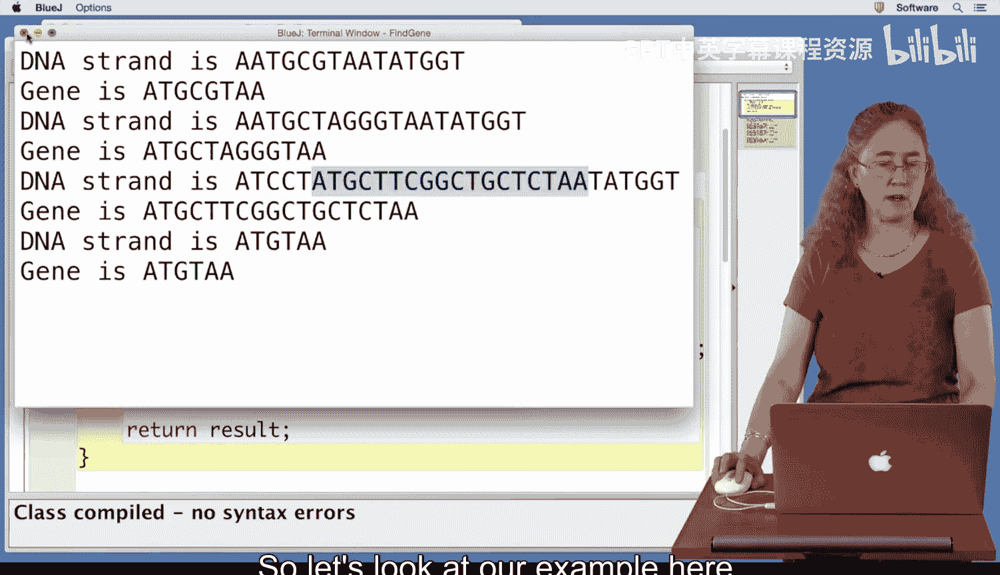
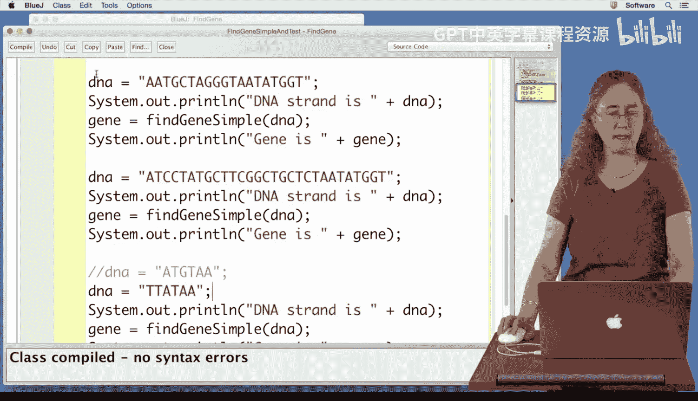
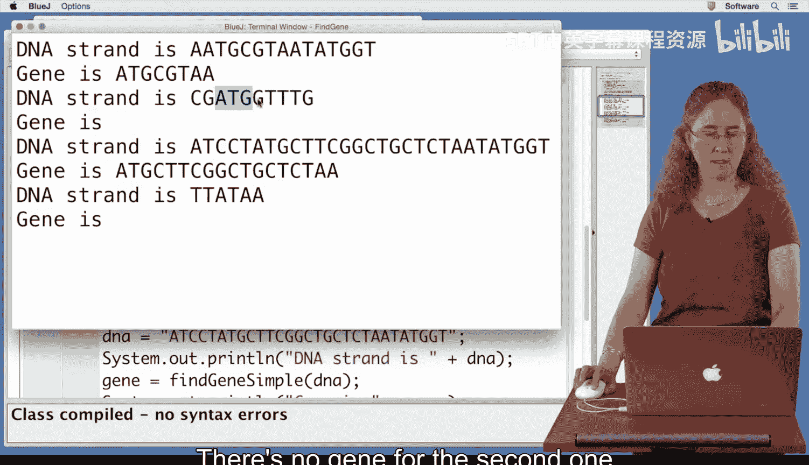
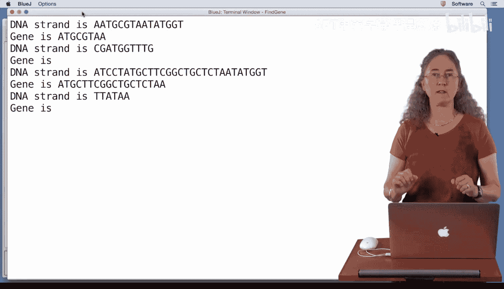

# 027：在DNA链中查找基因 🧬


在本节课中，我们将学习如何在一个DNA链中查找基因。我们将实现一个非常简单的算法来完成这个任务。

为了测试我们将要编写的代码，这里已经准备了几条DNA链。我们将打印出DNA链，调用查找基因的方法，然后打印出找到的基因。这个过程会使用四条不同的DNA链进行测试。

现在，让我们开始编写代码。

## 算法实现

首先，我们初始化一个名为`result`的变量来存储找到的基因，并将其设置为空字符串`null`。

根据视频中的知识，我们需要在DNA链中寻找起始密码子。起始密码子是字符串`ATG`。我们可以使用新学的字符串函数来实现。

以下是实现步骤：

1.  **定位起始密码子**：我们创建一个变量`startIndex`来存储起始密码子`ATG`在DNA链中的索引位置。使用`indexOf`函数在DNA链中搜索`ATG`。该函数会遍历字符串，在找到`ATG`时停止，并返回其起始位置的索引。
    ```java
    int startIndex = dna.indexOf("ATG");
    ```

2.  **定位终止密码子**：接下来，我们需要寻找终止密码子`TAA`。我们创建变量`stopIndex`来存储其位置。同样使用`indexOf`函数，但这次我们从起始密码子之后开始搜索。为此，我们给`indexOf`函数添加第二个参数，指定从`startIndex + 3`的位置开始查找（因为`ATG`的长度是3）。
    ```java
    int stopIndex = dna.indexOf("TAA", startIndex + 3);
    ```

3.  **提取基因**：现在我们有了起始密码子`ATG`的索引`startIndex`和终止密码子`TAA`的索引`stopIndex`。我们想要提取包含这两者及其之间所有内容的部分。我们使用字符串函数`substring`来实现。`substring`函数需要起始索引和结束索引（不包含结束索引处的字符）。因此，我们从`startIndex`开始，到`stopIndex + 3`结束（以包含整个`TAA`）。
    ```java
    String result = dna.substring(startIndex, stopIndex + 3);
    ```

现在，让我们编译并测试这段代码。

代码编译成功。运行我们编写的测试方法，可以看到结果：第一条DNA链成功找到了基因，从`ATG`开始，到第一个位于其后的`TAA`结束。后续几个例子也都能正确找到基因。



## 处理边界情况



上一节我们实现了基本的查找逻辑，本节中我们来看看当DNA链中缺少关键部分时会发生什么。

如果DNA链中没有`ATG`或者没有`TAA`，我们的代码可能会出错。让我们通过修改测试数据来检查。

首先，测试一条没有`ATG`的DNA链。运行程序后，我们遇到了一个错误：`String index out of bounds exception: -1`。这是因为`indexOf`函数在找不到目标字符串时会返回`-1`。当`startIndex`为`-1`时，我们试图从索引`-1`开始构建子字符串，这导致了错误。

为了解决这个问题，我们需要在查找`ATG`之后立即添加检查。以下是修复步骤：

1.  **检查起始密码子**：在获取`startIndex`后，检查其值是否为`-1`。如果是，则意味着DNA链中没有`ATG`，也就没有基因。此时，我们直接返回空字符串。
    ```java
    if (startIndex == -1) {
        return "";
    }
    ```

编译并再次运行测试。对于没有`ATG`的DNA链，现在程序不会报错，而是正确地返回空字符串（表示未找到基因）。



接下来，测试另一种情况：DNA链中有`ATG`，但没有`TAA`。修改测试数据后运行程序，发现对于这样的链，也没有输出基因。这是因为虽然找到了起始密码子，但`indexOf`函数找不到终止密码子`TAA`，`stopIndex`的值也是`-1`。

2.  **检查终止密码子**：与检查起始密码子类似，在获取`stopIndex`后，我们也需要检查其值是否为`-1`。如果是，则意味着在起始密码子之后没有找到`TAA`，同样没有完整的基因。我们也返回空字符串。
    ```java
    if (stopIndex == -1) {
        return ""; // 没有TAA的情况
    }
    ```

再次编译代码并运行测试。现在，我们的程序能够正确处理所有情况：
*   第一条DNA链（包含`ATG`和`TAA`）成功找到基因。
*   第二条DNA链（包含`ATG`但没有`TAA`）返回空字符串。
*   第三条DNA链（不包含`ATG`但包含`TAA`）也返回空字符串，因为没有起始密码子。

## 总结



本节课中，我们一起学习了如何在DNA链中查找一个简单的基因。我们实现的核心算法是：首先在DNA链中寻找起始密码子`ATG`；如果找到了起始密码子，则从它之后开始寻找终止密码子`TAA`；如果两者都能找到，我们就返回起始密码子、终止密码子以及它们之间的所有内容作为找到的基因。此外，我们还通过添加条件检查，使程序能够稳健地处理缺少起始密码子或终止密码子的边界情况。