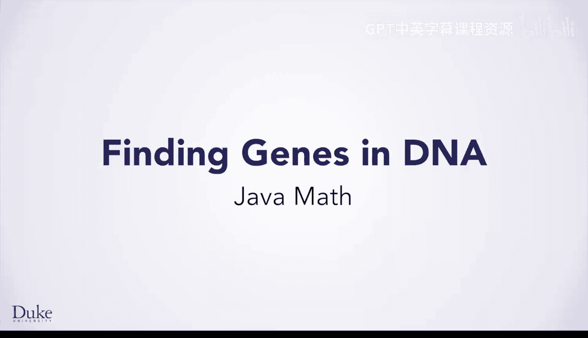
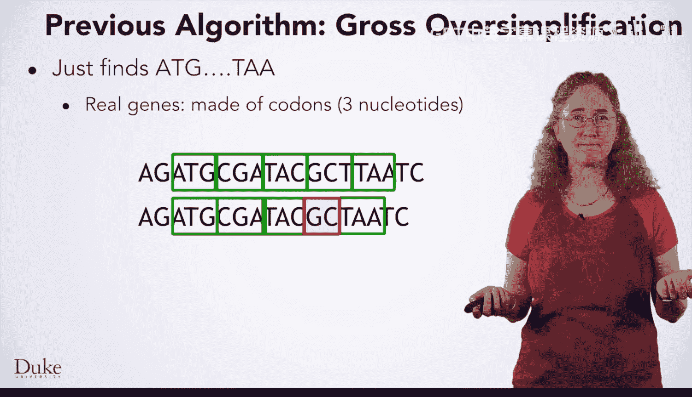
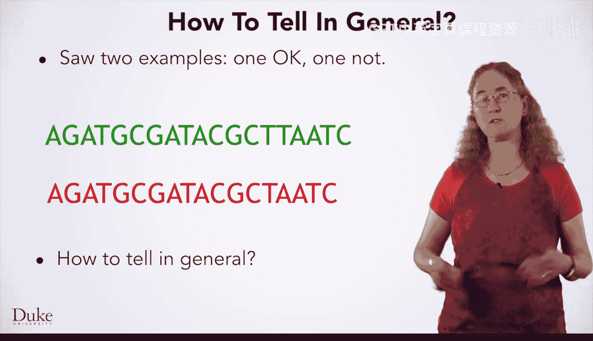
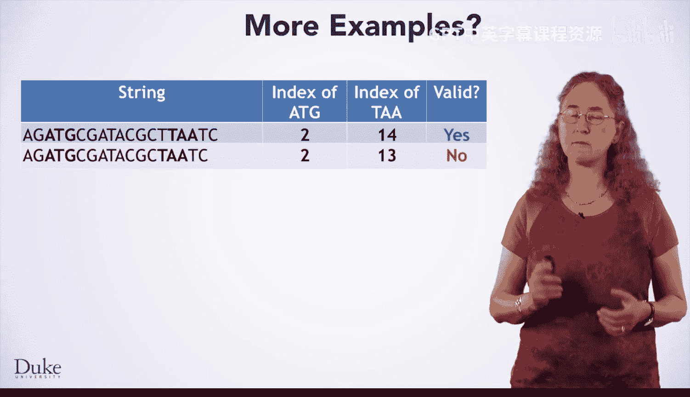
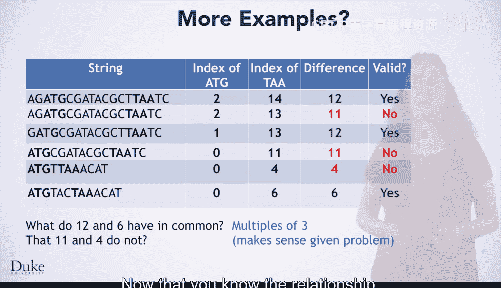
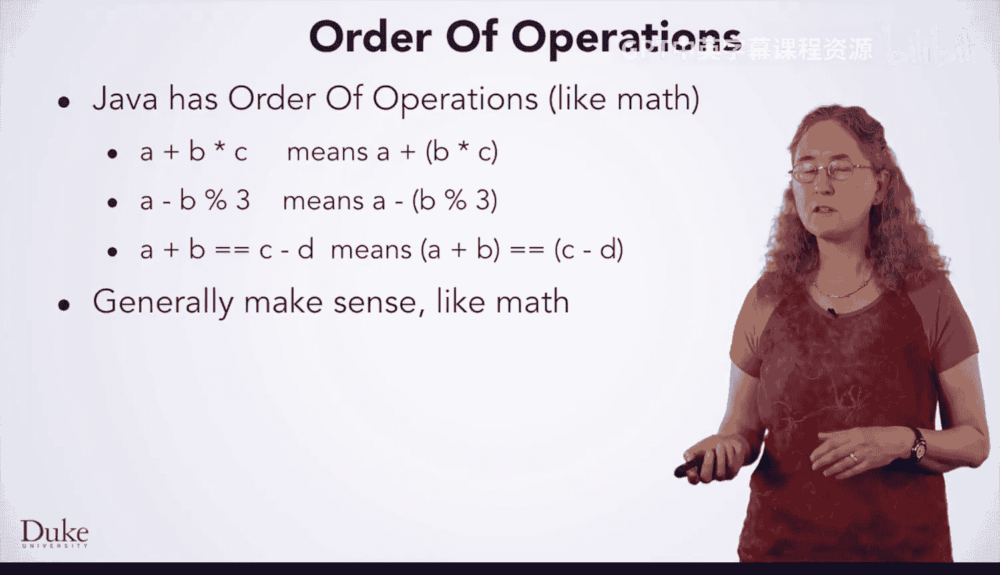

# 028：Java数学运算

在本节课中，我们将学习如何利用Java的数学运算来改进基因查找算法，使其更符合生物学事实。我们将重点关注如何判断一个DNA序列的长度是否为3的倍数，这是识别有效基因的关键条件。

## 从简化版算法到更现实的版本

上一节我们实现了一个简化的基因查找程序，它仅查找起始密码子ATG和终止密码子TAA，并返回两者之间的所有内容。然而，真实的基因必须由密码子组成，每个密码子包含三个核苷酸，因此基因的长度必须是3的倍数。

例如，以下字符串是一个有效的基因，因为它可以被划分为以ATG开始、以TAA结束的密码子序列：
`ATGAAATAA`

然而，这个字符串是无效的。虽然它包含ATG和TAA，但两者之间的序列无法被划分为完整的密码子：
`ATGATAA`

现在，让我们使我们的算法更贴近现实。我们将修复算法的这一方面。它仍然是一个简化版本，但会更加真实。从简单版本开始并逐步添加功能，不仅是一种有用的学习技巧，让我们一次引入几个概念，而且在编写真实、大型、复杂的问题时也同样重要。

## 识别有效基因的模式

你刚刚看到了两个DNA序列的例子，一个包含有效基因，另一个则不包含。如何从算法上判断其有效性呢？

展示索引位置可能会有帮助，如下所示，并高亮起始和终止密码子的位置。你是否看出了如何通过算法来区分？如果还没看出来，这很正常。发现模式可能很困难，但通过练习你会做得更好。

以下是发现模式的一个绝佳技巧：制作一个表格。你可能记得我们在一些例子中这样做过。

我们可以向表格中添加更多示例，如下所示，以帮助我们看清模式。一些标记为“是”，一些标记为“否”。也许你现在看到了模式，或者仍然难以看清。如果模式仍然不清晰，你可以做什么？也许添加更多行会有帮助，或者也可能没有。

相反，我们可能开始探索表格中各项之间的关系。这里我们添加了另一列，用于表示终止密码子索引与起始密码子索引之间的差值。

标记为“是”的示例，其差值为6和12。标记为“否”的示例，其差值为4和11。12和6有什么共同点是11和4所没有的？我们可能会想到很多。6和12都是6的倍数，但这在这个问题的背景下没有意义。如果我们做更多示例，可能会发现差值为3、9或15的“是”答案。然而，6和12，以及3、9和15，都是3的倍数。这个关系是有意义的，因为我们知道长度必须是3的倍数。

## 在Java中应用数学运算

既然你知道了需要寻找的关系，你需要在Java中进行一些数学运算。你需要一种方法来判断两个数字的差是否是3的倍数。

如果你和我们一起学习了课程一，你可能记得取模运算符（`%`），它在你进行除法运算时给出余数。`x % y` 表示用x除以y，但给我余数，而不是商。这可以帮助你解决手头的问题，因为一个数是3的倍数意味着它除以3的余数为0。也就是说，如果 `x % 3 == 0`，那么x是3的倍数。

你可以在Java中使用其他数学运算符：`+`（加）、`-`（减）、`*`（乘）、`/`（除），它们都是有效的。你也可以使用 `==` 来判断两个数字是否相等，使用 `!=` 判断是否不等，以及 `<`、`<=`、`>`、`>=` 来检查不等式。

你还可以将简单的表达式组合成更复杂的表达式。以下表达式检查 `(a - b) % 3` 是否等于0：
`(a - b) % 3 == 0`

它的计算过程是：首先计算 `a - b`，然后取该结果并对3取模，最后检查该结果是否等于零。这几乎正是你手头问题所需要的，用于判断两个事物之间的差是否是3的倍数。

## Java中的数字类型与运算规则

在学习Java数学运算时，需要了解几种不同的数字类型。实际上，这些类型有一些变体，但你现在不需要担心。

*   **`int`**：代表整数，如-2、-1、0、1、2等。`int` 不能有小数部分。
*   **`double`**：代表实数，即带有小数部分的数字，如1.2或3.457。当然，你也可以用 `double` 表示3（即3.0）。只有在需要时才应使用 `double`，因为它们有一些行为可能会让新手程序员感到困惑。

关于整数的一个注意事项是：整数的数学运算总是产生整数结果。那么，5除以2得到什么？如果你认为是2.5，请记住你只能得到一个整数结果，所以得到的是2。

另一个需要了解的关于Java数学运算的知识是，它像数学一样有运算顺序规则。在程序员术语中，这些规则称为**优先级**和**结合性**。与数学一样，`a + b * c` 意味着先做 `b * c`，然后将结果加到 `a` 上。

取模运算符 `%` 与除法具有相同的优先级，意味着它在运算顺序中处于相同的位置。所以 `a - b % 3` 意味着先做 `b % 3`，然后用 `a` 减去该结果。这就是为什么我们之前想在减法运算先进行时，给 `(a - b)` 加上括号。

相等性比较在运算顺序中发生得非常晚。`a + b == c - d` 意味着先计算 `a + b`，然后计算 `c - d`，最后比较两个结果是否相等。

这些规则通常与数学中类似：乘法和除法先进行，然后是加法和减法。

也像数学一样，你可以使用括号来对事物进行分组，使它们优先计算。如果你不确定运算顺序，可以随时使用括号来明确表达，并确保得到你想要的结果。

## 总结

本节课中，我们一起学习了如何利用Java的数学运算来改进基因查找算法。我们了解到，真实的基因长度必须是3的倍数，并学会了使用取模运算符 `%` 来判断一个数是否是3的倍数（`x % 3 == 0`）。我们还介绍了Java中的基本数字类型（`int` 和 `double`）以及运算符的优先级规则。现在，是时候运用这些知识去改进你的基因查找算法了。