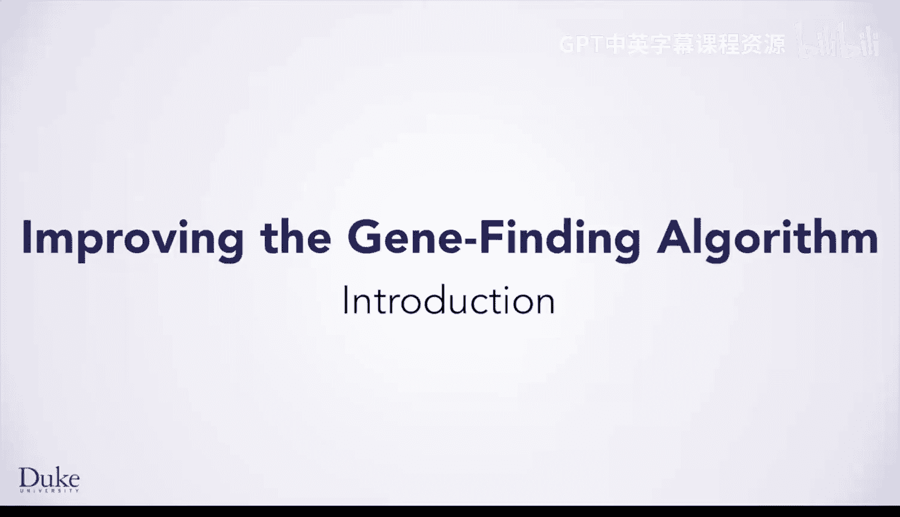

# Java编程和软件工程基础：2-5：引言

在本节课中，我们将扩展您在DNA链中寻找基因时已掌握的编程和问题解决能力。

我很高兴能与您一同学习。您将使用一种更接近基因组学和计算科学家实际工作的终止密码子和起始密码子模型来寻找基因，这类工作涉及个性化医疗和理解多种物种的遗传问题等领域。

上一节我们介绍了基础的基因查找概念，本节中我们将学习新的工具和方法。

您将学习来自Edu.Duke库的新类，并练习使用新的编程结构。这些结构允许您重复执行程序语句，直到问题解决，例如在DNA中找到所有基因，或在网页上找到所有链接。

以下是本课程将涵盖的核心内容要点：
*   使用更精确的起始与终止密码子模型进行基因查找。
*   学习并应用`Edu.Duke`库中的新类。
*   掌握能实现重复执行直至问题解决的编程结构，例如循环。

让我们开始吧。希望您能享受学习过程。

本节课中我们一起学习了如何通过更先进的模型和新的编程工具来扩展基因查找的能力，为处理更复杂的生物学信息学问题打下基础。