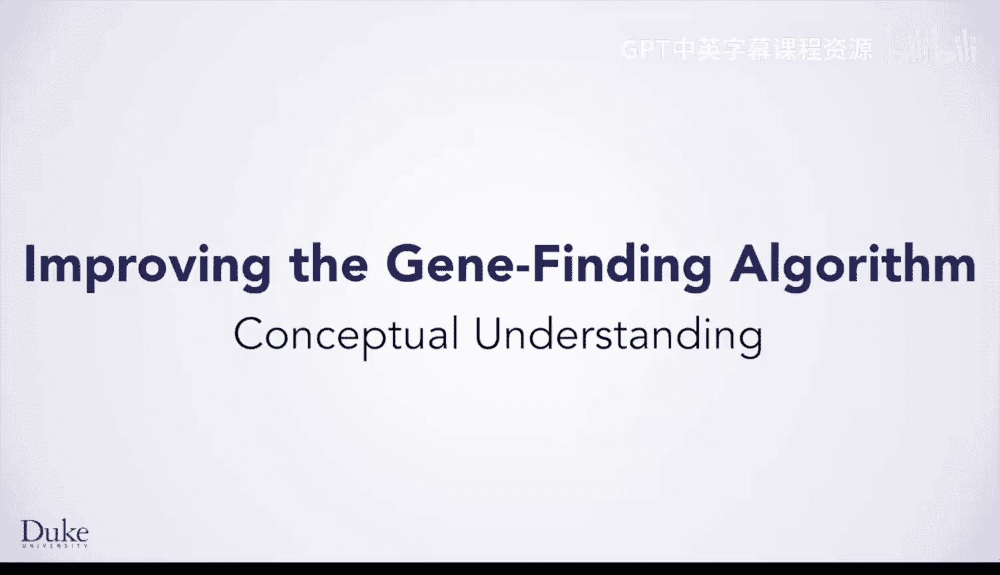
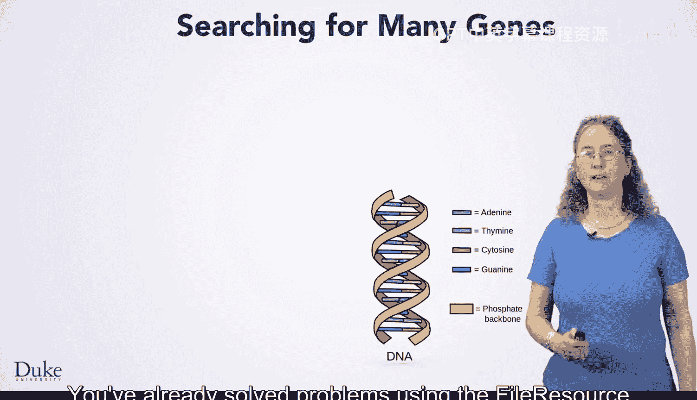
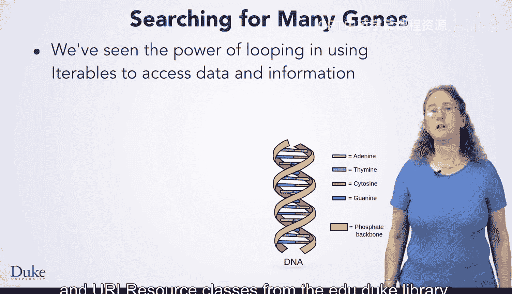
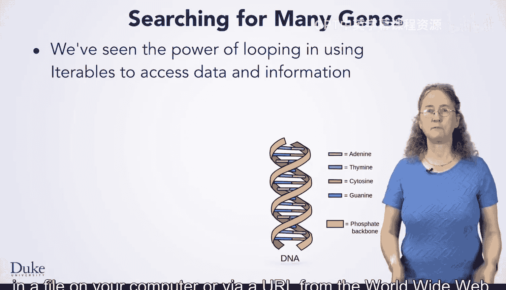
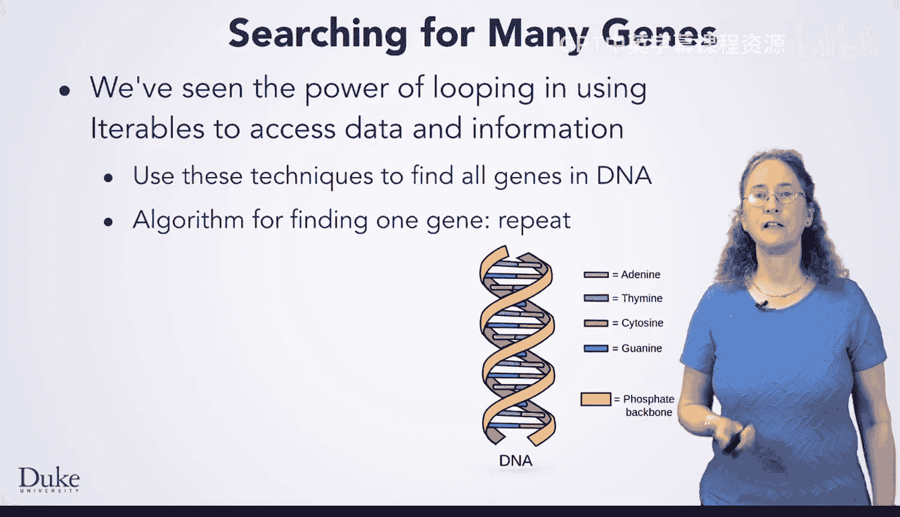
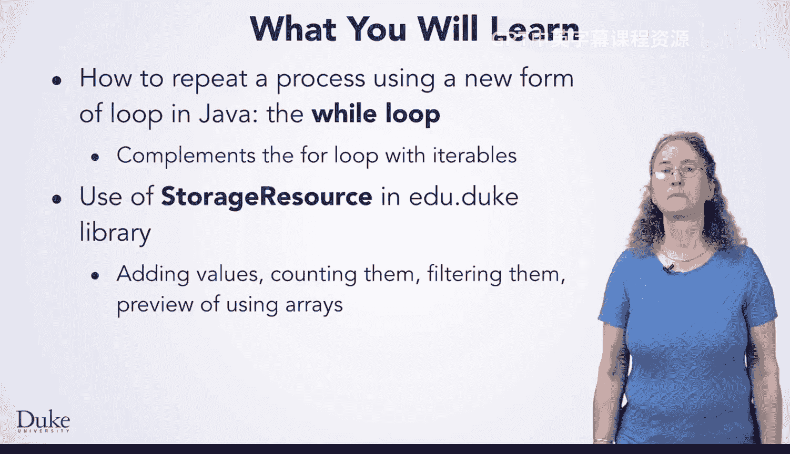
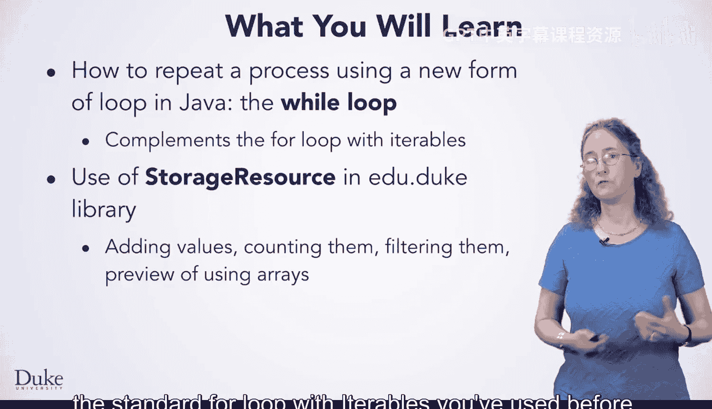

# 030：理解概念

在本节课中，我们将学习一个强大的新编程结构——不定循环。我们还将学习来自Edu.duke库的另一个可迭代对象。

我们已经使用过Edu.duke库中的`FileResource`和`URLResource`类来解决问题。使用可迭代对象使我们能够重复访问存储在计算机文件中或通过万维网URL获取的数据。

我们将运用这种重复的概念，在一条DNA链中寻找所有基因。这是基因组科学家工作的一部分，也是一个可以类比为在网页中寻找所有链接，或寻找所有关于猫、龙或其他任何你想看的YouTube视频的问题。

这里的核心思想是，我们将使用之前课程中开发的、用于在DNA链中寻找单个基因的算法。这是一个我们已经测试过并充满信心的算法。

我们将重复应用这个算法到整条DNA链上，以找到所有基因，而不仅仅是一个。我们还将学习一个新的可迭代对象，它允许我们存储中间结果，而不是直接打印找到的所有基因。通过存储结果，我们可以在找到可能是基因的字符串后，再去寻找特定的基因。

例如，通过存储基因搜索或其他类型搜索的结果，我们可以编写独立的方法来处理这些基因，而不是将处理逻辑与查找逻辑混在一起。

这种关注点分离——查找基因、处理基因、筛选具有特定特征的基因——是良好软件工程的标志。编写一个只做一件事的方法，而不是做几件事。这种分离使你更容易复用代码，也更容易开发代码。

我们将使用的存储对象是一个可迭代对象，你可以在程序运行时向其中添加内容。

更具体地说，我们将解决一个之前解决过的问题的变体：在DNA链中寻找基因的问题。基因位于DNA链的不同位置。在之前的课程中，我们开发了寻找单个基因的代码，就像这里用红色显示的区域。

我们通过寻找特定的标记——起始密码子和终止密码子——来找到这个基因。这些标记用于识别字符串中可能是基因的部分。你也可以使用类似的算法在网页的HTML文本中寻找链接的位置，例如寻找`<a href=`而不是`ATG`。

然而，DNA通常携带不止一个基因。因此，我们不仅要找到这个用红色标出的基因，还要使用编程技术来找到DNA链中所有可以编码基因的区域。这些区域以起始密码子开始，并以三个终止密码子之一结束。

在接下来的课程中，我们将在练习解决这个基因查找问题的过程中，学习许多关于Java和编程的知识。

我们将学习如何重复一个过程很多次，即使我们不知道具体要重复多少次。我们将通过使用`while`循环来实现这一点。这是一种新的循环，它补充了我们之前与可迭代对象一起使用的`for`循环。

我们将学习Edu.duke库中的`StorageResource`类。使用`StorageResource`对象将允许我们将选定的值添加到存储中，然后使用我们之前用过的、标准的`for`循环和可迭代对象来访问它们。

这种存储方式也为我们未来学习使用数组存储值的技术做了铺垫。

我们还将练习开发使用“短路求值”的`if`语句和布尔表达式。这将成为你迈向更优秀程序员和问题解决者过程中，所获得实践和知识的重要组成部分。

谢谢。😊