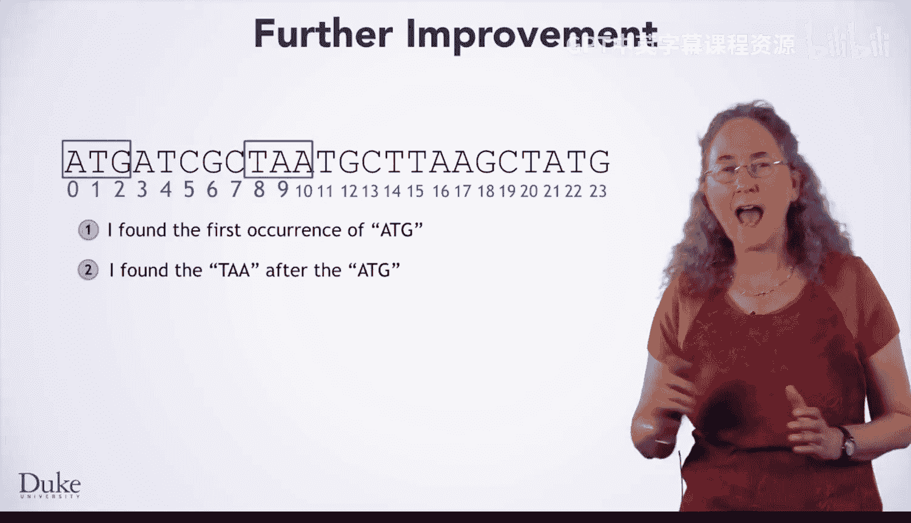
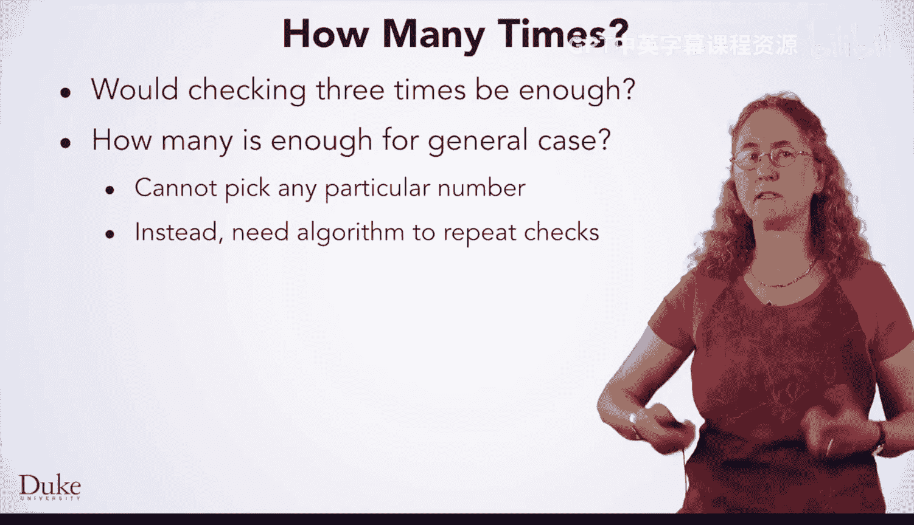

# Java编程和软件工程基础：2-5：while循环 🧬


在本节课中，我们将学习如何改进DNA序列中查找基因的算法。我们将重点探讨一个关键问题：当找到的第一个终止密码子不符合条件时，如何让算法继续寻找下一个。为此，我们将引入一种新的循环结构——**while循环**。

---

## 算法改进的需求

在之前的学习中，你已经了解了字符串，并改进了在DNA中查找基因的算法。然而，让我们思考一下你的算法在下面这个字符串上的表现。

```
ATGATCTCGTAAATCTAA
```

算法会找到索引0处的起始密码子`ATG`。然后，它会找到索引8处的终止密码子`TAA`。接着，它会检查两者之间的距离（8）是否是3的倍数。由于8不是3的倍数，算法会得出结论：`ATG`和这个`TAA`之间不存在有效的基因。这里有一个完整的密码子`ATC`和另一个密码子的三分之二`GC`。

但是，如果你继续越过这个`TAA`寻找，你会在索引15处找到另一个`TAA`。现在，`ATG`和`TAA`之间的距离是15，这是3的倍数，因此这是一个有效的基因。我们找到的第一个`TAA`实际上不是一个密码子，而是两个相邻密码子的片段（来自`GCT`的`T`和来自`AAT`的`AA`）。

因此，对基因查找算法的下一个改进就是增加这个功能：让算法持续寻找，直到找到一个与起始密码子距离为3的倍数的终止密码子。



---

## 步骤分解与抽象

基于刚才的例子，让我们按照七步法的第二步，写下我们刚刚做了什么。

以下是我们的操作步骤：

1.  找到`ATG`。
2.  找到`ATG`之后第一个出现的`TAA`（在索引8处）。
3.  检查它们之间的距离是否是3的倍数。在本例中，不是。
4.  找到第一个`TAA`之后的下一个`TAA`（第二个在索引15处）。
5.  检查这个`TAA`与起始密码子之间的距离是否是3的倍数。是的。
6.  因此，从索引0到18的子字符串就是我们的答案。

在这个特定的步骤序列中，我们在两个地方检查了距离是否是3的倍数。

---

## 从特例到通用情况



如果这在一般情况下都有效，你可以用熟悉的`if-else`语句来实现这个算法。然而，我们是否总是只需要检查两次？让我们看一个不同的DNA字符串。

对于这个DNA字符串，我们需要检查三次。前两个`TAA`与起始密码子的距离都不是3的倍数，但第三个是。

那么检查三次就够了吗？我们可能需要检查四次、五次、十次甚至五十次吗？这就引出了一个普遍性问题：我们到底需要检查多少次？

答案是：我们无法预先确定一个具体的检查次数。即使你写了50个`if-else`语句，我们也能构造出一个DNA字符串，它在找到一个有效的`TAA`之前，包含了超过50个与起始密码子距离不是3的倍数的`TAA`。


因此，我们需要编写算法，让它能够重复检查任意多次。

---

## 引入循环：while循环

正如你之前所见，当你将算法转化为代码时，算法中的重复会变成一个循环。为了用重复来表达你的算法，你需要使重复的步骤相同，并弄清楚要循环什么。

之前，你已经见过**for循环**，它可以遍历某个可迭代对象（如图像中的像素）中的元素。现在，你将学习一种新的循环，称为**while循环**，它允许你在某个条件成立时持续迭代。

在我们尝试通过寻找重复来概括这些步骤之前，让我们更精确地描述一下我们做了什么。

我们首先在索引0处找到了第一个`ATG`。对于第一个`TAA`，我们从索引3开始寻找，并在索引8处找到它。检查索引8是否是3的倍数，结果不是。于是我们从索引9开始寻找第二个`TAA`，并在索引15处找到它。检查索引15是否是3的倍数，结果是。因此，两者之间的所有内容就是我们的答案。

---

## 通用化算法步骤

现在，让我们将这些步骤通用化。

1.  寻找`ATG`。我们总是要寻找`ATG`，因为它是起始密码子。我们找到它的位置（例如索引0）很重要，我们将其赋值给一个变量，称为 **`startIndex`**。
2.  寻找`TAA`。我们总是要寻找`TAA`，因为它是终止密码子。我们开始寻找的位置不是固定的索引3，而是 **`startIndex + 3`**。我们找到它的位置（例如索引8）也很重要，我们将其赋值给一个变量，称为 **`currIndex`**。
3.  计算距离。距离是 **`currIndex - startIndex`**。
4.  检查条件。检查距离是否是3的倍数。
    *   如果是，则找到基因（从`startIndex`到`currIndex + 3`）。
    *   如果不是，则从 **`currIndex + 1`** 开始寻找下一个`TAA`，并更新`currIndex`为这个新位置，然后重复步骤3和4。

现在这些步骤看起来是重复的。重复可能有点难以察觉，因为它只发生了两次，但如果你为一个有更多无效`TAA`的字符串写下步骤，你会看到这些步骤被一遍又一遍地执行。

为了使这个过程可重复，我们将其写成循环形式。注意，步骤4、5和6（寻找下一个`TAA`、计算距离、检查条件）是我们将要重复的部分。

---

## 确定循环条件

然而，我们在这里留空了重复这些步骤的条件。我们如何知道何时停止重复？另外，在停止循环后你会做什么？

我们会在以下情况停止：
1.  我们找到了一个有效的`TAA`（距离是3的倍数）。循环停止，我们输出基因。
2.  我们用完了所有的`TAA`（即再也找不到`TAA`）。在这种情况下，`currIndex`会变成`-1`（正如你所知，当在字符串中找不到内容时，会返回`-1`）。如果遇到这种情况，意味着字符串中没有有效的基因，你应该返回空字符串`""`作为答案。

因此，循环继续的条件是：**`currIndex`不等于`-1`** **并且** **`(currIndex - startIndex) % 3 != 0`**（即距离不是3的倍数）。用伪代码表示：

```java
while (currIndex != -1 && (currIndex - startIndex) % 3 != 0) {
    // 寻找下一个TAA，从 currIndex + 1 开始
    // 更新 currIndex
}
```

---

## 总结

本节课中，我们一起学习了如何改进基因查找算法以处理无效的终止密码子。我们通过分析具体例子，将操作步骤抽象和通用化，最终识别出需要重复执行的部分。为了解决“重复次数未知”的问题，我们引入了**while循环**的概念。while循环允许我们在特定条件（如“未找到有效基因且还有候选密码子”）为真时，持续执行一段代码块。这为我们下一节将算法翻译成实际的Java代码奠定了坚实的基础。