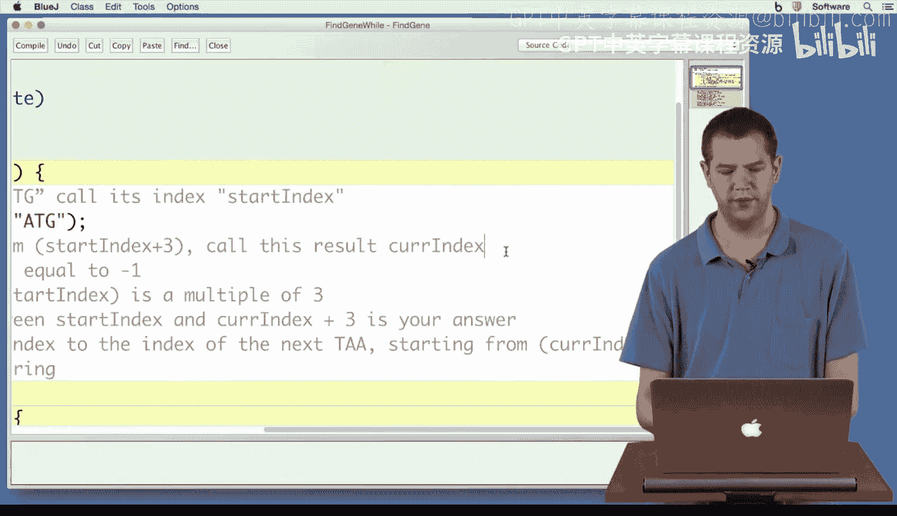
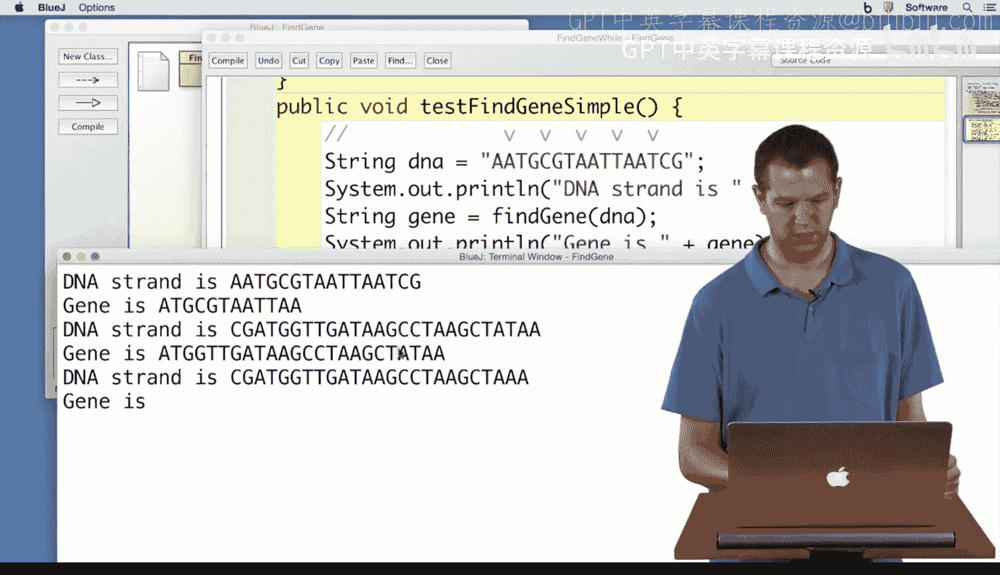

# Java编程基础：2-5：while循环编码 🧬


在本节课中，我们将学习如何将一个寻找特定DNA序列的算法，使用`while`循环转化为实际的Java代码。我们将从一个具体的算法步骤开始，逐步构建代码，并最终验证其正确性。

---

## 从算法到代码



上一节我们讨论了寻找基因序列的算法逻辑。本节中，我们来看看如何将这些逻辑步骤用Java代码实现。

我们的目标是：在DNA字符串中，找到第一个“ATG”起始密码子，然后寻找一个与之距离为3的倍数的“TAA”终止密码子，即使中间存在其他“TAA”序列。

以下是算法的主要步骤，我们将逐一实现：

1.  **找到第一个“ATG”的索引**。
    我们使用`indexOf`方法来实现这一步。
    ```java
    int startIndex = dna.indexOf("ATG");
    ```

2.  **从`startIndex + 3`的位置开始，寻找“TAA”的索引**。
    同样使用`indexOf`方法，并指定起始搜索位置。
    ```java
    int currIndex = dna.indexOf("TAA", startIndex + 3);
    ```

---

## 实现while循环逻辑

现在，我们进入核心部分。我们需要持续搜索，直到找到符合条件的“TAA”或搜索完整个字符串。这正是`while`循环的用武之地。

我们将设置一个循环，条件是当前找到的“TAA”索引`currIndex`不等于`-1`（`-1`表示未找到）。

```java
while (currIndex != -1) {
    // 循环体内的步骤
}
```

在循环体内，我们需要做两件事：

*   **检查距离是否为3的倍数**。
    通过计算`(currIndex - startIndex) % 3`是否等于`0`来判断。
*   **根据检查结果采取行动**。
    *   如果是3的倍数，则找到目标基因，返回子字符串。
    *   如果不是，则更新`currIndex`，继续寻找下一个“TAA”。

以下是循环体内的代码结构：

```java
if ((currIndex - startIndex) % 3 == 0) {
    // 找到基因，返回结果
    return dna.substring(startIndex, currIndex + 3);
} else {
    // 未找到符合条件的TAA，继续搜索下一个
    currIndex = dna.indexOf("TAA", currIndex + 1);
}
```

---

## 完成方法并测试

如果`while`循环结束（即`currIndex`变为`-1`），意味着没有找到符合条件的终止密码子，此时我们应该返回空字符串。

整合所有步骤，完整的方法代码如下：

```java
public String findGene(String dna) {
    int startIndex = dna.indexOf("ATG");
    if (startIndex == -1) {
        return "";
    }
    int currIndex = dna.indexOf("TAA", startIndex + 3);
    while (currIndex != -1) {
        if ((currIndex - startIndex) % 3 == 0) {
            return dna.substring(startIndex, currIndex + 3);
        } else {
            currIndex = dna.indexOf("TAA", currIndex + 1);
        }
    }
    return "";
}
```

为了验证代码正确性，我们编写了测试用例。测试字符串中包含故意放置的、不符合3倍数距离的“TAA”，以检验`while`循环是否能跳过它们，找到正确的基因。

运行测试后，代码成功输出了预期的基因序列，并且在找不到基因时返回了空字符串，证明了逻辑的正确性。

---

## 总结

本节课中我们一起学习了如何将算法转化为代码，并重点实践了`while`循环的应用。我们实现了以下关键点：



1.  使用`indexOf`方法定位字符串中的特定模式。
2.  利用`while`循环进行条件性重复搜索。
3.  在循环中使用`if-else`语句进行条件判断和流程控制。
4.  使用取模运算符`%`来验证距离是否为3的倍数。
5.  通过具体的测试案例验证了代码的健壮性。

通过这个例子，你不仅掌握了`while`循环的编码技巧，也加深了对字符串处理和算法实现的理解。