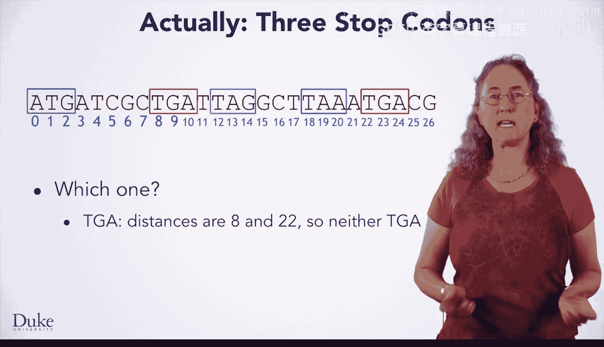
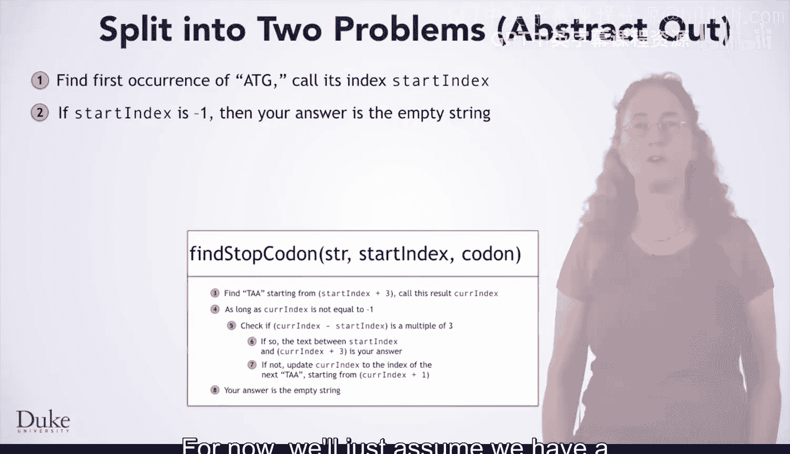
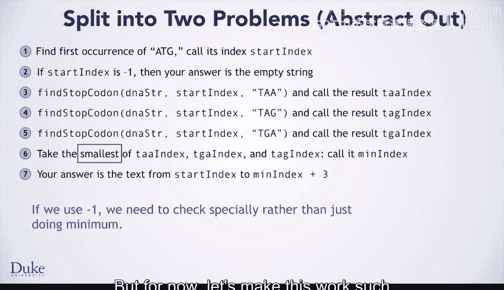

# Java编程和软件工程基础：2-5：三个终止密码子

在本节课中，我们将学习如何改进基因查找算法，使其能够识别三种不同的终止密码子（TAA、TAG、TGA），并从中选择第一个符合阅读框规则的密码子。

到目前为止，我们已经开发了一个算法，能够找到起始密码子和终止密码子，验证其长度是3的倍数，并返回该基因的DNA字符串。现在，是时候增加一层现实性和复杂性了。实际上存在三种不同的终止密码子：TAA、TGA和TAG。之前的算法只寻找TAA，现在我们需要让它寻找这三种密码子中，第一个距离起始密码子索引为3的倍数的那个。

那么，哪一个终止密码子是我们需要的呢？例如，第一个TGA距离起始密码子的索引不是3的倍数，所以不是我们想要的。第二个TGA同样不是3的倍数，也不是我们想要的。剩下的TAG和TAA，它们距离起始密码子的索引都是3的倍数。我们需要选择最先出现的那个，在这个例子中，是索引为12的TAG密码子。

## 设计解决方案

现在我们已经明确了问题，让我们来解决它。为此，让我们回顾一下之前的算法。之前算法中唯一与寻找TAA相关的部分，是步骤3和7中出现的“TAA”。我们能否基于这个算法，通过修改来完成大部分工作呢？

最好的方法是将问题分解。我们希望将搜索终止密码子的部分抽象成一个独立的方法。我们将其命名为 `findStopCodon`。这个方法将接收要搜索的DNA字符串、起始索引以及特定的终止密码子字符串（如“TAA”、“TGA”或“TAG”）作为参数。算法需要进行一些调整，例如返回找到的索引而不是文本，并且要能搜索三种终止密码子中的任意一种，而不仅仅是“TAA”。然而，算法搜索距离起始索引为3的倍数的密码子的基本机制保持不变。我们稍后会讨论这些修改。现在，我们假设已经有了一个可用的 `findStopCodon` 方法。

一旦我们将这个功能提取到独立的函数中，我们就可以用它来分别寻找三种终止密码子。

## 整合三种终止密码子

以下是使用 `findStopCodon` 方法的基本思路：

1.  调用该方法寻找“TAA”终止密码子。
2.  再次调用该方法寻找“TAG”终止密码子。
3.  第三次调用该方法寻找“TGA”终止密码子。

请注意，这对应于我们手动操作的过程：我们分别识别了TAA、TAG和TGA终止密码子的位置。这与我们手动的例子略有不同，因为 `findStopCodon` 方法只会返回一个距离起始索引为3的倍数的位置，而我们在图示中展示了一个非3倍数的TGA，仅用于说明。

现在我们有了这三个位置，我们想要最先出现的那个。因此，我们只需要取这三个值中的最小值，我们将其称为 `minIndex`。

最后，我们的答案就是从起始索引到 `minIndex + 3` 的子字符串。

## 实现 `findStopCodon` 方法

现在，让我们看看需要对抽象出来的 `findStopCodon` 算法做哪些修改。

首先，算法中硬编码的“TAA”需要被替换。它们将变成方法参数 `stopCodon`，这个参数告诉我们正在寻找的特定终止密码子。

另一个变化是，我们希望返回找到终止密码子的索引，而不是起始和终止密码子之间的文本。因为我们的主算法需要这些索引来进行比较，以确定使用哪一个，然后才获取文本。

每当我们在步骤4找到一个有效的终止密码子时，我们可以直接返回当前索引 `currIndex` 作为答案。

然而，在步骤6，当没有找到有效索引时，我们应该返回什么来表示呢？通常，返回 `-1` 是一个不错的选择，表示没有找到有效索引。但让我们看看这个返回值将如何被使用。

如果我们返回 `-1`，我们也可以让它工作，但我们必须修改主算法的代码，进行比简单地取这三个值的最小值更复杂的比较。你将在后续课程中看到这种方法，并在此过程中学习一个新概念。

但现在，为了让主算法能直接取最小值，我们可以返回DNA字符串的长度，因为这个值比任何有效的索引都要大。

当然，既然我们这样做，就应该显式地检查没有找到有效终止密码子的情况。如果 `minIndex` 等于DNA字符串的长度，就意味着三个终止密码子都没有被找到。

## 总结

本节课中，我们一起学习了如何扩展基因查找算法以处理三种终止密码子。我们通过将搜索功能抽象成独立的 `findStopCodon` 方法来分解问题，然后分别调用该方法寻找三种密码子，并从中选择最先出现的有效密码子。我们还讨论了如何设计方法的返回值，以便于在主算法中进行简单的比较。现在，我们已经有了完整的算法设计，接下来就可以将其转化为代码了。