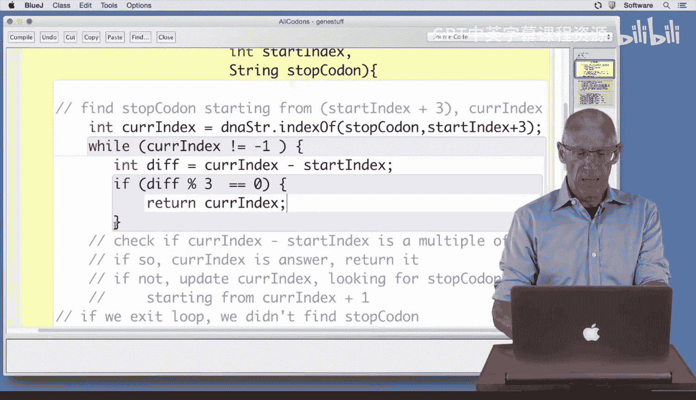

# Java编程和软件工程基础：2-5：三个终止密码子编码第一部分 🧬


在本节课中，我们将学习如何编写一个Java方法来在DNA字符串中寻找三个不同的终止密码子（TAA、TAG、TGA）。我们将基于之前寻找单个终止密码子的代码进行扩展，并遵循一个清晰的七步方法来构建和测试我们的程序。

---

## 概述

在之前的编码练习中，我们已经见过寻找单个终止密码子的代码，并确保它距离起始密码子的位置是3的倍数。本节课，我们将升级这段代码，使其能够寻找三个不同的终止密码子：**TAA**、**TAG** 和 **TGA**。为此，我们将编写一个名为 `findStopCodon` 的新方法。

## 编写 `findStopCodon` 方法

上一节我们介绍了寻找单个终止密码子的逻辑，本节中我们来看看如何将其通用化，以接受任何指定的终止密码子作为参数。

我们的方法 `findStopCodon` 将接收三个参数：
1.  `dnaStr`：要搜索的DNA字符串。
2.  `startIndex`：开始搜索的索引位置。
3.  `stopCodon`：要寻找的特定终止密码子。

以下是该方法的实现步骤：

1.  **初始化当前索引**：我们从 `startIndex + 3` 的位置开始，在DNA字符串中寻找第一个出现的 `stopCodon`。
    ```java
    int currIndex = dnaStr.indexOf(stopCodon, startIndex + 3);
    ```



2.  **进入循环**：只要 `currIndex` 不等于 `-1`（表示找到了终止密码子），我们就继续检查。
    ```java
    while (currIndex != -1) {
        // 检查逻辑将放在这里
    }
    ```

3.  **检查是否为3的倍数**：在循环内部，我们计算找到的终止密码子索引与起始索引的差值，并检查这个差值是否是3的倍数。
    ```java
    int diff = currIndex - startIndex;
    if (diff % 3 == 0) {
        // 找到符合条件的密码子
        return currIndex;
    }
    ```

4.  **更新搜索位置**：如果差值不是3的倍数，说明这个密码子不在正确的阅读框内。我们需要从 `currIndex + 1` 的位置开始继续搜索同一个终止密码子。
    ```java
    else {
        currIndex = dnaStr.indexOf(stopCodon, currIndex + 1);
    }
    ```

5.  **处理未找到的情况**：如果循环结束（即 `currIndex` 变为 `-1`），说明没有找到符合条件的终止密码子。我们返回DNA字符串的长度。这个设计是为了在后续寻找多个终止密码子中的最小值时提供便利。
    ```java
    return dnaStr.length();
    ```

将以上步骤组合起来，完整的 `findStopCodon` 方法代码如下：
```java
public int findStopCodon(String dnaStr, int startIndex, String stopCodon) {
    int currIndex = dnaStr.indexOf(stopCodon, startIndex + 3);
    while (currIndex != -1) {
        int diff = currIndex - startIndex;
        if (diff % 3 == 0) {
            return currIndex;
        } else {
            currIndex = dnaStr.indexOf(stopCodon, currIndex + 1);
        }
    }
    return dnaStr.length();
}
```

## 测试方法

编写完代码后，编译程序确保没有语法错误是第一步。但编译成功并不代表逻辑正确，因此我们必须进行测试。

以下是测试 `findStopCodon` 方法的代码示例。我们创建一个DNA字符串，并测试寻找“TAA”密码子的功能：

```java
public void testFindStop() {
    String dna = “ATGCGATAAATAA”; // 示例DNA序列
    // 在索引上方标出位置以便理解
    // 0 2 4 6 8 10...
    // A T G C G A T A A A T A A
    int result = findStopCodon(dna, 0, “TAA”);
    if (result != 9) { // 我们预期在索引9找到TAA
        System.out.println(“Error on test 1.”);
    }
    // ... 可以添加更多测试用例
    System.out.println(“Tests finished.”);
}
```

运行测试时，如果没有打印错误信息，并且最后显示了“Tests finished”，则说明所有测试都通过了。如果预期结果与实际结果不符，错误信息会被打印出来，帮助我们定位问题。


## 总结

本节课中我们一起学习了如何编写一个通用的 `findStopCodon` 方法来在DNA序列中寻找指定的终止密码子，并确保其位置符合阅读框规则（即与起始密码子的距离是3的倍数）。我们实现了从指定位置开始搜索、循环检查、以及返回结果的核心逻辑，并强调了通过编写测试代码来验证程序正确性的重要性。

现在，我们已经拥有了一个可靠的工具方法来寻找单个终止密码子。在接下来的课程中，我们将利用这个方法，进一步编写能够寻找三个不同终止密码子（TAA、TAG、TGA）中最早出现的那一个的代码。