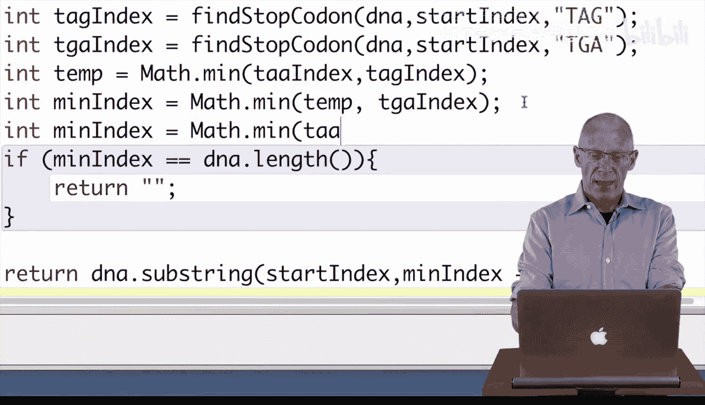
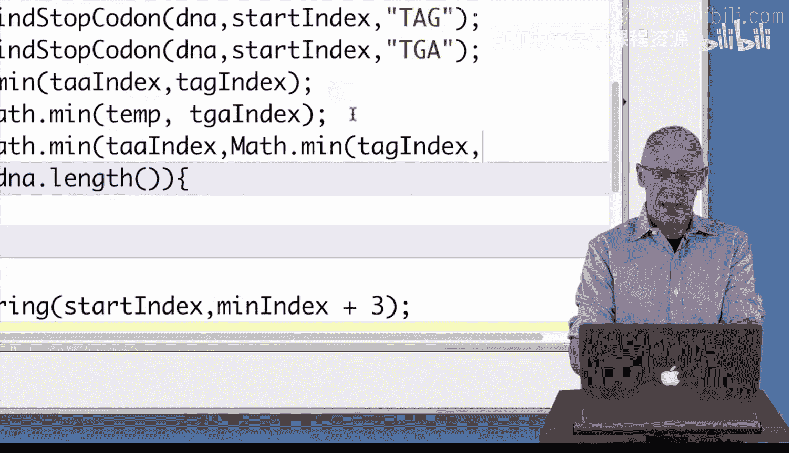

# 036：三个终止密码子编码第二部分


在本节中，我们将学习如何扩展之前的基因查找方法，使其能够处理三个不同的终止密码子（TAA、TAG、TGA）。我们将利用之前定义的抽象方法 `findStopCodon` 来实现这一功能。

上一节我们介绍了如何为单个终止密码子查找基因，本节中我们来看看如何同时处理多个终止密码子。

## 实现步骤

以下是实现支持三个终止密码子的 `findGene` 方法的具体步骤。

首先，我们需要在DNA序列中找到起始密码子“ATG”的位置。

```java
int startIndex = dna.indexOf("ATG");
```

如果找不到起始密码子，则方法应返回一个空字符串。

```java
if (startIndex == -1) {
    return "";
}
```

接下来，我们需要分别查找三个终止密码子（TAA, TAG, TGA）在起始密码子之后首次出现的位置。我们将使用之前定义的 `findStopCodon` 方法。

```java
int taaIndex = findStopCodon(dna, startIndex, "TAA");
int tagIndex = findStopCodon(dna, startIndex, "TAG");
int tgaIndex = findStopCodon(dna, startIndex, "TGA");
```

然后，我们需要从这三个索引值中找到最小的一个，这代表最早出现的有效终止密码子。

```java
int temp = Math.min(taaIndex, tagIndex);
int minIndex = Math.min(temp, tgaIndex);
```

或者，也可以将两步合并为一行代码：

```java
int minIndex = Math.min(taaIndex, Math.min(tagIndex, tgaIndex));
```

如果找到的最小索引值等于DNA序列的长度（意味着没有找到任何有效的终止密码子），则返回空字符串。

```java
if (minIndex == dna.length()) {
    return "";
}
```

最后，如果找到了有效的基因序列，则使用 `substring` 方法提取从起始索引到终止密码子（包含其三个碱基）的字符串。

```java
return dna.substring(startIndex, minIndex + 3);
```

## 测试与验证

编译代码没有语法错误并不意味着程序逻辑正确。我们必须编写测试方法来验证 `findGene` 方法在各种情况下的行为，例如包含不同终止密码子的DNA序列。测试方法的结构与之前视频中展示的类似。

## 总结



本节课中我们一起学习了如何编写一个能够处理多个终止密码子的基因查找方法。核心在于利用 `findStopCodon` 抽象方法和 `Math.min` 函数来找到最早出现的有效终止点，从而准确地提取基因序列。记住，编写完代码后，进行充分的测试是确保其正确性的关键步骤。



祝您编码愉快。😊