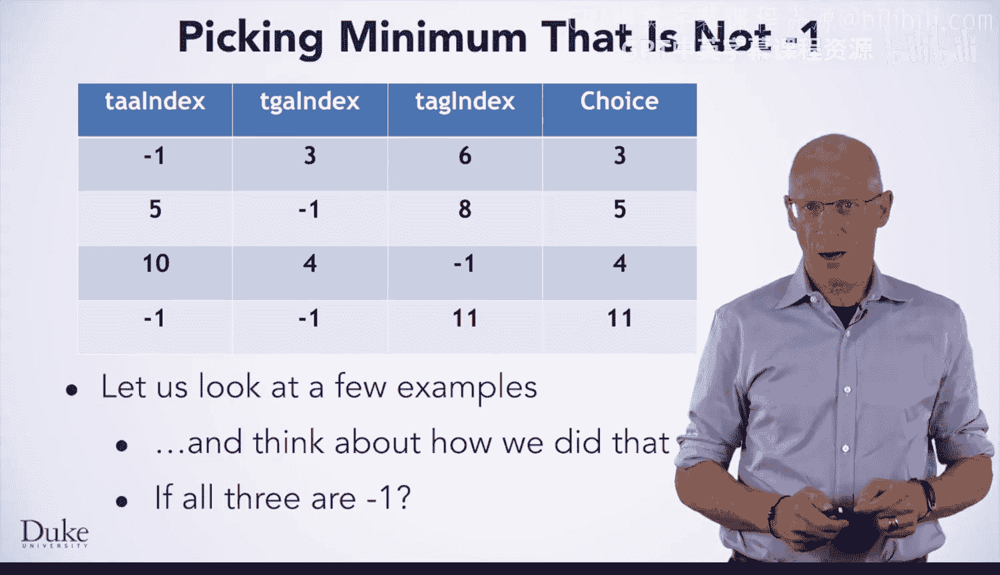
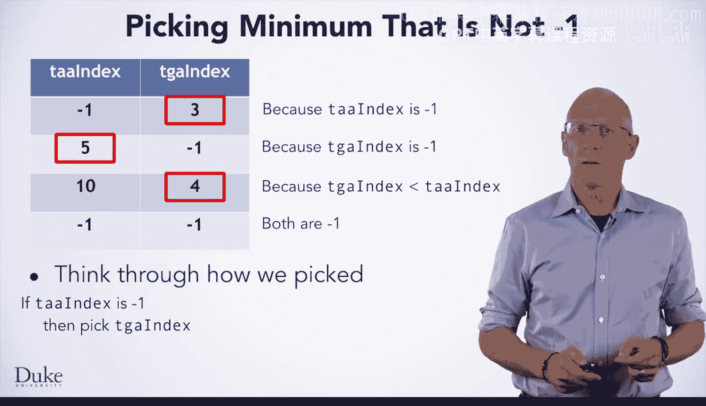
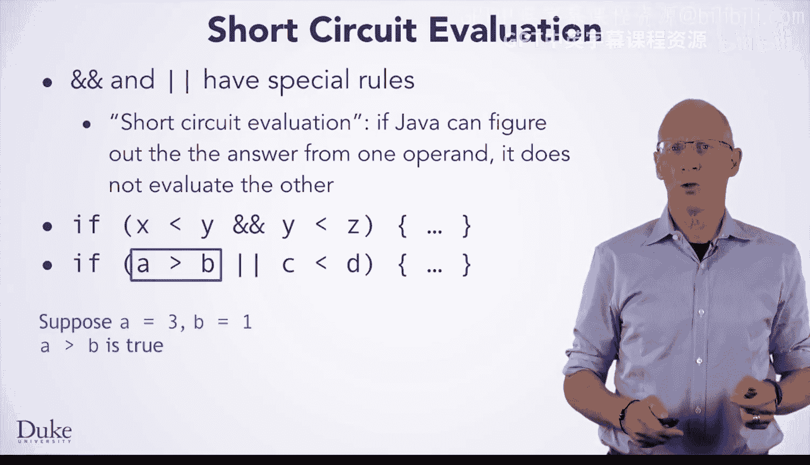

# Java编程和软件工程基础：2-5：逻辑与或运算


在本节课中，我们将学习如何在Java中使用逻辑运算符“与”（AND）和“或”（OR），并理解“短路求值”这一重要概念。我们将通过修改一个基因查找算法的例子，来具体应用这些逻辑运算符。

## 算法修改需求

上一节我们介绍了如何查找基因序列中的终止密码子。现在，我们来看看如何修改算法，使其在找不到有效终止密码子时返回-1，而不是字符串的长度。这是一个有效的设计选择，与Java中`indexOf`方法的行为一致。

为了实现这个修改，我们需要改变算法中的第6行。我们不能简单地取最小值，因为-1比任何有效索引都小。我们需要选择“不是-1的最小值”。

以下是几个例子，说明我们期望的选择逻辑：
*   当TAA索引为-1，TGA索引为3，TAG索引为6时，应选择3。
*   当索引为5，-1，8时，应选择5。
*   当索引为10，4，-1时，应选择4。
*   当索引为-1，-1，11时，应选择11。

## 决策逻辑分析

现在，让我们思考如何用算法表达这个决策过程。我们每次只比较两个值，然后将结果与第三个值比较。



以下是两个值之间的选择逻辑：
1.  如果TAA索引等于-1，则选择TGA索引。
2.  否则，如果TGA索引不等于-1**并且**TGA索引小于TAA索引，则选择TGA索引。
3.  否则，选择TAA索引。

注意，我们使用了“或”和“与”的逻辑连接词，将简单的条件组合成了复杂的条件判断。



## 在Java中实现逻辑运算

现在，让我们将上述逻辑应用到我们的算法中。我们将使用该逻辑在TAA索引和TGA索引之间做出选择，并将结果存储在变量`minIndex`中。然后，我们用同样的逻辑在`minIndex`和TAG索引之间做出最终选择。

在Java中，我们可以这样表达“与”和“或”：
*   **与**运算使用两个`&`符号表示：`&&`。
*   **或**运算使用两个竖线符号表示：`||`。

例如：
*   `if (x < y && y < z) { ... }` 表示如果x小于y**并且**y小于z。
*   `if (a > b || c < d) { ... }` 表示如果a大于b**或者**c小于d。

在我们的算法中，选择逻辑可以这样表达：
```java
if (taaIndex == -1 || (tgaIndex != -1 && tgaIndex < taaIndex)) {
    minIndex = tgaIndex;
} else {
    minIndex = taaIndex;
}
```

## 短路求值

“与”和“或”运算符有一个重要的特性，叫做**短路求值**。这意味着，如果Java通过计算第一个操作数就能确定整个表达式的结果，它将跳过对第二个操作数的计算。



例如：
*   在表达式 `x < y && y < z` 中，如果 `x < y` 为`false`，则无论 `y < z` 是什么，整个表达式都为`false`。因此，Java不会计算 `y < z`。
*   在表达式 `a > b || c < d` 中，如果 `a > b` 为`true`，则无论 `c < d` 是什么，整个表达式都为`true`。因此，Java不会计算 `c < d`。

短路求值非常重要，尤其是在第二个操作数的计算可能导致程序崩溃时。例如：
```java
if (x < str.length() && str.charAt(x) == ‘A’) { ... }
```
如果 `x < str.length()` 为`false`（即x不是有效索引），那么由于短路求值，`str.charAt(x)` 将永远不会被执行，从而避免了`StringIndexOutOfBoundsException`异常。依赖短路求值是防御性编程的一个绝佳例子，也是你Java编程工具箱中的重要工具。


## 总结

本节课中，我们一起学习了Java中的逻辑“与”和“或”运算符（`&&` 和 `||`）。我们通过修改基因查找算法的案例，理解了如何用它们构建复杂的条件判断。更重要的是，我们探讨了“短路求值”机制，它不仅能提升效率，更是编写健壮、安全代码的关键技术。请在实践中善用这些工具。