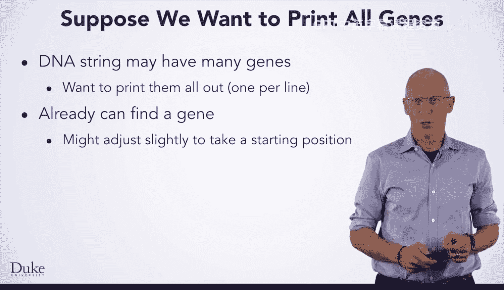
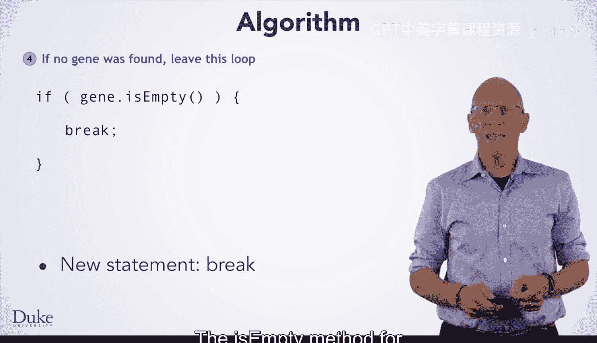
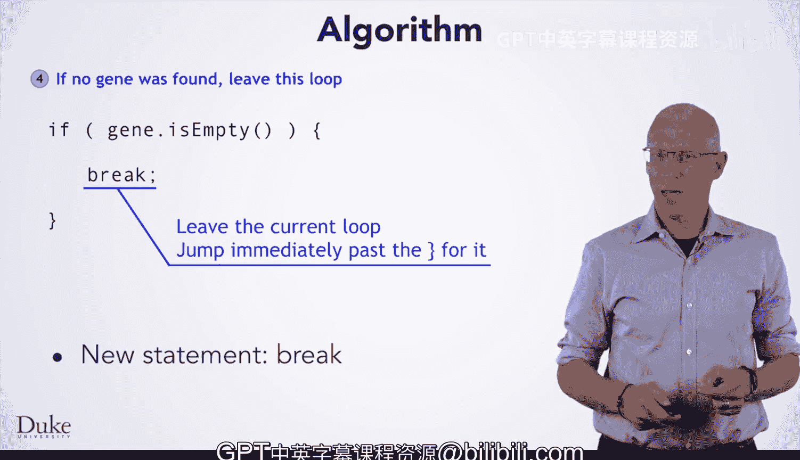

# 039：查找多个基因 🧬

在本节课中，我们将学习如何扩展之前编写的基因查找方法，使其能够在一个DNA字符串中查找并打印出**所有**的基因，而不仅仅是第一个。我们将探讨如何使用循环和`break`语句来实现这一目标。

到目前为止，你已经编写了一个查找基因的方法，并逐步改进了它。这个方法比你最初开始时复杂得多，尽管它仍然是对实际操作的简化。与其继续完善这个方法，不如让我们思考搜索基因的另一个方面。到目前为止，你只在字符串中寻找第一个基因。然而，字符串可能包含许多基因。如果你想找到它们全部并打印出来，该怎么办呢？

你已经可以找到一个基因。尽管你可能需要对方法做一些微小的调整，以便可以从字符串的中间开始查找。

## 从查找一个到查找多个 🔄

既然你可以找到一个基因，并且想要找到多个，你就需要使用循环来重复步骤。循环现在对你来说应该相当熟悉了，因为你可能想重复操作，只要还有更多的基因。你可以利用最近学到的`while`循环。

然而，这里有一点困难。在我们开始搜索之前，我们并不知道是否还有更多的基因。这似乎使得编写循环条件变得困难。

在代码中处理这种情况有很多方法，但我们将教你的是如何使用`break`语句来跳出循环体。

我们将通过一个比通常开发算法时稍短的例子，来演示如何打印所有基因。如果我们讲完后你还没有完全理解，请暂停视频，自己完成步骤一、二和三。在编写代码时，我们将向你展示它如何在这个DNA字符串上运行。

## 算法设计思路 💡

首先，我们将`startIndex`设置为零。`startIndex`将代表我们开始寻找下一个基因的位置。

然后，只要在`startIndex`之后还有更多的基因，我们就重复一些步骤。我们想找到`startIndex`之后的下一个基因，打印出那个基因，然后将`startIndex`设置到我们找到的基因的末尾之后。

为了向你展示算法将如何在字符串上继续工作，我们回到步骤二，并不断重复这些步骤。只要在`startIndex`之后还有更多的基因。

请注意，这就是我们之前提到的困难所在。我们需要知道是否会找到更多的基因，但我们还没有开始寻找它们。我们会找到下一个基因，打印它，更新`startIndex`，然后意识到我们应该停止重复步骤，因为没有更多的基因了。然而，我们遇到了这个困难：我们需要在步骤2中知道是否还有更多的基因，但我们直到步骤3才去寻找基因，这使得算法的实现有点尴尬。

实际上，我们希望在步骤3和步骤4之间就决定是继续还是停止。

## 改进的算法版本 🛠️

以下是算法的一个稍作修改的版本，它正好解决了这个问题。

请注意，我们的重复指令不再有任何条件，它只是说“重复这些步骤”。我们稍后会弄清楚何时停止。同样地，我们现在在循环中间有了另一个步骤，内容是：“如果没有找到任何基因，则离开循环”。一旦我们学会了如何将这类步骤转化为代码，这将更容易实现。

对于步骤二，即在不检查任何特定条件的情况下重复步骤，你可以简单地写`while (true)`。如果`while`循环的条件仅仅是`true`，那么当我们到达循环顶部时，代码将总是进入循环体，因为`true`总是评估为真。

我们需要的另一个新的Java语法是`break`语句。这就是你用来表达“离开这个循环”的方式。在这个例子中，我们将“如果没有找到基因”翻译成了一个`if`语句，内容是`if (gene.isEmpty())`。字符串的`isEmpty()`方法在字符串为空时返回`true`，否则返回`false`。请记住，我们的基因查找方法在找不到基因时返回空字符串。

在`if`语句内部，我们看到“离开这个循环”被翻译成了`break`语句。`break`语句在Java中简单地用关键字`break`后跟分号来编写，它会导致Java离开当前循环，无论它是`while`循环、`for`循环还是你可能学到的任何其他类型的循环（如`do-while`循环）。基本上，Java会跳过结束循环的右大括号。

## 将算法转化为代码 💻

现在我们知道如何实现这些步骤了，让我们把算法转化为代码并尝试一下。我们将找到所有存在的基因。祝你编码愉快！

## 总结 📝

本节课中，我们一起学习了如何扩展基因查找功能，从一个基因到查找多个基因。我们探讨了使用`while (true)`循环和`break`语句来处理未知循环次数的情况。关键点包括：

*   设置一个`startIndex`来跟踪搜索的起始位置。
*   使用`while (true)`创建一个无限循环，在循环内部决定何时跳出。
*   利用`break`语句在满足特定条件（如未找到基因）时立即终止循环。
*   每次找到基因后，更新`startIndex`以继续搜索剩余部分。

通过这种方法，你可以有效地遍历整个DNA字符串，识别并处理其中包含的所有基因。