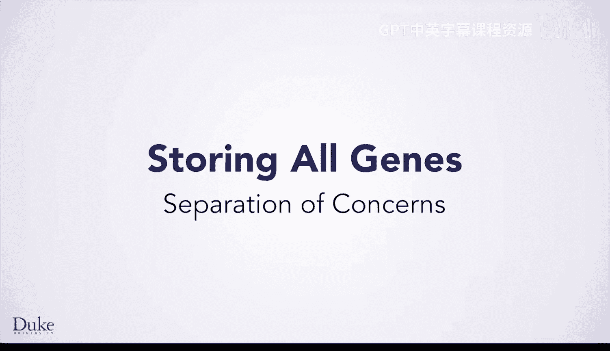
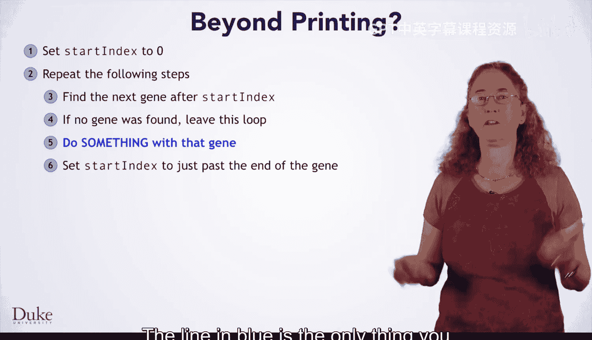
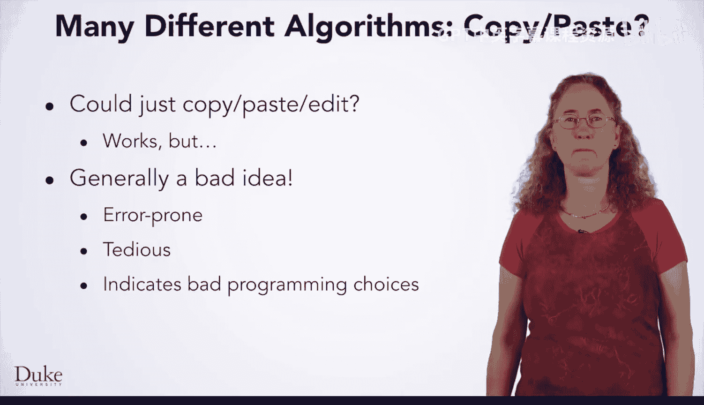
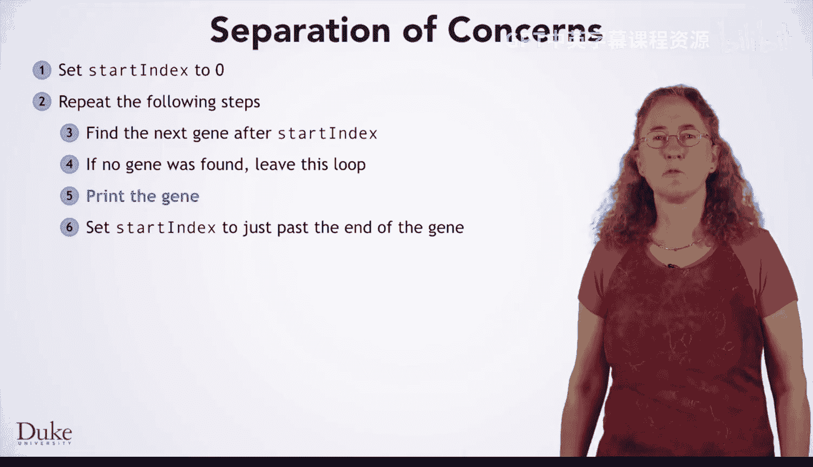
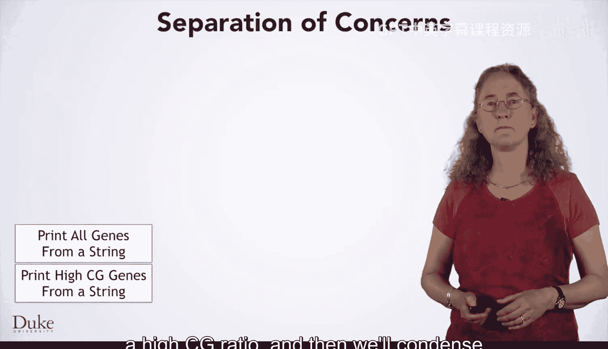
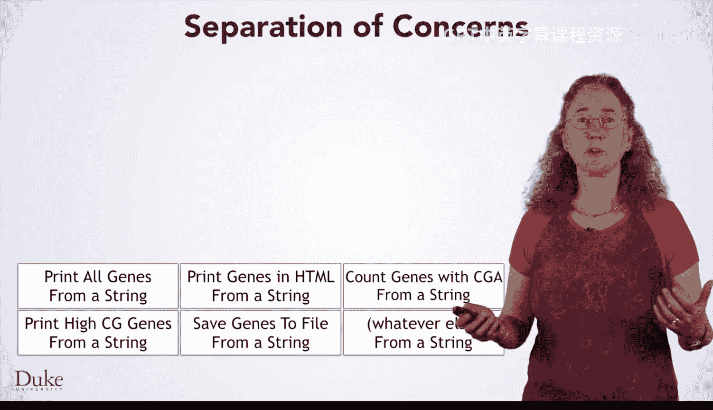
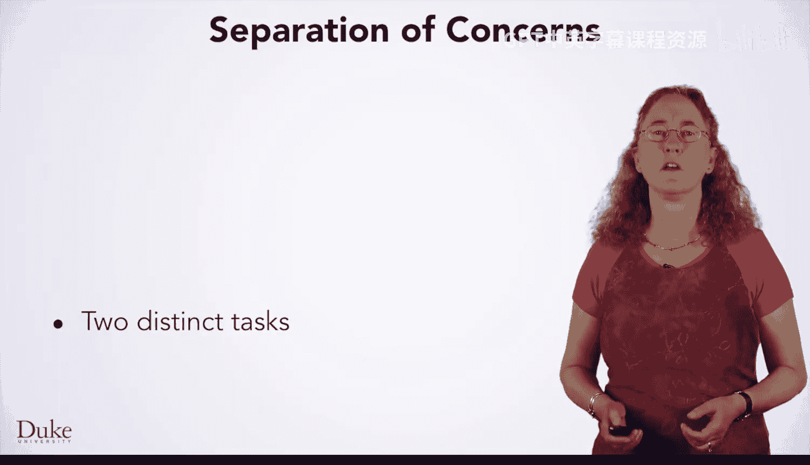
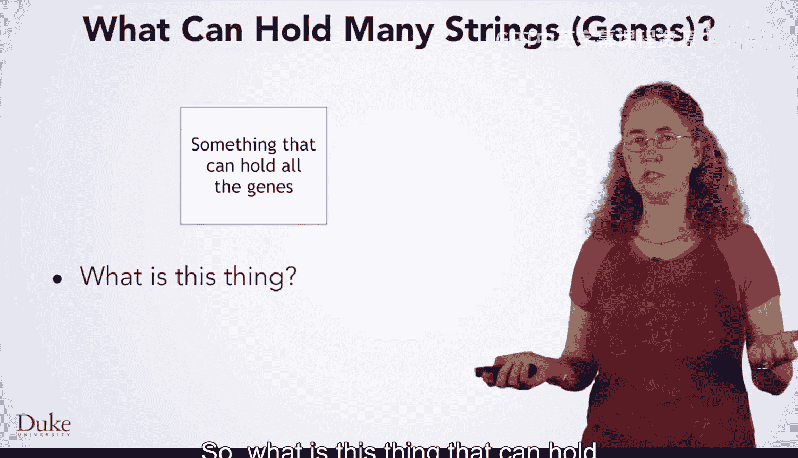
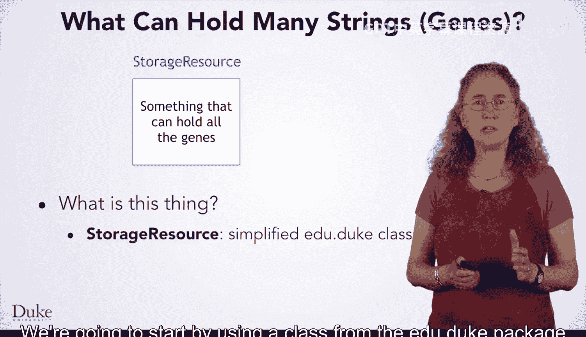
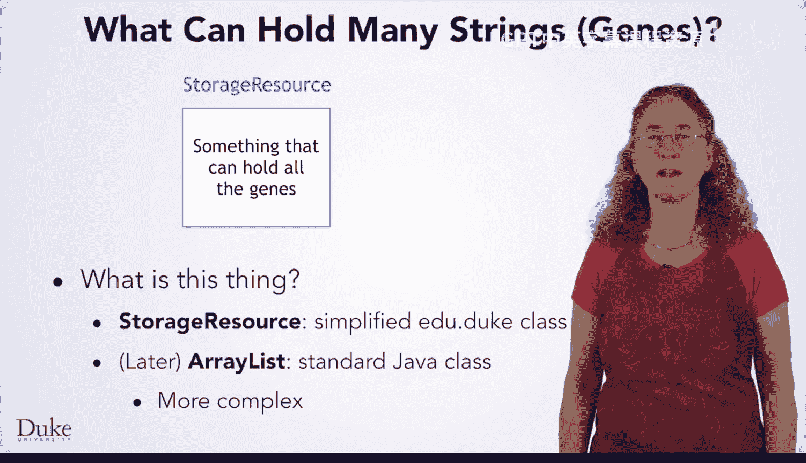

# Java编程和软件工程基础：2-5：关注点分离



在本节课中，我们将要学习一个重要的编程设计原则——关注点分离。我们将从一个具体的例子出发，分析为何简单的复制粘贴代码会导致问题，并探讨如何通过分离不同的任务来构建更灵活、更易维护的程序。

## 从迭代基因到发现问题

上一节我们介绍了如何遍历DNA字符串中的所有基因并打印它们。其核心算法结构如下：



```java
// 遍历DNA字符串并打印所有基因的算法框架
while (还有基因可找) {
    String currentGene = 找到下一个基因();
    System.out.println(currentGene); // 这是可以改变的部分
}
```

如果你想对DNA字符串中的基因进行其他操作，算法会非常相似。实际上，无论你想对每个基因做什么，代码结构都基本如此。**蓝色标注的行**是唯一需要根据具体需求更改的部分。

以下是可能的需求示例：
*   打印那些满足特定条件的基因。
*   统计基因的数量。
*   将基因保存到文件中。
*   用所有基因构建一个网页。

如果你想实现这些不同的功能，一个直接的方法是复制现有的算法，粘贴到一个新方法中，然后修改那一行代码。这种方法虽然可行，但通常是一个坏主意。

## 为何要避免复制粘贴

复制粘贴的方法存在几个主要问题。

1.  **容易出错**：你可能会忘记修改某些必须更改的部分。更糟糕的是，如果在复制之后发现原始实现中存在错误，你需要去修复每一个副本。
2.  **繁琐耗时**：你需要找到方法、复制、粘贴并修改。如果只需要一个变体，这可能还不算太糟，但如果你需要五种不同的功能，这会非常枯燥。
3.  **设计不佳**：每当你发现自己想要复制粘贴代码时，几乎总意味着存在更好的设计方法。



## 深入分析问题

让我们花点时间看看这个算法中可以改进的地方，理解如果保持现状并进行复制、粘贴、修改会带来多少工作量，从而找到改进的动机。

这是打印字符串中所有基因的算法。我们将其简化为底部的简短描述。

```java
算法：打印DNA字符串中的所有基因
1. 当DNA字符串中还有基因时：
2.   找到下一个基因
3.   打印该基因
```



然后我们复制、粘贴并修改第3行，改为“打印具有高CG比例的基因”。我们再次将其简化为简短描述。



```java
算法：打印具有高CG比例的基因
1. 当DNA字符串中还有基因时：
2.   找到下一个基因
3.   if (基因的CG比例 > 阈值) { 打印该基因 }
```

现在，我们继续复制、粘贴和编辑，以创建其他几种算法，对DNA字符串中的基因进行各种操作。

以下是可能创建的算法列表：
*   用HTML格式打印基因。
*   将基因写入输出文件。
*   统计包含密码子CGA的基因。



所有这些算法基本相同，区别仅在于它们对DNA字符串的具体操作细节。起初，复制粘贴似乎没什么大不了的。

## 问题如何扩大化

后来，我们获得了另一种DNA数据，它在一个文件中列出了所有基因，每行一个基因。我们也需要对这份数据执行同类型的操作，但算法会略有不同。它将包含一个“对文件中的每一行”的循环。

如果采用复制粘贴的方法，我们现在需要编写和测试六种算法。它们彼此非常相似，所以可能不算太难，但这是繁琐且容易出错的工作。

然后，如果我们又获得了其他数据源，我们将不得不为该数据源再次创建所有六种算法。同样地，如果我们需要执行一个新的操作，我们将不得不为每个数据源编写它的三个副本。这真是一团糟。

## 解决方案：关注点分离

我们真正需要做的是重新设计算法，运用**关注点分离**的原则。

我们最初的算法承担了两项任务：
1.  从某个数据源获取所有基因。
2.  打印它们，或对它们进行任何我们想做的操作。



我们希望将它们分离开来：让负责查找基因的算法将基因放入某个能够容纳基因列表的结构中。然后，让负责打印基因、统计基因或进行其他任何操作的算法，都基于这个列表进行操作。

这样，如果你需要添加新的数据源，只需编写一个方法将其基因放入我们的列表，它就能自动与你已编写的每一个处理算法协同工作。同样地，如果你需要编写新的处理算法，它也能自动与你已编写的每一个数据源协同工作。完全不需要任何复制粘贴。

## 实现分离的工具

那么，这个能够容纳所有基因供算法使用的“东西”是什么呢？

我们将从使用`edu.duke`包中的一个名为`StorageResource`的类开始，这是一个实现此功能的简化方式。

```java
// 使用StorageResource作为基因的存储容器
StorageResource geneList = new StorageResource();
// 查找基因的算法将基因添加到列表中
geneList.add(foundGene);
// 处理基因的算法从列表中读取
for (String gene : geneList.data()) {
    // 对每个基因进行操作
}
```



以后，当你学习了更多概念，你将过渡到使用标准的Java `util`包中的`ArrayList`类，它具有类似的功能，但更加强大和复杂。



```java
// 过渡到使用标准Java ArrayList
ArrayList<String> geneList = new ArrayList<>();
geneList.add(foundGene);
for (String gene : geneList) {
    // 对每个基因进行操作
}
```

## 总结



本节课中我们一起学习了**关注点分离**这一核心编程原则。我们分析了为何对相似代码进行复制粘贴会导致代码冗余、维护困难且容易出错。通过将“数据获取”和“数据处理”这两个关注点分离开，并使用一个中间存储结构（如`StorageResource`或`ArrayList`）来连接它们，我们可以构建出更加模块化、灵活和易于扩展的程序。这种设计使得新增数据源或处理逻辑时，无需修改大量现有代码，极大地提高了代码的可维护性和复用性。