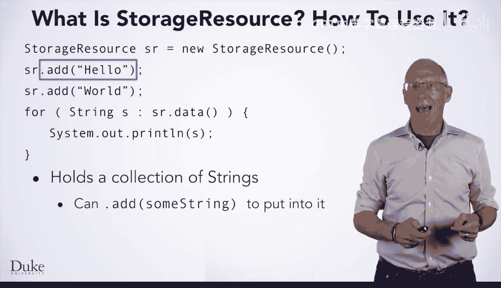
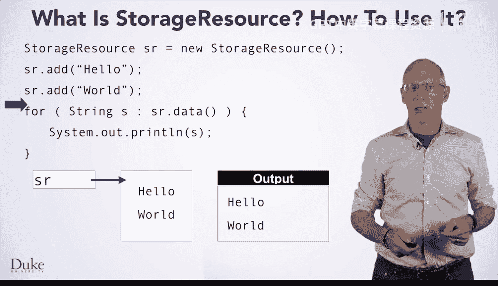
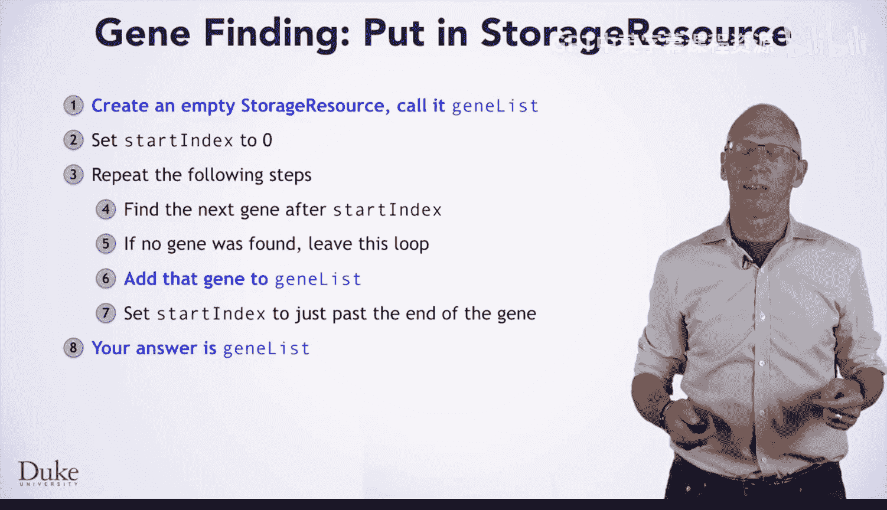

# Java编程和软件工程基础：2-5：StorageResource类 📦


在本节课中，我们将要学习如何使用 `StorageResource` 类来存储和管理数据集合。这是一种将数据存储在列表中的简化方法，有助于分离程序中的不同关注点。

---

## 什么是StorageResource类？ 🤔

`StorageResource` 是一个用于存储字符串集合的类。你可以使用 `.add` 方法将字符串放入其中，也可以使用 `.data` 方法获取一个可迭代对象，以便遍历你存入的所有字符串。

---



## 如何使用StorageResource？ 🛠️

以下是使用 `StorageResource` 类的基本步骤。

首先，我们需要声明一个 `StorageResource` 类型的变量并初始化它。

```java
StorageResource sr = new StorageResource();
```

初始化后，`sr` 变量引用一个空的字符串列表。

接下来，我们可以使用 `.add` 方法向这个资源中添加字符串。

```java
sr.add("Hello");
sr.add("World");
```

现在，`sr` 中包含了两个字符串：“Hello” 和 “World”。

为了处理这些数据，我们可以使用 `.data` 方法获取一个可迭代对象，并通过 `for-each` 循环来遍历所有字符串。

```java
for (String s : sr.data()) {
    System.out.println(s);
}
```

这段代码会依次打印出 “Hello” 和 “World”。

---

## 代码执行过程详解 🔍

上一节我们介绍了基本用法，本节中我们来看看代码是如何一步步执行的。

1.  **声明与初始化**：第一行代码 `StorageResource sr = new StorageResource();` 创建了一个名为 `sr` 的变量，它指向一个新的、空的 `StorageResource` 对象。
2.  **添加数据**：`sr.add("Hello");` 将字符串 “Hello” 添加到 `sr` 内部的列表中。接着，`sr.add("World");` 将 “World” 也添加进去。
3.  **遍历数据**：当执行到 `for (String s : sr.data())` 时，循环开始。
    *   第一次迭代：变量 `s` 被赋值为列表中的第一个字符串 “Hello”，然后执行循环体 `System.out.println(s);`，打印出 “Hello”。
    *   第二次迭代：变量 `s` 被更新为列表中的下一个字符串 “World”，再次执行循环体，打印出 “World”。
4.  **循环结束**：当列表中所有字符串都被遍历后，循环终止，程序继续执行后续代码。

通过这个过程，我们清晰地看到了数据是如何被存储和访问的。



---

## 在基因查找算法中的应用 🧬

了解了 `StorageResource` 的基本操作后，我们来看看如何将它应用到一个实际场景中，比如之前讨论过的基因查找算法。

以下是修改后的算法核心步骤，主要发生了三处变化：

1.  **创建存储容器**：在算法开始时，我们创建一个空的 `StorageResource` 对象，用于存放找到的所有基因字符串。
    ```java
    StorageResource geneList = new StorageResource();
    ```
2.  **存储而非打印**：在算法循环中，每找到一个基因，我们不再直接打印它，而是将其添加到 `StorageResource` 中。
    ```java
    geneList.add(foundGene);
    ```
3.  **返回结果**：在算法结束时，我们不再输出结果，而是将包含所有基因的 `StorageResource` 对象返回给调用者。
    ```java
    return geneList;
    ```

这样修改后，调用此方法的代码就可以自由地使用这些基因数据——无论是直接打印，还是进行进一步的分析处理，实现了更好的功能分离。

---

## 更多资源与总结 📚

本节课中我们一起学习了 `StorageResource` 类的用途和基本操作方法。

*   `StorageResource` 类提供了一个简单的方式来存储和遍历字符串集合。
*   核心操作包括使用 `new StorageResource()` 创建对象、使用 `.add(String)` 添加数据以及使用 `.data()` 进行遍历。
*   在复杂的程序中，使用此类可以帮助我们分离数据存储和数据处理逻辑，使代码更清晰、更易维护。

如果你想了解更多关于 `StorageResource` 类的其他方法，或者忘记了我们讨论过的细节，你可以在 Duke Learn to Program 网站的文档页面找到这个类的完整说明。



祝你使用 `StorageResource` 愉快！