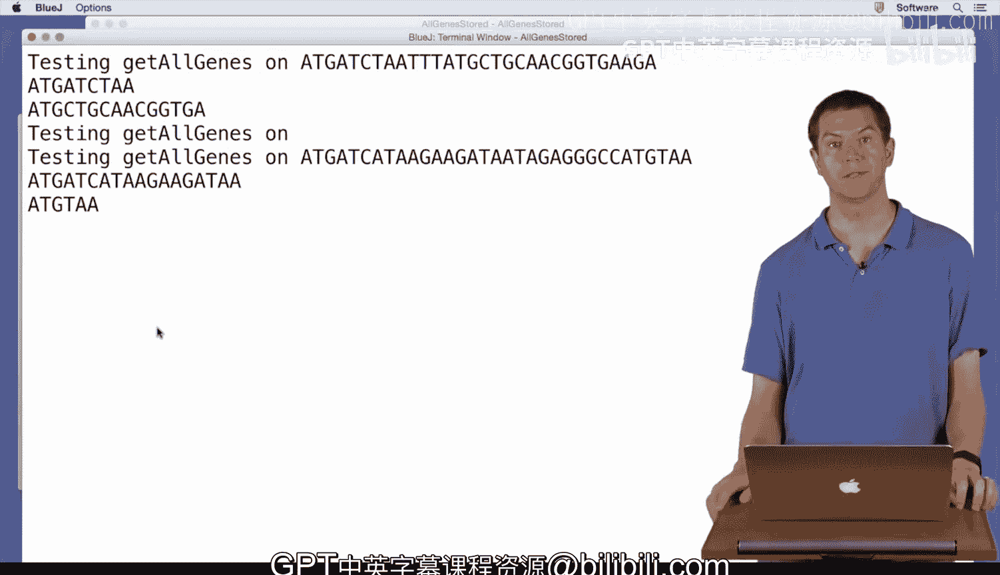

# 043：StorageResource类编码 📦


在本节课中，我们将学习如何将“查找基因”和“打印基因”这两个功能分离开来。我们将通过创建一个名为 `StorageResource` 的存储资源类来实现这一目标，从而让代码更加模块化和可重用。

## 概述

在之前的课程中，我们编写了直接查找并打印基因的代码。然而，为了提升代码的灵活性和可重用性，我们希望将“查找”和“处理（如打印）”这两个步骤分开。本节我们将创建一个 `getAllGenes` 方法，它负责查找所有基因并将其存储在一个 `StorageResource` 对象中。之后，我们可以遍历这个存储资源，根据需要进行打印或其他操作，而无需重复编写查找基因的代码。

## 代码重构：从打印到存储

上一节我们介绍了直接打印基因的算法。本节中，我们来看看如何修改代码，使其返回一个包含所有基因的存储集合，而不是直接打印。

首先，我们需要将原有的 `printAllGenes` 方法重命名为 `getAllGenes`，并修改其返回类型为 `StorageResource<String>`。这个方法将执行查找逻辑，但不再进行打印，而是将找到的每个基因添加到存储资源中。

以下是重构后的 `getAllGenes` 方法的核心步骤：

1.  创建一个空的 `StorageResource` 对象，用于存储基因。
2.  在DNA字符串中循环查找起始密码子 “ATG”。
3.  对于每个找到的起始点，查找下一个终止密码子（“TAA”, “TAG”, 或 “TGA”）。
4.  如果找到的基因长度是3的倍数，则将其视为有效基因。
5.  将这个有效的基因字符串添加到 `StorageResource` 中。
6.  循环结束后，返回这个包含了所有找到的基因的 `StorageResource` 对象。

对应的关键代码如下所示：

```java
public StorageResource<String> getAllGenes(String dna) {
    StorageResource<String> geneList = new StorageResource<>();
    int startIndex = 0;
    while (true) {
        startIndex = dna.indexOf(“ATG”, startIndex);
        if (startIndex == -1) {
            break;
        }
        // 查找终止密码子的逻辑...
        String currentGene = dna.substring(startIndex, stopIndex + 3);
        if (currentGene.length() % 3 == 0) {
            geneList.add(currentGene); // 将基因加入存储资源
        }
        startIndex = stopIndex + 3;
    }
    return geneList; // 返回存储资源
}
```

## 使用存储资源

现在，我们已经有了一个可以返回基因集合的方法。接下来，我们看看如何在主程序或测试方法中使用它。

我们可以调用 `getAllGenes` 方法，得到一个 `StorageResource` 对象。然后，我们可以遍历这个对象中的所有基因，并对每个基因执行我们想要的操作，例如打印。

以下是遍历 `StorageResource` 并打印其中所有基因的示例代码：

```java
public void testGetAllGenes() {
    String dna = “ATGCGATACGCTGAATAGATGTAG”;
    StorageResource<String> genes = getAllGenes(dna); // 获取存储资源
    for (String g : genes.data()) { // 遍历存储资源中的每个基因
        System.out.println(g);
    }
}
```

在这段代码中，`genes.data()` 返回一个可迭代的集合，允许我们使用 `for-each` 循环来访问其中的每一个基因字符串。

## 总结



本节课中我们一起学习了如何利用 `StorageResource` 类来改进我们的基因查找程序。关键点在于，我们将**查找功能**（`getAllGenes`）和**处理功能**（如打印）解耦。现在，`getAllGenes` 方法只负责查找并返回结果，而如何处理这些结果（打印、筛选、分析等）则由调用它的代码来决定。这种设计使我们的代码更加清晰、灵活，也更容易在未来进行扩展和维护。