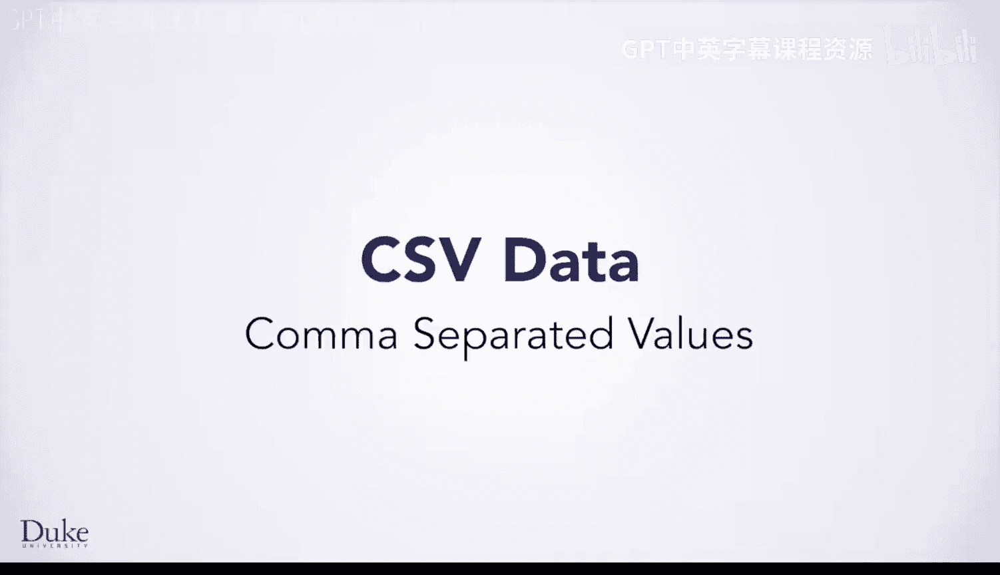
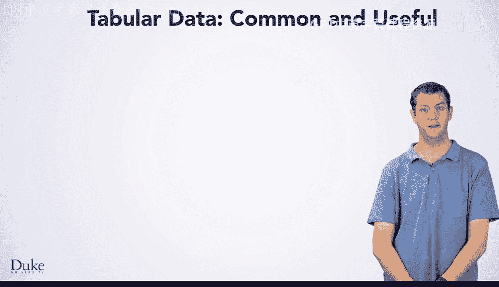
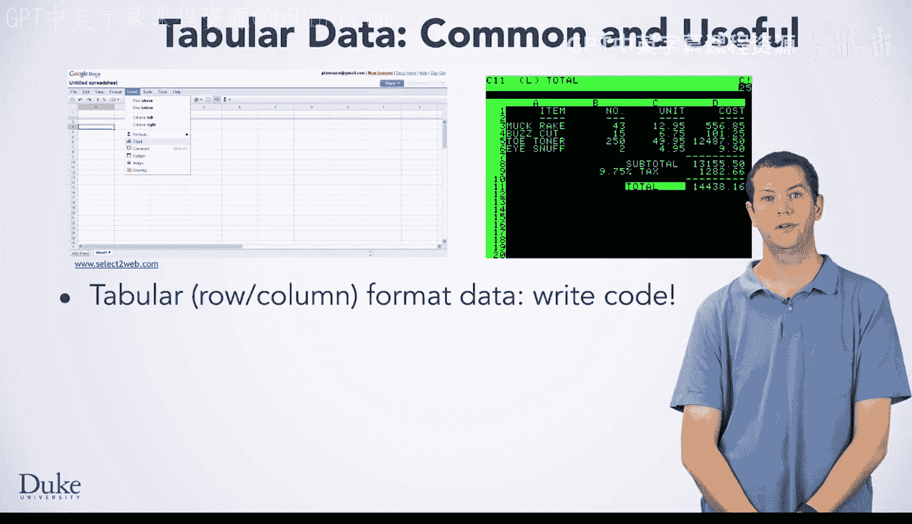
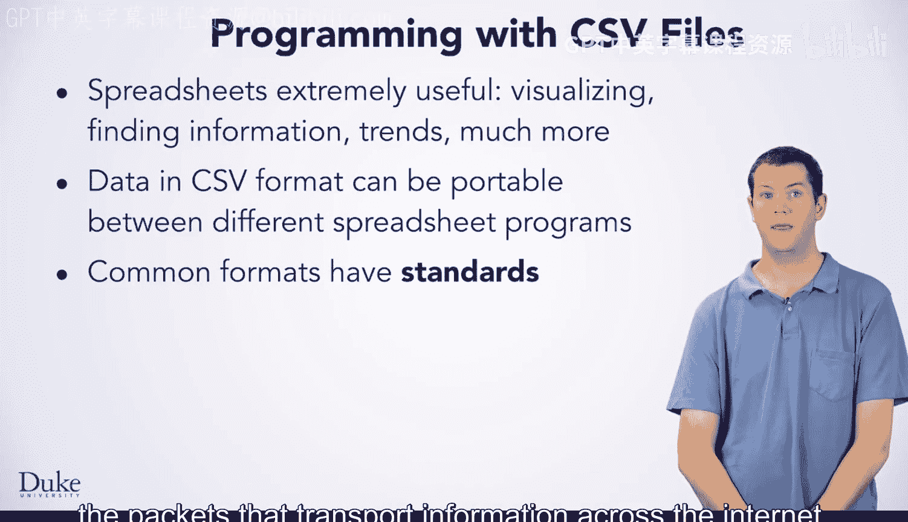

# 044：逗号分隔值 📊

在本节课中，我们将学习如何使用Java来分析数据，发现其中的趋势、模式，并基于数据信息得出结论。我们将重点介绍一种常见的数据格式——逗号分隔值（CSV），并学习如何利用Java程序来处理和分析这种格式的数据。

## 电子表格程序的历史与作用 📈

上一节我们介绍了数据分析的目标，本节中我们来看看用于数据分析的经典工具——电子表格程序。

以下是两个电子表格程序的截图，它们多年来一直被用于分析数据。

*   左侧是当今可以使用的Google文档电子表格的截图。该程序在云端分析数据并运行，可通过浏览器或移动应用程序在全球各种设备上访问。
*   右侧是Visicalc的截图，这是第一个电子表格程序，于1979年发布，并且只能在Apple2计算机上运行。

## 表格数据与CSV格式 📋

电子表格程序通常处理以行和列格式化的数据，即表格数据。你也将能够编写Java代码来分析此类数据。

电子表格程序通过花费数秒来模拟以前需要数天才能执行的“假设”场景，彻底改革了许多行业并催生了新行业。此处的链接指向一个描述Visicalc开发以及被这些程序所变革的行业的播客。

如今，可以被软件程序分析的数据通常通过政府和非营利网站公开提供。

典型情况下，数据以CSV文件的形式产生。在这种文件中，每一行中的不同数据值由逗号分隔，因此得名“逗号分隔值”。你将学习如何编写Java程序来分析以CSV格式存储的数据。

## 为什么需要Java分析CSV数据？ 💡

使用电子表格软件是发现模式、信息、趋势以及可视化数据的好方法，但有时仅凭电子表格程序不足以轻松解决所有问题。

存在许多不同的电子表格程序，因此一个通用的格式非常有用。CSV格式使得数据能够在用于分析数据的不同类型软件之间可移植。此外，你可以编写自己的Java程序，使用CSV格式来分析数据。

## 数据格式标准 📜

通用格式通常有标准。例如，互联网协议（IP）标准决定了在互联网上传输信息的数据包格式。制定IP标准的IETF（互联网工程任务组）也为CSV文件创建了一个标准。

其他组织为不同软件程序中使用的格式制定了不同但相关的标准。

## 使用Apache CSV解析库 🛠️

在本课中，你将学习如何使用一个开源软件库——Apache CSV解析器，同时更深入地了解Java编程。这个软件库将使你能够解决那些仅使用电子表格难以解决的问题。

让我们开始吧。

---

**本节课中我们一起学习了**：CSV（逗号分隔值）作为一种通用、便携的数据格式的重要性；回顾了电子表格程序的历史和作用；理解了在某些场景下，使用Java程序配合专门的解析库（如Apache CSV）来分析CSV数据，比单纯使用电子表格更强大、更灵活。