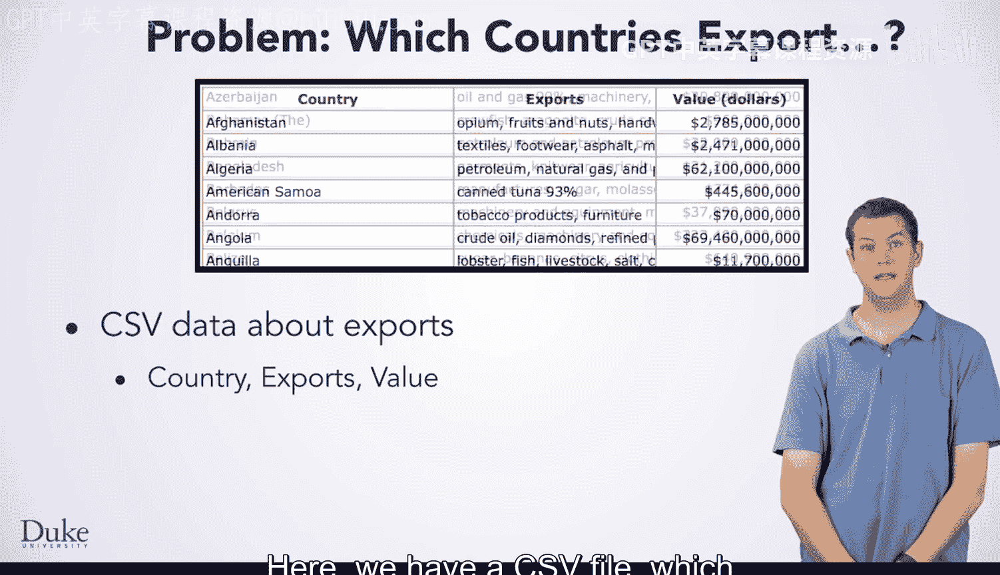
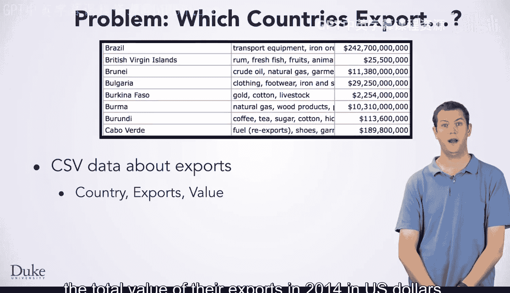
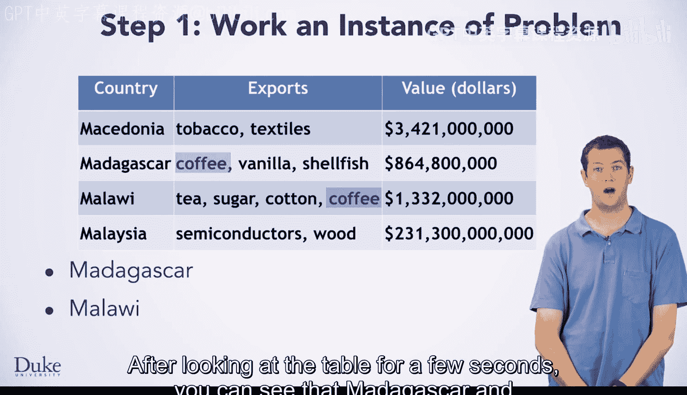
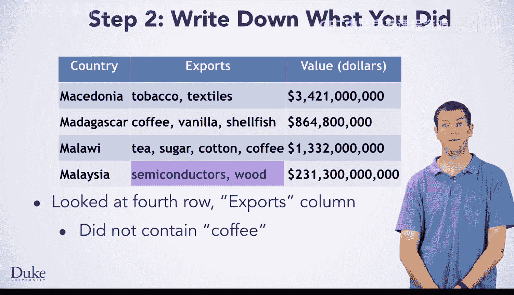
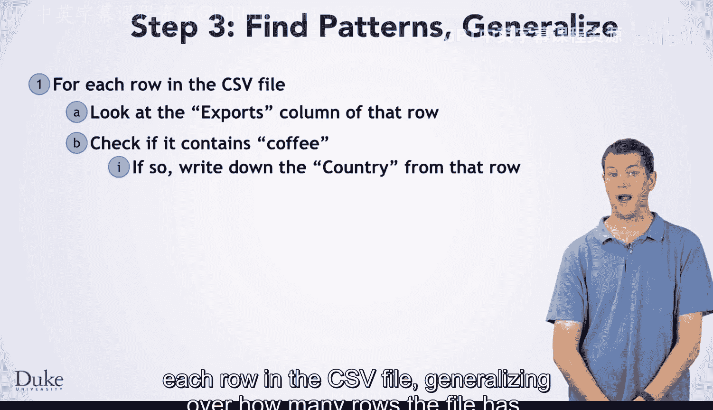
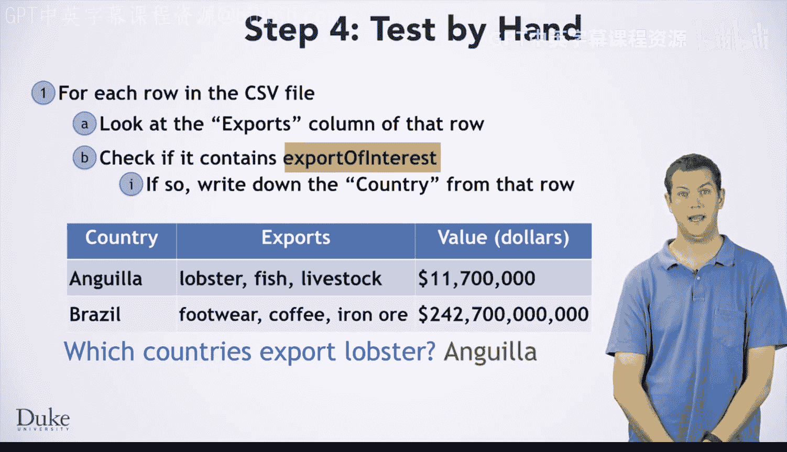

# 046：算法开发

在本节课中，我们将学习如何开发一个算法，用于分析CSV文件中的数据，以找出出口特定商品的所有国家。

上一节我们介绍了处理CSV文件的基础知识。本节中我们来看看如何利用这些知识解决一个实际问题。

## 问题定义

我们有一个CSV文件，其中包含了218个国家的出口数据。文件包含以下列：国家名称、主要出口商品以及2014年以美元计价的出口总值。

面对如此大量的数据，手动查找既繁琐又容易出错。因此，我们希望编写一个程序来自动完成这项分析。例如，我们可能想找出所有出口龙虾或铁矿石的国家。

## 算法开发七步法

我们将遵循七步法来编写这个程序。

### 第一步：手动解决一个小规模实例

首先，我们通过一个简化的例子来手动解决问题。以下是一个包含四个国家及其部分出口商品的表格：

| 国家 | 出口商品 |
| :--- | :--- |
| 马达加斯加 | 香草， 咖啡， 糖 |
| 马拉维 | 烟草， 咖啡， 茶 |
| 马其顿 | 葡萄酒， 烟草， 水果 |
| 马来西亚 | 橡胶， 棕榈油， 可可 |

**问题：** 哪些国家出口咖啡？

通过观察表格，我们可以发现：**马达加斯加**和**马拉维**出口咖啡，而马其顿和马来西亚不出口。

### 第二步：记录手动解决步骤

仅仅说“我看了看就找到了答案”对后续步骤没有帮助。我们需要以更逐步的方式记录思考过程。

以下是针对这个具体实例的详细步骤：
1.  查看第一行（马达加斯加）的“出口商品”列。
2.  发现其中不包含“咖啡”。
3.  查看第二行（马拉维）的“出口商品”列。
4.  发现其中包含“咖啡”。
5.  写下“马达加斯加”。
6.  查看第三行（马其顿）的“出口商品”列。
7.  发现其中不包含“咖啡”。
8.  查看第四行（马来西亚）的“出口商品”列。
9.  发现其中不包含“咖啡”。

### 第三步：寻找模式并归纳

观察上述步骤，我们发现对每一行的操作非常相似。这种相似性表明，我们最终需要对每一行进行循环处理。

然而，在能用“对每一行”来表达算法之前，我们需要仔细分析各行步骤中的差异。

**第一个差异：** 在第5步我们写下了“马达加斯加”。这个名称来自哪里？它来自当前查看行的“国家”列的值。

**第二个差异：** 我们没有写下第一行和第四行的国家名称，但写下了第二行和第三行的。我们是如何决定是否写下国家名称的？这个决定是基于该行的“出口商品”列是否包含“咖啡”。

现在，我们已经弄清楚了如何以相同的方式处理每一行，可以归纳出通用步骤。

以下是归纳后的通用算法（适用于任意行数的CSV文件）：
1.  对CSV文件中的每一行：
    2.  检查该行的“出口商品”列是否包含“咖啡”。
    3.  如果包含，则打印该行的“国家”列的值。

### 第四步：测试你的算法

现在，我们用一个新数据表来测试这个通用算法。下表包含两个国家：

| 国家 | 出口商品 |
| :--- | :--- |
| 安哥拉 | 石油， 钻石， **龙虾** |
| 巴西 | 铁矿石， 大豆， 咖啡 |

**问题：** 哪些国家出口龙虾？

根据我们的算法：
*   检查安哥拉：出口商品包含“咖啡”吗？不包含。不打印。
*   检查巴西：出口商品包含“咖啡”吗？包含。打印“巴西”。

**结果：** 算法输出“巴西”。但这是错误的，正确答案应该是“安哥拉”。

测试暴露了算法中的一个关键缺陷：我们的算法总是检查是否包含“咖啡”，而不是检查我们感兴趣的任何出口商品。在归纳步骤中，我们遗漏了这一点。

这正是“第四步：测试你的算法”旨在在编写代码之前发现的问题。

我们可以通过引入一个参数（我们称之为`exportOfInterest`）来修复这个算法，该参数表示我们要查找的出口商品。

修正后的算法如下：
1.  对CSV文件中的每一行：
    2.  检查该行的“出口商品”列是否包含 `exportOfInterest`。
    3.  如果包含，则打印该行的“国家”列的值。

用这个修正后的算法重新测试龙虾的案例，现在能得到正确答案“安哥拉”了。

### 后续步骤

至此，我们已经完成了一个健壮算法的开发。接下来的步骤将是：
*   **第五步：** 用Java代码实现这个算法。
*   **第六步：** 测试你编写的代码。
*   **第七步：** 调试代码（如果需要）。

## 总结

本节课中我们一起学习了如何系统地开发一个数据处理算法。我们从手动解决一个小问题实例开始，逐步记录思考过程，寻找操作中的模式并将其归纳为通用步骤。最关键的一步是使用不同的测试用例来验证我们的通用算法，这帮助我们发现并修正了一个重要的逻辑错误，即算法被硬编码为查找特定商品（咖啡），而不是一个可变的查询目标。最终，我们得到了一个清晰、正确的算法，为下一步的代码实现打下了坚实的基础。