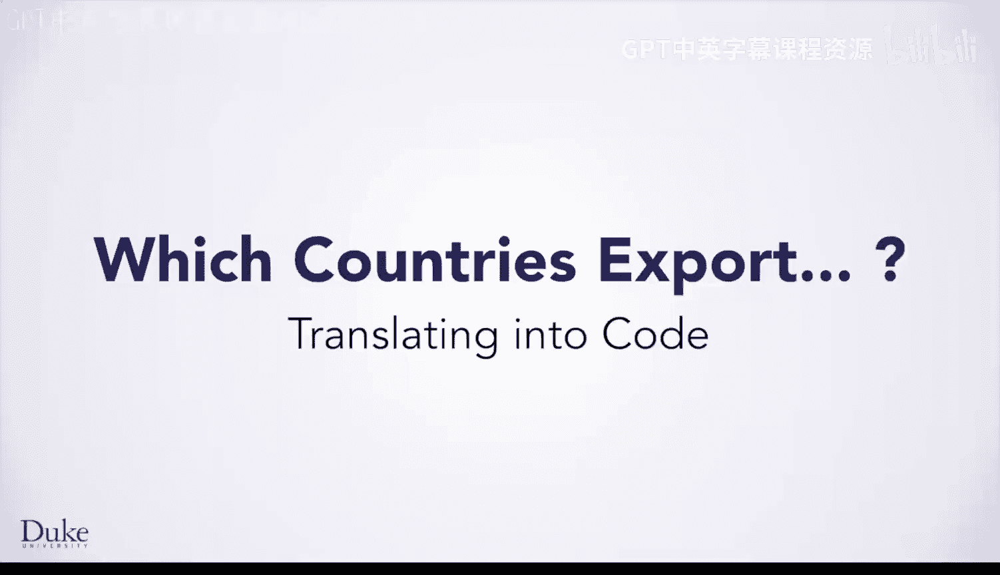
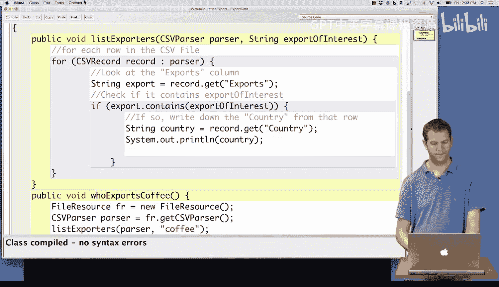
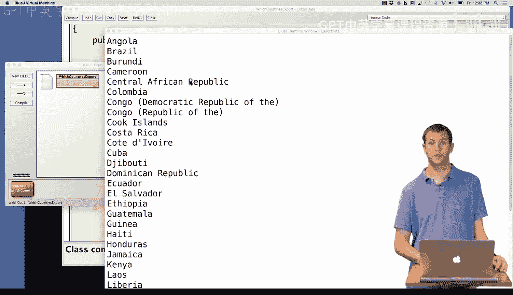
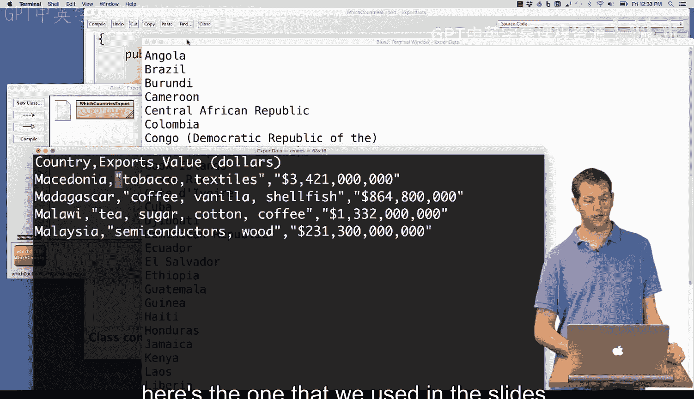
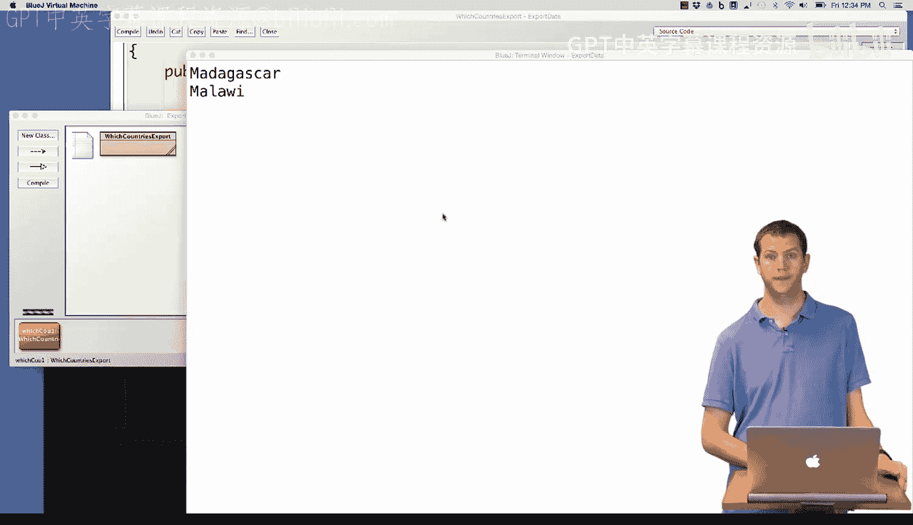

# Java编程和软件工程基础：2-5：哪些国家出口：代码翻译



## 概述
在本节课中，我们将学习如何将之前设计的“查找出口特定商品的国家”算法转化为实际的Java代码。我们将使用CSV解析器来读取数据文件，并实现一个方法来筛选和打印出符合条件的国家。

---

## 从算法到代码实现

上一节我们介绍了查找出口特定商品的算法。本节中，我们来看看如何在Java中实现这个算法。

我们已经在BlueJ中创建了一个类，并导入了必要的库：`edu.duke.*` 和 `org.apache.commons.csv.*`。后者提供了我们需要的`CSVParser`类。

这里有一个名为`listExporters`的方法。它接收两个参数：一个已打开数据文件的`CSVParser`对象，和一个表示我们感兴趣的商品名称的字符串`exportOfInterest`。方法注释中记录了我们之前设计的算法步骤。

以下是实现该算法的代码步骤：

**第一步：遍历CSV文件的每一行。**
我们知道，可以使用`CSVRecord`类型来遍历CSV文件中的每一行数据。

```java
for (CSVRecord record : parser) {
    // 后续步骤将放在这个循环体内
}
```

**第二步：获取“exports”列的值。**
我们可以使用`record.get("exports")`来获取当前行中“exports”列的内容。

```java
String export = record.get("exports");
```

**第三步：检查该列是否包含目标商品。**
我们需要检查`export`字符串是否包含`exportOfInterest`。一种方法是使用`indexOf`，如果找不到则返回-1。但更清晰、更易读的方法是使用`contains`方法。

```java
if (export.contains(exportOfInterest)) {
    // 如果包含，则执行下一步
}
```

**第四步：如果包含，则记录该行对应的国家。**
我们从“country”列获取国家名称，并将其打印出来。

```java
String country = record.get("country");
System.out.println(country);
```

将以上步骤组合起来，完整的`listExporters`方法代码如下：

```java
public void listExporters(CSVParser parser, String exportOfInterest) {
    for (CSVRecord record : parser) {
        String export = record.get("exports");
        if (export.contains(exportOfInterest)) {
            String country = record.get("country");
            System.out.println(country);
        }
    }
}
```

编译这段代码，确保没有语法错误。

---

## 创建测试方法

在BlueJ的对象工作台中直接创建CSV解析器有些复杂。因此，我们创建一个辅助测试方法。

这个方法名为`whoExportsCoffee`，它不接受参数，目的是从一个特定数据集中找出所有出口咖啡的国家。

以下是测试方法的实现步骤：

**第一步：创建文件资源。**
使用`FileResource`类，它允许我们通过对话框选择要读取的数据文件。

```java
FileResource fr = new FileResource();
```

**第二步：从文件资源中获取CSV解析器。**
`FileResource`对象可以提供一个`CSVParser`来解析文件数据。

```java
CSVParser parser = fr.getCSVParser();
```

**第三步：调用`listExporters`方法。**
使用上一步得到的解析器和目标商品“coffee”作为参数，调用我们编写的方法。

```java
listExporters(parser, "coffee");
```

完整的测试方法代码如下。注意，该方法不返回任何值，因此返回类型为`void`。



```java
public void whoExportsCoffee() {
    FileResource fr = new FileResource();
    CSVParser parser = fr.getCSVParser();
    listExporters(parser, "coffee");
}
```

再次编译，确保代码无误。

---

## 测试与验证

现在，我们通过创建一个对象并调用`whoExportsCoffee`方法来测试代码。

如果使用完整的大型数据文件（如`exportdata.csv`），手动验证所有结果将非常繁琐。这正是我们编写程序的目的。



因此，更有效的测试方法是使用一个我们已知结果的小型数据文件。例如，使用幻灯片中用过的小文件`exportsmall.csv`进行测试。



调用方法后，程序输出“Madagascar”和“Malawi”。这与我们预期的正确结果一致，从而增强了我们对代码正确性的信心。这样，我们就可以确信在大型文件上运行也能得到正确结果。

---



## 总结

本节课中我们一起学习了如何将“查找出口特定商品的国家”算法转化为可运行的Java代码。我们实现了遍历CSV数据、检查字符串包含关系以及输出结果的核心方法，并创建了测试方法来验证代码的正确性。你现在可以运用类似的思路，处理其他基于数据筛选的任务了。