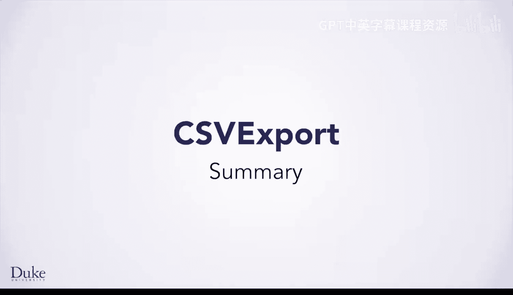
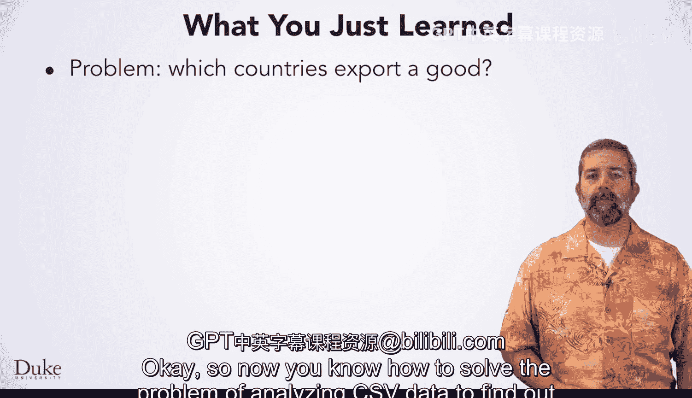
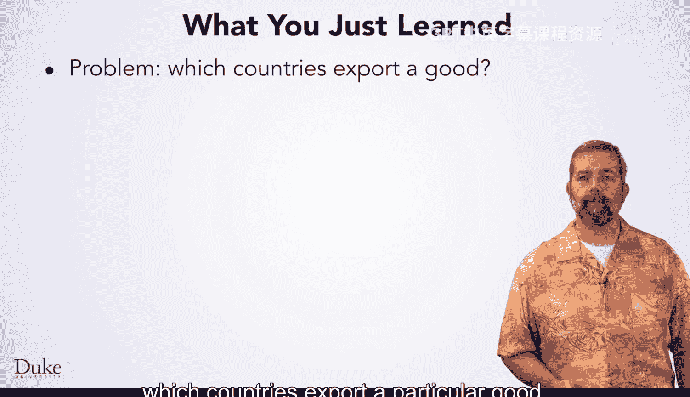
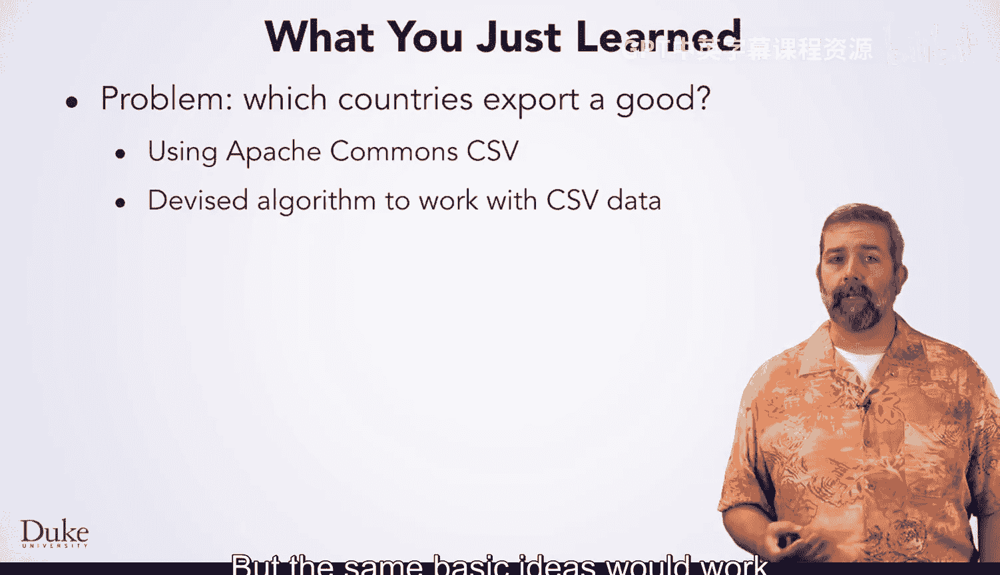
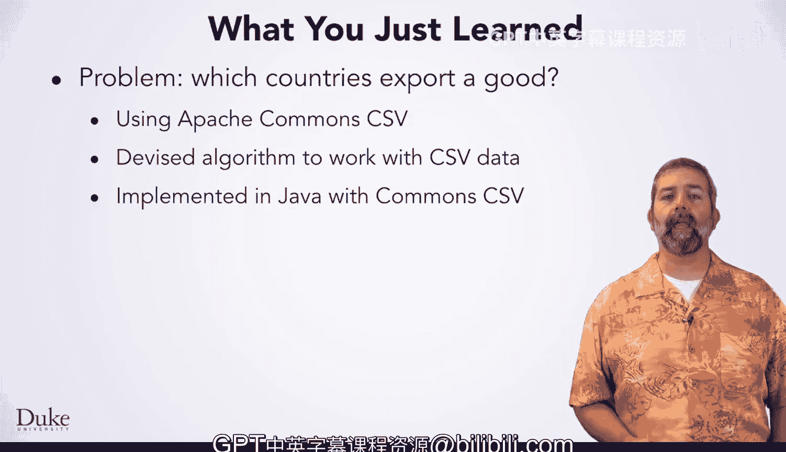

# Java编程和软件工程基础：2-5：CSV导出总结 📊

在本节课中，我们将学习如何使用Apache Commons CSV库来解析和分析CSV文件，并实现一个算法来筛选出符合特定条件的数据行。

---



## 概述

现在，你已经了解了如何解决分析CSV数据以找出出口特定商品的国家的问题。

在本节中，我们将学习使用Apache Commons CSV包的具体操作。这是一个用于处理CSV数据的库，我们将使用其CSV解析器和CSV记录类来操作CSV文件中的数据。

---



## 使用Apache Commons CSV库

上一节我们介绍了分析CSV数据的目标，本节中我们来看看实现这一目标所需的工具。你将学习Apache Commons CSV库的机制。



这个库的核心是`CSVParser`和`CSVRecord`类。`CSVParser`用于读取和解析CSV文件，而`CSVRecord`则代表文件中的一行数据。

以下是使用该库解析CSV文件的基本步骤：

1.  **添加依赖**：首先，需要在项目中引入Apache Commons CSV库。
2.  **创建解析器**：使用`CSVFormat`类定义CSV文件的格式（例如，是否包含表头），然后创建`CSVParser`对象。
3.  **遍历记录**：遍历`CSVParser`对象，获取每一行的`CSVRecord`。
4.  **访问数据**：通过列名或索引从`CSVRecord`中获取具体的单元格数据。

核心代码片段如下：
```java
Reader in = new FileReader("path/to/your/file.csv");
Iterable<CSVRecord> records = CSVFormat.DEFAULT.withFirstRecordAsHeader().parse(in);
for (CSVRecord record : records) {
    String country = record.get("Country");
    String exports = record.get("Exports");
    // ... 处理数据
}
```

---

## 设计筛选算法

掌握了操作CSV数据的基本方法后，我们需要设计一个算法来找出符合条件的数据行。

你设计了一个算法来分析CSV文件，找出所有满足特定条件的行。在本例中，条件是“出口某种特定商品”，但相同的基本思路也适用于更广泛的其他条件。

算法的核心逻辑是遍历CSV文件的每一行记录，并检查目标列（例如“Exports”列）的值是否包含我们正在查找的商品。如果包含，则将该行信息（如国家名称）记录下来或输出。

以下是实现该筛选逻辑的关键步骤列表：

1.  **定义查询条件**：明确要搜索的商品名称。
2.  **遍历数据行**：使用循环遍历解析后的所有`CSVRecord`。
3.  **检查条件**：在循环体内，从当前记录中获取“Exports”列的值。
4.  **执行匹配**：使用字符串方法（如`.contains()`）判断该值是否包含目标商品。
5.  **收集结果**：如果匹配成功，则记录或打印该行相关的信息（例如国家名称）。

---



## 在Java中实现

当然，你在Java中实现了它，运用了新学到的CSV库知识。

将库的使用方法和算法逻辑结合起来，就构成了完整的解决方案。你需要编写一个Java程序，该程序能够读取指定的CSV文件，根据用户输入或预设的商品名称进行筛选，并最终输出所有符合条件的国家列表。

---



## 总结

本节课中，我们一起学习了如何使用Apache Commons CSV库来解析和处理CSV文件。我们探讨了`CSVParser`和`CSVRecord`类的用法，并设计并实现了一个用于从CSV数据中筛选出符合特定条件（如出口某商品）的数据行的算法。通过这个实践，你掌握了处理结构化文本数据的一项基本而重要的技能。