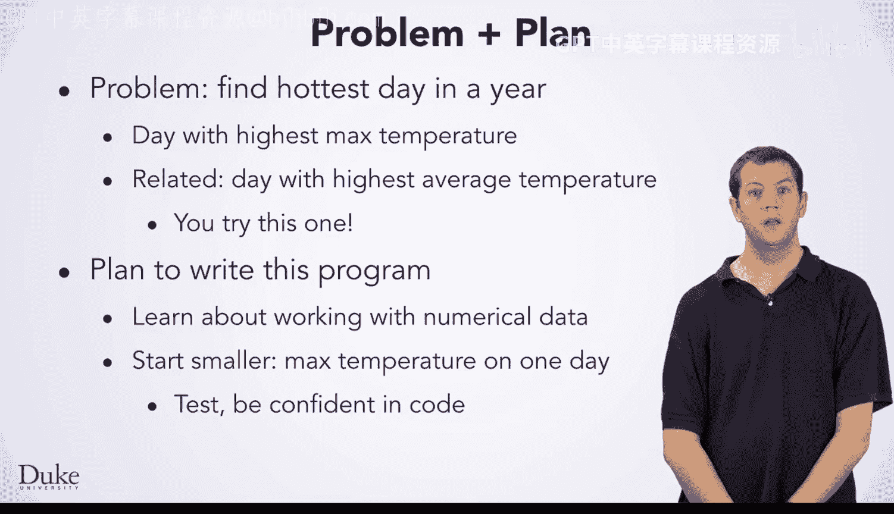

# 049：逗号分隔值


欢迎回来。现在你已经对处理CSV文件有了一些了解，是时候学习如何分析这些文件中的数值数据了。

例如，这里我们有一个关于2014年1月1日罗利-达勒姆机场天气的CSV数据文件。我们拥有连续几年的每日数据，每天一个CSV文件。每一行包含一个小时的天气信息，并且有多个列，例如华氏温度、露点、湿度等。如果你在研究天气模式，你可能想要分析这些数据并提出各种问题。当然，你将学到的技术也适用于其他类型的数据，因此你可能会发现它们在许多其他领域也很有用。😊

你可能会问的一个问题是：最高温度是多少？也就是说，什么时候最热？

如果你只是针对某一天的数据做这件事，你可以直接查看（只有24条记录）或在电子表格中使用最大值函数。然而，如果你想在许多天（例如一整年）中找到最高温度，你该怎么办？你肯定不想手动查看所有数据，并且将365个文件导入电子表格会非常繁琐。对于这类任务，你会希望编写一个程序来为你完成工作。在本课中，你将解决的正是这个问题：找到一年中最热的一天。

为了本示例的目的，我们将定义一年中最热的一天是最高温度最高的那一天。一个相关但略有不同的问题是找到平均温度最高的一天。我们不会详细讲解那个问题，但你在本课之后肯定可以完成它。

编写此程序的计划是：首先学习处理数值数据。CSV解析器会将数据读取为字符串，这些字符串必须转换为数字。一旦你知道如何将字符串转换为数字，我们将从一个较小的问题开始：仅找出一天中的最高温度。我们将与你一起逐步讲解算法和代码开发。

在继续之前，你需要测试你的代码以确保其正确性。一旦你对找出一天中最高温度的代码有信心，你将希望在此基础上进行扩展，找出许多天中的最高温度。



这将让你找到一年中的最高温度。那么，让我们开始吧。

## 概述

在本节课中，我们将要学习如何从CSV文件中提取和分析数值数据，特别是找出一年中的最高温度。我们将从字符串到数字的转换开始，逐步构建一个能够处理单日和多日数据的程序。

## 处理数值数据

上一节我们介绍了CSV文件的基本结构。本节中我们来看看如何处理其中的数值数据。CSV解析器默认将所有数据读取为字符串。为了进行数值比较（如找最大值），我们需要将这些字符串转换为数字类型，例如整数或浮点数。

在Java中，可以使用以下方法进行转换：

```java
String temperatureStr = "75";
int temperature = Integer.parseInt(temperatureStr);
```

或者对于小数：

```java
String humidityStr = "45.6";
double humidity = Double.parseDouble(humidityStr);
```

## 找出单日最高温度

现在我们已经知道如何转换数据，让我们专注于解决一个更小的问题：找出单日CSV文件中的最高温度。这将是构建年度解决方案的基础。

以下是解决此问题的基本算法步骤：

1.  初始化一个变量来存储当前找到的最高温度（例如，`maxTemp`），可以将其设置为一个非常低的值。
2.  打开并逐行读取CSV文件。
3.  对于每一行，提取温度列（假设我们知道它的索引）。
4.  将温度字符串转换为数字。
5.  将转换后的温度与 `maxTemp` 比较。如果它更高，则更新 `maxTemp`。
6.  处理完所有行后，`maxTemp` 中存储的就是当日的最高温度。

## 扩展到多日数据

一旦我们能够可靠地找出单日的最高温度，下一步就是将其扩展到处理一整年的数据。这意味着我们需要遍历代表每一天的多个CSV文件。

以下是实现思路：

1.  初始化一个变量来存储年度最高温度（`yearMaxTemp`）以及对应的日期。
2.  遍历包含每日CSV文件的目录。
3.  对每个文件（代表一天），调用我们之前编写的“找出单日最高温度”的函数。
4.  将得到的单日最高温度与 `yearMaxTemp` 比较。如果更高，则更新 `yearMaxTemp` 和对应的日期。
5.  处理完所有文件后，我们就得到了年度最高温度及其发生的日期。


## 总结

本节课中我们一起学习了如何分析CSV文件中的数值数据。我们从将字符串转换为数字的基础开始，然后实现了找出单日最高温度的算法。最后，我们探讨了如何通过遍历多个文件将这个解决方案扩展到找出年度最高温度。这些技能是数据分析的基础，可以应用于天气数据之外的许多领域。