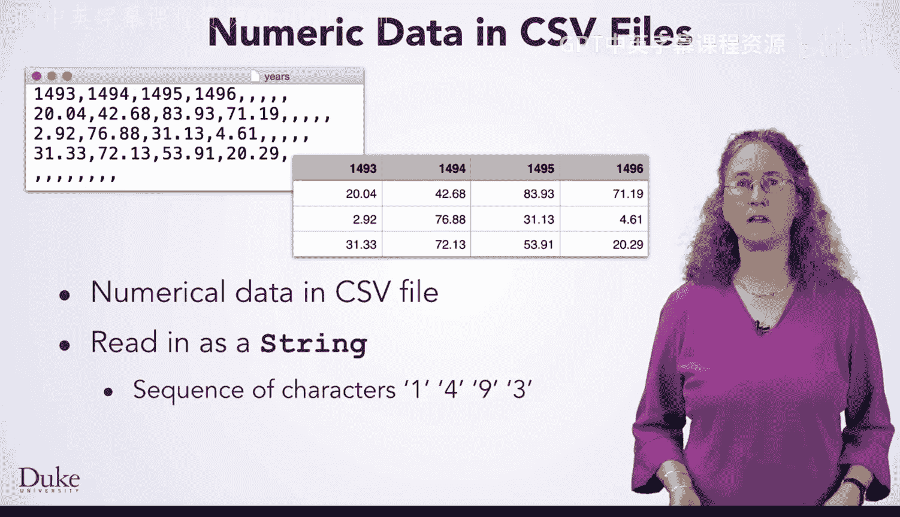
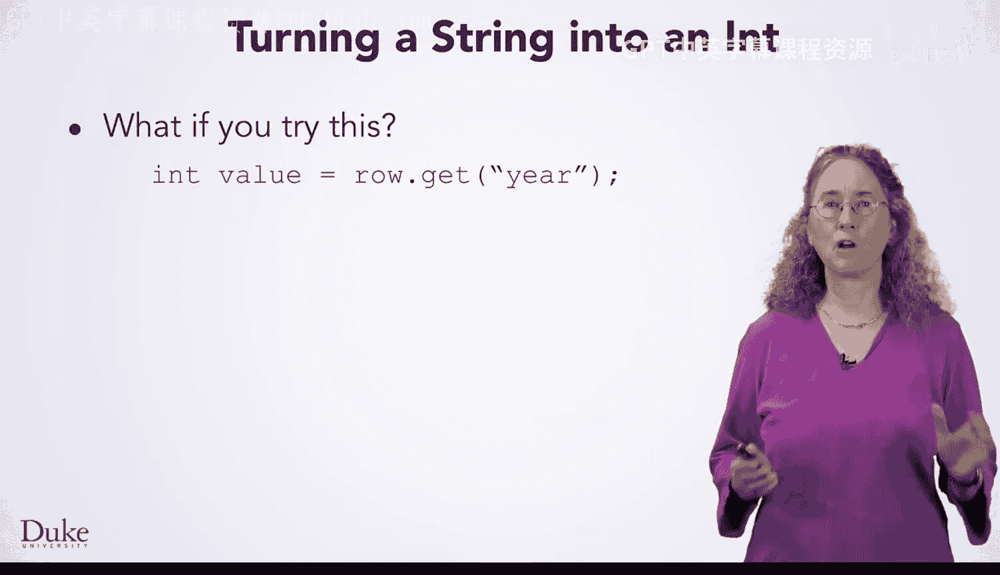
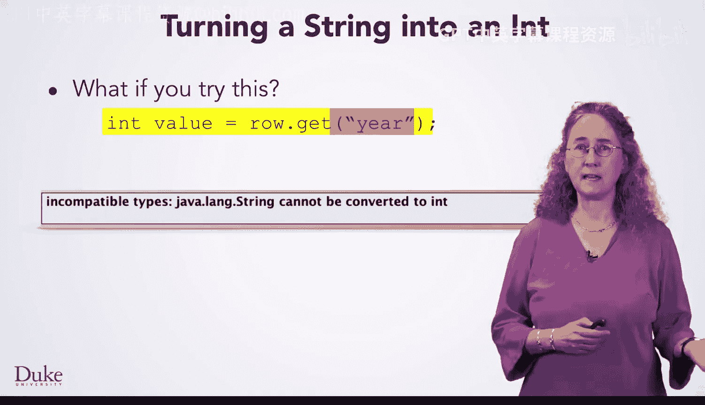
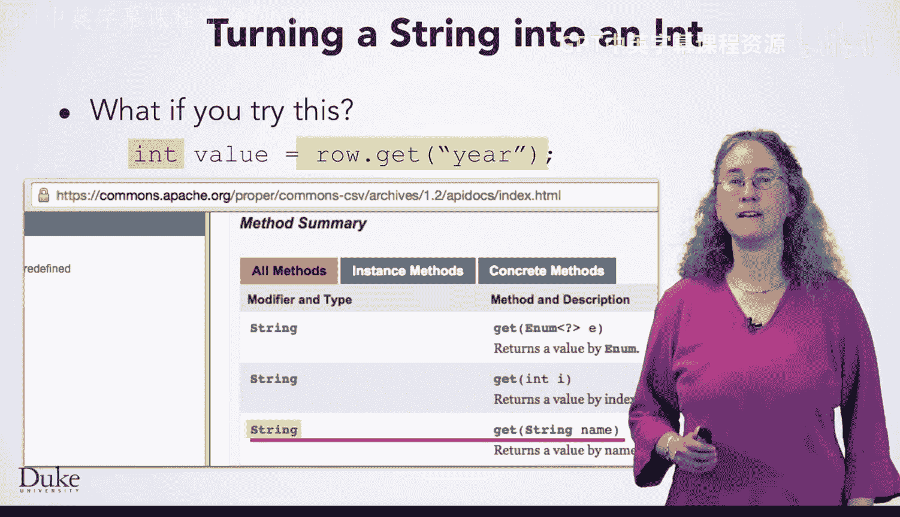
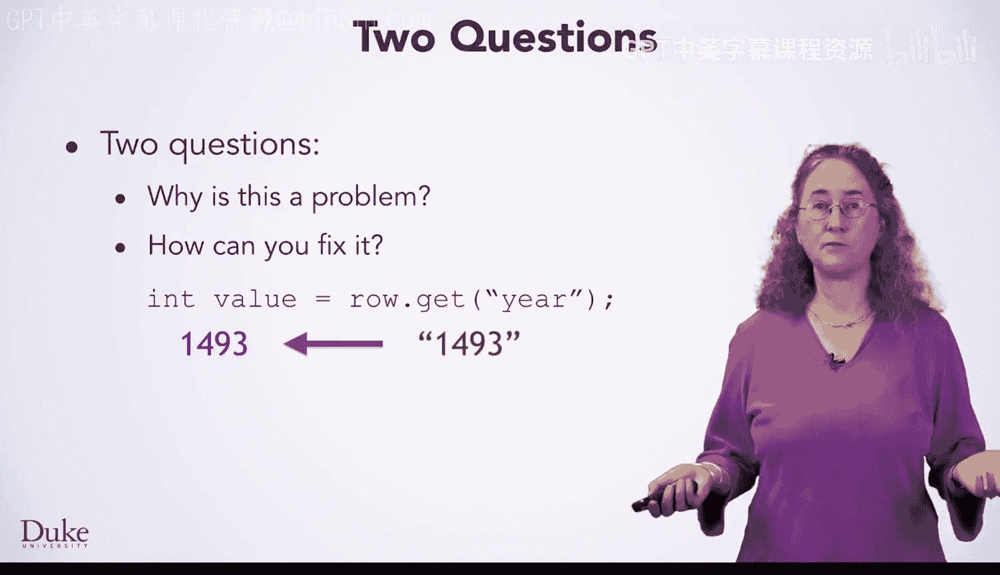
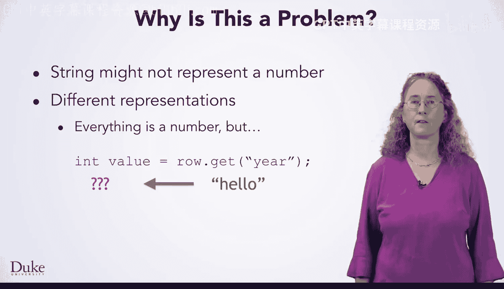
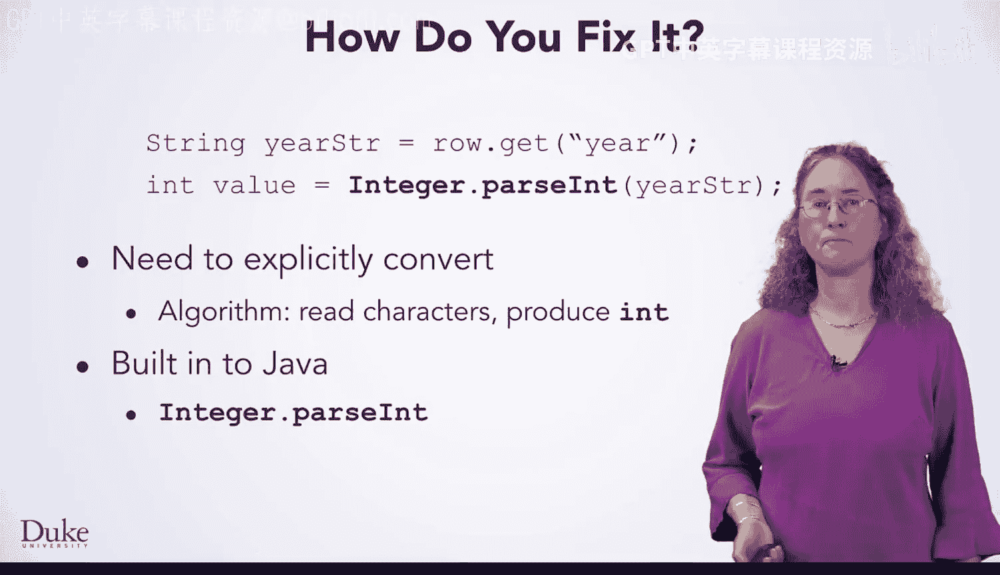
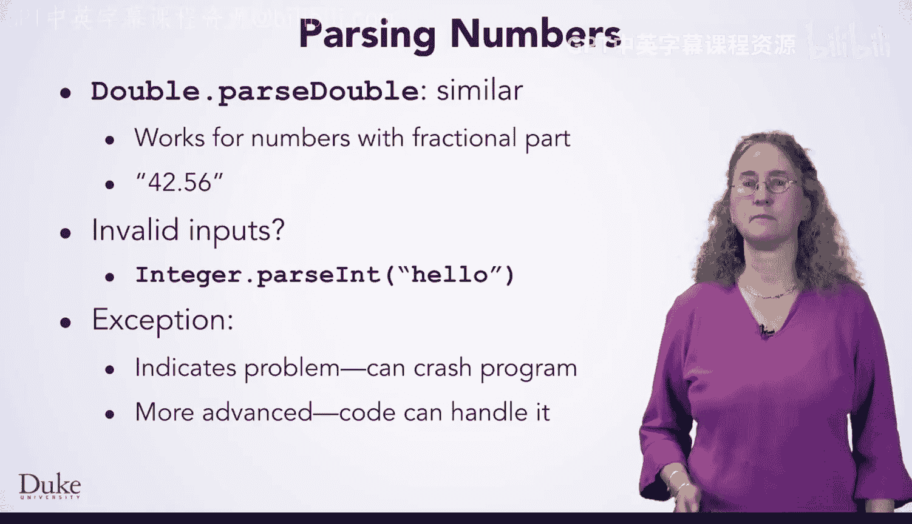
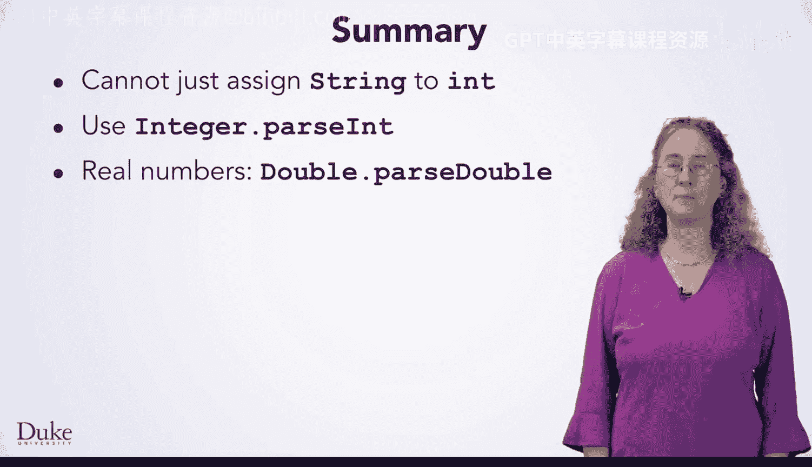

# Java编程和软件工程基础：2-5：字符串转数字 📝


在本节课中，我们将要学习如何处理CSV文件中的数值数据。具体来说，我们将探讨为什么从CSV读取的数值数据是字符串类型，以及如何将其转换为整数或浮点数以便进行数值计算。





## 为什么需要转换？ 🤔



上一节我们介绍了CSV文件的基本结构。在处理CSV文件时，你可能会遇到各种数值数据，例如年份。然而，用于读取CSV文件的库会将所有数据作为字符串读入。这意味着像“1493”这样的数据会被视为字符序列，而不是整数1493。如果你希望对数据进行数值操作，例如相加或寻找最大值，就需要将数据作为`int`或`double`类型来处理。

## 类型不兼容错误 ⚠️



如果你尝试编写类似 `int value = rh.get("year");` 的代码，在编译时会遇到错误。错误信息会指出类型不兼容：你正尝试将一个字符串赋值给一个整型变量。

查看CSV阅读器的文档，你会发现`get`方法的返回类型是`String`。因此，表达式`rh.get("year")`的类型是`String`，而变量`value`被声明为`int`类型。Java无法自动将字符串转换为整数，这引出了两个问题：为什么这是一个问题，以及如何解决它。



## 为什么不能自动转换？ 🔍

Java不能自动将字符串转换为整数，原因有几个。首先，字符串可能不包含数字字符。例如，如果CSV阅读器读取到字符串“hello”，Java无法将其有意义地转换为数字。其次，字符串“1493”和数字1493在计算机内部的表示方式完全不同。类型描述了数据的表示和解释方式，因此在这两种表示之间转换需要执行特定的算法。

## 如何转换字符串到数字？ 🛠️



为了解决这个问题，我们需要显式地调用代码来执行转换算法。Java已经内置了这样的功能。以下是转换字符串到数字的方法：

*   **转换为整数**：使用 `Integer.parseInt(String s)` 方法。你传入想要转换的字符串，它会返回对应的整数值。
    ```java
    int number = Integer.parseInt("1493");
    ```



*   **转换为浮点数**：使用 `Double.parseDouble(String s)` 方法。它可以处理带有小数部分的字符串。
    ```java
    double number = Double.parseDouble("42.56");
    ```

## 处理无效输入 🚨

使用这些方法时需要注意，如果传入的字符串无法表示一个有效的数字（例如“hello”），方法会抛出一个异常（`Exception`）。异常表明发生了错误，通常会导致程序崩溃。虽然可以通过更高级的技术来处理异常，防止程序崩溃，但本课程暂不深入讨论。



## 总结 📚



本节课中我们一起学习了如何处理CSV中的数值数据。你现在知道了不能直接将字符串赋值给整型变量。如果需要将字符串转换为整数，应该使用 `Integer.parseInt()` 方法；对于实数，则使用 `Double.parseDouble()` 方法。掌握这些知识后，你就可以自如地处理包含数字的CSV数据了。