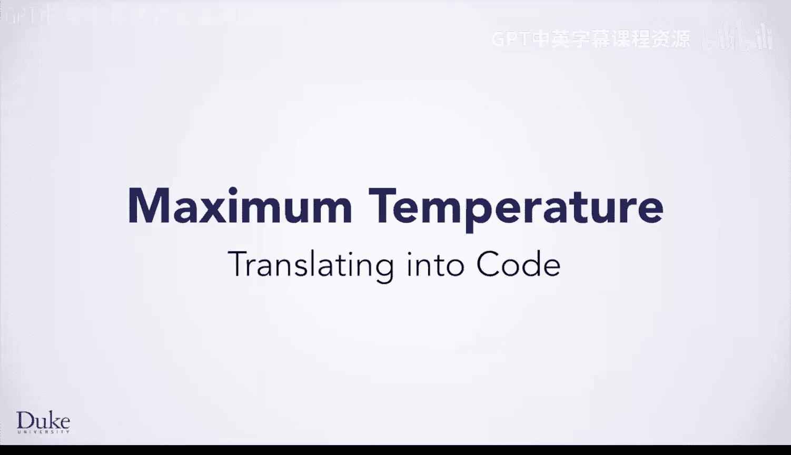
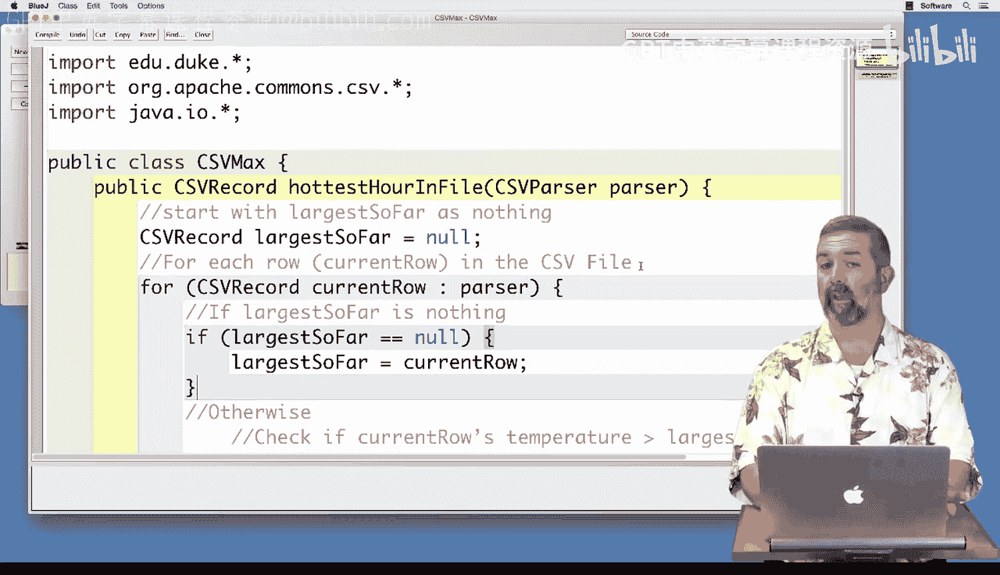
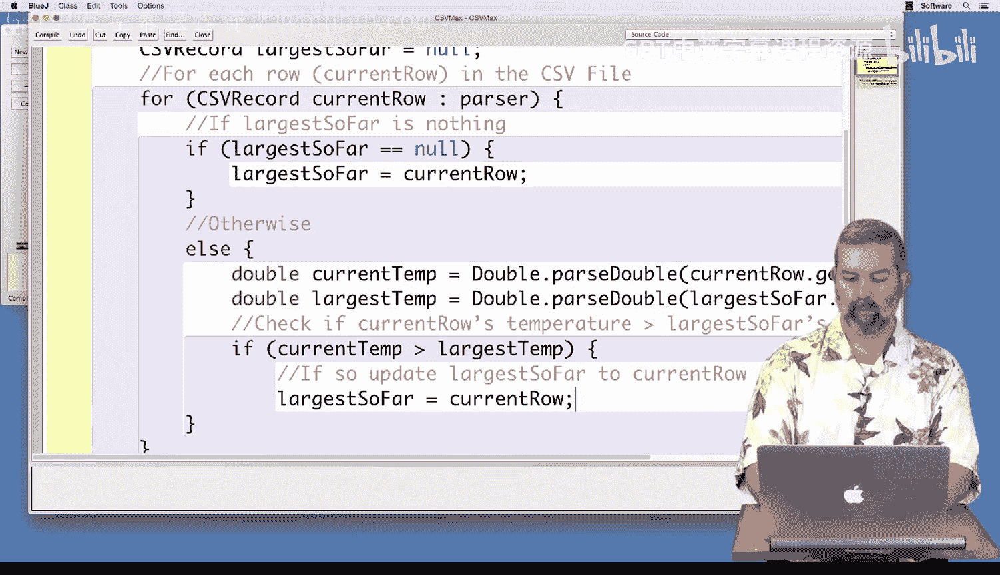
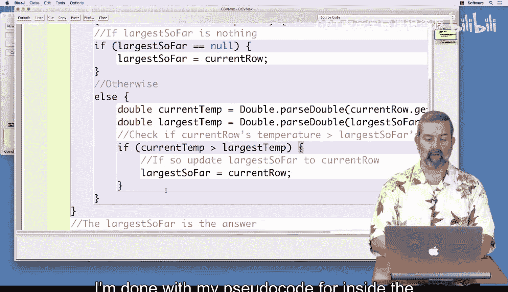
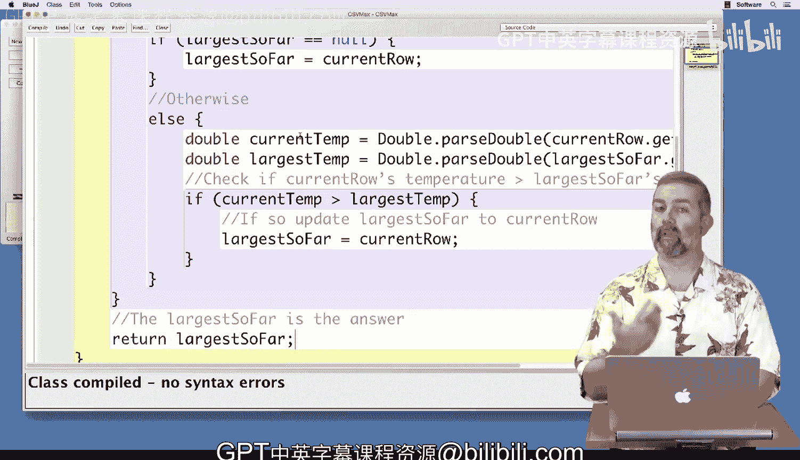

# 053：最高温度算法代码实现 🧑‍💻



在本节课中，我们将把上一节设计的“寻找最高温度”算法转化为实际的Java代码。我们将逐步构建一个方法，该方法能解析CSV文件，并找出温度最高的那条记录。

---

上一节我们介绍了寻找最高温度的逻辑算法，本节中我们来看看如何用Java代码来实现它。

我已经为大家设置好了类的基本结构，包括常用的导入语句、类名以及我们将要编写的方法 `hottestHourInFile`。我们将从上一视频结束时开发的伪代码开始编写。

首先，伪代码指出“将‘目前最大’初始化为空”。在Java中，“空”用 `null` 表示。

```java
CSVRecord largestSoFar = null;
```
因此，我将 `largestSoFar` 的初始值设为 `null`。它是一个 `CSVRecord` 类型的变量，这也正是我们计划最终要返回的结果。

接下来，伪代码说“对于CSV文件中的每一行”。这又是我们本课程中一直使用的熟悉的迭代模式。

```java
for (CSVRecord currentRow : parser) {
    // 处理每一行的逻辑将放在这里
}
```
我们将使用作为参数传入的 `parser` 对象作为迭代遍历的CSV数据源。我先在这里把循环结构搭建好，以便明确在遍历每条记录时需要做什么。

---

以下是循环内部需要处理的核心逻辑。

首先，检查“目前最大”是否为空。这是我们第一次遇到这种情况。



```java
if (largestSoFar == null) {
    largestSoFar = currentRow;
}
```
我们检查 `largestSoFar` 是否为 `null`。如果是，我们就假设当前记录（`currentRow`）的温度是最高的，因此将 `largestSoFar` 赋值为 `currentRow`。这个 `if` 语句的处理就完成了。

---

否则（在Java中即 `else` ），我们需要直接比较两个温度值。

这意味着我需要从记录中提取出温度值。我知道这些值是数字，但我需要决定它们应该是整数（`int`）还是双精度浮点数（`double`）。没错，应该是 `double`，因为在我们之前的例子中有一个温度是30.9，这是一个实数，更适合用 `double` 表示。

```java
else {
    double currentTemp = Double.parseDouble(currentRow.get("TemperatureF"));
    double largestTemp = Double.parseDouble(largestSoFar.get("TemperatureF"));
    // 比较逻辑将放在这里
}
```
我通过 `currentRow.get("TemperatureF")` 获取当前行的温度字符串，并使用 `Double.parseDouble()` 将其转换为 `double` 类型的 `currentTemp`。对于 `largestSoFar` 也进行同样的操作，得到 `largestTemp`。

现在，我有了两个 `double` 值，可以直接进行比较。

```java
    if (currentTemp > largestTemp) {
        largestSoFar = currentRow;
    }
}
```
我检查 `currentTemp` 是否大于 `largestTemp`。如果是，就用 `currentRow` 替换 `largestSoFar` 中保存的记录。

---

这样，我们就处理了循环内伪代码中提到的两种情况。接下来，移动到循环外的下一行伪代码：“‘目前最大’即为答案”。



```java
return largestSoFar;
```
因此，我返回 `largestSoFar`。

现在，我将编译我的代码，以确保没有犯任何低级语法错误。编译器提示没有语法错误，这意味着代码可以准备进行测试了。



---



本节课中我们一起学习了如何将“寻找最高温度”的算法伪代码逐步翻译成可运行的Java代码。我们实现了初始化变量、遍历CSV记录、处理首次比较和后续直接比较的逻辑，并最终返回结果。代码已经编译通过，为接下来的测试做好了准备。