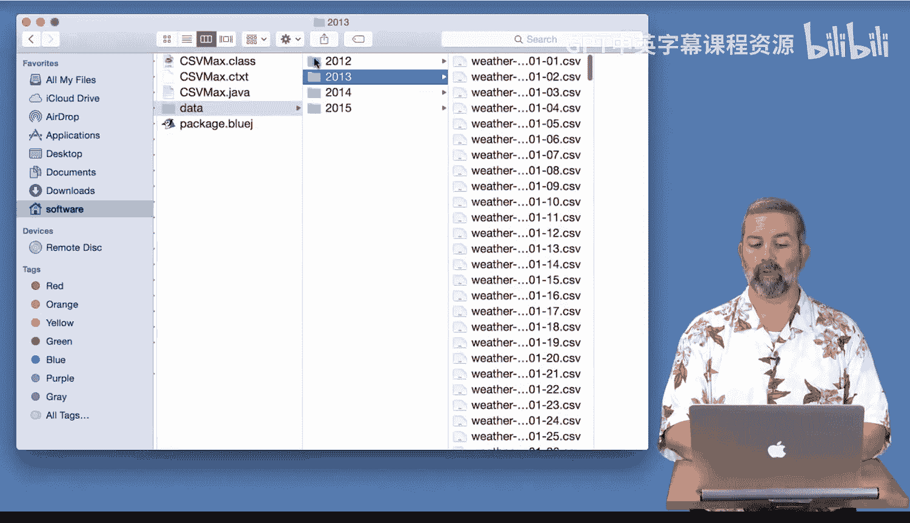
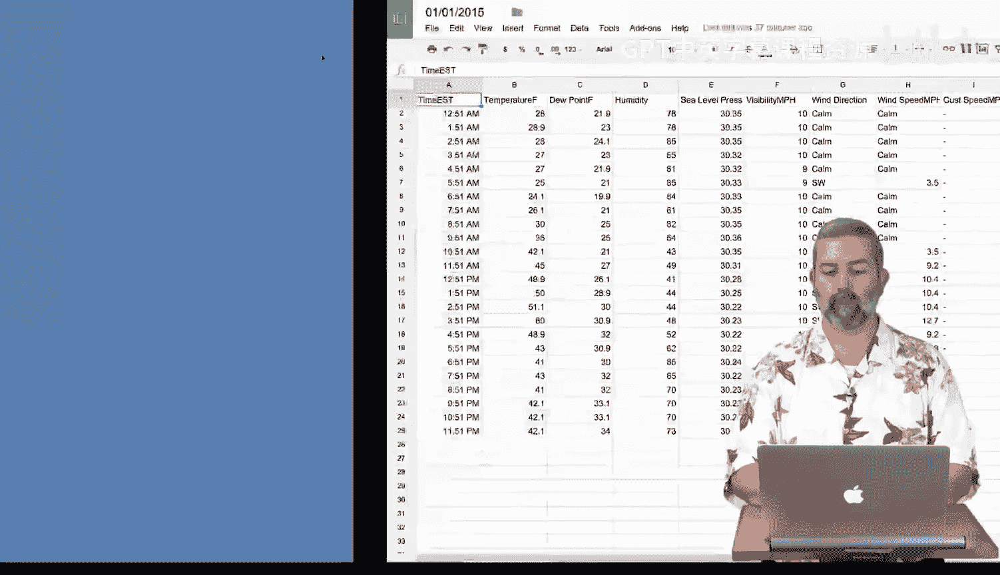
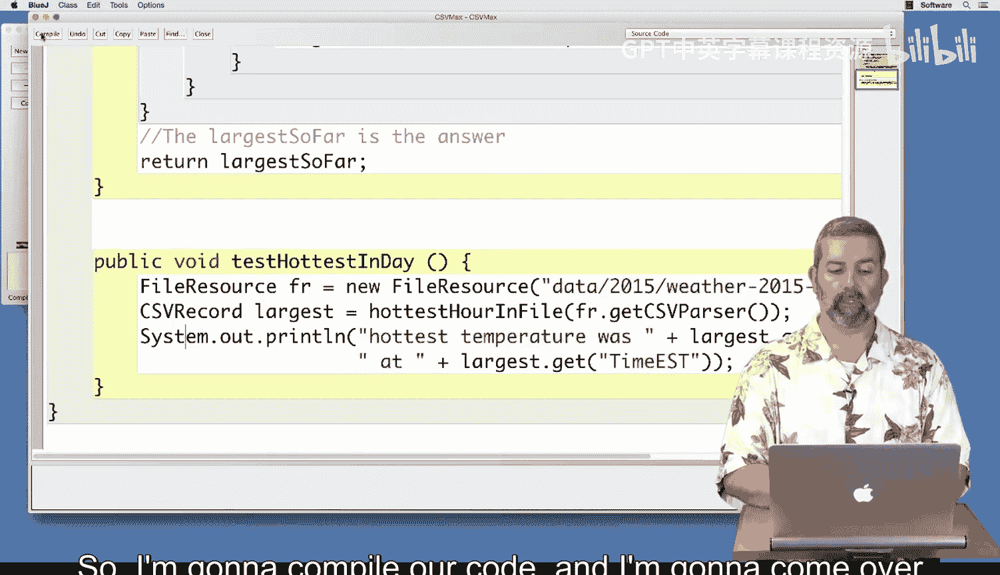
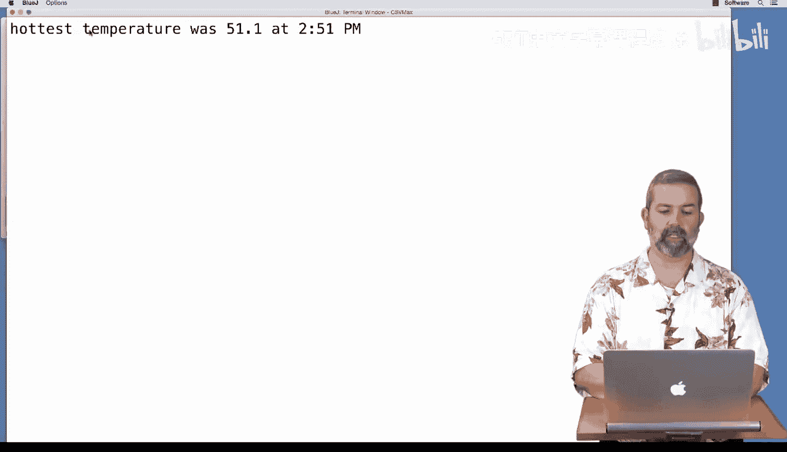
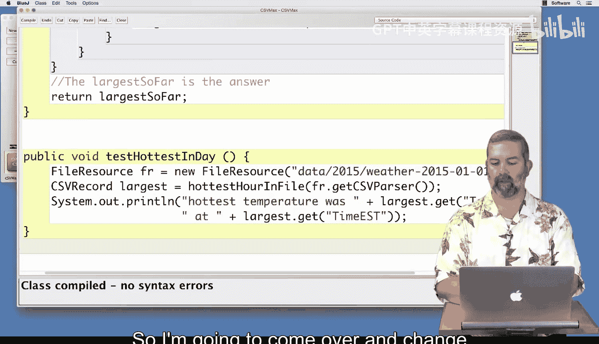
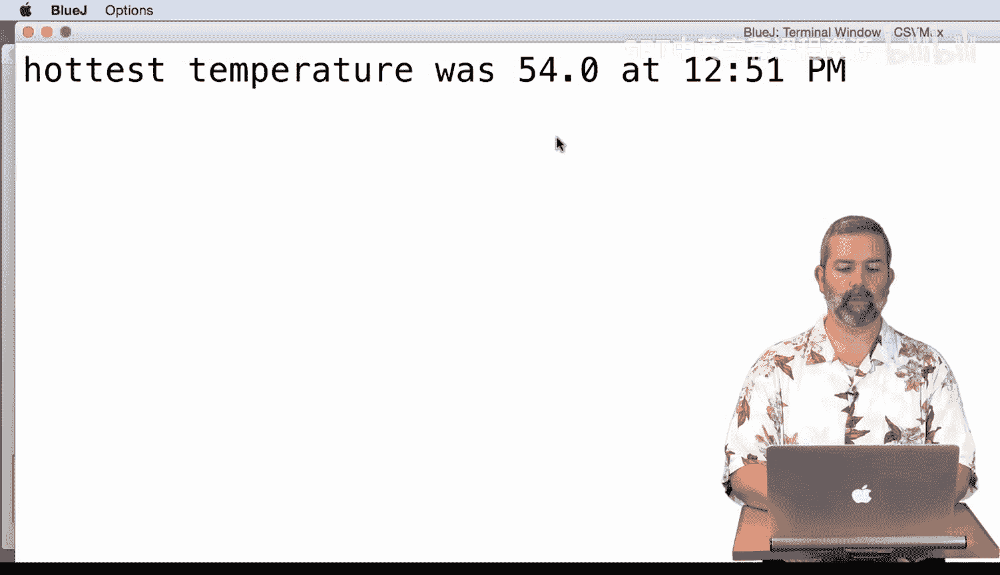
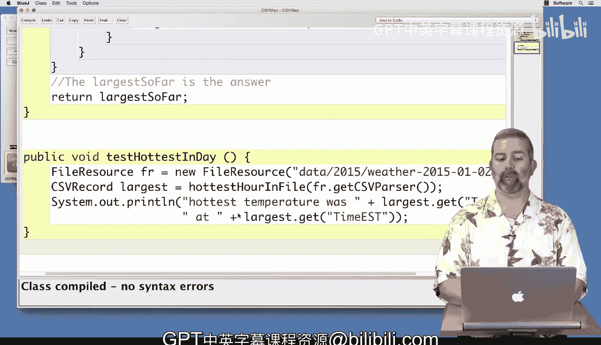

# 054：代码测试


在本节课中，我们将学习如何测试用于查找CSV文件中最高温度的Java代码。我们将查看数据在文件系统中的组织方式，并运行测试来验证我们的程序是否正确工作。

## 数据文件结构


上一节我们介绍了如何编写查找最高温度的方法。本节中，我们来看看数据文件是如何组织的，以便更好地理解我们的代码在处理什么。



数据被组织在一个文件夹中。该文件夹按年份划分，每个年份文件夹内包含该年每一天的天气数据文件。

以下是数据组织的示例：
```
data/
├── 2014/
│   ├── weather-2014-01-01.csv
│   ├── weather-2014-01-02.csv
│   └── ...
├── 2015/
│   ├── weather-2015-01-01.csv
│   ├── weather-2015-01-02.csv
│   └── ...
└── ...
```
每年有365或366个文件，具体取决于是否为闰年。

## 单个数据文件示例



了解了整体结构后，我们来看看单个文件的内容。这有助于我们理解代码解析的数据格式。

这里以2015年1月1日的文件为例。CSV文件顶部是列信息，下方是每列对应的数据行。这些文件可以方便地在电子表格中打开和查看，以便直观地理解数据结构。

## 测试方法 `testHottestInDay`

为了确保我们的代码正确，我们将使用一个预先编写好的测试方法。这个方法封装了测试单个文件最高温度查找功能的流程。

`CSVMax` 类中已经包含了一个名为 `testHottestInDay` 的方法。以下是该方法的核心步骤：



1.  第一行代码创建一个指向2015年1月1日数据文件的 `FileResource` 对象。
    ```java
    FileResource fr = new FileResource("data/2015/weather-2015-01-01.csv");
    ```
2.  第二行代码调用我们刚刚编写的 `hottestHourInFile` 方法，并传入为该数据集创建的解析器。
    ```java
    CSVRecord largest = hottestHourInFile(fr.getCSVParser());
    ```
3.  该方法返回温度最高的那条 `CSVRecord`。
4.  最后，我们打印出最高温度及其出现的时间，以验证结果。
    ```java
    System.out.println("hottest temperature was " + largest.get("TemperatureF") + " at " + largest.get("TimeEST"));
    ```

运行这个测试可以让我们判断程序是否正确。

## 执行测试与验证

现在，让我们实际编译并运行代码，看看测试结果是否与文件中的数据一致。



首先编译代码。然后在BlueJ环境中创建一个新的 `CSVMax` 对象，并调用 `testHottestInDay` 方法。



测试结果显示，2015年1月1日的最高温度是 **51.1°F**，出现在 **下午2:51**。我们打开对应的数据文件查看温度列，发现温度值在20多度到50多度之间变化，其中确实有一个 **51.1** 的数值，证实了代码结果的正确性。

## 测试第二个文件



为了进一步确保代码的健壮性，我们不应该只满足于一次测试。接下来，我们更换一个数据文件进行测试。

将测试方法中的文件路径从1月1日改为1月2日。重新编译代码，创建一个新的 `CSVMax` 对象，并再次运行 `testHottestInDay`。

这次，程序输出最高温度为 **54°F**，出现在 **下午12:51**。我们检查1月2日的数据文件，发现温度列中确实出现了多个54度的记录。我们的代码正确地返回了**第一个**出现54度的记录时间（12:51 PM），而不是最后一次出现的时间（3:51 PM）。

## 总结



本节课中我们一起学习了如何测试查找CSV文件最高温度的Java代码。我们首先了解了数据文件的组织结构和格式。然后，我们使用 `testHottestInDay` 方法对代码进行了测试，并分别在2015年1月1日和1月2日的数据文件上验证了结果的正确性。通过两次成功的测试，我们可以对代码的正确性有合理的信心。建议你尝试测试更多的文件，以进一步巩固理解并确保代码在各种情况下的可靠性。