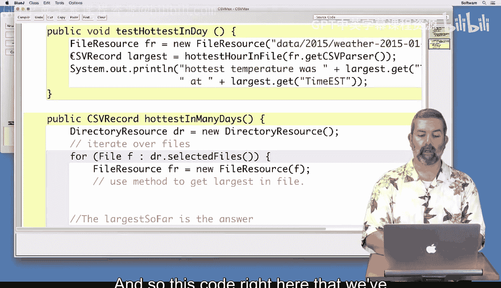
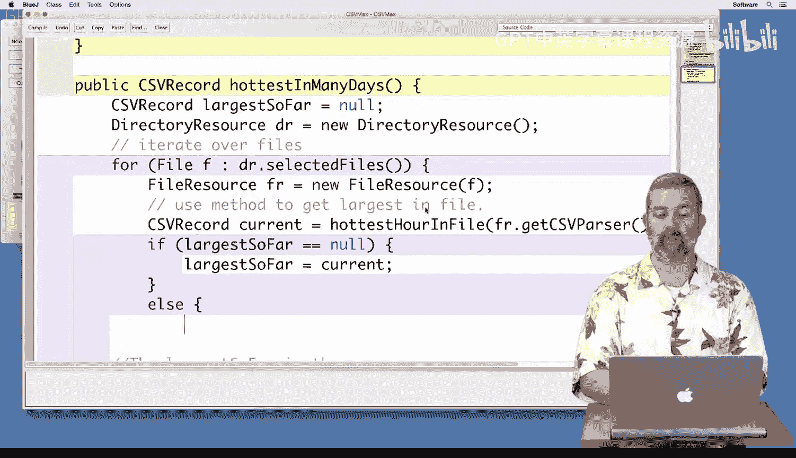
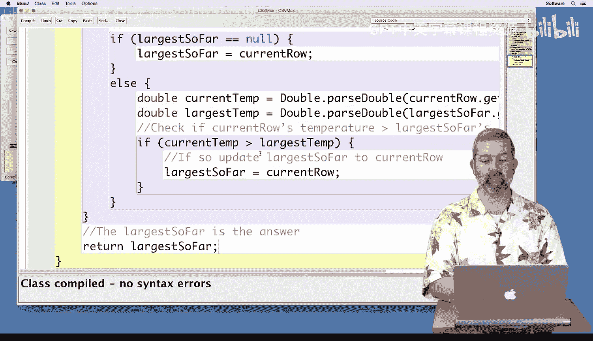

# 055：多数据集最高温度分析 🔥


在本节课中，我们将学习如何从多个数据文件中找出最高温度记录。我们将扩展之前单日最高温度查找的功能，使其能够处理一个日期范围内的多个CSV文件。

上一节我们介绍了如何从单个CSV文件中找出最高温度。本节中，我们将编写一个方法，循环处理多个文件，并找出所有文件中的最高温度记录。

## 概述



我们将创建一个名为 `hottestInManyDays` 的新方法。该方法使用 `DirectoryResource` 来允许用户一次性选择多个文件进行分析。核心思路是遍历每个选中的文件，调用之前编写的单文件最高温度查找方法，并在循环中比较和更新找到的最高温度记录。

## 方法实现步骤

以下是实现 `hottestInManyDays` 方法的具体步骤。

首先，我们创建方法并使用 `DirectoryResource` 选择文件。


```java
public CSVRecord hottestInManyDays() {
    DirectoryResource dr = new DirectoryResource();
    CSVRecord largestSoFar = null;
```




接下来，我们遍历选中的每一个文件。

```java
    for (File f : dr.selectedFiles()) {
        FileResource fr = new FileResource(f);
        CSVRecord currentRow = hottestHourInFile(fr.getCSVParser());
```


在循环内部，我们需要将当前文件中的最高温度与迄今为止找到的最高温度进行比较。以下是处理比较的逻辑。


1.  如果 `largestSoFar` 为 `null`（即这是第一个被处理的文件），则直接将当前记录赋值给它。
2.  否则，我们需要比较当前记录的温度与 `largestSoFar` 记录的温度。



```java
        if (largestSoFar == null) {
            largestSoFar = currentRow;
        } else {
            double currentTemp = Double.parseDouble(currentRow.get("TemperatureF"));
            double largestTemp = Double.parseDouble(largestSoFar.get("TemperatureF"));
            if (currentTemp > largestTemp) {
                largestSoFar = currentRow;
            }
        }
    }
    return largestSoFar;
}
```

## 代码测试

现在我们已经完成了方法的编写，接下来对其进行测试以确保其正确性。


我们首先创建一个测试方法，使用一个小的数据集（例如2015年的头两天）进行验证。我们知道这两天的最高温度分别是51.1和54，因此方法应该返回54以及对应的日期（1月2日）。

```java
public void testHottestInManyDays() {
    CSVRecord largest = hottestInManyDays();
    System.out.println("hottest temperature was " + largest.get("TemperatureF") +
                       " at " + largest.get("DateUTC"));
}
```


运行测试后，如果结果符合预期（输出54和1月2日），则证明代码在小数据集上工作正常。

在获得初步信心后，我们可以将其应用于更大的数据集，例如2014年全年的数据。运行程序后，它成功找出了该年的最高温度记录（例如98.1度，发生于7月8日）。


## 总结

本节课中我们一起学习了如何扩展程序功能以处理多个数据文件。我们实现了 `hottestInManyDays` 方法，它通过循环调用单文件处理函数并结合比较逻辑，最终找出多个文件中的全局最高温度记录。我们遵循了先在小规模数据上验证、再扩展到大规模数据的测试方法，确保了代码的可靠性。