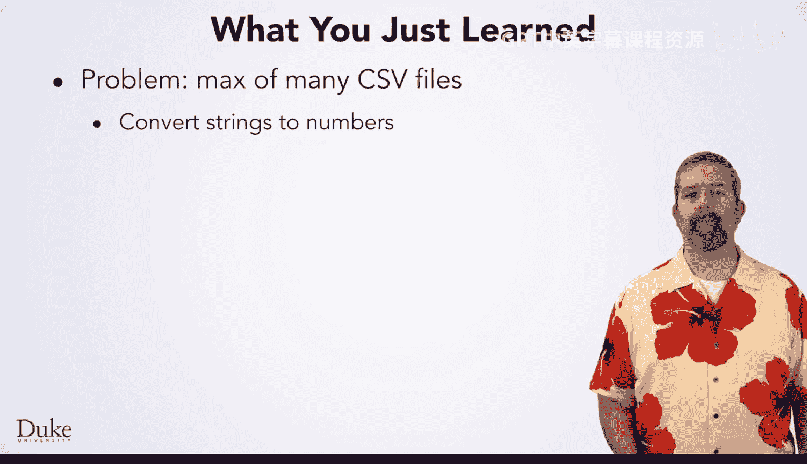
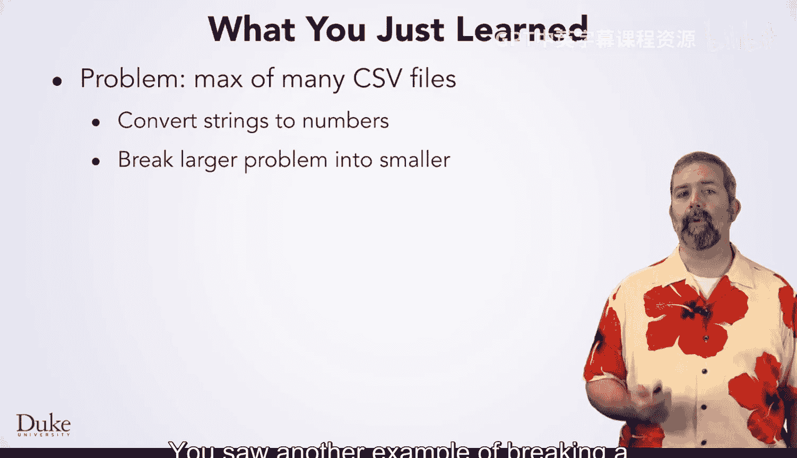
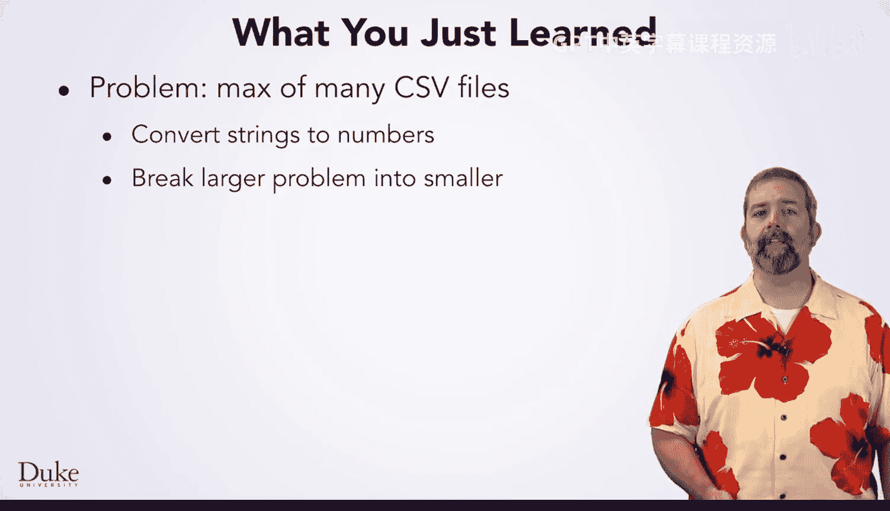
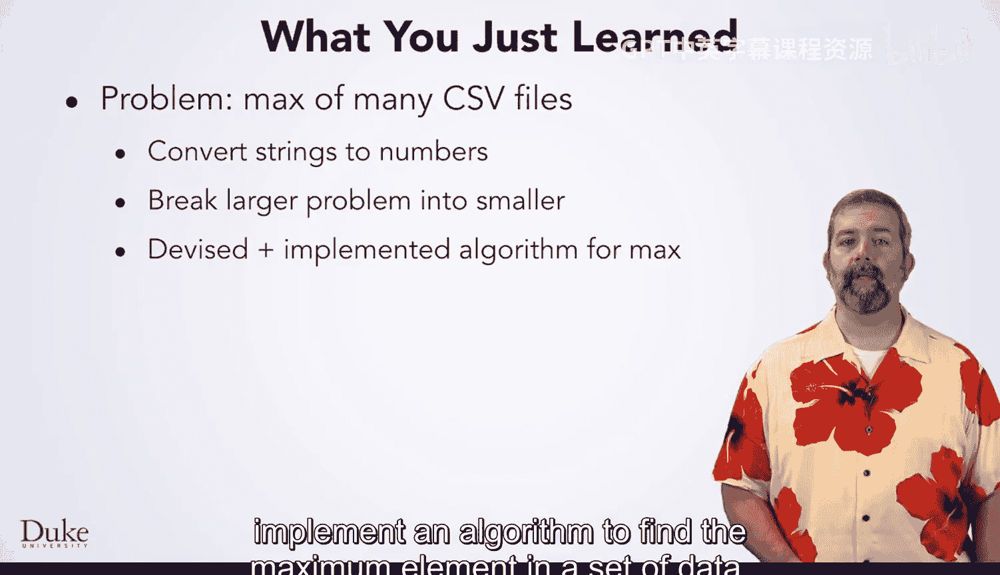
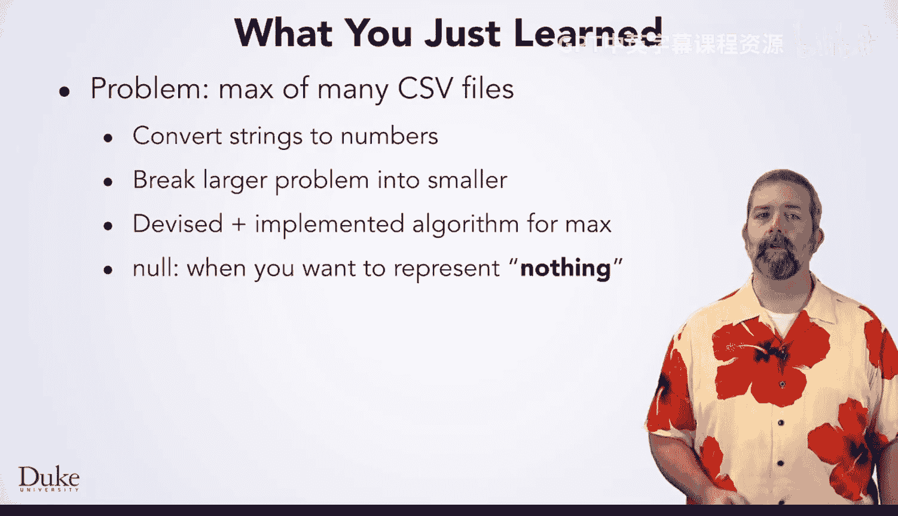
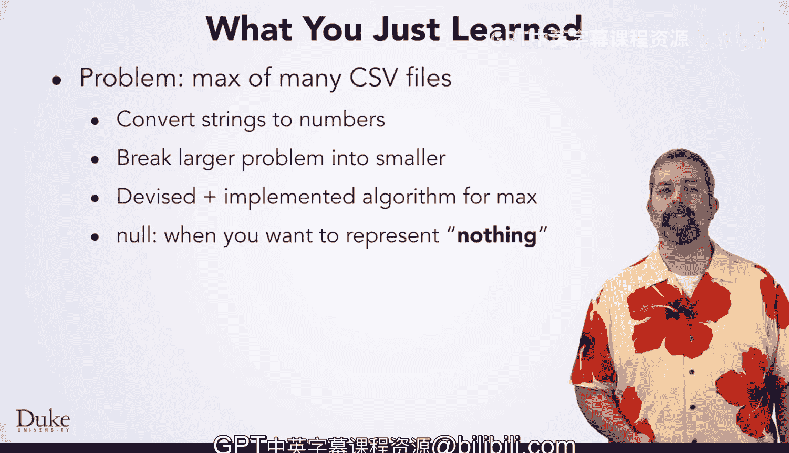

# Java编程和软件工程基础：2-5：CSV最大值总结 📊


在本节课中，我们将总结如何从多个CSV文件中找出最高温度值。我们将回顾涉及的核心概念，包括字符串到数字的转换、问题分解、算法设计以及Java中的`null`概念。


## 核心概念回顾

上一节我们介绍了如何从单个文件中找到最大值，本节中我们来看看如何将这些知识应用到多个文件中，并总结所学的关键技能。



### 字符串到数字的转换
在处理CSV文件时，数据通常以字符串形式读取。为了进行数值比较（如找最高温度），我们需要将这些字符串转换为数字。Java提供了两种主要方法：
*   使用 `Integer.parseInt()` 将字符串转换为整数。
*   使用 `Double.parseDouble()` 将字符串转换为双精度浮点数。

以下是转换的代码示例：
```java
String numberStr = “42”;
int intValue = Integer.parseInt(numberStr); // 转换为整数 42
double doubleValue = Double.parseDouble(numberStr); // 转换为浮点数 42.0
```



### 问题分解策略
解决复杂问题的有效策略是将其分解为更小、更易管理的子问题。在本例中，我们遵循了以下步骤：
1.  首先，解决**从单个CSV文件中找出最大值**的问题。
2.  然后，在此基础上构建解决方案，实现**从多个CSV文件中找出最大值**。



### 寻找最大值的算法
我们设计并实现了一个算法来在一组数据中寻找最大元素。该算法的核心思路是：
1.  初始化一个变量（如`maxSoFar`）来存储当前找到的最大值。
2.  遍历数据集中的每一个元素。
3.  将每个元素与`maxSoFar`进行比较。
4.  如果当前元素大于`maxSoFar`，则更新`maxSoFar`的值为当前元素。
5.  遍历完成后，`maxSoFar`中存储的就是最大值。



### 理解 `null` 概念
在Java中，`null`是一个特殊的值，用于表示“无”或“不存在此类对象”。在我们的程序中，当初始化一个可能暂无值的对象引用时，可能会使用`null`。例如，在开始读取文件前，用于存储最大温度值的变量可以初始化为`null`，表示尚未找到任何有效值。

## 总结





本节课中我们一起学习了从CSV文件中处理和分析数据的关键技能。我们掌握了如何将字符串转换为数字，实践了通过分解大问题来简化解决过程的策略，设计并实现了寻找数据最大值的算法，同时也理解了`null`在Java中代表“空”或“无”的含义。这些是进行数据处理和算法实现的基础。