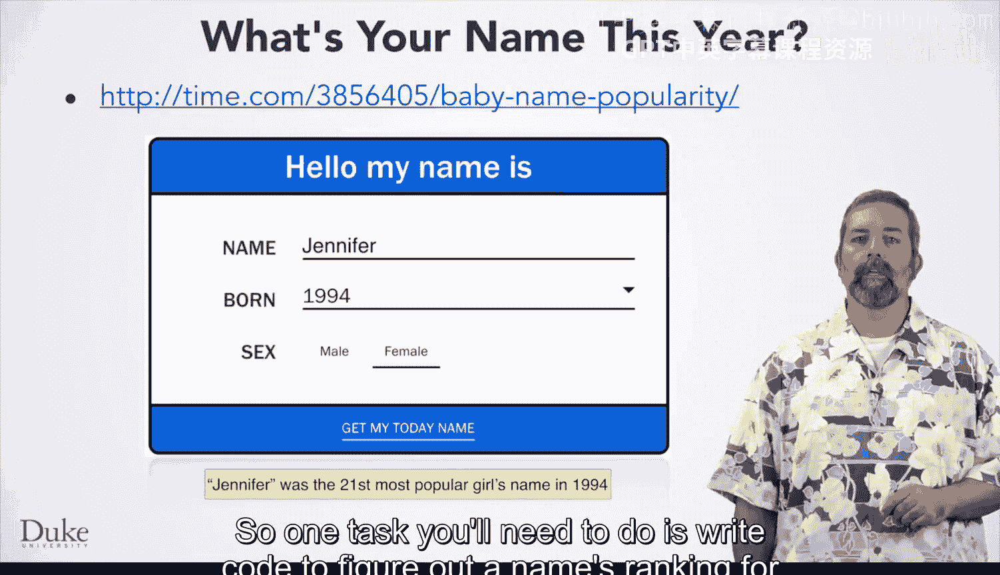
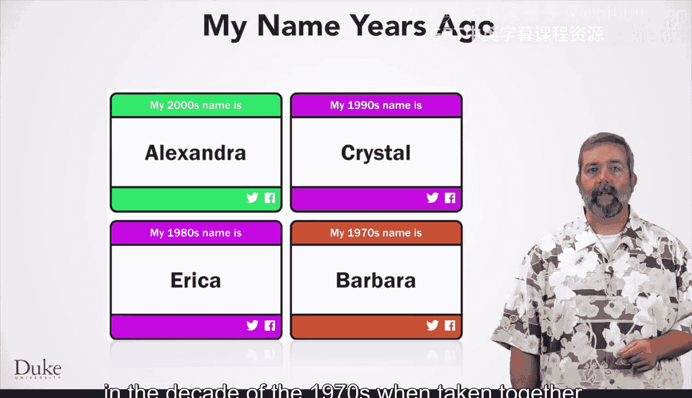
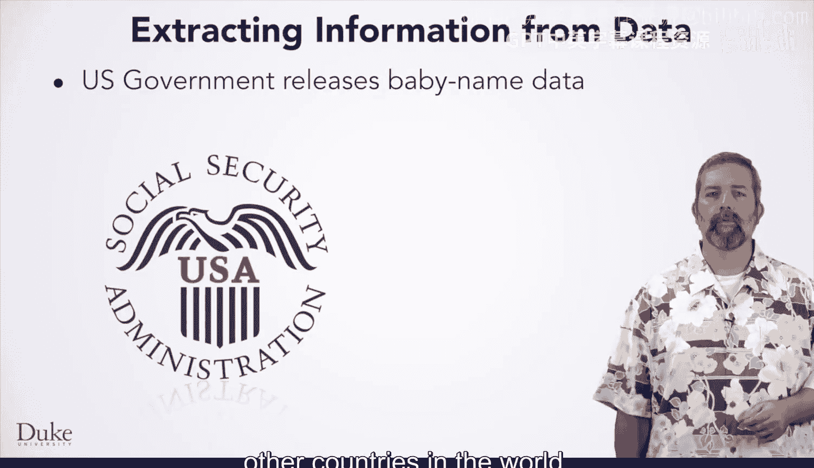
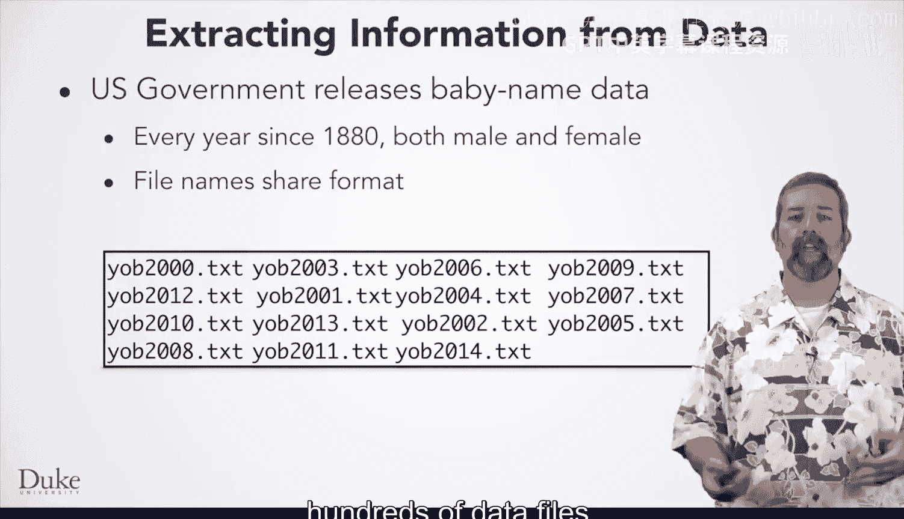
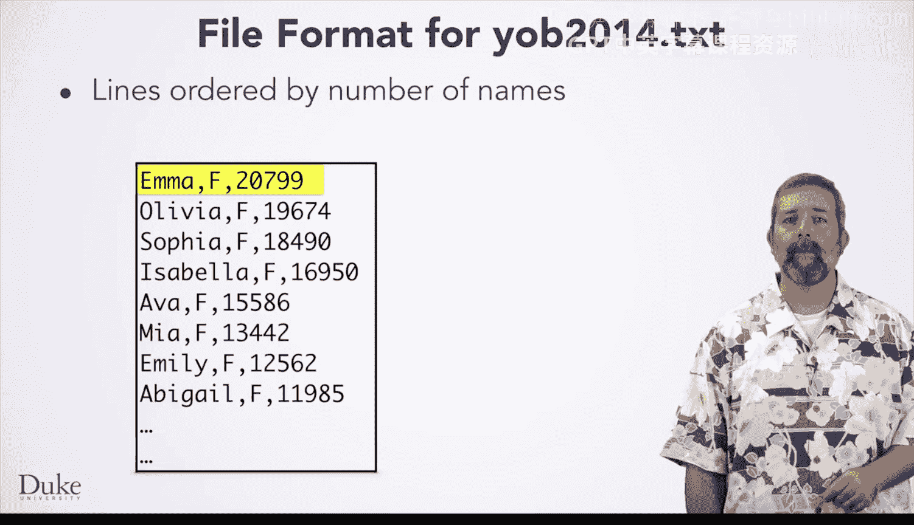
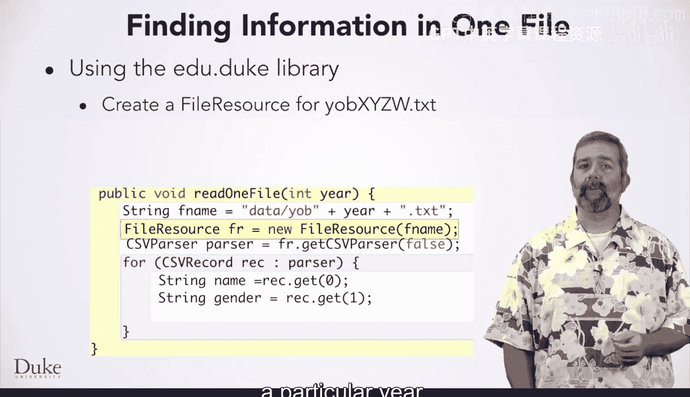

# 058：婴儿姓名迷你项目概览 👶


在本节课中，我们将学习本课程迷你项目的背景知识和所需编写的代码。你将编写程序来回答一些使用电子表格很难解答的问题，但通过运用本课程中学到的实践、技能和库，你将能够以直接的方式处理这些问题。

## 项目目标：你的名字今年是什么？🤔


你将回答的问题是：**根据你出生那年的名字，你今年的名字是什么？** 换句话说，在今年，哪个名字的流行度排名与你出生那年你的名字的排名相同？

你可以为任何人的名字回答这个问题，无论是朋友的名字、你喜欢的歌手还是任何人。我们将使用一些图片来描述你将要做的事情，这些图片取自一个提供类似功能的网站。

假设你是一位名叫Jennifer的女性，出生于1994年。Jennifer在1994年是第21位最受欢迎的女孩名字。因此，你需要完成的一项任务是编写代码，找出给定年份中某个名字的排名。

## 从排名到新名字 🔄



如果你是1994年的Jennifer，那么你今天的名字会是什么？


通过编码，你会发现**Grace**是今天第21位最受欢迎的名字。这里的“今天”指的是2014年，这是我们拥有的关于美国婴儿命名数据的最新年份。

所以，如果你出生于1994年并取名Jennifer，那么你今天的名字将是Grace。


## 探索不同年代的名字 📅


但你也可以查看你在任何给定年份的名字。

这里我们看到一个摘要，显示了你在几个不同年代的名字。1994年的Jennifer，在20世纪70年代会是Barbara。这意味着Barbara在20世纪70年代这十年间（数据合并计算）是第21位最受欢迎的名字。



## 利用历史数据 📊


因为我们拥有美国追溯到19世纪80年代（130多年前）的数据，我们可以确定你很久以前的名字。


这里我们看到，如果你是1994年的Jennifer，你在20世纪初的名字会是Sarah。

## 数据处理与编程任务 💻



你需要编写程序来对我们在此概述的名字数据得出结论，将所有数据转化为信息。美国政府每年都会发布婴儿姓名数据。我们已收集这些数据，并将其作为本课程的一部分提供给你。我们很乐意得到你的帮助，为世界其他国家收集类似的数据。

我们拥有多年来的男性和女性数据，每年对应一个不同的数据文件。这些文件遵循一个命名约定，这在编写程序打开和读取文件时非常方便。在编写代码访问这数百个数据文件时，你将利用这个通用的命名约定。

文件内容也采用相似的格式，这将帮助你编写更通用的代码来解决这些问题。我们将简要查看2014年的数据文件，这是提供给你使用的最新数据。



文件中的行号按拥有特定名字的婴儿数量排序，因此最受欢迎的婴儿名字排在第一行，然后是第二受欢迎的，依此类推，正如你在这里看到的。2014年有20799名婴儿被命名为Emma，使其成为当年最受欢迎的女性婴儿名字。

## 文件结构解析 📁

在数据文件中，所有女性名字都排在男性名字之前。这意味着最受欢迎的男孩名字（2014年是Noah，有19144名男孩取名Noah）紧接在拥有最少女孩数的女孩名字之后（2014年是Ziona和Ziaah）。我们将概述访问单个文件中数据的高级概念，但你需要完成全部七个步骤来解决本迷你项目中要求你处理的问题。



在开发此问题的解决方案时，你将使用来自 `edu.duke` 和 `org.apache.commons.csv` 包中的几个类。例如，你需要一个 `FileResource` 对象来访问特定年份文件中的数据。

你需要通过调用 `FileResource` 类的 `getCSVParser` 方法来获取一个CSV解析器，并确保请求一个**没有标题行**的解析器。

```java
FileResource fr = new FileResource("data/yob2014.csv");
CSVParser parser = fr.getCSVParser(false);
```

由于没有标题行，你需要通过索引来访问每条记录中的数据：索引0是文件中婴儿的名字，婴儿的性别是第二个数据元素。

```java
for (CSVRecord record : parser) {
    String name = record.get(0); // 获取名字
    String gender = record.get(1); // 获取性别
    // ... 处理数据
}
```


一旦掌握了这些，你就可以开始思考问题，并使用我们的七步流程来解决整个问题。




祝你编程愉快！😊

---

**本节课总结**：在本节课中，我们一起学习了“婴儿姓名”迷你项目的背景和目标。我们了解到，项目核心是通过编程分析历史婴儿姓名数据，找出与给定名字在出生年份排名相同的当前年份名字。我们预览了数据文件的结构和格式，并介绍了访问这些数据所需的关键Java类和方法，为后续动手编码奠定了基础。