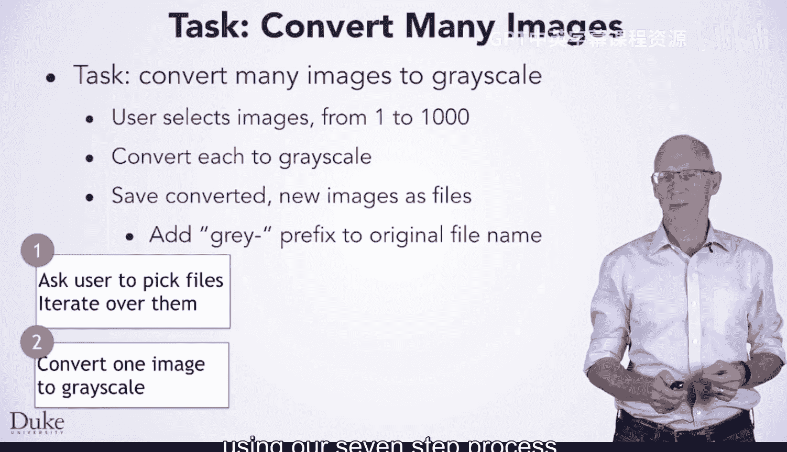

# 061：多文件处理

欢迎回来。在本节课中，你将学习如何将图像转换为灰度图。这是一个通过编写两个程序并将它们组合成一个程序来解决实际问题的例子。

## 概述

在本节课中，我们将要学习如何批量处理图像文件，将它们转换为灰度图。我们将把这个大任务分解为几个小步骤，最终构建一个能选择多个文件、进行灰度转换并保存结果的高效程序。

## 为什么要进行灰度转换？

将图像转换为灰度图有几个原因。

你可能想看看图像在灰度打印时的效果。灰度打印比彩色打印便宜得多，并且一些出版物要求所有图像都转换为灰度图。

或者，你可能计划进行其他更复杂的图像处理。使用灰度图像可以简化甚至加速这些处理过程。

## 单文件转换 vs. 批量转换

如果你只需要转换一张图像，最简单的方法可能是使用图像编辑软件。你会打开想要转换的图像，然后使用软件创建一个灰度副本。

但是，如果你需要转换许多图像呢？

打开每张图像、将其转换为灰度然后保存，这个过程可能相当繁琐和耗时。对于少量图像，这可能不是大问题。但如果你需要对1000张图像进行操作，手动完成可能需要数天时间，并且很难坚持完成这种重复性任务。

相反，你可以编写一个程序来批量转换图像。具体来说，你可以让用户选择一组要转换的图像，对每个选中的图像执行灰度转换，然后使用相似的文件名保存结果。在我们的例子中，我们将在每个图像文件名前添加“gray-”前缀，以区分新的灰度副本和原始文件。

## 任务分解

这正是我们将在本节课中与你一起完成的任务。具体来说，我们将把这个大任务分解为几个较小的任务。

问题的一个方面是允许用户选择一组文件并对每个选中的文件执行操作。虽然最终目标是转换图像文件为灰度版本，但我们将从简单地打印选中的文件名开始，这是解决更大问题的一小步。

接下来，你将使用我们的七步流程来学习如何转换一张图像为灰度图。

之后，你将把前两个想法和程序组合成一个单一的程序，该程序允许用户选择多个文件并将每个文件转换为灰度图。

最后，你将使你的程序将结果保存到具有适当命名的新文件中。

## 总结

本节课中我们一起学习了如何将批量图像处理任务分解为可管理的步骤。我们从理解需求开始，然后学习了如何选择文件、处理单张图像，最终将这些功能组合成一个完整的批量灰度转换程序。通过这种方法，你可以高效地处理大量图像，而无需手动重复操作。