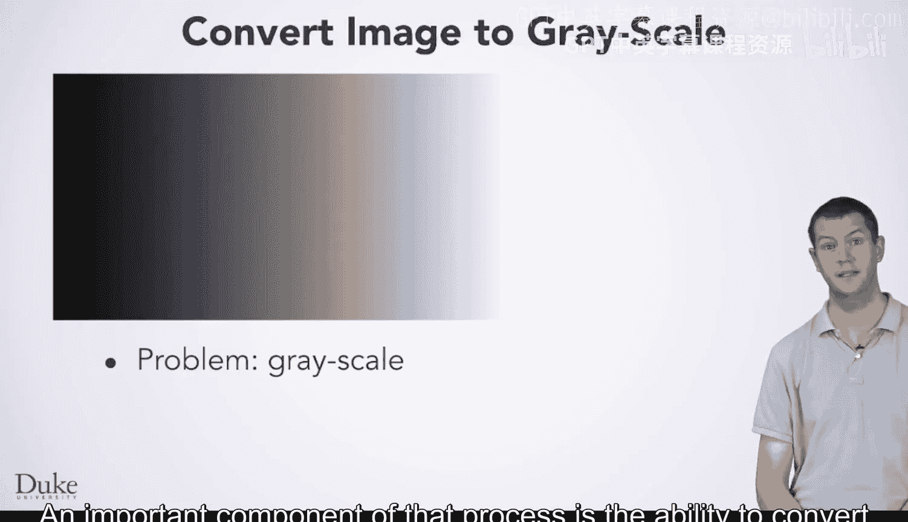
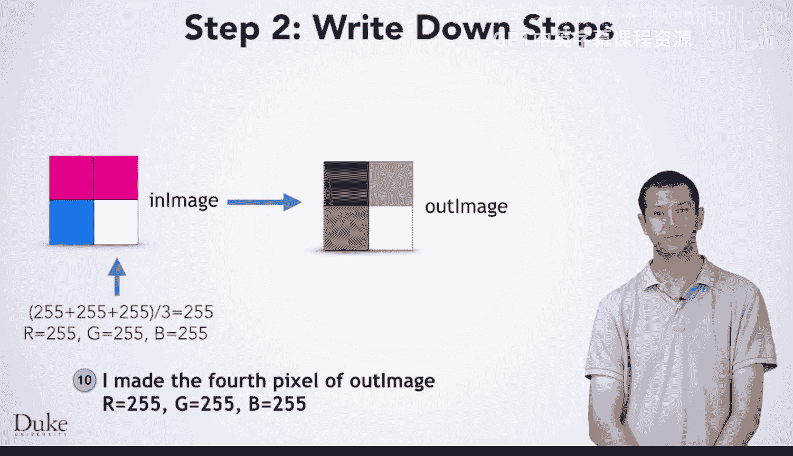
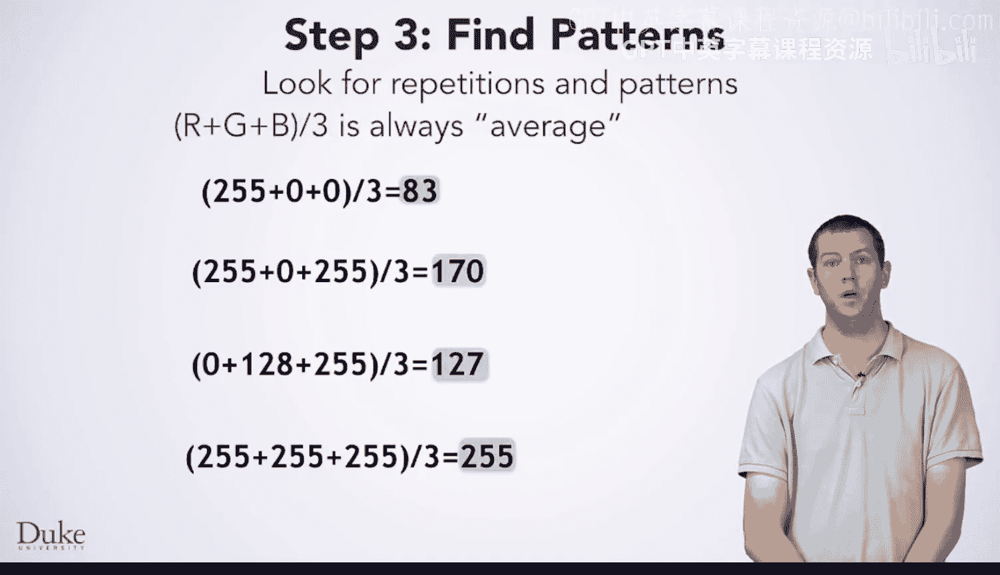
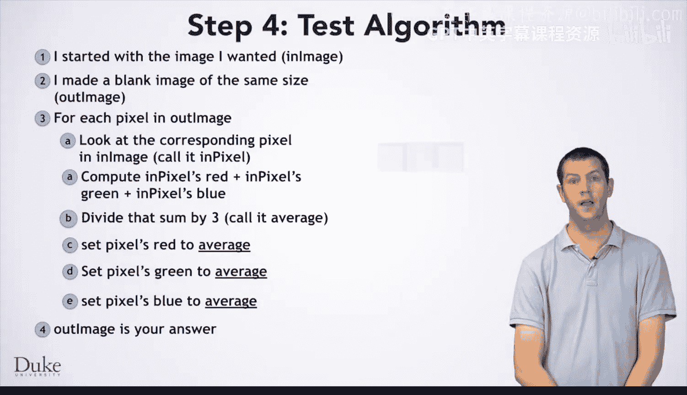

# 062：七步法 🖼️➡️⚫⚪

在本节课中，我们将学习如何将彩色图像转换为灰度图像。这是一个重要的图像处理过程，其核心在于理解并应用一个系统化的七步法来解决问题。我们将通过一个具体的例子，逐步拆解这个过程，最终得到一个通用的算法。

---

## 第一步：手动处理一个实例 🖐️

与所有编程问题一样，我们首先需要手动解决一个小规模的问题实例。这里，我们选择一个2x2像素的彩色图像作为输入。

我们需要创建一个同样大小的2x2图像作为输出。但关键问题是：如何确定输出图像中每个像素的灰度值？

在解决这个具体问题之前，你需要一些领域知识，即关于颜色或图形的知识。

首先，我们需要明确：什么是灰度？
一个颜色是灰度，当且仅当它的红色、蓝色和绿色分量值完全相同。

然而，仅凭这个知识不足以告诉我们如何为一个特定的颜色计算出对应的灰度值，它只告诉我们结果需要让红、绿、蓝分量相等。

一种方法是取红、绿、蓝三个分量的平均值。或者，你也可以决定使用加权平均，因为人眼对不同颜色的感知并不相同。当然，也可能有更复杂的替代方案。但简单地取平均值效果不错且简单。

现在，你具备了手动解决这个问题所需的知识。你可以查看一个像素的RGB值，计算其平均值，然后为输出像素填充相应的颜色。接着，对每个输入像素重复此过程：查看其RGB值，计算平均值，并相应地为输出像素着色。

当你为所有像素都填充了颜色后，你就完成了问题实例的手动求解，第一步也就完成了。

---

## 第二步：精确记录操作步骤 📝

接下来，你需要精确地写下你刚才所做的操作。

1.  我从想要处理的图像开始，我们称之为输入图像。
2.  我创建了另一个相同大小的图像，我们称之为输出图像。
3.  我计算了 (255 + 0 + 0) / 3，结果是 83。
4.  我将输出图像的第一个像素的红、绿、蓝值都设置为 83。
5.  然后，我对其他每个像素，计算其红、绿、蓝的平均值，并相应地设置输出像素的颜色。

完成这些后，我们得到了解决这个特定问题实例的10个步骤。

---

## 第三步：寻找模式和重复 🔍

现在，你已准备好进入第三步：寻找模式和重复。

你可以看到，我们对每个像素做了非常相似的事情，但它们并不完全相同。我们需要在数字中找到模式。

为了将这些步骤推广到任何图像，让我们看看需要泛化的具体数字。为什么我们在这里使用255，在那里使用0？这些数字都是输入图像中对应像素的红色分量。那么这些数字呢？同样，这些是输入图像中对应像素的绿色分量。最后，这些数字是对应像素的蓝色分量。

接下来，你应该为这个数学计算的结果起个名字。它不会总是这些特定的数字，你需要能够精确地引用它。我们称之为 **`average`**。

---

## 第四步：编写通用算法 📋

好的，经过上述思考，你现在可以编写通用算法了。

请注意我们是如何思考对每个像素做什么，并写下通用步骤的。现在，我们可以将其写成针对输出图像中每个像素要执行的步骤。这个算法将适用于任何尺寸、任何颜色的图像。

以下是通用算法的步骤：

1.  对于输出图像中的每一个像素 (i, j)：
    *   获取输入图像中相同位置 (i, j) 像素的红色分量值，记为 **`red`**。
    *   获取输入图像中相同位置 (i, j) 像素的绿色分量值，记为 **`green`**。
    *   获取输入图像中相同位置 (i, j) 像素的蓝色分量值，记为 **`blue`**。
    *   计算平均值：**`average = (red + green + blue) / 3`**。
    *   将输出图像中位置 (i, j) 的像素的红、绿、蓝分量都设置为 **`average`**。

---

## 第五步：测试通用算法 ✅

在编写代码之前，你应该做的最后一件事是在另一个小型输入上测试你的通用算法。

这里有一个小图像及其每个像素的RGB值。花点时间执行算法，看看是否能得到正确答案。

测试结果正确，所以你已经准备好用代码实现它了。

---

## 总结 📚

本节课中，我们一起学习了应用“七步法”来解决将彩色图像转换为灰度图像的问题。我们从手动处理一个小实例开始，精确记录步骤，然后寻找模式并将其泛化为一个通用算法，最后对算法进行了测试验证。这个过程的核心是计算每个像素红、绿、蓝分量的平均值，公式为 **`average = (red + green + blue) / 3`**，并用这个平均值设置输出像素的颜色。掌握了这个方法，你就为用代码实现任何尺寸图像的灰度转换打下了坚实的基础。