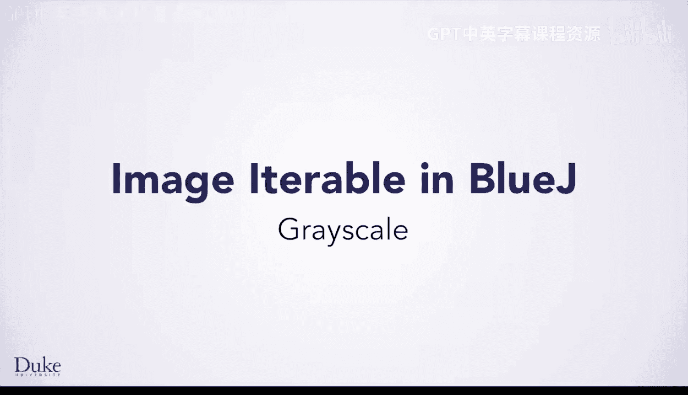
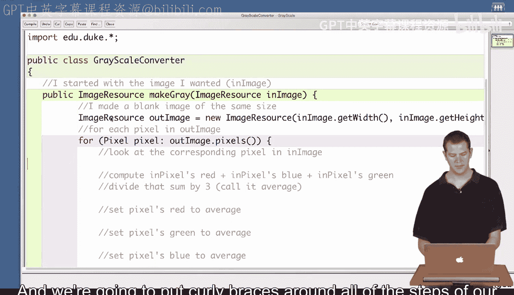
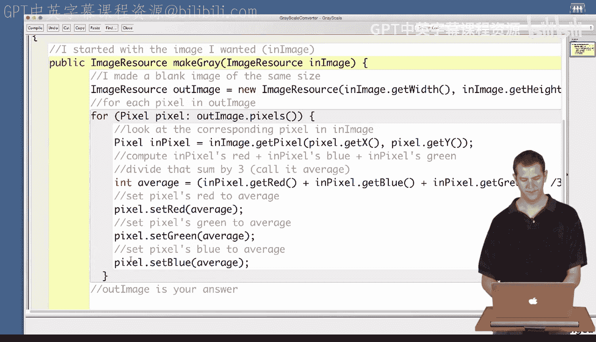
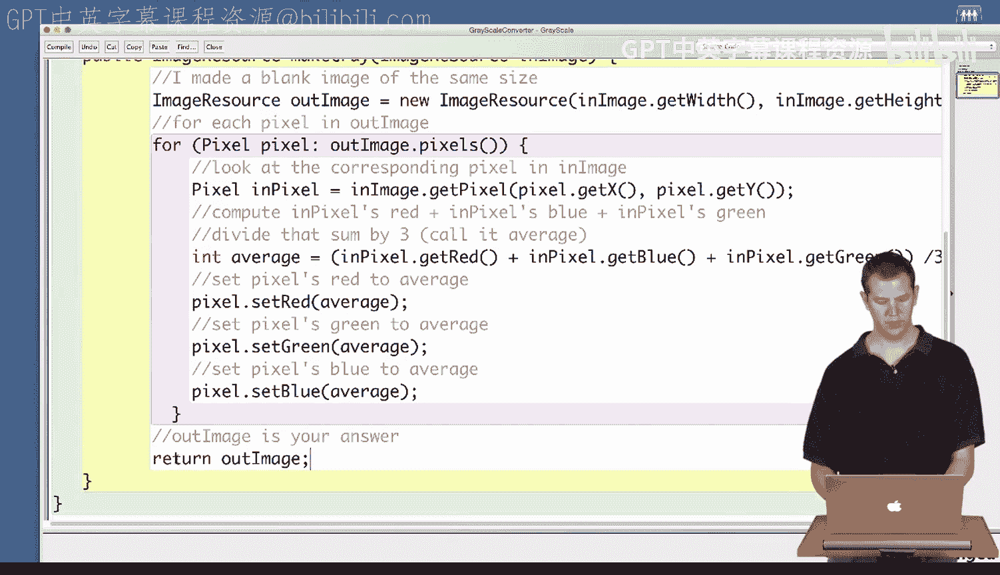
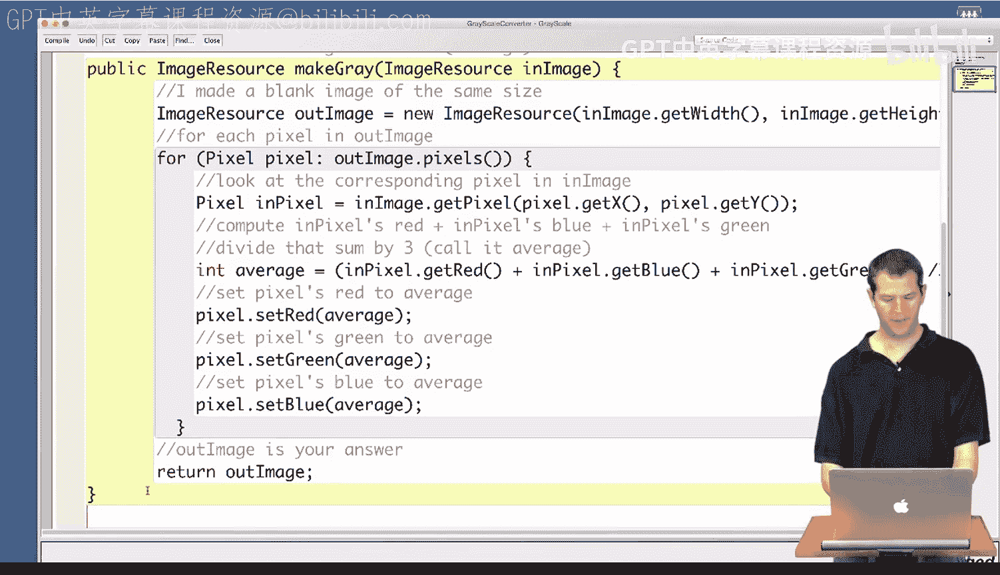
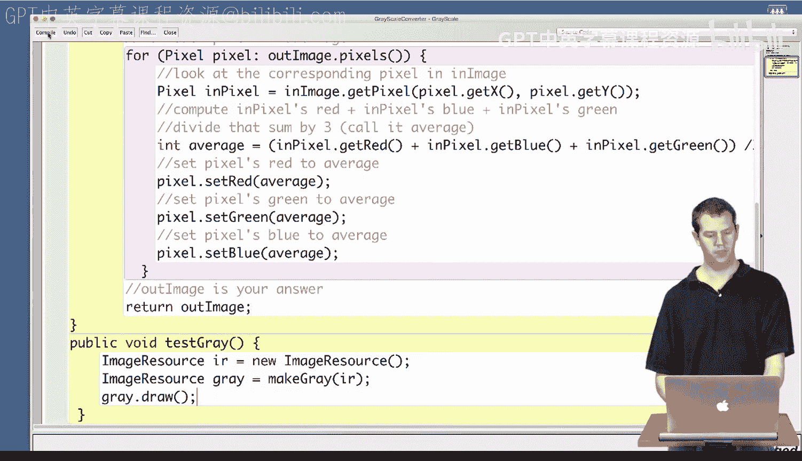
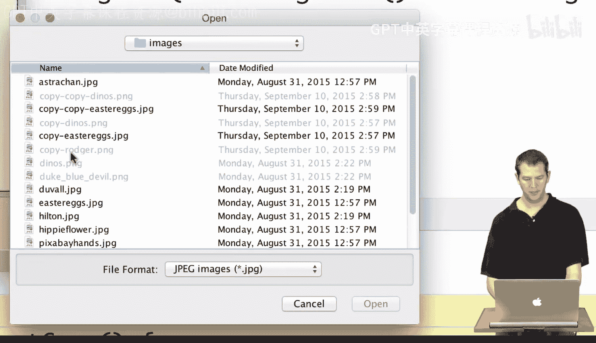

# 063：灰度处理 🖼️➡️⚫⚪



在本节课中，我们将学习如何将彩色图像转换为灰度图像。我们将基于之前设计的算法，在BlueJ环境中编写具体的Java代码来实现这一功能。

---

上一节我们介绍了灰度转换的算法思路，本节中我们来看看如何将这些步骤转化为实际的Java代码。

我们已经创建了一个名为 `GrayscaleConverter` 的类，并导入了必要的库。在编写代码前，我们已经将算法步骤以注释的形式写在了代码中，作为编写指南。

我们算法的第一步是获取要处理的图像。在代码中，这将是我们传递给函数的一个参数，以便该函数可以处理任何我们指定的图像。

```java
public ImageResource makeGray(ImageResource inImage) {
```

接下来，我们需要创建一个与输入图像尺寸相同的空白图像。

```java
    ImageResource outImage = new ImageResource(inImage.getWidth(), inImage.getHeight());
```



我们算法的第三步是遍历输出图像中的每一个像素。这需要一个 `for` 循环。

以下是循环的框架，我们将把对每个像素执行的操作放在花括号 `{}` 内。

```java
    for (Pixel pixel : outImage.pixels()) {
        // 对每个像素执行的操作将写在这里
    }
```

在循环体内，我们首先要找到输入图像中对应位置的像素。

```java
        Pixel inPixel = inImage.getPixel(pixel.getX(), pixel.getY());
```

然后，我们需要计算该对应像素的红、绿、蓝三个颜色通道值的平均值。

```java
        int average = (inPixel.getRed() + inPixel.getGreen() + inPixel.getBlue()) / 3;
```

计算出平均值后，我们将这个值同时设置为输出图像当前像素的红、绿、蓝通道值。



```java
        pixel.setRed(average);
        pixel.setGreen(average);
        pixel.setBlue(average);
```

以上步骤完成了对每个像素的处理。循环结束后，我们的最后一步是返回处理好的图像。



```java
    return outImage;
}
```

现在，我们可以点击编译按钮。如果底部显示“类编译完成，无语法错误”，则说明代码在语法上是正确的。

---



通常，我们通过在BlueJ主窗口创建对象并调用其方法来测试代码。但直接创建 `ImageResource` 对象进行测试有些复杂，因此我们将编写一个辅助测试方法。

```java
public void testGray() {
    ImageResource ir = new ImageResource(); // 这会弹出一个对话框让我们选择图片
    ImageResource gray = makeGray(ir);
    gray.draw();
}
```

再次编译代码，确保没有错误。遵守语言规则只是第一步，我们还需要验证代码是否能正确运行。

现在，我们转到BlueJ的主窗口。创建一个新的 `GrayscaleConverter` 对象。



然后，调用该对象的 `testGray()` 方法。程序会弹出一个对话框，让我们选择一张图片。例如，我们可以选择一张色彩鲜艳的图片进行测试。

运行后，我们将看到原图被成功转换成了灰度图像。通过这个测试用例，我们对代码的正确性更有信心了。通常，运行的测试用例越多，我们对代码正确性的信心就越足。



---

本节课中我们一起学习了如何在BlueJ中实现图像的灰度转换。我们首先回顾了算法步骤，然后将其逐句转化为Java代码，包括遍历像素、计算颜色平均值以及设置新像素值。最后，我们编写了一个测试方法来验证代码功能。通过实践，我们巩固了将算法思想转化为可执行代码的能力。