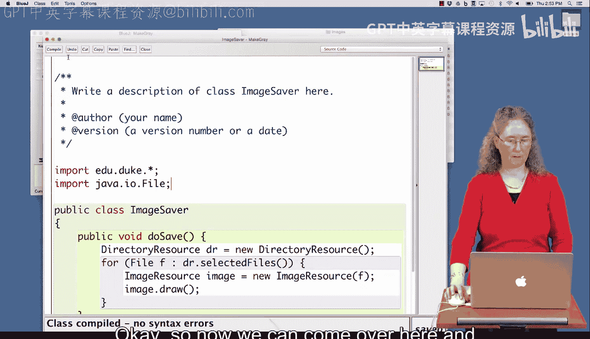
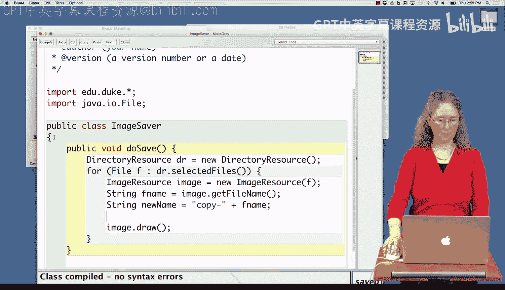
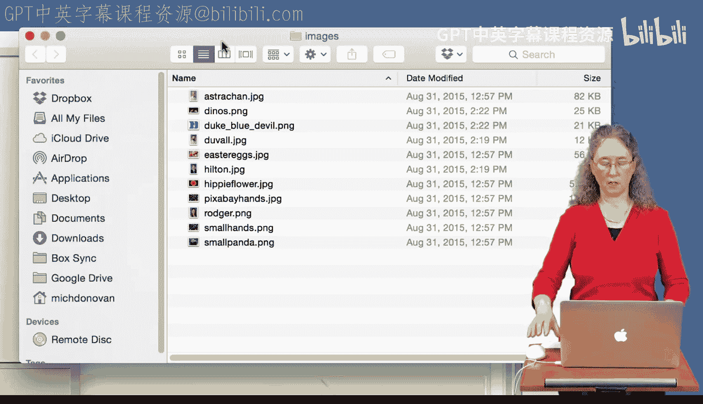
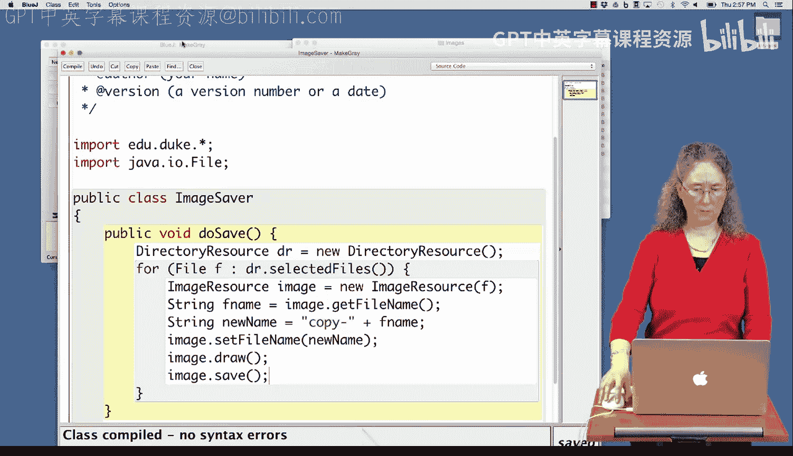
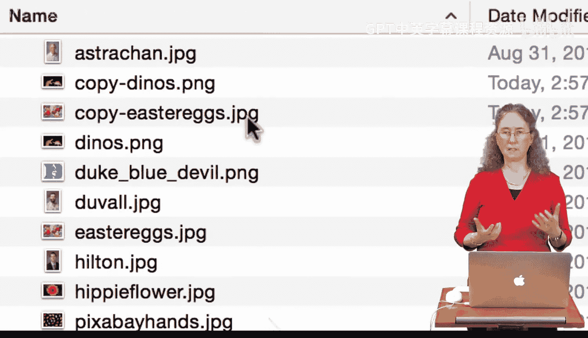
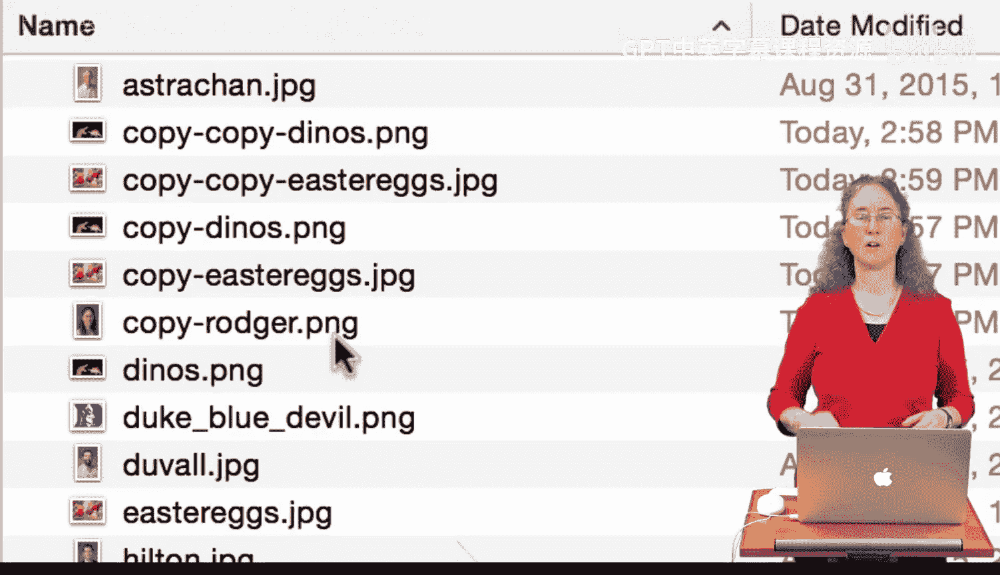

# Java编程和软件工程基础：2-5：使用新名称保存图像 📸


在本节课中，我们将学习如何编写一个Java程序来读取计算机上的图像文件，并创建它们的副本。我们将使用特定的库来选择和操作图像文件，最终实现以新名称保存图像副本的功能。

---


## 概述

我们将创建一个名为 `ImageSaver` 的Java类。这个类将包含一个 `doSave` 方法，用于从指定目录选择图像文件，为每个文件生成一个带有“copy-”前缀的新文件名，然后保存这个新文件。整个过程涉及文件选择、字符串操作和文件保存。

---

## 创建 `ImageSaver` 类

首先，我们需要创建一个新的Java类。我们将其命名为 `ImageSaver`。

```java
public class ImageSaver {
    // 类的内容将在这里编写
}
```

---

## 实现 `doSave` 方法

上一节我们创建了类的基本结构，本节中我们来看看如何实现核心的 `doSave` 方法。这个方法将完成选择文件和保存副本的主要逻辑。

在 `ImageSaver` 类中，我们创建一个名为 `doSave` 的方法。

```java
public void doSave() {
    // 方法的具体实现将在这里编写
}
```

---

## 选择图像文件

为了选择文件，我们将使用 `DirectoryResource` 类。这个类允许我们通过图形界面从目录中选择文件。



以下是实现选择文件功能的步骤：

1.  创建一个 `DirectoryResource` 类型的变量。
2.  使用 `selectedFiles` 方法获取用户选择的文件列表。
3.  使用 `for` 循环遍历每一个选中的文件。

```java
DirectoryResource dr = new DirectoryResource();
for (File f : dr.selectedFiles()) {
    // 对每个文件 f 进行处理
}
```

---


## 加载和显示图像

在成功获取文件列表后，我们需要将每个文件加载为图像并显示它，以验证程序运行正常。

以下是加载和显示图像的步骤：

1.  为当前文件 `f` 创建一个 `ImageResource` 对象。
2.  调用 `draw` 方法在屏幕上显示图像。

```java
ImageResource image = new ImageResource(f);
image.draw();
```

---

## 生成新的文件名

在确认可以成功加载图像后，下一步是为副本生成一个新的文件名。我们希望新文件名在原文件名前加上“copy-”前缀。

以下是生成新文件名的步骤：



1.  使用 `getFileName` 方法获取原始图像的文件名。
2.  使用字符串拼接，创建以“copy-”开头的新文件名。

```java
String fname = image.getFileName();
String newName = "copy-" + fname;
```

---


## 保存图像副本

最后一步是使用新文件名保存图像。这需要两个操作：设置图像对象的新文件名，然后将其保存到磁盘。



以下是保存图像副本的步骤：

1.  使用 `setFileName` 方法为 `ImageResource` 对象设置新的文件名。
2.  调用 `save` 方法将图像保存为新文件。

```java
image.setFileName(newName);
image.save();
```

将以上所有步骤整合到 `for` 循环中，完整的 `doSave` 方法就完成了。

---



## 完整代码示例


以下是整合了所有步骤的 `ImageSaver` 类的完整代码。请确保已正确导入所需的库。

```java
import edu.duke.*;
import java.io.File;

public class ImageSaver {
    public void doSave() {
        DirectoryResource dr = new DirectoryResource();
        for (File f : dr.selectedFiles()) {
            ImageResource image = new ImageResource(f);
            image.draw(); // 可选：显示原图

            String fname = image.getFileName();
            String newName = "copy-" + fname;

            image.setFileName(newName);
            image.save(); // 保存为新文件
        }
    }
}
```



---


## 运行程序

要运行此程序，请执行以下步骤：

1.  编译 `ImageSaver.java` 文件。
2.  创建一个 `ImageSaver` 对象。
3.  调用该对象的 `doSave` 方法。
4.  在弹出的对话框中选择一个包含图像的目录，并选择一个或多个图像文件。
5.  程序将为每个选中的图像创建一个名为“copy-原文件名”的新文件。

---

## 总结

本节课中我们一起学习了如何编写一个Java程序来复制图像文件。我们掌握了以下核心技能：
*   使用 `DirectoryResource` 类交互式地选择文件。
*   使用 `ImageResource` 类加载和操作图像。
*   通过字符串操作生成新的文件名，格式为 **`"copy-" + originalFileName`**。
*   使用 `setFileName` 和 `save` 方法将图像保存为新文件。



通过这个简单的程序，你可以轻松地为任何图像文件创建副本。