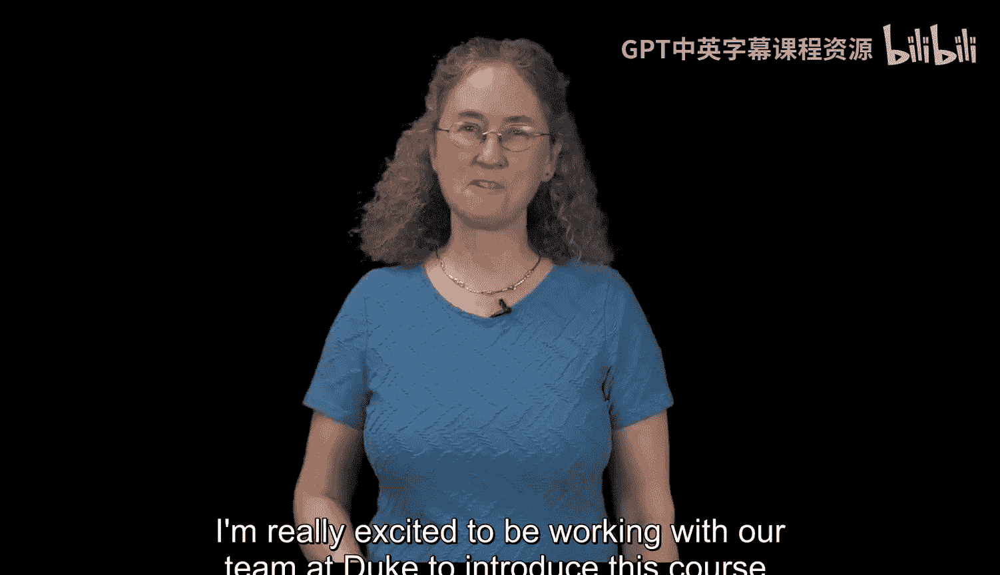
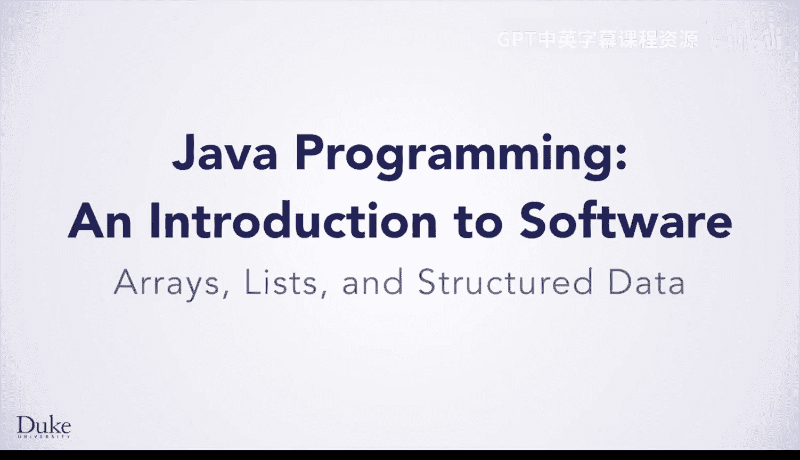
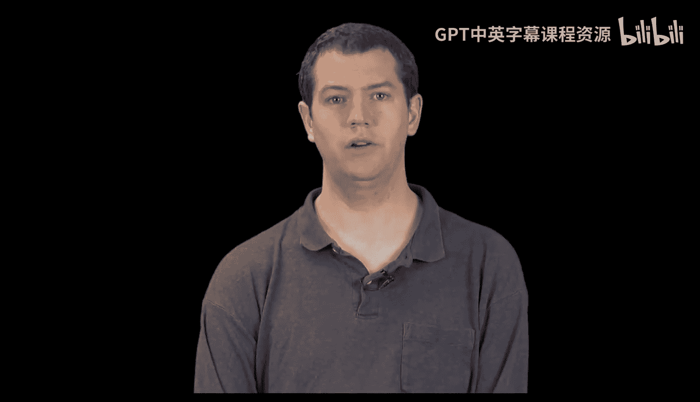
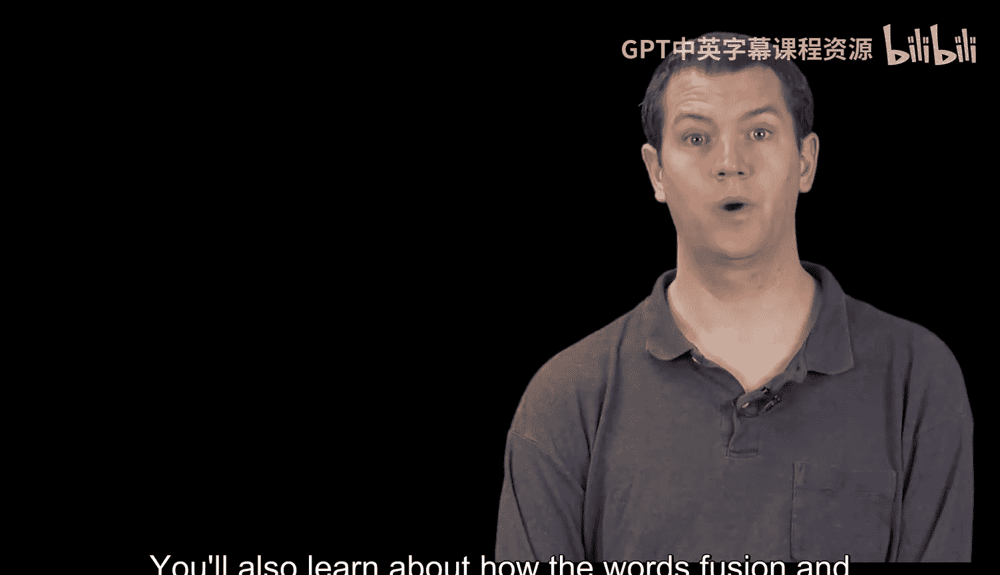
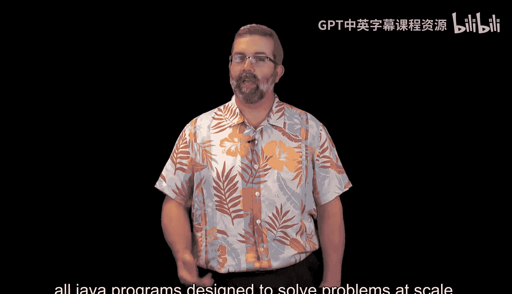
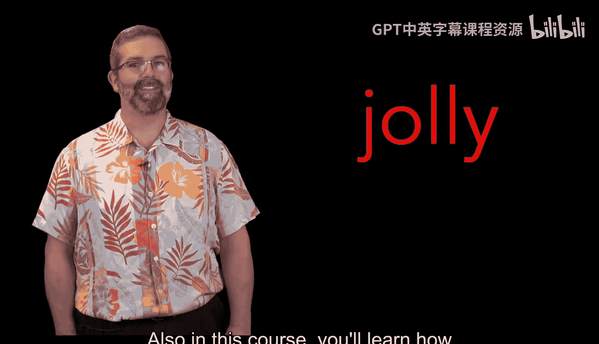
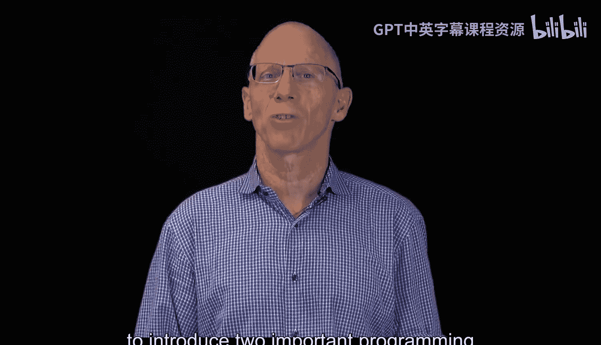
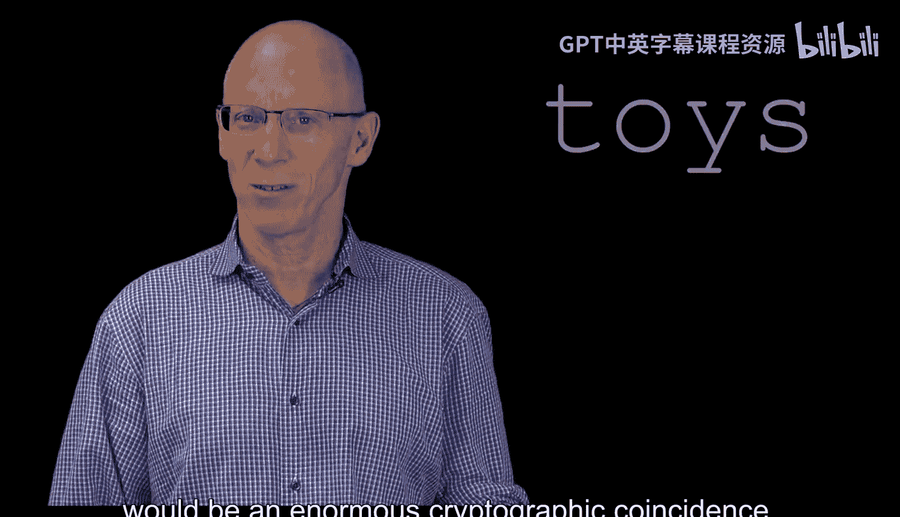
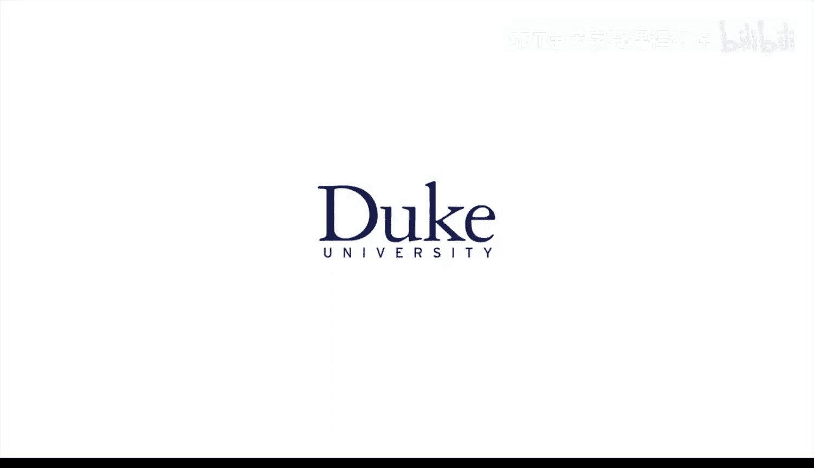

Java编程与软件工程基础：1：欢迎 👋

在本课程中，我们将学习Java编程、数组列表和结构化数据。课程结合了真实世界的数据分析，并引入了安全和密码学的相关知识。无论这是你与我们的第一次课程，还是作为Java编程与软件工程专业课程的一部分继续学习，你都将使用一个七步流程来设计和实现Java程序，以解决问题并磨练技能。

---

我们设计了一系列结合了真实世界数据分析的编程问题，并引入了安全和密码学的课程。

无论这是你第一次参加我们的课程，还是作为“Java编程与软件工程导论”专业课程的一部分继续学习，你都将使用一个七步流程来帮助设计和实现Java程序，以解决问题并磨练成为一名高效软件工程师所需的技能。

在解决我们设计的问题时，你将学习数组和映射。

这是两种标准的数据结构，用于创建高效、健壮的程序来解决问题。作为密码学课程的一部分，你将学习单词“melon”和“cubed”如何通过数字**16**联系起来。

---

你好，我是Drew。

在本课程中，你将使用我们设计的Edu Duke类库来编写程序，解决有趣的问题，例如分析网络博客和从模板生成随机故事。

同时，你也将使用标准的Java U类库，这将有助于你在使用Java为这些问题创建解决方案时增长知识和技能。

理解API以便使用库中的代码是本课程的重要组成部分。

同样重要的是开始培养对面向对象编程的理解。在本课程中，你将学习类的结构以及如何通过策略性地组合类来创建程序。

你还将学习单词“fusion”和“layout”如何通过数字**20**联系起来。

---

你好，我是Robert。

我们为本课程设计了一个激动人心的迷你项目，以帮助你更深入地了解类、面向对象和数据结构。

你将使用几乎所有为解决大规模问题而设计的Java程序中都包含的标准技术和库。

我们构建了本课程的模块，先介绍主题，然后通过更详细、更健壮、可扩展的解决方案来探索它们，这些方案改进了初始程序。

这使你能在解决熟悉问题的同时学习新技术。

我们希望这种学习方法能促进所有学习者的成功。此外，在本课程中，你将学习数字**19**如何连接单词“jolly”和“cheer”。

---

你好，我是Owen。

我对本课程中引入两种重要编程结构的方法感到兴奋：数组和映射。

这些不仅仅是Java中的结构，它们在每种编程语言中都被用来为编程问题创建高效的解决方案。

通过探索这些结构之间的关系，并在熟悉的语境中遇到它们，你将能够在掌握概念和支撑这些概念的Java库的同时，练习使用它们。

你还将了解为什么拥有**14**个假玩具会是一个巨大的密码学巧合。

---

欢迎来到数组列表与结构化数据。

---

### 课程总结

在本节课中，我们一起了解了本课程的整体介绍、教学目标以及各位讲师对课程核心内容的概述。我们明确了课程将围绕Java编程、数组、映射等数据结构展开，并结合数据分析与密码学等实际应用。课程将通过一系列精心设计的问题和项目，帮助你掌握使用Java库、理解API以及面向对象编程的基础，为后续深入学习打下坚实基础。