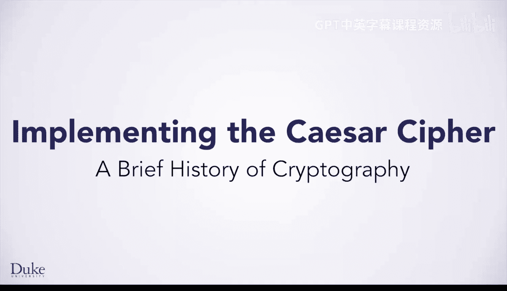
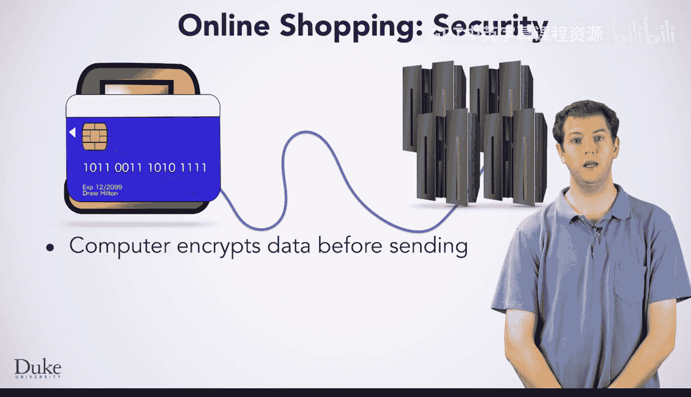
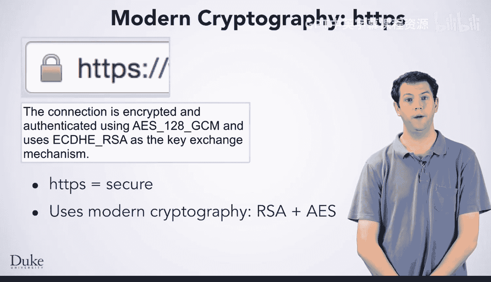
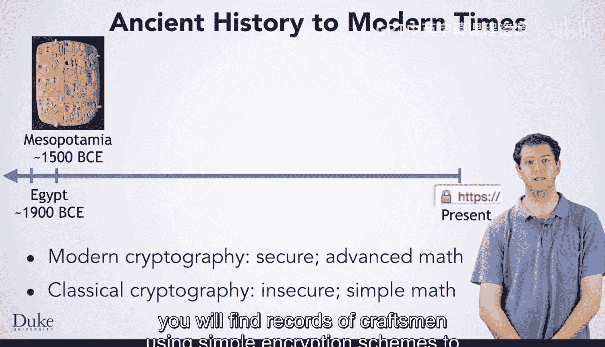

# Java编程和软件工程基础：2-5：密码学简史 🔐

在本节课中，我们将要学习密码学的历史背景及其在现代安全中的重要性。通过了解从古埃及到二战时期的加密方法，我们将理解为什么安全通信至关重要，并为后续学习凯撒密码和维吉尼亚密码打下基础。

## 在线购物的安全问题 💳

上一节我们介绍了本模块的学习目标，本节中我们来看看一个具体的应用场景：在线购物。

假设你想在线购买商品。你使用连接到互联网的计算机，以便与在线商店的服务器通信。为了完成购买，你需要将信用卡或其他支付信息输入计算机。

当你结算购物车中的商品时，你的计算机会将这些包含信用卡信息的数据通过互联网发送给在线商店。但如果有一个窃贼正在窥探互联网上传输的数据呢？这个窃贼可能会拦截你的信用卡信息，并利用它进行欺诈性消费。这显然是你和在线商店都不希望发生的情况。

## 加密如何保障安全 🔒

那么，是什么让在线购物变得安全呢？实际发生的情况是，你的计算机在将信息发送给在线商店的Web服务器之前，会先对其进行加密。

以下是加密过程的核心步骤：
1.  **协商密钥**：两台计算机商定一个称为“密钥”的特殊数据片段。
2.  **加密数据**：使用一个**加密算法**配合密钥来转换数据，使得只有拥有密钥的另一台计算机才能解密数据。
3.  **传输密文**：你的计算机通过互联网发送加密后的数据，任何潜在的窃贼都会被挫败。窃贼只能看到加密数据，无法理解信息内容。
4.  **解密数据**：拥有密钥的接收计算机可以解密数据，理解原始信息。

## 现代网络加密实践 🌐

当你在网上进行任何操作时，你的网页浏览器会告诉你是否拥有安全连接。例如，Chrome浏览器会以绿色显示“HTTPS”并在旁边显示一个绿色的锁形图标。HTTPS中的“S”代表“安全”，它是一种与标准HTTP不同的、连接到Web服务器的方式。

如果你点击锁形图标，它会告诉你用于保护连接安全的加密技术细节。保护你的互联网连接涉及许多算法。

以下是建立安全连接的关键算法：
*   **AES算法**：连接建立后，通常使用一种名为**AES**的算法来加密发送到服务器的数据。
*   **密钥交换算法**：在发送任何信息之前，你的计算机和服务器必须以安全的方式商定密钥。这听起来可能很困难，但有算法可以实现这一点。例如，你的计算机可能使用**椭圆曲线迪菲-赫尔曼**或**RSA**这两种算法来与服务器安全地建立连接。

这些算法对于互联网的安全运行至关重要，但其中涉及的数学原理较为高深，实现这些加密算法可能需要花费数天或数月来学习相关数学知识，这并非本课程的重点。

## 古典密码学的价值 📜

尽管现代密码学需要一些高等数学，但通过回顾历史，你仍然可以学到很多关于密码学的知识。古典密码学，即过去几个世纪使用的加密算法，涉及简单的数学，甚至在计算机出现之前就已存在。

这些算法在今天并不安全，计算机可以轻易破解它们。但学习它们的工作原理并实现它们，将教会你一些重要的经验。更重要的是，学习如何破解它们将给你一个关键教训：**不要试图自己发明加密方案。如果你需要安全性，请使用经过充分测试的现代密码学库实现。**

## 密码学历史纵览 🕰️

那么，我们需要回溯到多远的过去才能找到密码学的首次使用呢？

以下是密码学发展史上的几个关键节点：
*   **古埃及（约4000年前）**：已知最早的类似密码学的使用来自古埃及。然而，历史学家认为，当时隐藏信息并非严肃的保密尝试。
*   **美索不达米亚（约公元前1500年）**：向前几百年到美索不达米亚，你会发现有工匠在石板上记录时使用简单加密方案来保护其秘密的记录。
*   **罗马帝国**：**凯撒密码**以尤利乌斯·凯撒命名，他曾广泛使用它。你将在本模块的其余部分学习这种密码。
*   **16世纪**：再向前1500年，你会找到**维吉尼亚密码**。乔万·巴蒂斯塔·贝拉索实际上在1553年描述了这个算法，但它以19世纪的布莱斯·德·维吉尼亚命名。这个算法在历史上非常重要，因为它长期以来被认为是不可破解的。然而，在迷你项目中，你将编写一个程序来破解它。
*   **20世纪40年代**：密码学是第二次世界大战的关键部分。盟军投入大量资源破解德国密码，其核心工作发生在英国的布莱切利园。艾伦·图灵是这项密码破译工作的领导者，并为计算机科学做出了许多重要贡献。事实上，他非常重要，以至于计算机科学的最高荣誉被称为“图灵奖”。

## 本模块的学习内容 🎯

现在你已经对密码学历史有了一些了解。那么你将要做什么呢？

在本模块中，你将学习**凯撒密码**，实现它，然后破解它。在本课程结束时的迷你项目中，你将学习**维吉尼亚密码**，同样也将实现并破解它。当然，所有这些问题都将教会你几项重要的技能，这些技能可以帮助你解决各种各样的其他问题。

## 总结 📝

本节课中我们一起学习了密码学的基本概念及其历史发展。我们了解到，从古埃及的简单记录隐藏到现代互联网中复杂的AES和RSA算法，密码学的核心目标始终是保护信息的安全传输。虽然现代加密技术非常复杂，但通过研究古典密码（如凯撒密码和维吉尼亚密码），我们可以掌握加密、解密的基本原理，并深刻理解使用经过验证的现代加密方案的重要性。这为我们后续动手实现和破解这些古典密码奠定了坚实的基础。